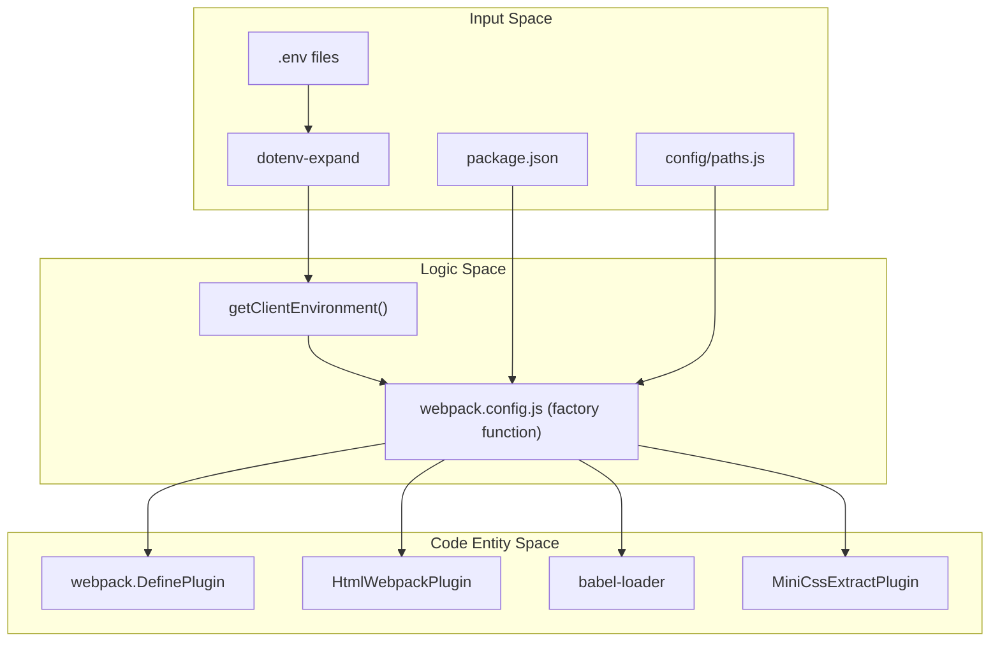
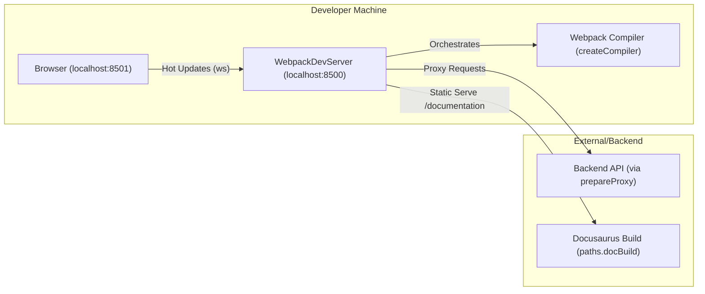

# Page: Webpack Build Configuration

# Webpack Build Configuration

Relevant source files

The following files were used as context for generating this wiki page:

- [.gitignore](.gitignore)
- [.prettierrc.js](.prettierrc.js)
- [Documenation/docusaurus.config.js](Documenation/docusaurus.config.js)
- [config/env.js](config/env.js)
- [config/paths.js](config/paths.js)
- [config/webpack.config.js](config/webpack.config.js)
- [config/webpackDevServer.config.js](config/webpackDevServer.config.js)
- [eslint.config.mjs](eslint.config.mjs)
- [package-lock.json](package-lock.json)
- [package.json](package.json)
- [scripts/start-dev.js](scripts/start-dev.js)

The Atlas build system is powered by Webpack 5, providing a highly customized pipeline for both local development and production-ready deployments. The configuration is designed to handle a React/Redux application with complex asset requirements, including 3D models (OBJ/GLTF), deep-zoom imagery, and geospatial data.

## Configuration Architecture

The Webpack configuration is managed as a single function exported from `config/webpack.config.js` that branches based on the `webpackEnv` argument [config/webpack.config.js:50](). This approach ensures consistency between development and production while allowing for environment-specific optimizations.

### Environment-Driven Branching
The build process identifies two primary environments: `development` and `production` [config/webpack.config.js:51-52](). Key differences include:
*   **Source Maps**: Production uses `source-map` (if `GENERATE_SOURCEMAP` is not false), while development uses `cheap-module-source-map` for faster rebuilds [config/webpack.config.js:147-151]().
*   **Minification**: Production utilizes `TerserPlugin` for JavaScript and `CssMinimizerPlugin` for CSS [config/webpack.config.js:250-287]().
*   **Asset Hashing**: Production filenames include content hashes (e.g., `[name].[contenthash:8].js`) for cache busting, whereas development uses predictable names [config/webpack.config.js:160-175]().
*   **Profiling**: Production can enable profiling via the `--profile` flag, which adjusts `TerserPlugin` settings to preserve function names [config/webpack.config.js:56](), [config/webpack.config.js:252-255]().

### Build Data Flow
The following diagram illustrates how environment variables and local configurations flow into the final Webpack configuration object.

**Build Pipeline Data Flow**

Sources: [config/webpack.config.js:50-135](), [config/env.js:65-93](), [config/paths.js:73-91]()

---

## The Babel Pipeline

Atlas uses `babel-loader` to transpile modern JavaScript (ES6+) and JSX into browser-compatible code [config/webpack.config.js:386-424]().

*   **Presets**: It leverages `babel-preset-react-app`, which includes standard transformations for React and TypeScript [package.json:162-166](), [package.json:182]().
*   **Plugins**: A notable inclusion is `babel-plugin-named-asset-import`, which allows for specialized imports like SVG-to-React components [package.json:181]().
*   **Caching**: The loader has `cacheDirectory` enabled to speed up subsequent builds by skipping unchanged files [config/webpack.config.js:409-411]().
*   **Runtime**: It uses `@babel/runtime` to reduce bundle size by sharing helper functions across modules [package.json:29]().

Sources: [config/webpack.config.js:386-424](), [package.json:162-166](), [package.json:181-182]()

---

## Style and Asset Handling

The configuration uses a modular `getStyleLoaders` function to process CSS and SASS/SCSS [config/webpack.config.js:85-141]().

### Style Processing
1.  **Development**: Uses `style-loader` to inject CSS into the DOM via `<style>` tags for Hot Module Replacement (HMR) [config/webpack.config.js:87]().
2.  **Production**: Uses `MiniCssExtractPlugin.loader` to extract CSS into separate files [config/webpack.config.js:88-91]().
3.  **PostCSS**: Every style goes through `postcss-loader` which applies `autoprefixer` (via `postcss-preset-env`) and `postcss-flexbugs-fixes` [config/webpack.config.js:100-119]().
4.  **Resolving**: Uses `resolve-url-loader` for SASS/SCSS to handle relative path resolution in `@import` statements [config/webpack.config.js:127-131]().

### Asset Modules
Webpack 5 asset modules handle static files:
*   **Images**: Small images (under 10KB by default) are inlined as Data URLs using `url-loader` logic [config/webpack.config.js:35-37](), [config/webpack.config.js:357-363]().
*   **SVGs**: Handled via `@svgr/webpack`, allowing SVGs to be imported as React components [config/webpack.config.js:373-384]().

Sources: [config/webpack.config.js:81-141](), [config/webpack.config.js:357-384]()

---

## HTML Generation and HTML2PugPlugin

Atlas employs a specific approach to HTML generation to support its dynamic runtime configuration requirements.

*   **HtmlWebpackPlugin**: Generates the standard `index.html` from the template in `public/index.html` [config/webpack.config.js:526-542]().
*   **HTML2PugPlugin**: A custom implementation within the config that takes the generated HTML and converts it into a Pug (`.pug`) template using the `html2pug` library [config/webpack.config.js:23](). This is emitted to the build directory for the server-side Express instance to inject runtime configurations [config/webpack.config.js:543-554]().
*   **InterpolateHtmlPlugin**: Allows using environment variables directly in the HTML template via `%VARIABLE_NAME%` syntax [config/webpack.config.js:15](), [config/webpack.config.js:518]().

Sources: [config/webpack.config.js:518-554](), [config/webpack.config.js:23]()

---

## Optimization and Runtime

To improve performance and security, the build includes several advanced plugins and configurations:

| Plugin / Config | Purpose |
| :--- | :--- |
| `InlineChunkHtmlPlugin` | Inlines the small Webpack runtime script into `index.html` to reduce HTTP requests [config/webpack.config.js:10](), [config/webpack.config.js:556-559](). |
| `ModuleScopePlugin` | Ensures that imports do not reach outside of `src/`, preventing accidental dependency on files outside the project root [config/webpack.config.js:16](), [config/webpack.config.js:320-322](). |
| `TerserPlugin` | Handles JavaScript minification, specifically configured to preserve `Function.name` if profiling is enabled [config/webpack.config.js:11](), [config/webpack.config.js:251-274](). |
| `BundleAnalyzerPlugin` | Triggered via `--analyze` flag to visualize the size of Webpack output files [config/webpack.config.js:9](), [config/webpack.config.js:58-59](), [config/webpack.config.js:613-615](). |
| `splitChunks` | Automatically splits vendor code and common modules into separate chunks for better caching [config/webpack.config.js:231-247](). |

Sources: [config/webpack.config.js:231-322](), [config/webpack.config.js:556-615]()

---

## Dev Server Configuration

The `config/webpackDevServer.config.js` file defines the behavior of the local development environment using `webpack-dev-server` [config/webpackDevServer.config.js:19-94]().

### Key Features
*   **Documentation Integration**: The dev server is configured via `setupMiddlewares` to serve the Docusaurus documentation at `/documentation` if the build folder exists [config/webpackDevServer.config.js:61-69]().
*   **History API Fallback**: Redirects 404s to `index.html`, essential for `react-router-dom` client-side routing [config/webpackDevServer.config.js:46-51]().
*   **Proxy Support**: Reads the `proxy` field from `package.json` to forward API requests to a backend server, avoiding CORS issues [config/webpackDevServer.config.js:80]().
*   **Logging**: Custom `onListening` hook provides clear feedback on which ports the application and documentation are running on [config/webpackDevServer.config.js:81-92]().

### Connection Mapping
The dev server establishes several connections to facilitate a smooth developer experience.

**Dev Server Connectivity**

Sources: [config/webpackDevServer.config.js:19-94](), [scripts/start-dev.js:87-102]()

---

## Summary of Entry and Output

*   **Entry Point**: The application starts at `src/index.js` (resolved via `paths.appIndexJs`) [config/paths.js:80](). In development, it also includes the `webpackHotDevClient` for HMR [config/webpack.config.js:154-156]().
*   **Output Directory**: Production builds are emitted to `build/atlas/` [config/paths.js:76]().
*   **Public Path**: In production, the `publicPath` is dynamically determined but defaults to `/` for runtime-configurable builds to ensure deployment-agnostic artifacts [config/webpack.config.js:68](), [config/paths.js:34-43]().

Sources: [config/paths.js:76-91](), [config/webpack.config.js:154-175]()
