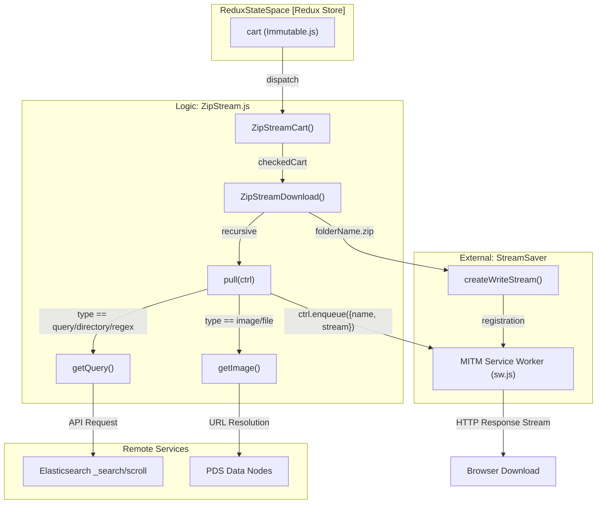
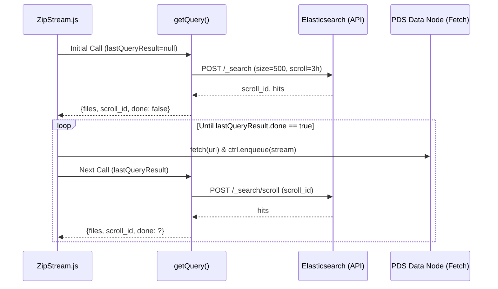

# Page: ZIP Stream Download

# ZIP Stream Download

Relevant source files

The following files were used as context for generating this wiki page:

- [src/core/downloaders/ZipStream.js](src/core/downloaders/ZipStream.js)
- [src/external/streamsaver-helpers/ponyfill.min.js](src/external/streamsaver-helpers/ponyfill.min.js)
- [src/other/serviceWorker.js](src/other/serviceWorker.js)
- [src/pages/Cart/Content/CartView/CartView.js](src/pages/Cart/Content/CartView/CartView.js)

The `ZipStream` downloader provides a client-side mechanism for generating ZIP archives directly in the browser. By leveraging `streamsaver` and a service worker-based "Man-in-the-Middle" (MITM) approach, it avoids server-side compression overhead and allows for downloading extremely large datasets (multi-gigabyte) without exhausting client-side memory.

## Implementation Overview

The implementation is centered around the `ZipStreamDownload` function, which coordinates between the Atlas Redux state, Elasticsearch (ES) scroll APIs for bulk metadata retrieval, and the `streamsaver` library for file I/O.

### Data Flow

The following diagram illustrates how a user request for a ZIP download is transformed from a collection of cart items into a streamed ZIP file.

**ZIP Stream Data Flow: Cart to File**

Sources: [src/core/downloaders/ZipStream.js:17-53](), [src/core/downloaders/ZipStream.js:75-130]()

## Key Functions and Classes

### ZipStreamCart
This is the Redux-aware entry point. It extracts the current cart from the state, filters for items marked as `checked`, and initiates the download process.

*   **Location:** [src/core/downloaders/ZipStream.js:17-41]()
*   **Mechanism:** It accesses the `cart` state using `state.get('cart').toJS()` [src/core/downloaders/ZipStream.js:28]() and filters for `v.checked === true` [src/core/downloaders/ZipStream.js:29]().
*   **Parameters:**
    *   `statusCallback`: Reports progress (percent, files processed).
    *   `productKeys`: Array of file types to include (e.g., `['src', 'lbl']`). Defaults to `['src']` if null [src/core/downloaders/ZipStream.js:25]().

### ZipStreamDownload
The core orchestrator that initializes the `WritableStream` via `streamsaver`.

*   **Location:** [src/core/downloaders/ZipStream.js:44-52]()
*   **Mechanism:** It creates a `fileStream` using `createWriteStream` [src/core/downloaders/ZipStream.js:53](). It calculates `totalFiles` and `totalProducts` upfront by iterating through items and multiplying by `productKeys.length` to provide accurate progress metrics [src/core/downloaders/ZipStream.js:61-70]().

### The pull() Loop
The `pull` function is the heart of the streaming logic. It is called by the underlying ZIP generator whenever it is ready for more data.

1.  **Item Iteration:** It iterates through `items` (cart entries) using `currentItemIdx` [src/core/downloaders/ZipStream.js:85]().
2.  **Resolution:**
    *   If the item is a `query`, `directory`, or `regex`, it calls `getQuery` to fetch a batch of files via ES scroll [src/core/downloaders/ZipStream.js:94-99]().
    *   If the item is a single `image` or `file`, it calls `getImage` [src/core/downloaders/ZipStream.js:103]().
3.  **Stream Enqueueing:** For each file, it performs a `fetch(url)` [src/core/downloaders/ZipStream.js:141](). If successful, it enqueues the `res.body` (a `ReadableStream`) into the ZIP controller [src/core/downloaders/ZipStream.js:148-164]().

## Directory Structure and Collision Avoidance

To prevent filename collisions within the ZIP (e.g., two different products having a file named `data.csv`), the downloader implements a structured pathing strategy:

| Item Type | Path Strategy | Example |
| :--- | :--- | :--- |
| **Query/Image/Regex** | `{index}_{type}/{filename}` | `0_query/product_A.xml` |
| **Directory** | Original PDS path structure | `bundle/data/file.xml` |

For `directory` types, the code attempts to preserve the relative path by stripping the base URI and removing release identifiers (e.g., `::1`) from the filepath [src/core/downloaders/ZipStream.js:152-159]().

Sources: [src/core/downloaders/ZipStream.js:151-160]()

## Recursive ES Scroll Handling

When a cart item is a "Query" (representing thousands of potential files), the system cannot fetch all metadata at once. It uses a scrolling mechanism with a `3h` timeout [src/core/downloaders/ZipStream.js:15]().

**Query Resolution Logic**

Sources: [src/core/downloaders/ZipStream.js:93-114](), [src/core/downloaders/ZipStream.js:14-15]()

## Metadata Injection

The downloader automatically generates and injects a `metadata.json` file into the root of the ZIP archive once all cart items have been processed. This provides a manifest of the downloaded contents.

*   **Manifest Creation:** The manifest includes a list of all successfully processed files [src/core/downloaders/ZipStream.js:213-215]().
*   **Injection:** This is handled via `ctrl.closeWithMetadata()` which ensures the metadata file is the last entry in the ZIP [src/core/downloaders/ZipStream.js:88]().

## Abort and Error Handling

*   **Aborting:** The downloader supports an `abortController`. If the user cancels the download, the `fileStream` is aborted, which signals the MITM service worker to stop the download [src/core/downloaders/ZipStream.js:240-244]().
*   **Failures:** If an individual file `fetch` fails (404 or 403), the system increments a `failures` counter [src/core/downloaders/ZipStream.js:142](). It then continues to the next file rather than crashing the entire ZIP generation [src/core/downloaders/ZipStream.js:171-173]().
*   **Empty Items:** If a query or image set returns zero files, the system calculates the remaining "total" for that item as failures and skips to the next item [src/core/downloaders/ZipStream.js:118-130]().

Sources: [src/core/downloaders/ZipStream.js:118-130](), [src/core/downloaders/ZipStream.js:141-173](), [src/core/downloaders/ZipStream.js:233-248]()
