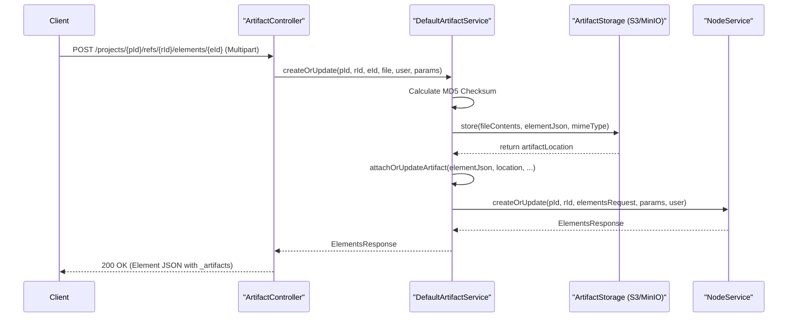
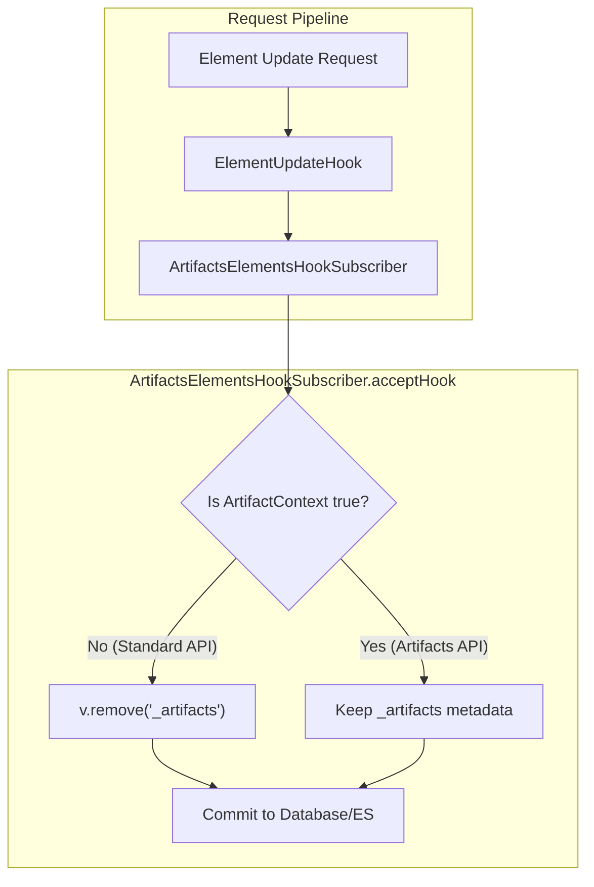

# Page: Artifacts API

# Artifacts API

Relevant source files

The following files were used as context for generating this wiki page:

- [artifacts/artifacts.gradle](artifacts/artifacts.gradle)
- [artifacts/src/main/java/org/openmbee/mms/artifacts/json/ArtifactJson.java](artifacts/src/main/java/org/openmbee/mms/artifacts/json/ArtifactJson.java)
- [artifacts/src/main/java/org/openmbee/mms/artifacts/objects/ArtifactResponse.java](artifacts/src/main/java/org/openmbee/mms/artifacts/objects/ArtifactResponse.java)
- [artifacts/src/main/java/org/openmbee/mms/artifacts/pubsub/ArtifactsElementsHookSubscriber.java](artifacts/src/main/java/org/openmbee/mms/artifacts/pubsub/ArtifactsElementsHookSubscriber.java)
- [artifacts/src/main/java/org/openmbee/mms/artifacts/service/DefaultArtifactService.java](artifacts/src/main/java/org/openmbee/mms/artifacts/service/DefaultArtifactService.java)
- [core/src/main/java/org/openmbee/mms/core/objects/ElementsRequest.java](core/src/main/java/org/openmbee/mms/core/objects/ElementsRequest.java)
- [core/src/main/java/org/openmbee/mms/core/objects/ElementsResponse.java](core/src/main/java/org/openmbee/mms/core/objects/ElementsResponse.java)
- [example/artifacts.postman_collection.json](example/artifacts.postman_collection.json)
- [example/test_artifacts/aa.png](example/test_artifacts/aa.png)
- [example/test_artifacts/x.jpg](example/test_artifacts/x.jpg)

The Artifacts API provides endpoints for uploading, retrieving, and managing binary files (artifacts) associated with elements. Artifacts are stored in a dedicated storage backend (such as S3 or MinIO) while their metadata is embedded within the element's JSON structure under the `_artifacts` key.

## Overview

The artifacts module extends the core MMS functionality to handle non-structured binary data. Key features include:
*   **Deduplication**: Artifacts are stored based on MD5 checksums to prevent redundant storage of identical files [artifacts/src/main/java/org/openmbee/mms/artifacts/service/DefaultArtifactService.java:91-92]().
*   **Versioning**: Artifacts are associated with specific element versions. Retrieving an element at a specific commit will reference the artifact version present at that time [artifacts/src/main/java/org/openmbee/mms/artifacts/service/DefaultArtifactService.java:52-67]().
*   **Pluggable Storage**: Supports different backends through the `ArtifactStorage` interface.
*   **Integrity Protection**: A pre-commit hook ensures that artifact metadata cannot be manually injected or altered through standard element update APIs [artifacts/src/main/java/org/openmbee/mms/artifacts/pubsub/ArtifactsElementsHookSubscriber.java:24-28]().

### Data Flow: Artifact Upload

The following diagram illustrates the flow of a multipart file upload through the system components.

**Artifact Upload Sequence**

Sources: [artifacts/src/main/java/org/openmbee/mms/artifacts/service/DefaultArtifactService.java:69-103](), [artifacts/src/main/java/org/openmbee/mms/artifacts/json/ArtifactJson.java:18-23]()

---

## Core Components

### ArtifactJson
`ArtifactJson` is a specialized map that handles the metadata for an artifact stored within an `ElementJson` object. It uses the system key `_artifacts` to store a list of artifact metadata objects [artifacts/src/main/java/org/openmbee/mms/artifacts/json/ArtifactJson.java:16-23]().

| Field | Description |
| :--- | :--- |
| `mimetype` | The IANA media type of the file (e.g., `image/jpeg`) |
| `extension` | The file extension (e.g., `jpg`) |
| `location` | The URI or path in the storage backend |
| `locationType` | The type of storage (e.g., `internal`) |
| `checksum` | MD5 hash of the file content |

Sources: [artifacts/src/main/java/org/openmbee/mms/artifacts/json/ArtifactJson.java:18-91]()

### DefaultArtifactService
This service implements the business logic for associating files with elements. 
*   **`get`**: Retrieves the binary data from `ArtifactStorage` based on the artifact metadata found on the element [artifacts/src/main/java/org/openmbee/mms/artifacts/service/DefaultArtifactService.java:52-67]().
*   **`createOrUpdate`**: Handles the upload process. It generates a checksum, persists the binary to storage, and then updates the element's JSON to include the new artifact metadata before calling the `NodeService` to commit the change [artifacts/src/main/java/org/openmbee/mms/artifacts/service/DefaultArtifactService.java:69-103]().
*   **`disassociate`**: Removes the artifact metadata from the element, effectively "deleting" the attachment from that version of the element [artifacts/src/main/java/org/openmbee/mms/artifacts/service/DefaultArtifactService.java:105-125]().

Sources: [artifacts/src/main/java/org/openmbee/mms/artifacts/service/DefaultArtifactService.java:30-125]()

### ArtifactsElementsHookSubscriber
To maintain data integrity, MMS uses an `EmbeddedHookSubscriber` that listens for `ElementUpdateHook` events. 

**Pre-Commit Enforcement Logic**

This subscriber ensures that users cannot manually modify the `_artifacts` field via the standard Elements API. The `_artifacts` field is stripped from any incoming `ElementJson` unless the request originates from the `ArtifactController`, which sets a thread-local `ArtifactsContext` [artifacts/src/main/java/org/openmbee/mms/artifacts/pubsub/ArtifactsElementsHookSubscriber.java:17-29](), [artifacts/src/main/java/org/openmbee/mms/artifacts/service/DefaultArtifactService.java:98-102]().

Sources: [artifacts/src/main/java/org/openmbee/mms/artifacts/pubsub/ArtifactsElementsHookSubscriber.java:9-30](), [artifacts/src/main/java/org/openmbee/mms/artifacts/service/DefaultArtifactService.java:98-102]()

---

## API Endpoints

### Upload/Update Artifact
`POST /projects/{projectId}/refs/{refId}/elements/{elementId}`

Uploads a file and associates it with the specified element. If the element does not exist, it is created [artifacts/src/main/java/org/openmbee/mms/artifacts/service/DefaultArtifactService.java:73-80]().

*   **Content-Type**: `multipart/form-data`
*   **Body**: `file` (Binary)
*   **Response**: `ElementsResponse` containing the updated element with `_artifacts` metadata.

### Retrieve Artifact
`GET /projects/{projectId}/refs/{refId}/elements/{elementId}`

Retrieves the binary content of the artifact.

*   **Query Parameters**:
    *   `extension`: (Optional) Filter by file extension.
    *   `mimetype`: (Optional) Filter by mime type.
*   **Response**: Binary stream of the file.

### Disassociate Artifact
`DELETE /projects/{projectId}/refs/{refId}/elements/{elementId}`

Removes the artifact association from the element. This creates a new commit for the element where the `_artifacts` entry is removed [artifacts/src/main/java/org/openmbee/mms/artifacts/service/DefaultArtifactService.java:115-121]().

Sources: [artifacts/src/main/java/org/openmbee/mms/artifacts/service/DefaultArtifactService.java:52-125](), [example/artifacts.postman_collection.json:197-248]()

---

## Storage Implementation

The `ArtifactStorage` interface defines the contract for persisting binary data.

| Function | Description |
| :--- | :--- |
| `store(byte[] data, ElementJson element, String mimeType)` | Persists data to the backend and returns a location string [artifacts/src/main/java/org/openmbee/mms/artifacts/service/DefaultArtifactService.java:92](). |
| `get(String location, ElementJson element, String mimeType)` | Retrieves the byte array for a given location [artifacts/src/main/java/org/openmbee/mms/artifacts/service/DefaultArtifactService.java:60](). |

The default implementation typically uses S3-compatible storage (like MinIO). The location is usually structured as `{projectId}/{elementId}/{extension}/{checksum}` to ensure uniqueness and organization.

Sources: [artifacts/src/main/java/org/openmbee/mms/artifacts/service/DefaultArtifactService.java:32-67](), [example/artifacts.postman_collection.json:208-209]()
