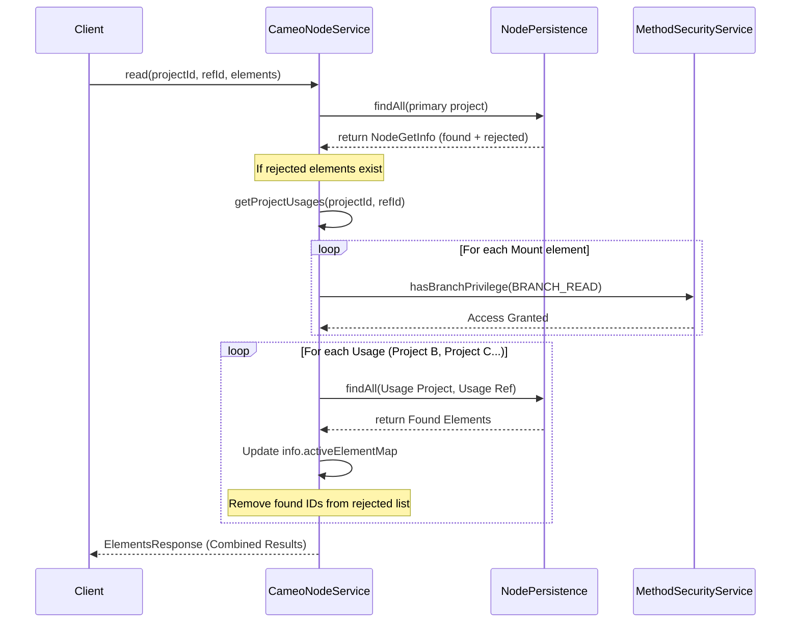
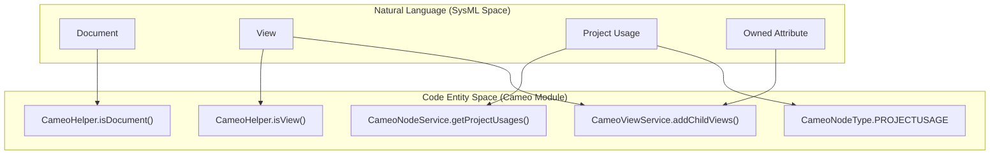

# Page: Cameo Module

# Cameo Module

Relevant source files

The following files were used as context for generating this wiki page:

- [cameo/src/main/java/org/openmbee/mms/cameo/CameoConstants.java](cameo/src/main/java/org/openmbee/mms/cameo/CameoConstants.java)
- [cameo/src/main/java/org/openmbee/mms/cameo/services/CameoCommitService.java](cameo/src/main/java/org/openmbee/mms/cameo/services/CameoCommitService.java)
- [cameo/src/main/java/org/openmbee/mms/cameo/services/CameoHelper.java](cameo/src/main/java/org/openmbee/mms/cameo/services/CameoHelper.java)
- [cameo/src/main/java/org/openmbee/mms/cameo/services/CameoNodeService.java](cameo/src/main/java/org/openmbee/mms/cameo/services/CameoNodeService.java)
- [cameo/src/main/java/org/openmbee/mms/cameo/services/CameoViewService.java](cameo/src/main/java/org/openmbee/mms/cameo/services/CameoViewService.java)
- [core/src/main/java/org/openmbee/mms/core/dao/CommitPersistence.java](core/src/main/java/org/openmbee/mms/core/dao/CommitPersistence.java)
- [crud/src/main/java/org/openmbee/mms/crud/config/OptimizationConfig.java](crud/src/main/java/org/openmbee/mms/crud/config/OptimizationConfig.java)
- [crud/src/main/java/org/openmbee/mms/crud/domain/JsonDomain.java](crud/src/main/java/org/openmbee/mms/crud/domain/JsonDomain.java)
- [crud/src/main/java/org/openmbee/mms/crud/services/DefaultCommitService.java](crud/src/main/java/org/openmbee/mms/crud/services/DefaultCommitService.java)
- [example/cameo.postman_collection.json](example/cameo.postman_collection.json)
- [federatedpersistence/src/main/java/org/openmbee/mms/federatedpersistence/dao/FederatedCommitPersistence.java](federatedpersistence/src/main/java/org/openmbee/mms/federatedpersistence/dao/FederatedCommitPersistence.java)
- [federatedpersistence/src/main/java/org/openmbee/mms/federatedpersistence/dao/FederatedNodePersistence.java](federatedpersistence/src/main/java/org/openmbee/mms/federatedpersistence/dao/FederatedNodePersistence.java)
- [jupyter/src/main/java/org/openmbee/mms/jupyter/services/JupyterNodeService.java](jupyter/src/main/java/org/openmbee/mms/jupyter/services/JupyterNodeService.java)
- [msosa/src/main/java/org/openmbee/mms/msosa/services/MsosaViewService.java](msosa/src/main/java/org/openmbee/mms/msosa/services/MsosaViewService.java)

The Cameo module provides domain-specific logic for SysML models exported from Cameo Systems Modeler. It extends the core MMS functionality to support hierarchical view rendering, cross-project element resolution (Project Usages), and specific element typing based on SysML stereotypes.

## Cameo Schema Services

The module is built around a set of services that override or extend the `DefaultNodeService` and `DefaultViewService` to handle Cameo-specific data structures.

### CameoNodeService
`CameoNodeService` is the primary service for element operations. Its most significant feature is the implementation of **cross-project element resolution**. Unlike the standard service, if an element is not found in the current project, `CameoNodeService` recursively searches through "Project Usages" (mounts).

*   **Recursive Mount Traversal**: The `getProjectUsages` method performs a depth-first search of the project's hierarchy to build a tree of accessible projects [cameo/src/main/java/org/openmbee/mms/cameo/services/CameoNodeService.java:99-145]().
*   **Cross-Project Read**: The `read` method attempts to find elements in the primary project. If any are "rejected" (not found), it iterates through the list of project usages to resolve them from mounted projects, respecting user permissions [cameo/src/main/java/org/openmbee/mms/cameo/services/CameoNodeService.java:43-90]().

### CameoViewService
`CameoViewService` implements the `ViewService` interface to handle the SysML View and Viewpoint hierarchy. It processes `_childViews` and manages the relationship between Documents and Groups (Site Characterizations).

*   **Child View Processing**: The `addChildViews` method identifies SysML Views and populates the `_childViews` property by inspecting `ownedAttributes` of type `Property` where the property type is another View [cameo/src/main/java/org/openmbee/mms/cameo/services/CameoViewService.java:59-83]().
*   **Document/Group Resolution**:
    *   `getDocuments` finds all elements typed as Documents and resolves their parent Group (Site Characterization) [cameo/src/main/java/org/openmbee/mms/cameo/services/CameoViewService.java:32-44]().
    *   `getGroups` retrieves all elements typed as Groups and maps their hierarchy using the `_parentId` [cameo/src/main/java/org/openmbee/mms/cameo/services/CameoViewService.java:85-97]().

### CameoCommitService
Extends `DefaultCommitService`. It overrides `isProjectNew` to account for Cameo-specific initialization. A project is considered "new" if it has 1 or fewer commits, as Cameo projects typically receive an automatic initial commit during setup [cameo/src/main/java/org/openmbee/mms/cameo/services/CameoCommitService.java:11-17]().

Sources: [cameo/src/main/java/org/openmbee/mms/cameo/services/CameoNodeService.java:27-146](), [cameo/src/main/java/org/openmbee/mms/cameo/services/CameoViewService.java:28-140](), [cameo/src/main/java/org/openmbee/mms/cameo/services/CameoCommitService.java:11-17]()

---

## Data Flow: Cross-Project Resolution

The following diagram illustrates how `CameoNodeService` resolves elements across multiple projects using the Mount hierarchy.

**Element Resolution Logic**

Sources: [cameo/src/main/java/org/openmbee/mms/cameo/services/CameoNodeService.java:59-83](), [cameo/src/main/java/org/openmbee/mms/cameo/services/CameoNodeService.java:102-138]()

---

## Constants and Types

The module uses `CameoConstants` and `CameoHelper` to map SysML concepts to JSON keys and node types.

### CameoNodeType and CameoEdgeType
Elements are assigned specific types based on their SysML metadata (stereotypes and properties):
*   `DOCUMENT`: Elements with the Document stereotype ID [cameo/src/main/java/org/openmbee/mms/cameo/services/CameoHelper.java:65-74]().
*   `VIEW`: Elements with SysML View stereotype IDs [cameo/src/main/java/org/openmbee/mms/cameo/services/CameoHelper.java:52-63]().
*   `PROJECTUSAGE`: Elements where the type is "Mount" [cameo/src/main/java/org/openmbee/mms/cameo/services/CameoHelper.java:35-36]().
*   `GROUP`: Elements where `_isGroup` is true [cameo/src/main/java/org/openmbee/mms/cameo/services/CameoHelper.java:76-81]().

### Key Constants
| Constant | JSON Key | Purpose |
| :--- | :--- | :--- |
| `MOUNTEDELEMENTPROJECTID` | `mountedElementProjectId` | ID of the project being used/mounted |
| `MOUNTEDREFID` | `mountedRefId` | Branch ID of the mounted project |
| `CHILDVIEWS` | `_childViews` | Calculated list of sub-views |
| `OWNERID` | `ownerId` | Standard SysML ownership relation |
| `APPLIEDSTEREOTYPEIDS` | `appliedStereotypeIds` | List of SysML stereotype GUIDs |

Sources: [cameo/src/main/java/org/openmbee/mms/cameo/CameoConstants.java:10-130](), [cameo/src/main/java/org/openmbee/mms/cameo/services/CameoHelper.java:17-50]()

---

## Implementation Detail: View Processing

The relationship between "Natural Language" SysML concepts and the code implementation is mapped below.

**SysML to Code Mapping**

Sources: [cameo/src/main/java/org/openmbee/mms/cameo/services/CameoHelper.java:52-74](), [cameo/src/main/java/org/openmbee/mms/cameo/services/CameoViewService.java:59-83](), [cameo/src/main/java/org/openmbee/mms/cameo/services/CameoNodeService.java:99-103]()

### Recursive Mount Traversal Logic
The `getProjectUsages` function is critical for building the `MountJson` structure. It uses `NodePersistence.findAllByNodeType` with `CameoNodeType.PROJECTUSAGE` to find all mount elements in the current context [cameo/src/main/java/org/openmbee/mms/cameo/services/CameoNodeService.java:102-103](). It then extracts the `mountedElementProjectId` and `mountedRefId` to recurse into the next project [cameo/src/main/java/org/openmbee/mms/cameo/services/CameoNodeService.java:108-109](). Circular dependencies are prevented by tracking visited project/ref pairs in a `saw` list [cameo/src/main/java/org/openmbee/mms/cameo/services/CameoNodeService.java:118-121]().

Sources: [cameo/src/main/java/org/openmbee/mms/cameo/services/CameoNodeService.java:99-145]()
