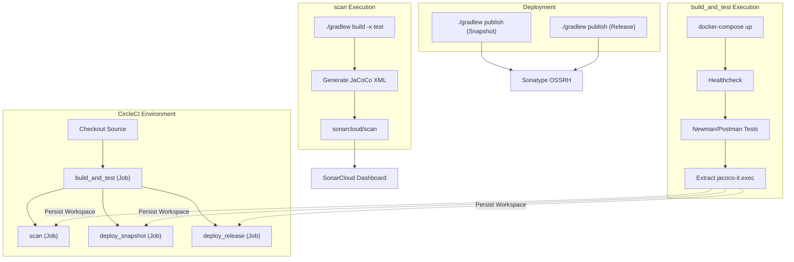
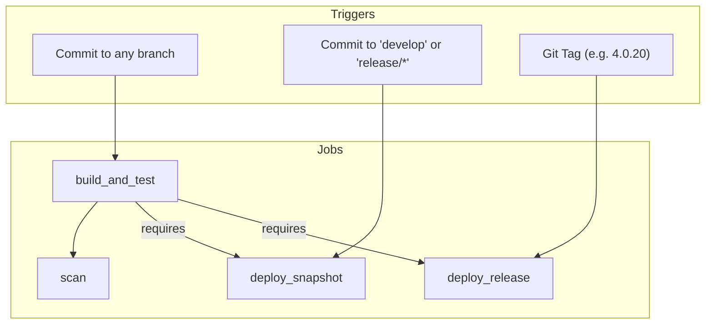

# Page: CI/CD and Build Pipeline

# CI/CD and Build Pipeline

Relevant source files

The following files were used as context for generating this wiki page:

- [.circleci/config.yml](.circleci/config.yml)
- [.gitignore](.gitignore)
- [.readthedocs.yaml](.readthedocs.yaml)
- [Dockerfile](Dockerfile)
- [build.gradle](build.gradle)
- [docs/requirements.txt](docs/requirements.txt)
- [elastic/README.rst](elastic/README.rst)
- [example/example.gradle](example/example.gradle)
- [example/getAtCommits.postman_collection.json](example/getAtCommits.postman_collection.json)
- [gradle.properties](gradle.properties)
- [sonar-project.properties](sonar-project.properties)

The Model Management System (MMS) utilizes a robust CI/CD pipeline managed via CircleCI to ensure code quality, security compliance, and automated delivery of artifacts to the Sonatype Open Source Software Repository Hosting (OSSRH). The pipeline integrates Gradle multi-module builds, Dockerized integration testing with Postman/Newman, JaCoCo code coverage, and SonarCloud analysis.

## Pipeline Overview

The pipeline is defined in [.circleci/config.yml:1-124](). It consists of four primary jobs organized into a single workflow: `build-test-deploy`.

### Pipeline Jobs and Data Flow

The following diagram illustrates the progression of a commit through the CircleCI pipeline and the associated Gradle tasks.

**MMS Build Pipeline Data Flow**

**Sources:** [.circleci/config.yml:13-124]()

---

## 1. build_and_test Job

This job is the entry point for all branches and tags. It uses a `docker/docker` executor to manage the multi-container environment required for integration testing [.circleci/config.yml:14-16]().

### Implementation Details:
1.  **Environment Setup**: Copies the `application.properties.example` to the active configuration and downloads JaCoCo agent/CLI jars [.circleci/config.yml:26-29]().
2.  **Service Orchestration**: Starts the MMS application and its dependencies (PostgreSQL, Elasticsearch, MinIO) using `docker-compose up --build -d` [.circleci/config.yml:30]().
3.  **Health Check**: Polls the `/healthcheck` endpoint using a `curl` container to ensure the system is ready before testing [.circleci/config.yml:31]().
4.  **Integration Testing**: Executes a suite of Postman collections using Newman. These tests cover various modules including CRUD, Cameo, Jupyter, Permissions, and Search [.circleci/config.yml:34-48]().
5.  **Coverage Collection**: When the MMS container runs, it uses the `-javaagent:jacocoJars/jacocoagent.jar` to track execution [Dockerfile:8](). After tests finish, the `jacoco-it.exec` file is copied out of the container [.circleci/config.yml:52]().

**Sources:** [.circleci/config.yml:14-53](), [Dockerfile:1-10]()

---

## 2. Scan and Quality Gates

The `scan` job performs static analysis and processes coverage reports [.circleci/config.yml:59-74]().

### JaCoCo and SonarCloud Integration:
*   **Report Generation**: The job runs `./gradlew build -x test` to compile classes, then uses the `jacococli.jar` to convert the binary `.exec` file from the integration tests into an XML report [.circleci/config.yml:68-71]().
*   **SonarCloud**: Uses the `sonarsource/sonarcloud` orb to upload results. Configuration is driven by `sonar-project.properties`, which specifies the project key `Open-MBEE_exec-mms` and the path to the JaCoCo XML report [sonar-project.properties:1-5]().

**Sources:** [.circleci/config.yml:59-74](), [sonar-project.properties:1-5]()

---

## 3. Artifact Publication (OSSRH)

MMS uses the Gradle `maven-publish` and `signing` plugins to distribute modules [build.gradle:62-64]().

### Publication Logic
Artifacts are published to Sonatype OSSRH. The destination repository is determined by the version string:
*   **Snapshots**: Versions ending in `-SNAPSHOT` are sent to the Sonatype snapshots repository [build.gradle:138-139]().
*   **Releases**: Versions without the suffix are sent to the staging repository [build.gradle:137-139]().

### Key Gradle Tasks
*   `javadocJar`: Packages Javadoc into a JAR [build.gradle:72-75]().
*   `sourcesJar`: Packages source code into a JAR [build.gradle:77-80]().
*   `publish`: Orchestrates the upload of the JAR, POM, and signatures [build.gradle:98-153]().
*   `signing`: Signs the `mavenJava` publication using PGP keys provided via environment variables (`SIGNING_KEY`, `SIGNING_PASSWORD`) [build.gradle:155-163]().

**Sources:** [build.gradle:61-163](), [.circleci/config.yml:76-94]()

---

## 4. Build Configuration Entity Mapping

This table maps the conceptual build pipeline stages to the specific code entities and configurations that implement them.

| Pipeline Stage | Code Entity / File | Implementation Role |
| :--- | :--- | :--- |
| **Orchestration** | `.circleci/config.yml` | Defines jobs, workflows, and environment executors. |
| **Build Tool** | `build.gradle` | Root build script managing subproject dependencies and publishing. |
| **App Assembly** | `example/example.gradle` | Assembles the `bootJar` including all functional modules. |
| **Containerization** | `Dockerfile` | Multi-stage build that runs `gradlew bootJar` and sets up the JaCoCo agent. |
| **Dependency Mgmt** | `gradle.properties` | Centralized versioning for Spring Boot, Jackson, and Elastic. |
| **Test Execution** | `postman/*.json` | Postman collections executed by Newman in the `build_and_test` job. |
| **Code Analysis** | `sonar-project.properties` | Configures SonarCloud project keys and coverage report paths. |

**Sources:** [build.gradle:1-164](), [example/example.gradle:1-55](), [gradle.properties:1-15](), [.circleci/config.yml:1-124]()

---

## 5. Workflow Triggers

The `build-test-deploy` workflow implements specific filters to control the flow of artifacts [.circleci/config.yml:97-124]().

*   **Snapshots**: Triggered on `develop` or `release/*` branches. They are published with the `-SNAPSHOT` suffix [build.gradle:47-50]().
*   **Releases**: Triggered only by Git tags matching the version pattern `/[0-9.]+(-(a|b|rc)[0-9]+)?/` [.circleci/config.yml:121-122](). The pipeline validates that the Git tag matches the version defined in `gradle.properties` [build.gradle:43-46]().

**Sources:** [.circleci/config.yml:95-124](), [build.gradle:43-52]()
