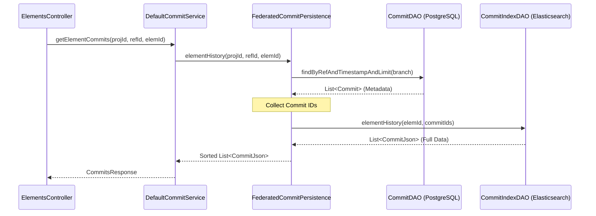
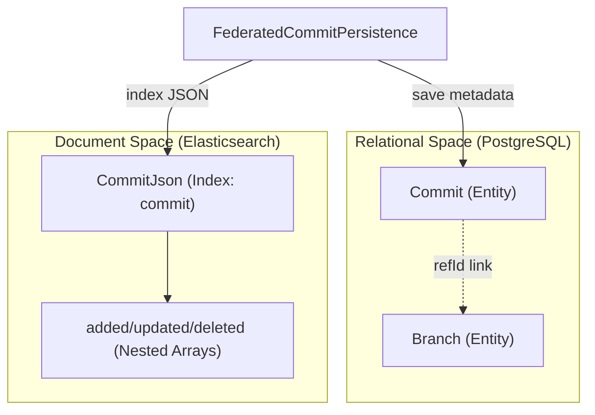

# Page: Commits and History API

# Commits and History API

Relevant source files

The following files were used as context for generating this wiki page:

- [cameo/src/main/java/org/openmbee/mms/cameo/services/CameoCommitService.java](cameo/src/main/java/org/openmbee/mms/cameo/services/CameoCommitService.java)
- [cameo/src/main/java/org/openmbee/mms/cameo/services/CameoNodeService.java](cameo/src/main/java/org/openmbee/mms/cameo/services/CameoNodeService.java)
- [core/src/main/java/org/openmbee/mms/core/dao/CommitPersistence.java](core/src/main/java/org/openmbee/mms/core/dao/CommitPersistence.java)
- [crud/src/main/java/org/openmbee/mms/crud/config/OptimizationConfig.java](crud/src/main/java/org/openmbee/mms/crud/config/OptimizationConfig.java)
- [crud/src/main/java/org/openmbee/mms/crud/controllers/elements/ElementsController.java](crud/src/main/java/org/openmbee/mms/crud/controllers/elements/ElementsController.java)
- [crud/src/main/java/org/openmbee/mms/crud/services/DefaultCommitService.java](crud/src/main/java/org/openmbee/mms/crud/services/DefaultCommitService.java)
- [crud/src/main/java/org/openmbee/mms/crud/services/DefaultNodeService.java](crud/src/main/java/org/openmbee/mms/crud/services/DefaultNodeService.java)
- [elastic/src/main/java/org/openmbee/mms/elastic/CommitElasticDAOImpl.java](elastic/src/main/java/org/openmbee/mms/elastic/CommitElasticDAOImpl.java)
- [example/crud.postman_collection.json](example/crud.postman_collection.json)
- [example/permissions.postman_collection.json](example/permissions.postman_collection.json)
- [example/twc.postman_collection.json](example/twc.postman_collection.json)
- [federatedpersistence/src/main/java/org/openmbee/mms/federatedpersistence/dao/FederatedCommitPersistence.java](federatedpersistence/src/main/java/org/openmbee/mms/federatedpersistence/dao/FederatedCommitPersistence.java)
- [federatedpersistence/src/main/java/org/openmbee/mms/federatedpersistence/dao/FederatedNodePersistence.java](federatedpersistence/src/main/java/org/openmbee/mms/federatedpersistence/dao/FederatedNodePersistence.java)

The Commits and History API provides endpoints for retrieving the audit trail of changes within a project. MMS tracks every change to an element as a versioned commit, allowing users to query the state of the repository at any point in time, inspect specific change sets, and view the evolution of individual elements.

## Commit Data Structure

Commits are represented by `CommitJson` objects. Unlike standard version control systems that might only store a message and metadata, an MMS commit explicitly contains arrays of the element states as they existed at the time of the commit.

### CommitJson Fields
*   `id`: The unique identifier (UUID) for the commit.
*   `_creator`: The user who performed the action.
*   `_created`: Timestamp of the commit.
*   `added`: Array of `ElementJson` objects created in this commit.
*   `updated`: Array of `ElementJson` objects modified in this commit.
*   `deleted`: Array of `ElementJson` objects removed in this commit.

### Large Commit Handling
To prevent performance degradation with massive commits, `CommitElasticDAOImpl` implements a chunking strategy. If the number of elements in a commit exceeds the limit (default 10,000), the DAO splits the `CommitJson` into multiple physical documents in Elasticsearch, all sharing the same `commitId` but having unique `docId` values [elastic/src/main/java/org/openmbee/mms/elastic/CommitElasticDAOImpl.java:42-73]().

**Sources:** [json/src/main/java/org/openmbee/mms/json/CommitJson.java](), [elastic/src/main/java/org/openmbee/mms/elastic/CommitElasticDAOImpl.java:27-78]()

---

## Commit Endpoints

### 1. Get Branch Commits
`GET /projects/{projectId}/refs/{refId}/commits`

Retrieves a list of commits associated with a specific branch.

*   **Query Parameters:**
    *   `limit`: Integer to restrict the number of commits returned [crud/src/main/java/org/openmbee/mms/crud/services/DefaultCommitService.java:39-41]().
    *   `maxTimestamp`: ISO-8601 timestamp to filter commits occurring before a certain time [crud/src/main/java/org/openmbee/mms/crud/services/DefaultCommitService.java:42-50]().

### 2. Get Specific Commit
`GET /projects/{projectId}/commits/{commitId}`

Retrieves the full details of a specific commit, including the `added`, `updated`, and `deleted` arrays. This is handled by `DefaultCommitService.getCommit` [crud/src/main/java/org/openmbee/mms/crud/services/DefaultCommitService.java:71-79]().

### 3. Get Element History
`GET /projects/{projectId}/refs/{refId}/elements/{elementId}/commits`

Retrieves all commits that affected a specific element. The `FederatedCommitPersistence` delegates this to `CommitIndexDAO.elementHistory`, which performs a "should" query in Elasticsearch across the `added.id`, `updated.id`, and `deleted.id` fields [elastic/src/main/java/org/openmbee/mms/elastic/CommitElasticDAOImpl.java:113-124]().

**Sources:** [crud/src/main/java/org/openmbee/mms/crud/services/DefaultCommitService.java:36-90](), [federatedpersistence/src/main/java/org/openmbee/mms/federatedpersistence/dao/FederatedCommitPersistence.java:160-175]()

---

## Technical Implementation and Data Flow

The Commit API follows a federated persistence pattern where metadata is stored in a Relational Database (RDB) and the heavy JSON payloads (the element arrays) are stored in Elasticsearch.

### Logic Flow: Retrieving Commits
The following diagram illustrates how a request for commit history flows from the Controller through the Service layer to the Federated Persistence layer.

**Commit Retrieval Sequence**

**Sources:** [crud/src/main/java/org/openmbee/mms/crud/services/DefaultCommitService.java:82-90](), [federatedpersistence/src/main/java/org/openmbee/mms/federatedpersistence/dao/FederatedCommitPersistence.java:160-175]()

---

## The "Get At Commit" Pattern

A critical feature of the MMS API is the ability to read elements at a specific point in history. Most `GET` endpoints for elements accept an optional `commitId` parameter.

### Implementation in `DefaultNodeService`
When a `commitId` is provided:
1.  The service validates the commit exists via `commitPersistence.findById` [crud/src/main/java/org/openmbee/mms/crud/services/DefaultNodeService.java:71-74]().
2.  The request is passed to `nodePersistence.findAll(projectId, refId, commitId, ...)` [crud/src/main/java/org/openmbee/mms/crud/services/DefaultNodeService.java:150]().
3.  The persistence layer uses the `commitId` to filter the Elasticsearch query, ensuring only the version of the element associated with that commit (or the most recent version prior to it) is returned.

### Optimization Logic
The `mms.optimize-for-federated` flag influences how the latest commit is resolved. If set to `false`, the system explicitly resolves the latest `commitId` before querying elements to ensure consistency across the federated stores [crud/src/main/java/org/openmbee/mms/crud/services/DefaultNodeService.java:81-83]().

**Sources:** [crud/src/main/java/org/openmbee/mms/crud/services/DefaultNodeService.java:65-158](), [crud/src/main/java/org/openmbee/mms/crud/config/OptimizationConfig.java:9-10]()

---

## Persistence Mapping

MMS uses a dual-write strategy for commits to maintain both relational integrity and search performance.

| Code Entity | Responsibility | Storage Backend |
| :--- | :--- | :--- |
| `Commit` (JPA Entity) | Stores commit metadata: `commitId`, `creator`, `timestamp`, `branchId`. | PostgreSQL (Scoped Schema) |
| `CommitJson` (DTO) | Contains full element deltas (`added`, `updated`, `deleted`). | Elasticsearch (`commit` index) |
| `FederatedCommitPersistence` | Coordinates writes to both `CommitDAO` and `CommitIndexDAO`. | Orchestrator |

**Code Entity to Data Space Mapping**

**Sources:** [federatedpersistence/src/main/java/org/openmbee/mms/federatedpersistence/dao/FederatedCommitPersistence.java:40-64](), [data/src/main/java/org/openmbee/mms/data/domains/scoped/Commit.java](), [elastic/src/main/java/org/openmbee/mms/elastic/CommitElasticDAOImpl.java:34-43]()
