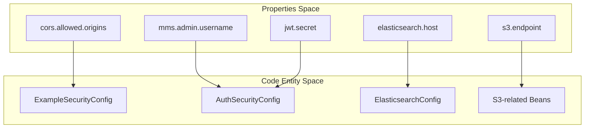
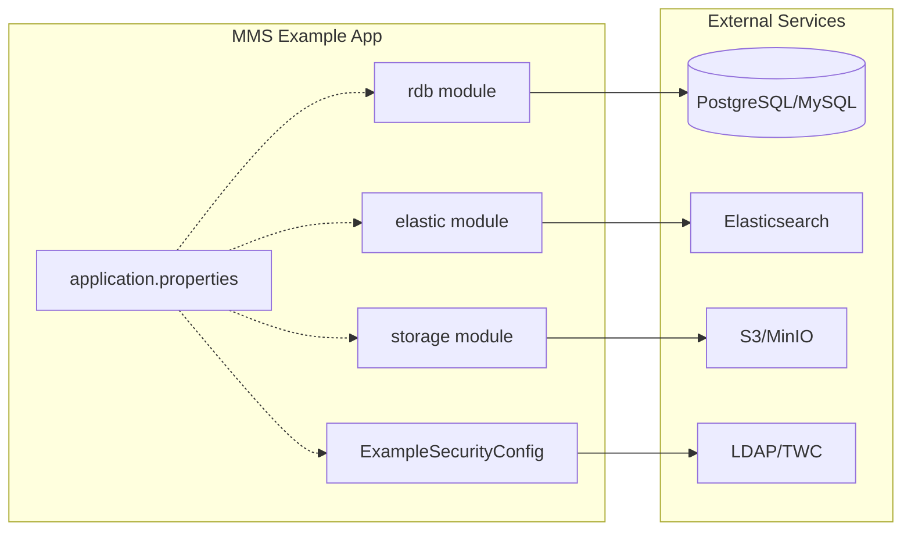

# Page: Configuration Reference

# Configuration Reference

Relevant source files

The following files were used as context for generating this wiki page:

- [.gitignore](.gitignore)
- [elastic/src/main/java/org/openmbee/mms/elastic/config/ElasticsearchConfig.java](elastic/src/main/java/org/openmbee/mms/elastic/config/ElasticsearchConfig.java)
- [elastic/src/main/resources/application.properties.example](elastic/src/main/resources/application.properties.example)
- [example/src/main/java/org/openmbee/mms/example/config/ExampleSecurityConfig.java](example/src/main/java/org/openmbee/mms/example/config/ExampleSecurityConfig.java)
- [example/src/main/resources/application-test.properties](example/src/main/resources/application-test.properties)
- [example/src/main/resources/application.properties.example](example/src/main/resources/application.properties.example)
- [rdb/src/main/java/org/openmbee/mms/rdb/repositories/BranchGroupPermRepository.java](rdb/src/main/java/org/openmbee/mms/rdb/repositories/BranchGroupPermRepository.java)
- [rdb/src/main/java/org/openmbee/mms/rdb/repositories/BranchRepository.java](rdb/src/main/java/org/openmbee/mms/rdb/repositories/BranchRepository.java)
- [rdb/src/main/java/org/openmbee/mms/rdb/repositories/BranchUserPermRepository.java](rdb/src/main/java/org/openmbee/mms/rdb/repositories/BranchUserPermRepository.java)
- [rdb/src/main/java/org/openmbee/mms/rdb/repositories/ProjectGroupPermRepository.java](rdb/src/main/java/org/openmbee/mms/rdb/repositories/ProjectGroupPermRepository.java)
- [rdb/src/main/java/org/openmbee/mms/rdb/repositories/ProjectUserPermRepository.java](rdb/src/main/java/org/openmbee/mms/rdb/repositories/ProjectUserPermRepository.java)
- [storage/src/main/resources/application.properties.example](storage/src/main/resources/application.properties.example)
- [storage/storage.gradle](storage/storage.gradle)

The Model Management System (MMS) is configured primarily through Spring Boot `application.properties` files. Because MMS is a modular system, configuration is spread across infrastructure (databases, search engines), security (JWT, LDAP, TWC), and storage (S3/MinIO) settings.

This page provides a high-level reference for the available configuration keys and how they integrate to form a functional environment.

## Application Assembly and Security

The `example` module serves as the primary assembly point for the MMS application, combining various library modules into a runnable Spring Boot service. The `ExampleSecurityConfig` class integrates these modules by defining the security filter chain, CORS policies, and transaction management.

### ExampleSecurityConfig
This configuration class [example/src/main/java/org/openmbee/mms/example/config/ExampleSecurityConfig.java:33-33]() manages:
*   **CORS**: Configured via `cors.allowed.origins` [example/src/main/java/org/openmbee/mms/example/config/ExampleSecurityConfig.java:35-36]().
*   **Auth Integration**: Delegates specific security rules to the `AuthSecurityConfig` from the authenticator module [example/src/main/java/org/openmbee/mms/example/config/ExampleSecurityConfig.java:46-46]().
*   **Method Security**: Enables `@PreAuthorize` expressions via `@EnableGlobalMethodSecurity` [example/src/main/java/org/openmbee/mms/example/config/ExampleSecurityConfig.java:30-30]().

### Configuration Bridge: Logic to Properties
The following diagram illustrates how the application configuration properties map to the internal Spring components.

**Configuration Mapping**

**Sources:** [example/src/main/java/org/openmbee/mms/example/config/ExampleSecurityConfig.java:35-46](), [elastic/src/main/java/org/openmbee/mms/elastic/config/ElasticsearchConfig.java:20-33]()

---

## Infrastructure Configuration

MMS requires a relational database (PostgreSQL or MySQL) for metadata and Elasticsearch for element content. 

### Database and Persistence
*   **JDBC**: Configured via `spring.datasource.url` and `spring.datasource.driver-class-name` [example/src/main/resources/application.properties.example:31-37]().
*   **Hibernate**: DDL behavior is controlled by `spring.jpa.hibernate.ddl-auto` (typically set to `update`) [example/src/main/resources/application.properties.example:46-46]().
*   **Optimization**: The `mms.optimize-for-federated` flag enables performance optimizations for the federated persistence layer [example/src/main/resources/application.properties.example:6-6]().

### Elasticsearch
The `ElasticsearchConfig` bean [elastic/src/main/java/org/openmbee/mms/elastic/config/ElasticsearchConfig.java:33-33]() uses properties to initialize the `RestHighLevelClient`. It supports optional Basic Authentication [elastic/src/main/java/org/openmbee/mms/elastic/config/ElasticsearchConfig.java:40-53]().

For details on database schemas, Elasticsearch limits, and MinIO setup, see [Infrastructure Configuration](#9.1).

**Sources:** [example/src/main/resources/application.properties.example:31-69](), [elastic/src/main/java/org/openmbee/mms/elastic/config/ElasticsearchConfig.java:18-58]()

---

## Security and Integration Configuration

MMS supports multiple authentication providers and complex integration with Teamwork Cloud (TWC).

### Identity and Access
*   **JWT**: Requires `jwt.secret` and `jwt.expiration` for stateless session management [example/src/main/resources/application.properties.example:11-13]().
*   **LDAP**: Configured via `ldap.provider.url`, `ldap.user.dn.pattern`, and group search filters [example/src/main/resources/application.properties.example:16-28]().
*   **TWC**: Configured as an array of instances, allowing MMS to delegate permissions and map revisions to Teamwork Cloud resources [example/src/main/resources/application.properties.example:74-79]().

### System Constraints
*   **Streaming**: Large data exports are managed by `mms.stream.batch.size` (default 100,000) [example/src/main/resources/application.properties.example:5-5]().
*   **Admin**: Initial bootstrap credentials are set via `mms.admin.username` and `mms.admin.password` [example/src/main/resources/application.properties.example:2-3]().

For details on LDAP attribute mapping, JWT lifecycle, and TWC instance aliasing, see [Security and Integration Configuration](#9.2).

**Sources:** [example/src/main/resources/application.properties.example:1-28](), [example/src/main/resources/application.properties.example:71-79]()

---

## Configuration Summary Table

| Category | Key Prefix | Purpose |
| :--- | :--- | :--- |
| **Database** | `spring.datasource` | JDBC connection and driver settings [example/src/main/resources/application.properties.example:31-38]() |
| **Elasticsearch** | `elasticsearch` | Host, port, and result limits [elastic/src/main/resources/application.properties.example:1-8]() |
| **Security** | `jwt` / `mms.admin` | Token signing and bootstrap credentials [example/src/main/resources/application.properties.example:2-13]() |
| **LDAP** | `ldap` | Provider URL and DN patterns [example/src/main/resources/application.properties.example:16-28]() |
| **TWC** | `twc.instances` | Teamwork Cloud REST endpoints and aliases [example/src/main/resources/application.properties.example:74-79]() |
| **Storage** | `s3` | Credentials and endpoint for S3/MinIO [storage/src/main/resources/application.properties.example:1-4]() |

### System Integration Diagram

This diagram shows how different configuration groups interact within the `example` application assembly.

**MMS Component Integration**

**Sources:** [example/src/main/resources/application.properties.example:1-92](), [example/src/main/java/org/openmbee/mms/example/config/ExampleSecurityConfig.java:33-47]()
