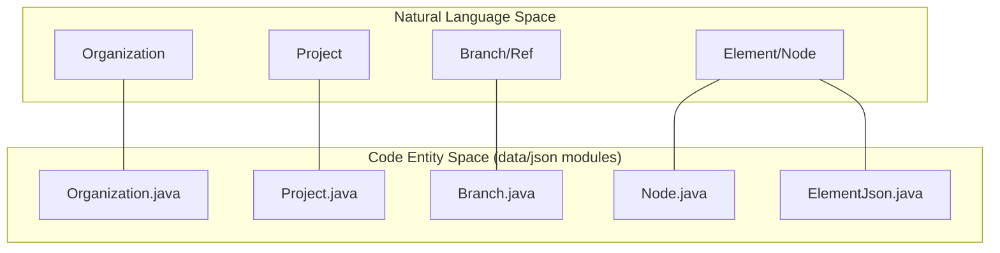
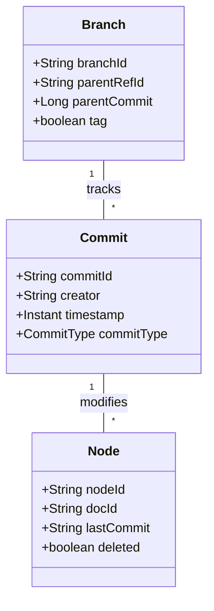

# Page: Core Domain Model

# Core Domain Model

Relevant source files

The following files were used as context for generating this wiki page:

- [data/src/main/java/org/openmbee/mms/data/domains/scoped/Branch.java](data/src/main/java/org/openmbee/mms/data/domains/scoped/Branch.java)
- [data/src/main/java/org/openmbee/mms/data/domains/scoped/Commit.java](data/src/main/java/org/openmbee/mms/data/domains/scoped/Commit.java)
- [data/src/main/java/org/openmbee/mms/data/domains/scoped/Node.java](data/src/main/java/org/openmbee/mms/data/domains/scoped/Node.java)
- [json/json.gradle](json/json.gradle)
- [json/src/main/java/org/openmbee/mms/json/CommitJson.java](json/src/main/java/org/openmbee/mms/json/CommitJson.java)

The MMS data model is designed to support a multi-tenant, version-controlled repository for structured data. It follows a strict hierarchical containment model where data is partitioned by organizations and projects, and versioned through branches (refs) and commits. This model is realized through two primary representations: **JSON Transfer Objects** for API communication and **JPA Entities** for relational persistence.

## Hierarchy and Scoping

The fundamental hierarchy of MMS is `Organization` → `Project` → `Ref` (Branch/Tag) → `Element` (Node). 

- **Organization**: The top-level container for grouping related projects.
- **Project**: A distinct modeling effort. Projects are the boundary for data isolation and schema definition.
- **Ref**: A branch or tag within a project. It represents a specific timeline or snapshot of elements.
- **Element/Node**: The atomic unit of data (e.g., a SysML element, a Jupyter cell).

### Code-to-Concept Mapping
The following diagram bridges the natural language concepts to the specific classes found in the `data` and `json` modules.

**Entity Mapping Diagram**

Sources: [data/src/main/java/org/openmbee/mms/data/domains/scoped/Node.java:12-27](), [data/src/main/java/org/openmbee/mms/data/domains/scoped/Branch.java:13-37](), [json/src/main/java/org/openmbee/mms/json/CommitJson.java:14-20]()

## JSON Transfer Objects (json module)

The `json` module defines the Data Transfer Objects (DTOs) used by the REST API. These objects extend `BaseJson`, which is backed by a `HashMap`, allowing for a flexible schema that can accommodate various domain-specific fields (e.g., Cameo or Jupyter attributes) without changing the Java class definitions.

Key characteristics include:
- **System Fields**: Fields prefixed with underscores (e.g., `_commitId`, `_refId`, `_docId`) are managed by the system to track versioning and identity.
- **Commit Tracking**: `CommitJson` tracks changes through `added`, `updated`, and `deleted` arrays of element versions.

For details, see [JSON Transfer Objects (json module)](#2.1).

Sources: [json/src/main/java/org/openmbee/mms/json/CommitJson.java:16-20](), [json/json.gradle:1-7]()

## Database Entities (data module)

MMS utilizes a two-schema multi-tenancy design implemented via JPA entities in the `data` module.

1.  **Global Schema**: Contains metadata that spans the entire installation, such as `User`, `Group`, `Organization`, and `Project` definitions.
2.  **Scoped Schema**: Every project has its own database schema (or table prefix) containing `Node`, `Branch`, and `Commit` entities. This ensures that the bulk of the model data is partitioned per project.

**Scoped Schema Relationships**

For details, see [Database Entities (data module)](#2.2).

Sources: [data/src/main/java/org/openmbee/mms/data/domains/scoped/Node.java:12-27](), [data/src/main/java/org/openmbee/mms/data/domains/scoped/Branch.java:13-37](), [data/src/main/java/org/openmbee/mms/data/domains/scoped/Commit.java:12-36]()

## Core Service Interfaces

The `core` module defines the service layer interfaces that mediate between the API controllers and the persistence implementations. This decoupling allows MMS to support different backend implementations (e.g., RDB vs. Federated Persistence) while maintaining a consistent domain model.

Key interfaces include:
- `NodeService`: Handles CRUD operations for elements.
- `BranchService`: Manages ref creation and branching logic.
- `CommitService`: Provides access to the history and timeline of changes.

For details, see [Core Service Interfaces](#2.3).
