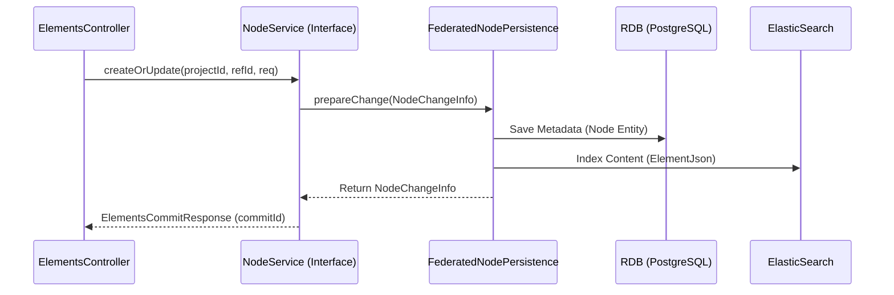
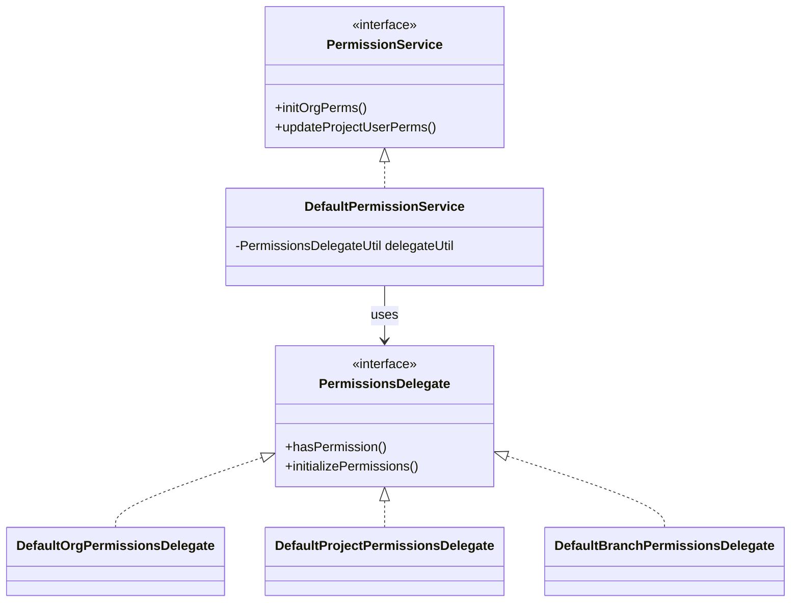

# Page: Core Service Interfaces

# Core Service Interfaces

Relevant source files

The following files were used as context for generating this wiki page:

- [authenticator/src/main/java/org/openmbee/mms/authenticator/security/JwtTokenGenerator.java](authenticator/src/main/java/org/openmbee/mms/authenticator/security/JwtTokenGenerator.java)
- [core/src/main/java/org/openmbee/mms/core/builders/PermissionUpdatesResponseBuilder.java](core/src/main/java/org/openmbee/mms/core/builders/PermissionUpdatesResponseBuilder.java)
- [core/src/main/java/org/openmbee/mms/core/config/Constants.java](core/src/main/java/org/openmbee/mms/core/config/Constants.java)
- [core/src/main/java/org/openmbee/mms/core/exceptions/BadRequestException.java](core/src/main/java/org/openmbee/mms/core/exceptions/BadRequestException.java)
- [core/src/main/java/org/openmbee/mms/core/exceptions/ConflictException.java](core/src/main/java/org/openmbee/mms/core/exceptions/ConflictException.java)
- [core/src/main/java/org/openmbee/mms/core/exceptions/DeletedException.java](core/src/main/java/org/openmbee/mms/core/exceptions/DeletedException.java)
- [core/src/main/java/org/openmbee/mms/core/exceptions/ForbiddenException.java](core/src/main/java/org/openmbee/mms/core/exceptions/ForbiddenException.java)
- [core/src/main/java/org/openmbee/mms/core/exceptions/InternalErrorException.java](core/src/main/java/org/openmbee/mms/core/exceptions/InternalErrorException.java)
- [core/src/main/java/org/openmbee/mms/core/exceptions/NotFoundException.java](core/src/main/java/org/openmbee/mms/core/exceptions/NotFoundException.java)
- [core/src/main/java/org/openmbee/mms/core/exceptions/NotModifiedException.java](core/src/main/java/org/openmbee/mms/core/exceptions/NotModifiedException.java)
- [core/src/main/java/org/openmbee/mms/core/exceptions/UnauthorizedException.java](core/src/main/java/org/openmbee/mms/core/exceptions/UnauthorizedException.java)
- [core/src/main/java/org/openmbee/mms/core/objects/ElementsCommitResponse.java](core/src/main/java/org/openmbee/mms/core/objects/ElementsCommitResponse.java)
- [core/src/main/java/org/openmbee/mms/core/services/DefaultPermissionService.java](core/src/main/java/org/openmbee/mms/core/services/DefaultPermissionService.java)
- [core/src/main/java/org/openmbee/mms/core/services/NodeService.java](core/src/main/java/org/openmbee/mms/core/services/NodeService.java)
- [core/src/main/java/org/openmbee/mms/core/services/TokenService.java](core/src/main/java/org/openmbee/mms/core/services/TokenService.java)
- [crud/src/main/java/org/openmbee/mms/crud/config/ExceptionHandlerConfig.java](crud/src/main/java/org/openmbee/mms/crud/config/ExceptionHandlerConfig.java)
- [crud/src/main/java/org/openmbee/mms/crud/controllers/BaseController.java](crud/src/main/java/org/openmbee/mms/crud/controllers/BaseController.java)
- [data/src/main/java/org/openmbee/mms/data/domains/global/Privilege.java](data/src/main/java/org/openmbee/mms/data/domains/global/Privilege.java)
- [federatedpersistence/src/main/java/org/openmbee/mms/federatedpersistence/permissions/DefaultBranchPermissionsDelegate.java](federatedpersistence/src/main/java/org/openmbee/mms/federatedpersistence/permissions/DefaultBranchPermissionsDelegate.java)
- [federatedpersistence/src/main/java/org/openmbee/mms/federatedpersistence/permissions/DefaultFederatedPermissionsDelegateFactory.java](federatedpersistence/src/main/java/org/openmbee/mms/federatedpersistence/permissions/DefaultFederatedPermissionsDelegateFactory.java)
- [federatedpersistence/src/main/java/org/openmbee/mms/federatedpersistence/permissions/DefaultOrgPermissionsDelegate.java](federatedpersistence/src/main/java/org/openmbee/mms/federatedpersistence/permissions/DefaultOrgPermissionsDelegate.java)
- [federatedpersistence/src/main/java/org/openmbee/mms/federatedpersistence/permissions/DefaultProjectPermissionsDelegate.java](federatedpersistence/src/main/java/org/openmbee/mms/federatedpersistence/permissions/DefaultProjectPermissionsDelegate.java)
- [federatedpersistence/src/main/java/org/openmbee/mms/federatedpersistence/permissions/FederatedPermissionUpdatesResponseBuilder.java](federatedpersistence/src/main/java/org/openmbee/mms/federatedpersistence/permissions/FederatedPermissionUpdatesResponseBuilder.java)
- [rdb/src/main/java/org/openmbee/mms/rdb/config/DatabaseDefinitionService.java](rdb/src/main/java/org/openmbee/mms/rdb/config/DatabaseDefinitionService.java)
- [rdb/src/main/java/org/openmbee/mms/rdb/config/PersistenceJPAConfig.java](rdb/src/main/java/org/openmbee/mms/rdb/config/PersistenceJPAConfig.java)
- [rdb/src/main/java/org/openmbee/mms/rdb/config/SuffixedPhysicalNamingStrategy.java](rdb/src/main/java/org/openmbee/mms/rdb/config/SuffixedPhysicalNamingStrategy.java)
- [rdb/src/main/java/org/openmbee/mms/rdb/repositories/BaseDAOImpl.java](rdb/src/main/java/org/openmbee/mms/rdb/repositories/BaseDAOImpl.java)
- [twc/src/main/java/org/openmbee/mms/twc/config/TwcConfig.java](twc/src/main/java/org/openmbee/mms/twc/config/TwcConfig.java)

The core module defines a set of service interfaces that act as the primary abstraction layer for the Model Management System (MMS). These interfaces decouple the REST API controllers from the underlying persistence logic, allowing the system to support multiple storage backends (e.g., Federated Persistence, Elasticsearch, RDB) and domain-specific schemas (e.g., Cameo, Jupyter) without modifying the high-level business logic.

### Service Abstraction Overview

Service interfaces define the contract for operations on fundamental MMS entities. By using these interfaces, the API layer remains agnostic of whether data is stored in a relational database, a search index, or a combination of both.

| Interface | Responsibility | Key Implementation Area |
| :--- | :--- | :--- |
| `NodeService` | CRUD operations for model elements. | `federatedpersistence`, `cameo`, `jupyter` |
| `ProjectService` | Lifecycle management for projects and organizations. | `crud`, `cameo` |
| `BranchService` | Branch creation and metadata management. | `federatedpersistence` |
| `CommitService` | Retrieval and indexing of change history. | `federatedpersistence` |
| `PermissionService` | Authorization and RBAC management. | `core.services.DefaultPermissionService` |
| `SearchService` | Advanced querying and indexing. | `elastic` |

**Sources:** [core/src/main/java/org/openmbee/mms/core/services/NodeService.java:11-25](), [core/src/main/java/org/openmbee/mms/core/services/DefaultPermissionService.java:29-160]()

---

### NodeService and Data Flow

The `NodeService` is the primary interface for interacting with model elements. It supports bulk operations, streaming reads, and point-in-time retrieval.

#### Service Interface Definition
The interface defines methods for reading and mutating nodes:
* `readAsStream`: Streams elements to an `OutputStream` for large data exports [core/src/main/java/org/openmbee/mms/core/services/NodeService.java:13-13]().
* `createOrUpdate`: Handles the ingestion of `ElementsRequest` and returns an `ElementsCommitResponse` containing the new `commitId` [core/src/main/java/org/openmbee/mms/core/services/NodeService.java:19-20]().
* `delete`: Performs soft deletes on elements [core/src/main/java/org/openmbee/mms/core/services/NodeService.java:22-24]().

#### Data Flow Diagram: API to Persistence
The following diagram illustrates how a request flows from the REST layer through the service interfaces into the federated persistence layer.

**Element Update Flow**

**Sources:** [core/src/main/java/org/openmbee/mms/core/services/NodeService.java:11-25](), [core/src/main/java/org/openmbee/mms/core/objects/ElementsCommitResponse.java:8-30]()

---

### PermissionService and Delegates

The `PermissionService` manages the hierarchical RBAC model (Org → Project → Ref). It utilizes a "Delegate" pattern to allow different security implementations (e.g., default local permissions vs. TWC-delegated permissions).

#### Core Logic
The `DefaultPermissionService` orchestrates permission initialization and updates. It relies on `PermissionsDelegateUtil` to fetch the correct delegate based on the object type (Org, Project, or Branch) [core/src/main/java/org/openmbee/mms/core/services/DefaultPermissionService.java:36-63]().

#### Permission Hierarchy
Permissions are calculated and cached. When an Org-level permission is updated, the service triggers a recalculation for all child projects [core/src/main/java/org/openmbee/mms/core/services/DefaultPermissionService.java:95-101]().

**Permission Implementation Mapping**

**Sources:** [core/src/main/java/org/openmbee/mms/core/services/DefaultPermissionService.java:29-57](), [federatedpersistence/src/main/java/org/openmbee/mms/federatedpersistence/permissions/DefaultBranchPermissionsDelegate.java:35-46](), [federatedpersistence/src/main/java/org/openmbee/mms/federatedpersistence/permissions/DefaultProjectPermissionsDelegate.java:28-41]()

---

### DatabaseDefinitionService

The `DatabaseDefinitionService` is a specialized service responsible for the physical provisioning of project storage. In the RDB implementation, it handles the creation of project-specific databases and the dynamic creation of "suffixed" tables for branches.

#### Key Functions
* `createProjectDatabase`: Executes the SQL `CREATE DATABASE` command and initializes the base schema [rdb/src/main/java/org/openmbee/mms/rdb/config/DatabaseDefinitionService.java:60-72]().
* `generateProjectSchemaFromModels`: Uses Hibernate `SchemaExport` to generate the `Branch`, `Commit`, `Node`, and `NodeType` tables within the project database [rdb/src/main/java/org/openmbee/mms/rdb/config/DatabaseDefinitionService.java:122-144]().
* `copyTablesFromParent`: Performs a fast branch creation by executing `INSERT INTO ... SELECT *` from a parent branch table to a new suffixed branch table [rdb/src/main/java/org/openmbee/mms/rdb/config/DatabaseDefinitionService.java:163-180]().

#### Dynamic Table Naming
MMS uses a `SuffixedPhysicalNamingStrategy` to map JPA entities to branch-specific tables. For example, the `Node` entity might map to `nodes_master` or `nodes_branch123` depending on the `ContextHolder` state [rdb/src/main/java/org/openmbee/mms/rdb/config/SuffixedPhysicalNamingStrategy.java:33-37]().

**Sources:** [rdb/src/main/java/org/openmbee/mms/rdb/config/DatabaseDefinitionService.java:40-144](), [rdb/src/main/java/org/openmbee/mms/rdb/config/SuffixedPhysicalNamingStrategy.java:12-47]()

---

### Schema-Based Service Dispatch

The `GenericServiceFactory` (implemented in schema-specific modules) allows the system to resolve the correct service implementation at runtime based on the project's `schemaId`.

1.  **Request Arrival**: A request includes a `projectId`.
2.  **Context Resolution**: The system looks up the project metadata to determine its schema (e.g., `cameo`, `jupyter`).
3.  **Service Injection**: The `GenericServiceFactory` provides the schema-specific implementation of `NodeService` or `ProjectService`.

This ensures that a project configured with the `cameo` schema uses the `CameoNodeService`, which includes logic for cross-project mounts, while a standard project uses the `DefaultNodeService`.

**Sources:** [core/src/main/java/org/openmbee/mms/core/config/Constants.java:9-12](), [rdb/src/main/java/org/openmbee/mms/rdb/repositories/BaseDAOImpl.java:35-46]()
