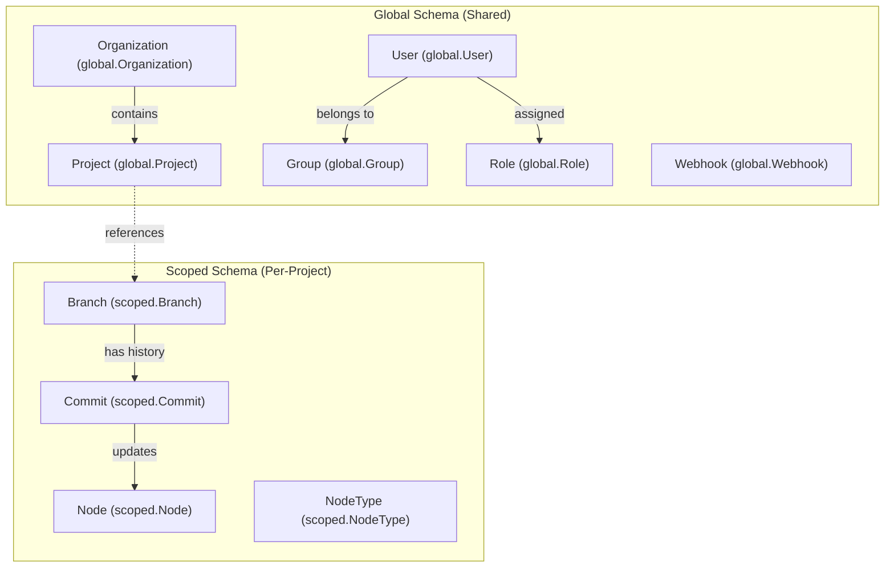

# Page: Database Entities (data module)

# Database Entities (data module)

Relevant source files

The following files were used as context for generating this wiki page:

- [data/src/main/java/org/openmbee/mms/data/domains/scoped/Branch.java](data/src/main/java/org/openmbee/mms/data/domains/scoped/Branch.java)
- [data/src/main/java/org/openmbee/mms/data/domains/scoped/Commit.java](data/src/main/java/org/openmbee/mms/data/domains/scoped/Commit.java)
- [data/src/main/java/org/openmbee/mms/data/domains/scoped/Node.java](data/src/main/java/org/openmbee/mms/data/domains/scoped/Node.java)
- [json/src/main/java/org/openmbee/mms/json/CommitJson.java](json/src/main/java/org/openmbee/mms/json/CommitJson.java)

The `data` module defines the JPA entity classes that form the backbone of the MMS persistence layer. MMS employs a two-schema multi-tenancy design where metadata is stored in a **Global** schema, while versioned model data is stored in **Scoped** (per-project) schemas.

## Multi-Tenancy Architecture

MMS splits data into two distinct categories to balance global administrative needs with project-level data isolation and scalability:

1.  **Global Schema**: Contains entities that exist across the entire system, such as users, organizations, project metadata, and global security roles.
2.  **Scoped Schema**: Every project has its own dedicated relational schema (or database, depending on configuration). This schema contains the versioning metadata for that specific project, including branches, commits, and node pointers.

### Data Flow and Schema Mapping
The following diagram illustrates how system concepts map to specific JPA entities across the schema boundary.

**Entity Mapping: Global vs Scoped**

**Sources:**
* `data/src/main/java/org/openmbee/mms/data/domains/global/`
* `data/src/main/java/org/openmbee/mms/data/domains/scoped/`

---

## Scoped Entities (Project-Specific)

Scoped entities reside in the project-specific database schemas. They manage the version control pointers for model elements.

### Node Entity
The `Node` class represents a versioned element pointer. It does not store the element's JSON content (which is stored in Elasticsearch), but rather tracks the current state of an element within a specific project.

*   **File:** `data/src/main/java/org/openmbee/mms/data/domains/scoped/Node.java` [12-101]()
*   **Key Fields:**
    *   `nodeId`: The unique identifier for the element (e.g., a SysML ID) [20]().
    *   `docId`: A pointer to the specific JSON document in Elasticsearch [21]().
    *   `lastCommit`: The ID of the commit that last modified this node [22]().
    *   `initialCommit`: The ID of the commit that created this node [23]().
    *   `deleted`: Boolean flag for soft-deletion [24]().

### Branch Entity
The `Branch` class (often referred to as a "Ref" in the API) represents a named pointer to a specific point in the project's commit history.

*   **File:** `data/src/main/java/org/openmbee/mms/data/domains/scoped/Branch.java` [13-134]()
*   **Key Fields:**
    *   `branchId`: The unique string ID of the branch (e.g., "master") [24]().
    *   `parentRefId`: The ID of the branch from which this branch was created [30]().
    *   `parentCommit`: The specific commit ID in the parent branch where the fork occurred [31]().
    *   `tag`: A boolean indicating if this branch is a static tag (immutable) [35]().

### Commit Entity
The `Commit` class records every change set applied to the project.

*   **File:** `data/src/main/java/org/openmbee/mms/data/domains/scoped/Commit.java` [14-93]()
*   **Key Fields:**
    *   `commitId`: A unique string identifier for the commit [26]().
    *   `creator`: The username of the person who performed the commit [29]().
    *   `commitType`: An enum (SET, COMMIT, etc.) defined in `CommitType` [35, 77-83]().

**Sources:**
* [data/src/main/java/org/openmbee/mms/data/domains/scoped/Node.java:12-101]()
* [data/src/main/java/org/openmbee/mms/data/domains/scoped/Branch.java:13-134]()
* [data/src/main/java/org/openmbee/mms/data/domains/scoped/Commit.java:14-93]()

---

## Global Entities (System-Wide)

Global entities are stored in the default public schema and manage the administrative hierarchy and security.

### Organization and Project
`Organization` acts as a top-level container, while `Project` defines the metadata for a model repository, including which `ProjectSchema` it follows (e.g., "default", "cameo").

### Security: Users, Groups, and Roles
The security model is implemented through several entities:
*   **User**: Represents a system user.
*   **Group**: Collections of users for bulk permission management.
*   **Role**: Defines a set of permissions (e.g., `READER`, `WRITER`, `ADMIN`).
*   **Privilege**: Atomic actions that can be performed.

### Webhook
The `Webhook` entity stores outbound HTTP callback configurations that trigger on commit events within specific projects.

---

## Relationship between Entities and JSON DTOs

The JPA entities in the `data` module are often mapped to/from JSON Transfer Objects (DTOs) in the `json` module during API operations.

**Natural Language to Code Entity Space**

| System Concept | JPA Entity (data module) | JSON DTO (json module) |
| :--- | :--- | :--- |
| **Model Element** | `Node` [data/src/main/java/org/openmbee/mms/data/domains/scoped/Node.java:12]() | `ElementJson` |
| **Version History** | `Commit` [data/src/main/java/org/openmbee/mms/data/domains/scoped/Commit.java:14]() | `CommitJson` [json/src/main/java/org/openmbee/mms/json/CommitJson.java:14]() |
| **Branch/Tag** | `Branch` [data/src/main/java/org/openmbee/mms/data/domains/scoped/Branch.java:13]() | `RefJson` |
| **Project** | `Project` | `ProjectJson` |

### Commit Data Structure
While the `Commit` JPA entity stores metadata like `creator` and `timestamp`, the `CommitJson` DTO is used to transfer the actual change set (added, updated, and deleted elements).

*   `CommitJson` defines constants for these arrays: `ADDED`, `UPDATED`, `DELETED` [json/src/main/java/org/openmbee/mms/json/CommitJson.java:17-19]().
*   It provides helper methods like `copy()` to aggregate changes during complex operations [json/src/main/java/org/openmbee/mms/json/CommitJson.java:22-48]().

**Sources:**
* [json/src/main/java/org/openmbee/mms/json/CommitJson.java:14-99]()
* [data/src/main/java/org/openmbee/mms/data/domains/scoped/Node.java:12-28]()
* [data/src/main/java/org/openmbee/mms/data/domains/scoped/Commit.java:14-36]()
