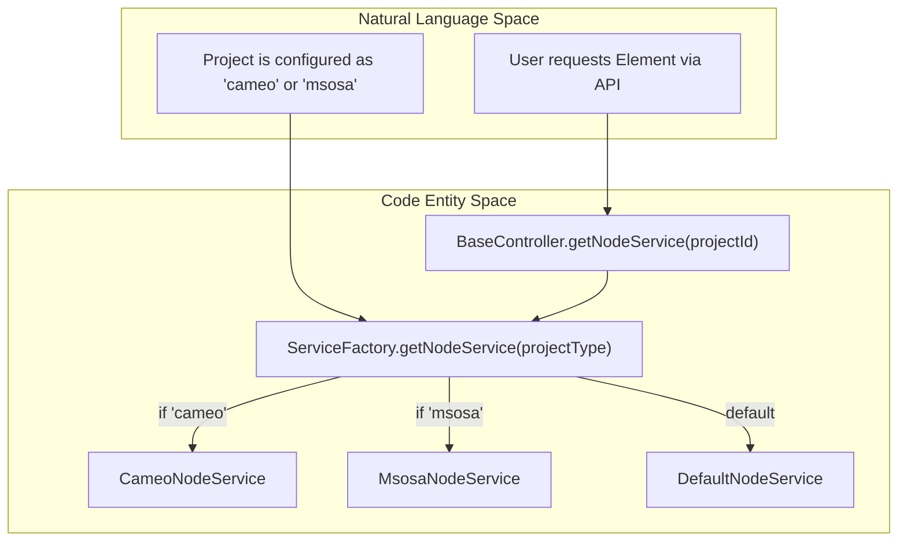
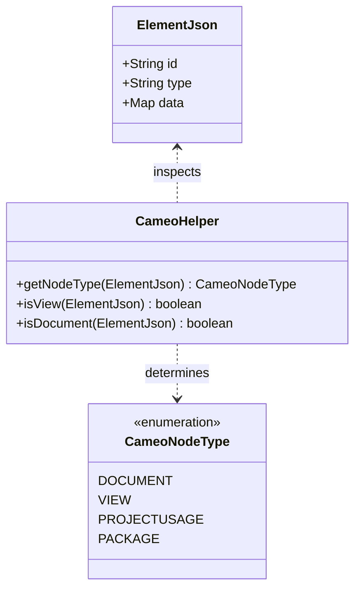

# Page: Domain-Specific Schema Modules

# Domain-Specific Schema Modules

Relevant source files

The following files were used as context for generating this wiki page:

- [authenticator/src/main/java/org/openmbee/mms/authenticator/security/JwtTokenGenerator.java](authenticator/src/main/java/org/openmbee/mms/authenticator/security/JwtTokenGenerator.java)
- [cameo/src/main/java/org/openmbee/mms/cameo/CameoConstants.java](cameo/src/main/java/org/openmbee/mms/cameo/CameoConstants.java)
- [cameo/src/main/java/org/openmbee/mms/cameo/services/CameoHelper.java](cameo/src/main/java/org/openmbee/mms/cameo/services/CameoHelper.java)
- [core/src/main/java/org/openmbee/mms/core/config/Constants.java](core/src/main/java/org/openmbee/mms/core/config/Constants.java)
- [core/src/main/java/org/openmbee/mms/core/objects/ElementsCommitResponse.java](core/src/main/java/org/openmbee/mms/core/objects/ElementsCommitResponse.java)
- [core/src/main/java/org/openmbee/mms/core/services/NodeService.java](core/src/main/java/org/openmbee/mms/core/services/NodeService.java)
- [core/src/main/java/org/openmbee/mms/core/services/TokenService.java](core/src/main/java/org/openmbee/mms/core/services/TokenService.java)
- [crud/src/main/java/org/openmbee/mms/crud/controllers/BaseController.java](crud/src/main/java/org/openmbee/mms/crud/controllers/BaseController.java)
- [example/cameo.postman_collection.json](example/cameo.postman_collection.json)
- [rdb/src/main/java/org/openmbee/mms/rdb/config/DatabaseDefinitionService.java](rdb/src/main/java/org/openmbee/mms/rdb/config/DatabaseDefinitionService.java)
- [rdb/src/main/java/org/openmbee/mms/rdb/config/PersistenceJPAConfig.java](rdb/src/main/java/org/openmbee/mms/rdb/config/PersistenceJPAConfig.java)
- [rdb/src/main/java/org/openmbee/mms/rdb/config/SuffixedPhysicalNamingStrategy.java](rdb/src/main/java/org/openmbee/mms/rdb/config/SuffixedPhysicalNamingStrategy.java)
- [rdb/src/main/java/org/openmbee/mms/rdb/repositories/BaseDAOImpl.java](rdb/src/main/java/org/openmbee/mms/rdb/repositories/BaseDAOImpl.java)
- [twc/src/main/java/org/openmbee/mms/twc/config/TwcConfig.java](twc/src/main/java/org/openmbee/mms/twc/config/TwcConfig.java)

The Model Management System (MMS) employs a pluggable schema architecture that allows it to adapt its behavior, data validation, and service logic based on the specific modeling domain of a project. While the core persistence layer handles generic JSON elements, domain-specific modules extend these capabilities to support specialized modeling paradigms like SysML (via Cameo), Jupyter Notebooks, and MSOSA.

### Schema Selection and Dispatch

When a project is created, a `schema` identifier is assigned to it [example/cameo.postman_collection.json:137-137](). This identifier determines which service implementations are provided by the `ServiceFactory` [crud/src/main/java/org/openmbee/mms/crud/controllers/BaseController.java:38-38](). The `BaseController` uses this factory to resolve the correct `NodeService` for a given project [crud/src/main/java/org/openmbee/mms/crud/controllers/BaseController.java:98-100]().

**Schema Resolution Workflow**

Sources: [crud/src/main/java/org/openmbee/mms/crud/controllers/BaseController.java:98-100](), [core/src/main/java/org/openmbee/mms/core/services/NodeService.java:11-11]()

---

### Cameo Module
The Cameo module provides deep integration for SysML models exported from No Magic's Cameo Systems Modeler. It introduces logic for handling "Project Usages" (mounts), allowing elements from one project to be resolved within the context of another [cameo/src/main/java/org/openmbee/mms/cameo/services/CameoHelper.java:35-36]().

Key features include:
*   **Recursive Mount Traversal**: Resolves elements across project boundaries using `getProjectUsages`.
*   **View & Document Logic**: Specialized handling for SysML View and Document stereotypes [cameo/src/main/java/org/openmbee/mms/cameo/services/CameoHelper.java:52-74]().
*   **Constant Mapping**: Extensive mapping of SysML/UML property IDs to human-readable keys [cameo/src/main/java/org/openmbee/mms/cameo/CameoConstants.java:102-125]().

For details, see [Cameo Module](#7.1).

### Jupyter Module
The Jupyter module treats Jupyter Notebooks as first-class elements within the MMS repository. It allows users to store, version, and query notebook structures (cells, metadata, and outputs) as typed elements.

Key features include:
*   **NotebooksController**: Dedicated endpoints at `/notebooks` for notebook-specific operations.
*   **JupyterNodeService**: Implements `readNotebooks` to parse and return notebook structures.
*   **Elasticsearch Mapping**: Uses a specialized `jupyter_node` mapping to index notebook cell content for search.

For details, see [Jupyter Module](#7.2).

### MSOSA Module
The MSOSA (Model-based Systems Engineering Open Source Architecture) module extends MMS to support the MSOSA modeling framework. It provides specialized services for managing views and projects according to MSOSA standards.

Key features include:
*   **MsosaNodeService**: Custom element persistence and retrieval logic.
*   **MsosaConstants**: Defines SysML property names and stereotypes specific to the MSOSA architecture.
*   **Schema Configuration**: Tailored `MsosaSchemaConfig` for wiring MSOSA-specific beans.

For details, see [MSOSA Module](#7.3).

---

### Schema-Driven Data Modeling

The schema system bridges the gap between raw JSON data and domain-specific semantics. Each module provides a "Helper" class (e.g., `CameoHelper`) that implements `ElementUtils` to categorize elements into domain types like `DOCUMENT`, `VIEW`, or `PACKAGE` [cameo/src/main/java/org/openmbee/mms/cameo/services/CameoHelper.java:14-50]().

**Entity Mapping Diagram**

Sources: [cameo/src/main/java/org/openmbee/mms/cameo/services/CameoHelper.java:17-50](), [cameo/src/main/java/org/openmbee/mms/cameo/CameoConstants.java:10-99]()

| Module | Schema ID | Key Service Class | Primary Use Case |
| :--- | :--- | :--- | :--- |
| **Cameo** | `cameo` | `CameoNodeService` | SysML 1.x models, Mounts/Usages |
| **Jupyter** | `jupyter` | `JupyterNodeService` | Notebook versioning and cell search |
| **MSOSA** | `msosa` | `MsosaNodeService` | MSOSA-compliant architecture models |

Sources: [example/cameo.postman_collection.json:137-137](), [cameo/src/main/java/org/openmbee/mms/cameo/services/CameoHelper.java:1-13]()
