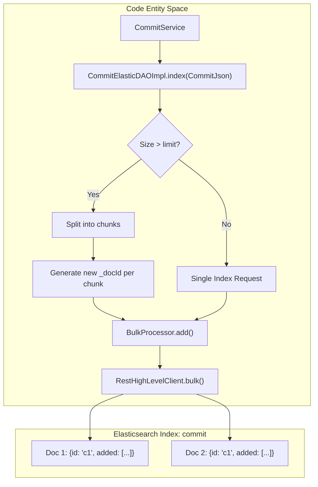
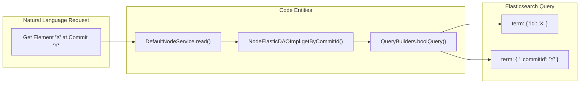

# Page: Elasticsearch Integration (elastic module)

# Elasticsearch Integration (elastic module)

Relevant source files

The following files were used as context for generating this wiki page:

- [core/src/main/java/org/openmbee/mms/core/exceptions/MMSException.java](core/src/main/java/org/openmbee/mms/core/exceptions/MMSException.java)
- [crud/src/main/java/org/openmbee/mms/crud/controllers/elements/ElementsController.java](crud/src/main/java/org/openmbee/mms/crud/controllers/elements/ElementsController.java)
- [crud/src/main/java/org/openmbee/mms/crud/services/DefaultNodeService.java](crud/src/main/java/org/openmbee/mms/crud/services/DefaultNodeService.java)
- [elastic/src/main/java/org/openmbee/mms/elastic/BaseElasticDAOImpl.java](elastic/src/main/java/org/openmbee/mms/elastic/BaseElasticDAOImpl.java)
- [elastic/src/main/java/org/openmbee/mms/elastic/BranchElasticDAOImpl.java](elastic/src/main/java/org/openmbee/mms/elastic/BranchElasticDAOImpl.java)
- [elastic/src/main/java/org/openmbee/mms/elastic/CommitElasticDAOImpl.java](elastic/src/main/java/org/openmbee/mms/elastic/CommitElasticDAOImpl.java)
- [elastic/src/main/java/org/openmbee/mms/elastic/NodeElasticDAOImpl.java](elastic/src/main/java/org/openmbee/mms/elastic/NodeElasticDAOImpl.java)
- [elastic/src/main/java/org/openmbee/mms/elastic/ProjectElasticImpl.java](elastic/src/main/java/org/openmbee/mms/elastic/ProjectElasticImpl.java)
- [elastic/src/main/java/org/openmbee/mms/elastic/config/ElasticsearchConfig.java](elastic/src/main/java/org/openmbee/mms/elastic/config/ElasticsearchConfig.java)
- [elastic/src/main/java/org/openmbee/mms/elastic/utils/BulkProcessor.java](elastic/src/main/java/org/openmbee/mms/elastic/utils/BulkProcessor.java)
- [elastic/src/main/resources/application.properties.example](elastic/src/main/resources/application.properties.example)
- [elastic/src/main/resources/elastic_mappings/cameo_node.json](elastic/src/main/resources/elastic_mappings/cameo_node.json)
- [elastic/src/main/resources/elastic_mappings/commit.json](elastic/src/main/resources/elastic_mappings/commit.json)
- [elastic/src/main/resources/elastic_mappings/default_node.json](elastic/src/main/resources/elastic_mappings/default_node.json)
- [elastic/src/main/resources/elastic_mappings/jupyter_node.json](elastic/src/main/resources/elastic_mappings/jupyter_node.json)
- [elastic/src/main/resources/elastic_mappings/metadata.json](elastic/src/main/resources/elastic_mappings/metadata.json)
- [example/elastic.postman_collection.json](example/elastic.postman_collection.json)
- [example/src/main/resources/application-test.properties](example/src/main/resources/application-test.properties)
- [example/src/main/resources/application.properties.example](example/src/main/resources/application.properties.example)
- [twc/src/main/java/org/openmbee/mms/twc/services/TwcRevisionMmsCommitMapService.java](twc/src/main/java/org/openmbee/mms/twc/services/TwcRevisionMmsCommitMapService.java)

The `elastic` module provides the persistence implementation for large-scale JSON data in MMS, specifically for elements (nodes) and commit history. While the relational database (RDB) handles metadata and project structures, Elasticsearch is used to store the actual content of elements and the delta-based change logs of every commit.

## Module Overview

The integration relies on the `RestHighLevelClient` to communicate with an Elasticsearch cluster. It implements various DAO (Data Access Object) interfaces defined in the `core` and `data` modules to provide indexed search and retrieval capabilities.

### Key Components

| Component | Description |
|:---|:---|
| `ElasticsearchConfig` | Configures the `RestHighLevelClient` bean with connection pooling and optional basic authentication [elastic/src/main/java/org/openmbee/mms/elastic/config/ElasticsearchConfig.java:18-58](). |
| `BaseElasticDAOImpl` | An abstract base class providing common CRUD operations, bulk processing, and scroll helpers [elastic/src/main/java/org/openmbee/mms/elastic/BaseElasticDAOImpl.java:37-200](). |
| `NodeElasticDAOImpl` | Manages element persistence, including branch-specific visibility via the `_inRefIds` field [elastic/src/main/java/org/openmbee/mms/elastic/NodeElasticDAOImpl.java:31-158](). |
| `CommitElasticDAOImpl` | Handles commit indexing with specialized logic for chunking large commits [elastic/src/main/java/org/openmbee/mms/elastic/CommitElasticDAOImpl.java:25-200](). |
| `BulkProcessor` | A utility class that batches multiple index/update requests to improve performance [elastic/src/main/java/org/openmbee/mms/elastic/utils/BulkProcessor.java:13-60](). |

**Sources:**
- [elastic/src/main/java/org/openmbee/mms/elastic/config/ElasticsearchConfig.java]()
- [elastic/src/main/java/org/openmbee/mms/elastic/BaseElasticDAOImpl.java]()
- [elastic/src/main/java/org/openmbee/mms/elastic/NodeElasticDAOImpl.java]()
- [elastic/src/main/java/org/openmbee/mms/elastic/CommitElasticDAOImpl.java]()
- [elastic/src/main/java/org/openmbee/mms/elastic/utils/BulkProcessor.java]()

---

## Implementation Detail: Commit Chunking

One of the critical functions of `CommitElasticDAOImpl` is handling "Large Commits." If a commit contains more elements than the configured `elasticsearch.limit.commit` (default 10,000), the system splits the `CommitJson` into multiple documents in Elasticsearch [elastic/src/main/java/org/openmbee/mms/elastic/CommitElasticDAOImpl.java:27-71]().

### Data Flow: Commit Indexing

The following diagram illustrates how a `CommitJson` is processed and stored.

**Commit Persistence Logic**

**Sources:**
- [elastic/src/main/java/org/openmbee/mms/elastic/CommitElasticDAOImpl.java:42-78]()
- [elastic/src/main/java/org/openmbee/mms/elastic/utils/BulkProcessor.java:48-59]()

---

## Implementation Detail: Node Persistence

`NodeElasticDAOImpl` manages the storage of `ElementJson` objects. Unlike commits, which are immutable, nodes use a reference-tracking mechanism (`_inRefIds`) to determine which branches an element version belongs to without duplicating data across branches [elastic/src/main/java/org/openmbee/mms/elastic/NodeElasticDAOImpl.java:89-116]().

### Element Retrieval and Versioning

MMS supports point-in-time reads. The `NodeElasticDAOImpl` uses filters on `_modified` and `_commitId` to find the correct version of an element for a given timestamp or commit [elastic/src/main/java/org/openmbee/mms/elastic/NodeElasticDAOImpl.java:119-152]().

**Node Retrieval Flow**

**Sources:**
- [crud/src/main/java/org/openmbee/mms/crud/services/DefaultNodeService.java:102-131]()
- [elastic/src/main/java/org/openmbee/mms/elastic/NodeElasticDAOImpl.java:66-87]()

---

## Index Mappings

MMS uses specific mappings for different data types to ensure performant searching. Mappings are defined in JSON files within `src/main/resources/elastic_mappings/`.

### Commit Mapping
The `commit` index stores the delta of every transaction. Key fields include:
- `added`, `updated`, `deleted`: Nested objects containing `id` and `_docId` of the elements involved [elastic/src/main/resources/elastic_mappings/commit.json:4-45]().
- `_projectId`, `_refId`: Metadata for scoping the commit [elastic/src/main/resources/elastic_mappings/commit.json:49-61]().

### Node Mappings
The system supports multiple node mappings to accommodate different domain schemas:
- `default_node`: Standard element properties.
- `cameo_node`: Extended properties for Cameo/MagicDraw models.
- `jupyter_node`: Specialized fields for Jupyter Notebook cells.

**Sources:**
- [elastic/src/main/resources/elastic_mappings/commit.json]()
- [elastic/src/main/java/org/openmbee/mms/elastic/utils/Index.java:25-30]() (Reference to Index types)

---

## Operational Limits and Configuration

Elasticsearch behavior is tuned via `application.properties`. These limits prevent oversized requests from crashing the cluster or the MMS application.

| Property | Default | Description |
|:---|:---|:---|
| `elasticsearch.limit.result` | 10000 | Max hits returned by a single search [elastic/src/main/java/org/openmbee/mms/elastic/BaseElasticDAOImpl.java:41-42](). |
| `elasticsearch.limit.get` | 100000 | Max IDs allowed in a multi-get request [elastic/src/main/java/org/openmbee/mms/elastic/BaseElasticDAOImpl.java:47-48](). |
| `elasticsearch.limit.index` | 5000 | Batch size for `BulkProcessor` [elastic/src/main/java/org/openmbee/mms/elastic/BaseElasticDAOImpl.java:50-51](). |
| `elasticsearch.limit.commit` | 10000 | Threshold for splitting large commit documents [elastic/src/main/java/org/openmbee/mms/elastic/CommitElasticDAOImpl.java:27-28](). |
| `elasticsearch.limit.term` | 1000 | Max number of terms in a `terms` query [elastic/src/main/java/org/openmbee/mms/elastic/BaseElasticDAOImpl.java:44-45](). |

**Sources:**
- [elastic/src/main/java/org/openmbee/mms/elastic/BaseElasticDAOImpl.java:41-51]()
- [elastic/src/main/java/org/openmbee/mms/elastic/CommitElasticDAOImpl.java:27-28]()
- [example/src/main/resources/application.properties.example:54-65]()
