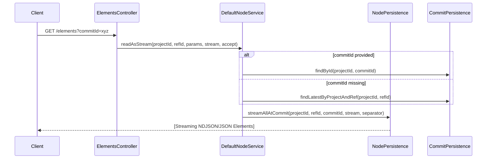
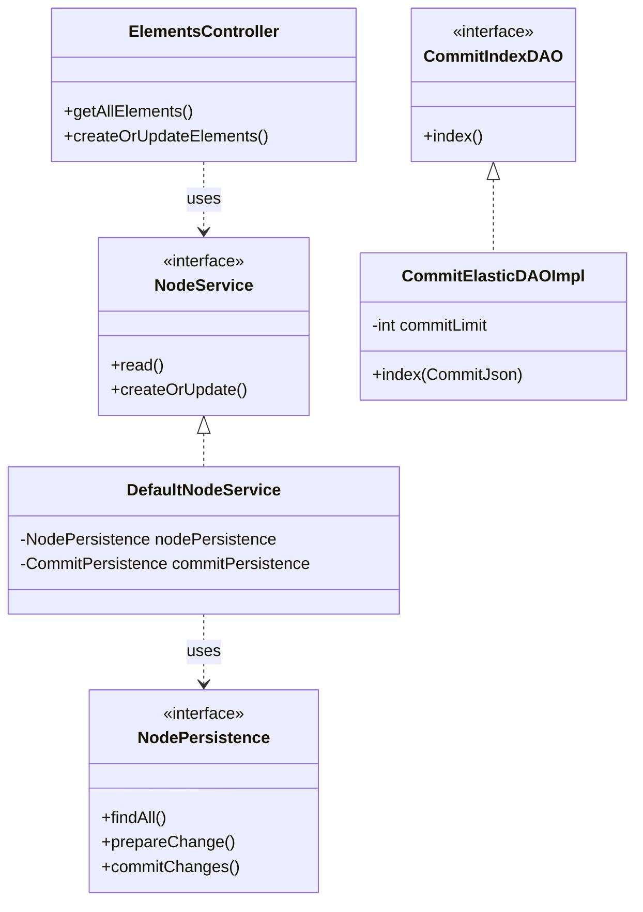

# Page: Elements API

# Elements API

<details>
<summary>Relevant source files</summary>

The following files were used as context for generating this wiki page:

- [crud/src/main/java/org/openmbee/mms/crud/controllers/elements/ElementsController.java](crud/src/main/java/org/openmbee/mms/crud/controllers/elements/ElementsController.java)
- [crud/src/main/java/org/openmbee/mms/crud/services/DefaultNodeService.java](crud/src/main/java/org/openmbee/mms/crud/services/DefaultNodeService.java)
- [elastic/src/main/java/org/openmbee/mms/elastic/CommitElasticDAOImpl.java](elastic/src/main/java/org/openmbee/mms/elastic/CommitElasticDAOImpl.java)
- [example/crud.postman_collection.json](example/crud.postman_collection.json)
- [example/permissions.postman_collection.json](example/permissions.postman_collection.json)
- [example/twc.postman_collection.json](example/twc.postman_collection.json)

</details>


The Elements API provides the primary interface for managing structured data within the Model Management System (MMS). It supports CRUD operations on elements scoped to a specific project and reference (branch). The API is designed for high-performance bulk operations, supporting both standard JSON and NDJSON (Newline Delimited JSON) streaming for large datasets.

## Endpoint Overview

All element operations are rooted at the following base path:
`/projects/{projectId}/refs/{refId}/elements`

| Method | Endpoint | Description |
| :--- | :--- | :--- |
| `GET` | `/` | Retrieves all elements or a filtered subset. Supports streaming. |
| `GET` | `/{elementId}` | Retrieves a specific element by its ID. |
| `POST` | `/` | Creates or updates elements (Bulk). |
| `PUT` | `/` | Synonymous with POST for creating/updating elements. |
| `DELETE` | `/` | Bulk soft-delete of elements. |
| `DELETE` | `/{elementId}` | Soft-delete a specific element. |

Sources: [crud/src/main/java/org/openmbee/mms/crud/controllers/elements/ElementsController.java:50-188]()

## Data Flow: Element Retrieval

When a request is made to retrieve elements, the `ElementsController` delegates the logic to a `NodeService` implementation (usually `DefaultNodeService`). The service interacts with `NodePersistence` to fetch data from the underlying federated stores (Relational Database and Elasticsearch).

### Point-in-Time Reads
Users can perform point-in-time reads by providing a `commitId` query parameter [crud/src/main/java/org/openmbee/mms/crud/controllers/elements/ElementsController.java:81](). If provided, the system retrieves the state of the elements as they existed at that specific commit [crud/src/main/java/org/openmbee/mms/crud/services/DefaultNodeService.java:69-74](). If omitted, the latest commit on the specified branch is used [crud/src/main/java/org/openmbee/mms/crud/services/DefaultNodeService.java:76-80]().

### NDJSON Streaming
For large-scale data retrieval, the API supports `application/x-ndjson` [crud/src/main/java/org/openmbee/mms/crud/controllers/elements/ElementsController.java:76](). This allows the server to stream elements one by one, reducing memory overhead on both the server and client.

**Element Retrieval Sequence**


Sources: [crud/src/main/java/org/openmbee/mms/crud/controllers/elements/ElementsController.java:72-93](), [crud/src/main/java/org/openmbee/mms/crud/services/DefaultNodeService.java:65-99]()

## Create and Update Operations

The `POST` and `PUT` methods handle both creation and updates. MMS uses an "upsert" logic based on the element's `id`.

### Optimistic Locking
MMS implements optimistic locking via the `lastCommitId` field in the `ElementsRequest` [crud/src/main/java/org/openmbee/mms/crud/services/DefaultNodeService.java:167](). If `lastCommitId` is provided, the service verifies that it matches the current latest commit of the branch. If they do not match, a `409 Conflict` is thrown, preventing "lost updates" [crud/src/main/java/org/openmbee/mms/crud/services/DefaultNodeService.java:169-174]().

### Element Resurrection
If an element was previously soft-deleted (marked with `_deleted: true`), posting the element again will "resurrect" it. The persistence layer handles the transition from a deleted state back to an active state during the `prepareChange` pipeline in the federated persistence module.

### Update Logic Components

| Class/Entity | Role |
| :--- | :--- |
| `ElementsRequest` | Wrapper for a list of `ElementJson` objects and the `lastCommitId`. |
| `ElementUpdateHook` | Triggered before persistence to allow plugins to modify or validate incoming elements. |
| `NodeChangeInfo` | Internal DTO used to track which elements are being added, updated, or deleted during a transaction. |
| `ElementsCommitResponse` | Returns the resulting `CommitJson` and the list of processed elements. |

**Code Entity Mapping: Update Pipeline**

```mermaid
graph TD
    subgraph "REST Layer"
        "ElementsController::createOrUpdateElements"["ElementsController::createOrUpdateElements"]
    end

    subgraph "Service Layer"
        "DefaultNodeService::createOrUpdate"["DefaultNodeService::createOrUpdate"]
        "EmbeddedHookService::hook"["EmbeddedHookService::hook"]
    end

    subgraph "Persistence Layer"
        "NodePersistence::prepareChange"["NodePersistence::prepareChange"]
        "NodePersistence::commitChanges"["NodePersistence::commitChanges"]
    end

    "ElementsController::createOrUpdateElements" --> "EmbeddedHookService::hook"
    "ElementsController::createOrUpdateElements" --> "DefaultNodeService::createOrUpdate"
    "DefaultNodeService::createOrUpdate" --> "NodePersistence::prepareChange"
    "NodePersistence::prepareChange" --> "NodePersistence::commitChanges"
```
Sources: [crud/src/main/java/org/openmbee/mms/crud/controllers/elements/ElementsController.java:112-129](), [crud/src/main/java/org/openmbee/mms/crud/services/DefaultNodeService.java:161-200]()

## Delete Operations

Deletes in MMS are "soft" by default. When an element is deleted, a new commit is created where the element is marked with `_deleted: true` in the index and removed from the active nodes table in the relational database.

*   **Bulk Delete**: `DELETE /projects/{id}/refs/{id}/elements` accepts an `ElementsRequest` containing the IDs of elements to be removed [crud/src/main/java/org/openmbee/mms/crud/controllers/elements/ElementsController.java:169-188]().
*   **Single Delete**: `DELETE /projects/{id}/refs/{id}/elements/{elementId}` deletes a specific node [crud/src/main/java/org/openmbee/mms/crud/controllers/elements/ElementsController.java:154-167]().

Sources: [crud/src/main/java/org/openmbee/mms/crud/controllers/elements/ElementsController.java:154-188]()

## Implementation Details

### Federated Persistence Interaction
The `DefaultNodeService` does not write directly to a database. Instead, it uses `NodePersistence.prepareChange()` to calculate the difference between the incoming JSON and the current state [crud/src/main/java/org/openmbee/mms/crud/services/DefaultNodeService.java:189](). This produces a `NodeChangeInfo` object which is then passed to `commitChanges()` to persist the metadata to RDB and the full JSON content to Elasticsearch.

### Large Commit Chunking
When committing large numbers of elements, the `CommitElasticDAOImpl` monitors the size of the commit. If the number of added/updated/deleted elements exceeds the configured `elasticsearch.limit.commit` (default 10,000), the DAO automatically chunks the commit into multiple Elasticsearch documents to avoid request size limits, while maintaining a single logical `commitId` [elastic/src/main/java/org/openmbee/mms/elastic/CommitElasticDAOImpl.java:43-78]().

**Entity Relationship: Element to Persistence**


Sources: [crud/src/main/java/org/openmbee/mms/crud/services/DefaultNodeService.java:33-50](), [elastic/src/main/java/org/openmbee/mms/elastic/CommitElasticDAOImpl.java:25-45]()
