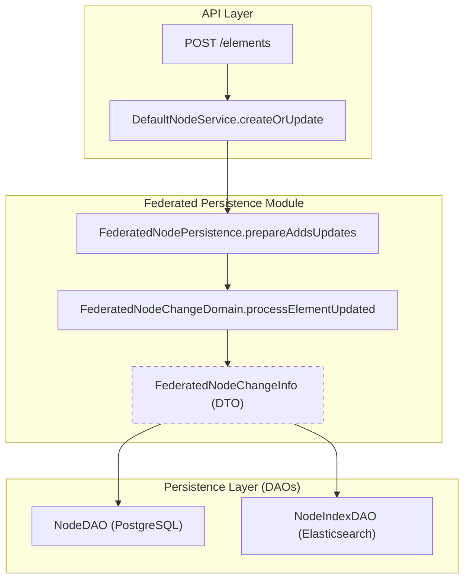
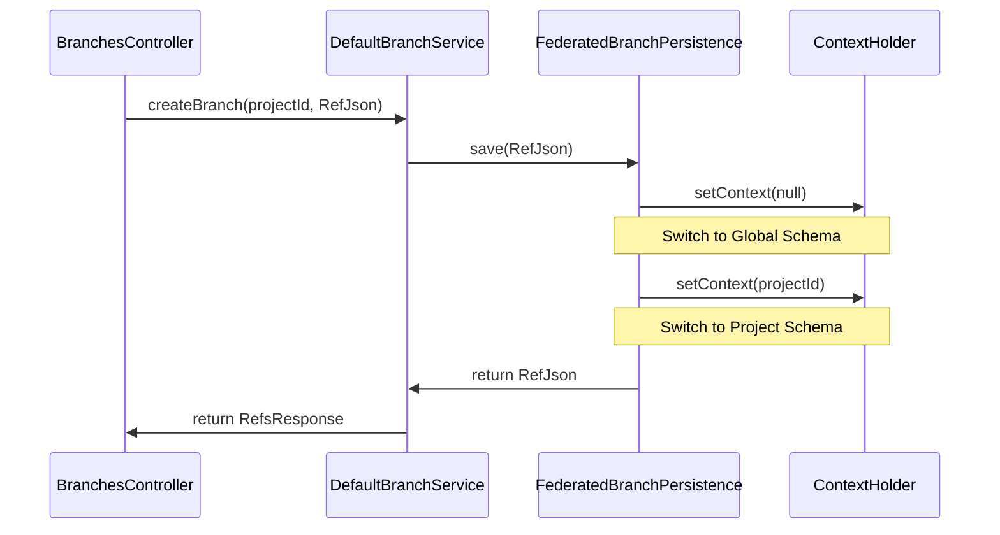

# Page: Federated Persistence Architecture

# Federated Persistence Architecture

Relevant source files

The following files were used as context for generating this wiki page:

- [artifacts/src/main/java/org/openmbee/mms/artifacts/crud/ArtifactsContext.java](artifacts/src/main/java/org/openmbee/mms/artifacts/crud/ArtifactsContext.java)
- [artifacts/src/main/java/org/openmbee/mms/artifacts/crud/ArtifactsPersistenceNodeUpdateFilter.java](artifacts/src/main/java/org/openmbee/mms/artifacts/crud/ArtifactsPersistenceNodeUpdateFilter.java)
- [cameo/src/main/java/org/openmbee/mms/cameo/services/CameoCommitService.java](cameo/src/main/java/org/openmbee/mms/cameo/services/CameoCommitService.java)
- [cameo/src/main/java/org/openmbee/mms/cameo/services/CameoNodeService.java](cameo/src/main/java/org/openmbee/mms/cameo/services/CameoNodeService.java)
- [core/src/main/java/org/openmbee/mms/core/dao/CommitPersistence.java](core/src/main/java/org/openmbee/mms/core/dao/CommitPersistence.java)
- [core/src/main/java/org/openmbee/mms/core/services/BranchService.java](core/src/main/java/org/openmbee/mms/core/services/BranchService.java)
- [crud/src/main/java/org/openmbee/mms/crud/config/OptimizationConfig.java](crud/src/main/java/org/openmbee/mms/crud/config/OptimizationConfig.java)
- [crud/src/main/java/org/openmbee/mms/crud/controllers/branches/BranchesController.java](crud/src/main/java/org/openmbee/mms/crud/controllers/branches/BranchesController.java)
- [crud/src/main/java/org/openmbee/mms/crud/domain/DefaultNodeUpdateFilter.java](crud/src/main/java/org/openmbee/mms/crud/domain/DefaultNodeUpdateFilter.java)
- [crud/src/main/java/org/openmbee/mms/crud/domain/NodeChangeDomain.java](crud/src/main/java/org/openmbee/mms/crud/domain/NodeChangeDomain.java)
- [crud/src/main/java/org/openmbee/mms/crud/domain/NodeUpdateFilter.java](crud/src/main/java/org/openmbee/mms/crud/domain/NodeUpdateFilter.java)
- [crud/src/main/java/org/openmbee/mms/crud/services/DefaultBranchService.java](crud/src/main/java/org/openmbee/mms/crud/services/DefaultBranchService.java)
- [crud/src/main/java/org/openmbee/mms/crud/services/DefaultCommitService.java](crud/src/main/java/org/openmbee/mms/crud/services/DefaultCommitService.java)
- [example/makeBranchFromCommit.postman_collection.json](example/makeBranchFromCommit.postman_collection.json)
- [federatedpersistence/src/main/java/org/openmbee/mms/federatedpersistence/dao/FederatedBranchPersistence.java](federatedpersistence/src/main/java/org/openmbee/mms/federatedpersistence/dao/FederatedBranchPersistence.java)
- [federatedpersistence/src/main/java/org/openmbee/mms/federatedpersistence/dao/FederatedCommitPersistence.java](federatedpersistence/src/main/java/org/openmbee/mms/federatedpersistence/dao/FederatedCommitPersistence.java)
- [federatedpersistence/src/main/java/org/openmbee/mms/federatedpersistence/dao/FederatedNodePersistence.java](federatedpersistence/src/main/java/org/openmbee/mms/federatedpersistence/dao/FederatedNodePersistence.java)
- [federatedpersistence/src/main/java/org/openmbee/mms/federatedpersistence/dao/FederatedOrgPersistence.java](federatedpersistence/src/main/java/org/openmbee/mms/federatedpersistence/dao/FederatedOrgPersistence.java)
- [federatedpersistence/src/main/java/org/openmbee/mms/federatedpersistence/domain/FederatedNodeChangeDomain.java](federatedpersistence/src/main/java/org/openmbee/mms/federatedpersistence/domain/FederatedNodeChangeDomain.java)
- [json/src/main/java/org/openmbee/mms/json/BaseJson.java](json/src/main/java/org/openmbee/mms/json/BaseJson.java)

The `federatedpersistence` module implements a dual-write strategy to maintain consistency between relational metadata (PostgreSQL) and document-based content (Elasticsearch). It serves as the primary implementation of the persistence interfaces defined in the `core` module, ensuring that structural data like branches and commits are transactional in the RDB while rich element data is indexed for search and historical retrieval in Elasticsearch.

## Core Persistence Pipeline

The architecture centers around a multi-stage pipeline for handling changes to nodes (elements). This pipeline is managed by `FederatedNodePersistence`, which coordinates between the relational `NodeDAO` and the document-oriented `NodeIndexDAO`.

### Node Change Pipeline (prepare-commit)

The process of updating or adding elements follows a "prepare" then "commit" pattern to ensure data integrity across both stores.

1.  **Prepare Change**: `prepareChange` initializes a `NodeChangeInfo` object, which tracks the state of the transaction [federatedpersistence/src/main/java/org/openmbee/mms/federatedpersistence/dao/FederatedNodePersistence.java:79-81]().
2.  **Prepare Adds/Updates**: `prepareAddsUpdates` processes the incoming JSON. It calls `FederatedNodeChangeDomain.processPostJson` to assign new UUIDs (`docId`) to elements and calculate the differences between new and existing data [federatedpersistence/src/main/java/org/openmbee/mms/federatedpersistence/dao/FederatedNodePersistence.java:84-89]().
3.  **Commit Changes**: `commitChanges` (inherited/implemented via domain) executes the final write to the RDB `node` table and the Elasticsearch index.

### Logic Flow: Element Update

The following diagram illustrates the flow from a REST request through the Federated Persistence layer to the underlying DAOs.

**Natural Language to Code Entity Mapping: Node Update Flow**

**Sources:** [federatedpersistence/src/main/java/org/openmbee/mms/federatedpersistence/dao/FederatedNodePersistence.java:84-89](), [federatedpersistence/src/main/java/org/openmbee/mms/federatedpersistence/domain/FederatedNodeChangeDomain.java:100-126]()

## Federated Components

### FederatedNodePersistence
The main entry point for element CRUD. It utilizes `FederatedNodeGetDomain` for reads and `FederatedNodeChangeDomain` for writes [federatedpersistence/src/main/java/org/openmbee/mms/federatedpersistence/dao/FederatedNodePersistence.java:40-67](). It manages multi-tenancy by setting the `ContextHolder` based on the `projectId` and `refId` before any DAO operation [federatedpersistence/src/main/java/org/openmbee/mms/federatedpersistence/dao/FederatedNodePersistence.java:85-85]().

### FederatedCommitPersistence
Handles the dual-write for commits. When a commit is saved:
1.  A relational `Commit` entity is saved to the RDB via `commitDAO` [federatedpersistence/src/main/java/org/openmbee/mms/federatedpersistence/dao/FederatedCommitPersistence.java:51-51]().
2.  The full `CommitJson` (including metadata and element pointers) is indexed in Elasticsearch via `commitIndexDAO` [federatedpersistence/src/main/java/org/openmbee/mms/federatedpersistence/dao/FederatedCommitPersistence.java:52-52]().
3.  **Cleanup**: If the Elasticsearch write fails, it attempts to roll back the RDB entry to prevent "ghost" commits [federatedpersistence/src/main/java/org/openmbee/mms/federatedpersistence/dao/FederatedCommitPersistence.java:56-61]().

### FederatedBranchPersistence
Manages branching without data duplication. In MMS, a branch is a metadata pointer.
-   Saves a global `Branch` entity (for cross-project permissions) [federatedpersistence/src/main/java/org/openmbee/mms/federatedpersistence/dao/FederatedBranchPersistence.java:93-93]().
-   Saves a scoped `Branch` entity (for project-specific branch state) [federatedpersistence/src/main/java/org/openmbee/mms/federatedpersistence/dao/FederatedBranchPersistence.java:98-98]().
-   Updates the branch index in Elasticsearch [federatedpersistence/src/main/java/org/openmbee/mms/federatedpersistence/dao/FederatedBranchPersistence.java:97-97]().

**Sources:** [federatedpersistence/src/main/java/org/openmbee/mms/federatedpersistence/dao/FederatedCommitPersistence.java:25-64](), [federatedpersistence/src/main/java/org/openmbee/mms/federatedpersistence/dao/FederatedBranchPersistence.java:26-100]()

## Data Transfer and State Management

### ContextHolder
The `ContextHolder` is a thread-local utility used to route database connections to the correct project schema. `FederatedNodePersistence` and related classes call `ContextHolder.setContext(projectId, refId)` to ensure that subsequent JPA/Hibernate calls target the appropriate relational schema [federatedpersistence/src/main/java/org/openmbee/mms/federatedpersistence/dao/FederatedNodePersistence.java:106-106]().

### NodeChangeInfo and FederatedNodeChangeInfo
The `NodeChangeInfo` DTO carries the state of a transaction. The federated implementation, `FederatedNodeChangeInfoImpl`, adds specific maps to track:
-   `toSaveNodeMap`: Relational nodes to be updated in PostgreSQL [federatedpersistence/src/main/java/org/openmbee/mms/federatedpersistence/domain/FederatedNodeChangeDomain.java:96-96]().
-   `oldDocIds`: Previous Elasticsearch document IDs (used for history/cleanup) [federatedpersistence/src/main/java/org/openmbee/mms/federatedpersistence/domain/FederatedNodeChangeDomain.java:108-108]().

### NodeUpdateFilter
During the preparation phase, `NodeUpdateFilter` implementations (like `DefaultNodeUpdateFilter`) are used to determine if an update is necessary by comparing the incoming JSON with the existing record. It handles:
-   **Conflict Detection**: Checking if the `modified` timestamp in the request is older than the one in the DB [crud/src/main/java/org/openmbee/mms/crud/domain/DefaultNodeUpdateFilter.java:46-62]().
-   **Equivalence Checking**: If the incoming JSON is identical to the existing data, the update is rejected with a `304 Not Modified` status [crud/src/main/java/org/openmbee/mms/crud/domain/DefaultNodeUpdateFilter.java:39-42]().

**Code Entity Interaction: Branching and Persistence**

**Sources:** [crud/src/main/java/org/openmbee/mms/crud/services/DefaultBranchService.java:78-140](), [federatedpersistence/src/main/java/org/openmbee/mms/federatedpersistence/dao/FederatedBranchPersistence.java:45-100]()

## Implementation Details

| Class | Responsibility | Key Method |
| :--- | :--- | :--- |
| `FederatedNodeChangeDomain` | Logic for processing adds, updates, and deletes of elements. | `processElementAddedOrUpdated` [federatedpersistence/src/main/java/org/openmbee/mms/federatedpersistence/domain/FederatedNodeChangeDomain.java:129-150]() |
| `FederatedNodeGetDomain` | Logic for retrieving elements and handling point-in-time reads. | `processGetJson` [federatedpersistence/src/main/java/org/openmbee/mms/federatedpersistence/dao/FederatedNodePersistence.java:128-128]() |
| `FederatedCommitPersistence` | Coordinates dual-write for commits between RDB and Index. | `save(CommitJson, Instant)` [federatedpersistence/src/main/java/org/openmbee/mms/federatedpersistence/dao/FederatedCommitPersistence.java:40-64]() |
| `FederatedBranchPersistence` | Manages relational and indexed branch metadata. | `findById(projectId, refId)` [federatedpersistence/src/main/java/org/openmbee/mms/federatedpersistence/dao/FederatedBranchPersistence.java:122-139]() |

**Sources:** [federatedpersistence/src/main/java/org/openmbee/mms/federatedpersistence/dao/FederatedNodePersistence.java](), [federatedpersistence/src/main/java/org/openmbee/mms/federatedpersistence/domain/FederatedNodeChangeDomain.java](), [federatedpersistence/src/main/java/org/openmbee/mms/federatedpersistence/dao/FederatedCommitPersistence.java](), [federatedpersistence/src/main/java/org/openmbee/mms/federatedpersistence/dao/FederatedBranchPersistence.java]()
