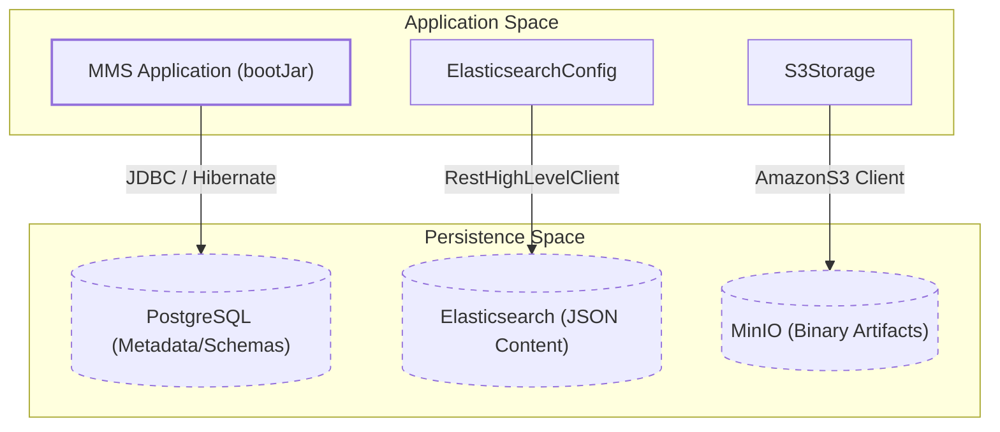
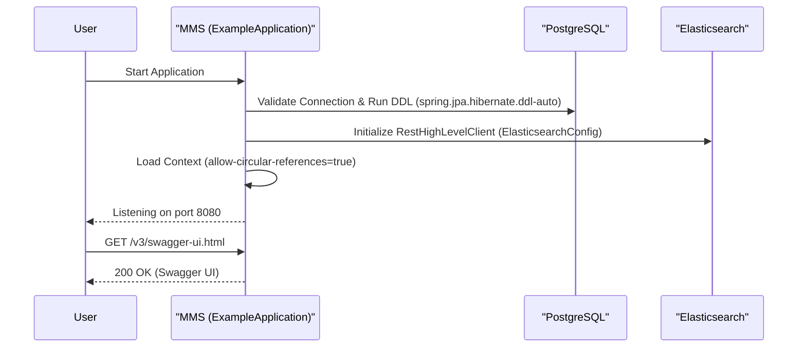

# Page: Getting Started

# Getting Started

<details>
<summary>Relevant source files</summary>

The following files were used as context for generating this wiki page:

- [docker-compose.yml](docker-compose.yml)
- [docs/Makefile](docs/Makefile)
- [docs/conf.py](docs/conf.py)
- [docs/deployment.rst](docs/deployment.rst)
- [docs/index.rst](docs/index.rst)
- [docs/installation.rst](docs/installation.rst)
- [docs/overview.rst](docs/overview.rst)
- [docs/quickstart.rst](docs/quickstart.rst)
- [elastic/src/main/java/org/openmbee/mms/elastic/config/ElasticsearchConfig.java](elastic/src/main/java/org/openmbee/mms/elastic/config/ElasticsearchConfig.java)
- [elastic/src/main/resources/application.properties.example](elastic/src/main/resources/application.properties.example)
- [example/src/main/resources/application-test.properties](example/src/main/resources/application-test.properties)
- [example/src/main/resources/application.properties.example](example/src/main/resources/application.properties.example)
- [storage/README.rst](storage/README.rst)
- [storage/src/main/java/org/openmbee/mms/storage/S3Storage.java](storage/src/main/java/org/openmbee/mms/storage/S3Storage.java)

</details>


This page provides a technical guide for setting up and running the Model Management System (MMS) in a local environment. MMS follows a microservices-adjacent architecture requiring a relational database, a document store, and an object store for full functionality.

## System Dependencies

MMS requires three primary infrastructure components to operate in its reference configuration [docs/installation.rst:7-11]():

1.  **Relational Database**: Used for metadata, organizational hierarchy, and project-specific relational schemas (e.g., PostgreSQL 11+ or MySQL 5.7) [docs/quickstart.rst:18-19]().
2.  **Document Store**: Used for indexing element JSON content and commit history (Elasticsearch 7.8.1) [docs/quickstart.rst:29-30]().
3.  **Object Store**: Used for binary artifact storage (S3-compliant, e.g., MinIO) [docs/quickstart.rst:35-36]().

### Local Infrastructure Setup (Docker)

The quickest way to spin up dependencies is using the provided `docker-compose.yml` or manual `docker run` commands.

| Service | Image | Default Port | Internal User/DB |
| :--- | :--- | :--- | :--- |
| **PostgreSQL** | `postgres:11-alpine` | 5432 | `mmsuser` / `mms` |
| **Elasticsearch** | `elasticsearch:7.8.1` | 9200 | N/A |
| **MinIO** | `minio/minio` | 9000 | `admintest` / `admintest` |

**Source:** [docker-compose.yml:1-30](), [docs/quickstart.rst:22-39]()

## Configuration via application.properties

MMS uses Spring Boot's externalized configuration. Key properties must be defined in an `application.properties` file or passed via the `SPRING_CONFIG_LOCATION` environment variable [docs/quickstart.rst:44-46]().

### Database Configuration
MMS uses JPA/Hibernate. For PostgreSQL:
```properties
spring.datasource.url=jdbc:postgresql://localhost:5432/mms
spring.datasource.username=mmsuser
spring.datasource.password=test1234
spring.datasource.driver-class-name=org.postgresql.Driver
spring.jpa.properties.hibernate.dialect=org.hibernate.dialect.PostgreSQL10Dialect
spring.jpa.hibernate.ddl-auto=update
```
**Source:** [example/src/main/resources/application.properties.example:31-46]()

### Elasticsearch Configuration
The `elastic` module consumes these properties to initialize the `RestHighLevelClient` [elastic/src/main/java/org/openmbee/mms/elastic/config/ElasticsearchConfig.java:20-58]().
```properties
elasticsearch.host=localhost
elasticsearch.port=9200
elasticsearch.http=http
elasticsearch.index.element=mms
```
**Source:** [example/src/main/resources/application.properties.example:55-58]()

### Artifact Storage (S3/MinIO)
The `storage` module uses `S3Storage` to interact with S3-compatible backends [storage/src/main/java/org/openmbee/mms/storage/S3Storage.java:31-50]().
```properties
s3.endpoint=http://localhost:9000
s3.access_key=admintest
s3.secret_key=admintest
s3.region=optional
s3.bucket=mms
```
**Source:** [example/src/main/resources/application.properties.example:88-92](), [storage/README.rst:15-30]()

## Application Data Flow

The following diagram illustrates how the MMS application connects to its dependencies during startup and request processing.

**MMS Infrastructure Connectivity**

**Sources:** [elastic/src/main/java/org/openmbee/mms/elastic/config/ElasticsearchConfig.java:32-58](), [storage/src/main/java/org/openmbee/mms/storage/S3Storage.java:55-82](), [docs/installation.rst:7-11]()

## Running the Application

### Using Docker Compose
The project root contains a `docker-compose.yml` that builds the MMS image from the local context and wires it to the dependencies.

1.  **Build and Start**:
    ```bash
    docker-compose up --build
    ```
2.  **Profiles**: The compose file sets `SPRING_PROFILES_ACTIVE=test` [docker-compose.yml:35](), which loads settings from `application-test.properties`.

### Manual Execution (Bare Metal)
If running outside of Docker:
1.  Ensure Java 11+ is installed [docs/quickstart.rst:15]().
2.  Build the jar: `./gradlew bootJar`.
3.  Run: `java -jar example/build/libs/mms-example-4.0.x.jar --spring.config.location=path/to/application.properties` [docs/deployment.rst:11]().

## Health and API Verification

Once started, the application exposes several management and documentation endpoints:

*   **Healthcheck**: Standard Spring Boot Actuator `/health` endpoint (if enabled).
*   **Swagger UI**: Accessible at `/v3/swagger-ui.html` for interactive API exploration [example/src/main/resources/application.properties.example:80]().
*   **Default Admin**: Initial setup typically uses the `mms.admin.username` and `mms.admin.password` defined in properties for first-time authentication [example/src/main/resources/application.properties.example:2-3]().

**MMS Component Initialization**

**Sources:** [example/src/main/resources/application.properties.example:46-51](), [example/src/main/resources/application.properties.example:80](), [elastic/src/main/java/org/openmbee/mms/elastic/config/ElasticsearchConfig.java:32-58]()
