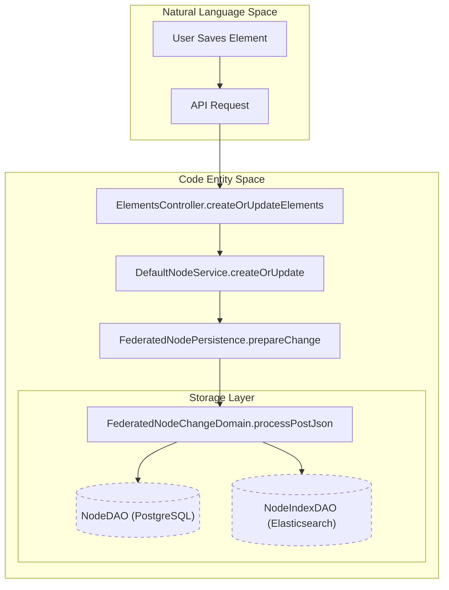
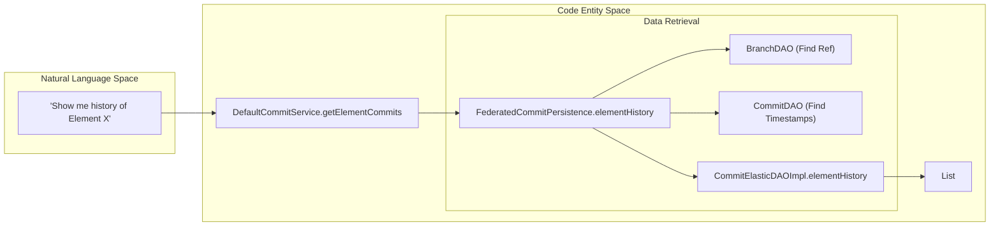

# Page: Glossary

# Glossary

Relevant source files

The following files were used as context for generating this wiki page:

- [authenticator/authenticator.gradle](authenticator/authenticator.gradle)
- [authenticator/src/main/java/org/openmbee/mms/authenticator/config/AuthSecurityConfig.java](authenticator/src/main/java/org/openmbee/mms/authenticator/config/AuthSecurityConfig.java)
- [cameo/src/main/java/org/openmbee/mms/cameo/services/CameoCommitService.java](cameo/src/main/java/org/openmbee/mms/cameo/services/CameoCommitService.java)
- [cameo/src/main/java/org/openmbee/mms/cameo/services/CameoNodeService.java](cameo/src/main/java/org/openmbee/mms/cameo/services/CameoNodeService.java)
- [core/core.gradle](core/core.gradle)
- [core/src/main/java/org/openmbee/mms/core/dao/CommitPersistence.java](core/src/main/java/org/openmbee/mms/core/dao/CommitPersistence.java)
- [crud/src/main/java/org/openmbee/mms/crud/config/OptimizationConfig.java](crud/src/main/java/org/openmbee/mms/crud/config/OptimizationConfig.java)
- [crud/src/main/java/org/openmbee/mms/crud/controllers/elements/ElementsController.java](crud/src/main/java/org/openmbee/mms/crud/controllers/elements/ElementsController.java)
- [crud/src/main/java/org/openmbee/mms/crud/services/DefaultCommitService.java](crud/src/main/java/org/openmbee/mms/crud/services/DefaultCommitService.java)
- [crud/src/main/java/org/openmbee/mms/crud/services/DefaultNodeService.java](crud/src/main/java/org/openmbee/mms/crud/services/DefaultNodeService.java)
- [data/data.gradle](data/data.gradle)
- [elastic/elastic.gradle](elastic/elastic.gradle)
- [elastic/src/main/java/org/openmbee/mms/elastic/CommitElasticDAOImpl.java](elastic/src/main/java/org/openmbee/mms/elastic/CommitElasticDAOImpl.java)
- [elastic/src/main/resources/elastic_mappings/cameo_node.json](elastic/src/main/resources/elastic_mappings/cameo_node.json)
- [elastic/src/main/resources/elastic_mappings/commit.json](elastic/src/main/resources/elastic_mappings/commit.json)
- [elastic/src/main/resources/elastic_mappings/default_node.json](elastic/src/main/resources/elastic_mappings/default_node.json)
- [elastic/src/main/resources/elastic_mappings/jupyter_node.json](elastic/src/main/resources/elastic_mappings/jupyter_node.json)
- [example/crud.postman_collection.json](example/crud.postman_collection.json)
- [example/permissions.postman_collection.json](example/permissions.postman_collection.json)
- [example/twc.postman_collection.json](example/twc.postman_collection.json)
- [federatedpersistence/src/main/java/org/openmbee/mms/federatedpersistence/dao/FederatedCommitPersistence.java](federatedpersistence/src/main/java/org/openmbee/mms/federatedpersistence/dao/FederatedCommitPersistence.java)
- [federatedpersistence/src/main/java/org/openmbee/mms/federatedpersistence/dao/FederatedNodePersistence.java](federatedpersistence/src/main/java/org/openmbee/mms/federatedpersistence/dao/FederatedNodePersistence.java)
- [json/json.gradle](json/json.gradle)
- [ldap/src/main/java/org/openmbee/mms/ldap/LdapCondition.java](ldap/src/main/java/org/openmbee/mms/ldap/LdapCondition.java)
- [ldap/src/main/java/org/openmbee/mms/ldap/LdapSecurityConfig.java](ldap/src/main/java/org/openmbee/mms/ldap/LdapSecurityConfig.java)
- [ldap/src/main/resources/application.properties.example](ldap/src/main/resources/application.properties.example)
- [rdb/rdb.gradle](rdb/rdb.gradle)
- [rdb/src/main/java/org/openmbee/mms/rdb/repositories/UserRepository.java](rdb/src/main/java/org/openmbee/mms/rdb/repositories/UserRepository.java)
- [twc/twc.gradle](twc/twc.gradle)

This page provides definitions for codebase-specific terms, domain concepts, and technical abbreviations used within the Model Management System (MMS). It serves as a reference for onboarding engineers to understand the mapping between high-level requirements and the underlying implementation.

## Core Concepts

### Element
The fundamental unit of data in MMS. Every object (e.g., a SysML Part, a Jupyter Cell, or a Documentation View) is stored as an Element. In the code, these are represented as `ElementJson` objects which extend `BaseJson` [json/src/main/java/org/openmbee/mms/json/ElementJson.java]().

### Ref / Branch
A version-controlled line of development. The default branch is always `master`. In the database, branches are managed by `BranchDAO` [data/src/main/java/org/openmbee/mms/data/dao/BranchDAO.java]() and represented in JSON as `RefJson` [json/src/main/java/org/openmbee/mms/json/RefJson.java]().

### Commit
A snapshot of changes made to elements within a specific Ref. A commit tracks which elements were `added`, `updated`, or `deleted`. Large commits are automatically chunked into multiple documents in Elasticsearch if they exceed the `elasticsearch.limit.commit` threshold [elastic/src/main/java/org/openmbee/mms/elastic/CommitElasticDAOImpl.java:27-78]().

### Federated Persistence
A storage strategy that splits data between a Relational Database (RDB) and Elasticsearch. Metadata (Orgs, Projects, Refs, Commits) is stored in RDB for transactional integrity, while Element content and Commit logs are stored in Elasticsearch for searchability and scalability [federatedpersistence/src/main/java/org/openmbee/mms/federatedpersistence/dao/FederatedCommitPersistence.java:25-40]().

## Technical Terms & Abbreviations

| Term | Definition | Code Reference |
|:---|:---|:---|
| **DAO** | Data Access Object. Interfaces for low-level storage operations. | `org.openmbee.mms.core.dao` |
| **DTO** | Data Transfer Object. Plain objects used for API requests/responses. | `org.openmbee.mms.core.objects` |
| **NDJSON** | Network Delimited JSON. A format where each line is a valid JSON object, used for streaming large element sets. | [crud/src/main/java/org/openmbee/mms/crud/services/DefaultNodeService.java:85-99]() |
| **MSS** | Method Security Service. A helper bean used in `@PreAuthorize` expressions to check permissions. | [cameo/src/main/java/org/openmbee/mms/cameo/services/CameoNodeService.java:30-40]() |
| **TWC** | Teamwork Cloud. An external modeling server that MMS can integrate with for auth and data mapping. | `org.openmbee.mms.twc` |
| **Org** | Organization. The top-level container for projects. | `org.openmbee.mms.json.OrgJson` |

## Data Flow Diagrams

### Natural Language to Code Entity Mapping: Element Persistence
This diagram bridges the concept of "Saving an Element" to the specific classes and methods involved in the Federated Persistence layer.

**Sources:** [crud/src/main/java/org/openmbee/mms/crud/controllers/elements/ElementsController.java:112-129](), [federatedpersistence/src/main/java/org/openmbee/mms/federatedpersistence/dao/FederatedNodePersistence.java:79-88]()

### Commit and History Resolution
This diagram shows how "History" is reconstructed by joining Relational metadata with Elasticsearch document logs.

**Sources:** [crud/src/main/java/org/openmbee/mms/crud/services/DefaultCommitService.java:82-90](), [federatedpersistence/src/main/java/org/openmbee/mms/federatedpersistence/dao/FederatedCommitPersistence.java:160-175](), [elastic/src/main/java/org/openmbee/mms/elastic/CommitElasticDAOImpl.java:164-180]()

## Domain Specific Concepts

### Mounts (Cameo)
In the Cameo schema, projects can "use" or "mount" other projects. The `CameoNodeService` performs recursive traversal of these mounts to resolve elements that exist in dependencies but are requested from the host project [cameo/src/main/java/org/openmbee/mms/cameo/services/CameoNodeService.java:99-145]().

### ContextHolder
A thread-local utility used to manage multi-tenancy. It stores the current `projectId` and `refId` to ensure the `DataSourceBasedMultiTenantConnectionProviderImpl` routes SQL queries to the correct database schema [federatedpersistence/src/main/java/org/openmbee/mms/federatedpersistence/dao/FederatedNodePersistence.java:85-95]().

### Soft Delete
Elements in MMS are rarely hard-deleted from the database. Instead, the `_deleted` flag is set to `true` in Elasticsearch, and the `deleted` column is set to `true` in the RDB `nodes` table. This allows for point-in-time recovery and history browsing [crud/src/main/java/org/openmbee/mms/crud/services/DefaultNodeService.java:92-126]().

**Sources:**
- `DefaultNodeService`: [crud/src/main/java/org/openmbee/mms/crud/services/DefaultNodeService.java]()
- `FederatedNodePersistence`: [federatedpersistence/src/main/java/org/openmbee/mms/federatedpersistence/dao/FederatedNodePersistence.java]()
- `CommitElasticDAOImpl`: [elastic/src/main/java/org/openmbee/mms/elastic/CommitElasticDAOImpl.java]()
- `CameoNodeService`: [cameo/src/main/java/org/openmbee/mms/cameo/services/CameoNodeService.java]()