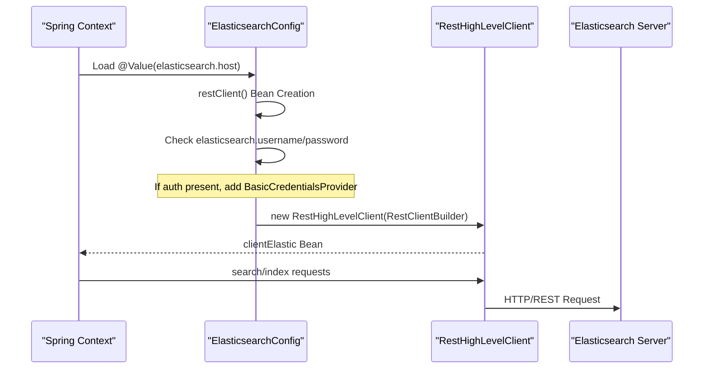

# Page: Infrastructure Configuration

# Infrastructure Configuration

<details>
<summary>Relevant source files</summary>

The following files were used as context for generating this wiki page:

- [docker-compose.yml](docker-compose.yml)
- [elastic/src/main/java/org/openmbee/mms/elastic/config/ElasticsearchConfig.java](elastic/src/main/java/org/openmbee/mms/elastic/config/ElasticsearchConfig.java)
- [elastic/src/main/resources/application.properties.example](elastic/src/main/resources/application.properties.example)
- [example/src/main/resources/application-test.properties](example/src/main/resources/application-test.properties)
- [example/src/main/resources/application.properties.example](example/src/main/resources/application.properties.example)

</details>


This page provides a technical deep dive into the infrastructure components required to run the Model Management System (MMS). It covers the relational database, search engine, object storage, and the orchestration of these services using Docker.

## System Overview and Connectivity

MMS follows a federated persistence architecture where metadata and structural relationships are stored in a relational database, while heavy JSON content and history are indexed in Elasticsearch. Binary artifacts are offloaded to S3-compatible storage.

### Infrastructure Service Mapping

The following diagram maps the logical infrastructure components to their specific code configurations and service names used in the `docker-compose.yml`.

**Diagram: Infrastructure Service Mapping**

```mermaid
graph TD
    subgraph "Spring Boot Application (MMS)"
        [ExampleApp] --> [ElasticsearchConfig]
        [ExampleApp] --> [DataSource]
        [ExampleApp] --> [S3Client]
    end

    subgraph "External Services (Docker Compose)"
        [ElasticsearchConfig] -- "elasticsearch.host:9200" --> ["elasticsearch_service"]
        [DataSource] -- "spring.datasource.url" --> ["postgres_service"]
        [S3Client] -- "s3.endpoint" --> ["minio_service"]
    end

    style "elasticsearch_service" stroke-dasharray: 5 5
    style "postgres_service" stroke-dasharray: 5 5
    style "minio_service" stroke-dasharray: 5 5
```

**Sources:**
- [docker-compose.yml:3-41]()
- [example/src/main/resources/application.properties.example:31-92]()

---

## Relational Database (PostgreSQL/MySQL)

MMS uses a relational database for managing Organizations, Projects, Refs, and Permissions. It supports both PostgreSQL and MySQL via JDBC.

### Database Connection and Hibernate
The system utilizes Spring Data JPA with Hibernate as the ORM. A critical feature is the multi-tenant schema approach where each project can reside in its own schema or be prefixed.

| Property | Description | Default (Local) |
| :--- | :--- | :--- |
| `spring.datasource.url` | JDBC connection string | `jdbc:postgresql://localhost:5432` |
| `spring.datasource.driver-class-name` | Database driver | `org.postgresql.Driver` |
| `spring.jpa.hibernate.ddl-auto` | Hibernate DDL strategy | `update` |
| `spring.jpa.properties.hibernate.dialect` | SQL Dialect for optimization | `PostgreSQL10Dialect` |
| `rdb.project.prefix` | Prefix for project-specific schemas | `mms` |

### Configuration Implementation
The database configuration is primarily driven by properties. In the `test` profile, the host is set to `postgres` to match the Docker service name.

**Sources:**
- [example/src/main/resources/application.properties.example:31-48]()
- [example/src/main/resources/application-test.properties:29-46]()

---

## Elasticsearch Integration

Elasticsearch is used for indexing `ElementJson` and `CommitJson` objects. The `elastic` module provides the client configuration and DAO implementations.

### Client Configuration
The `RestHighLevelClient` is configured in `ElasticsearchConfig.java`. It supports optional Basic Authentication and sets specific timeouts for long-running queries.

**Diagram: Elasticsearch Client Initialization**



### Operational Limits
MMS defines several application-level limits for Elasticsearch operations to prevent memory exhaustion and timeout issues:

*   **Insert Limit (`elasticsearch.limit.insert`)**: 80 (Batch size for bulk indexing) [[example/src/main/resources/application.properties.example:59-59]()]
*   **Result Limit (`elasticsearch.limit.result`)**: 10,000 (Max hits for standard searches) [[example/src/main/resources/application.properties.example:60-60]()]
*   **Scroll Timeout (`elasticsearch.limit.scrollTimeout`)**: 1000ms (Keep-alive for scroll contexts) [[example/src/main/resources/application.properties.example:62-62]()]
*   **Commit Limit (`elasticsearch.limit.commit`)**: 100,000 (Max elements per commit index) [[example/src/main/resources/application.properties.example:65-65]()]

**Sources:**
- [elastic/src/main/java/org/openmbee/mms/elastic/config/ElasticsearchConfig.java:17-60]()
- [example/src/main/resources/application.properties.example:54-70]()

---

## Artifact Storage (S3/MinIO)

Binary artifacts are stored in an S3-compatible backend. For local development and testing, **MinIO** is used as a drop-in replacement for AWS S3.

### S3 Configuration Parameters
The following properties define the connection to the storage provider:

*   **Endpoint**: `s3.endpoint` (e.g., `http://localhost:9000` for MinIO) [[example/src/main/resources/application.properties.example:88-88]()]
*   **Credentials**: `s3.access_key` and `s3.secret_key` [[example/src/main/resources/application.properties.example:89-90]()]
*   **Bucket**: `s3.bucket` (The target bucket name) [[example/src/main/resources/application.properties.example:92-92]()]

**Sources:**
- [example/src/main/resources/application.properties.example:88-92]()
- [example/src/main/resources/application-test.properties:83-86]()

---

## Docker Compose and Service Wiring

The `docker-compose.yml` file defines the standard runtime environment. It ensures that the MMS application starts only after its dependencies are healthy.

### Service Dependencies

| Service | Image | Role | Port |
| :--- | :--- | :--- | :--- |
| `postgres` | `postgres:11-alpine` | Metadata/RDB | 5432 |
| `elasticsearch` | `elasticsearch:7.8.1` | Content Indexing | 9200 |
| `minio` | `minio/minio` | Binary Storage | 9000 |
| `mms` | (Local Build) | Application Server | 8080 |

### Test Profile Wiring
When running via Docker Compose, the MMS container uses the `test` profile (`SPRING_PROFILES_ACTIVE=test`). This changes the hostnames in `application-test.properties` from `localhost` to the service names defined in the compose file (e.g., `jdbc:postgresql://postgres:5432`).

**Sources:**
- [docker-compose.yml:1-41]()
- [example/src/main/resources/application-test.properties:29-57]()

---

## Configuration Reference Summary

The following table summarizes the core infrastructure properties across different environments.

| Property | Default (Local) | Docker (Test Profile) |
| :--- | :--- | :--- |
| `spring.datasource.url` | `jdbc:postgresql://localhost:5432` | `jdbc:postgresql://postgres:5432` |
| `elasticsearch.host` | `localhost` | `elasticsearch` |
| `s3.endpoint` | `http://localhost:9000` | `http://minio:9000` |
| `mms.stream.batch.size` | `100000` | `100000` |

**Sources:**
- [example/src/main/resources/application.properties.example:1-92]()
- [example/src/main/resources/application-test.properties:1-86]()
