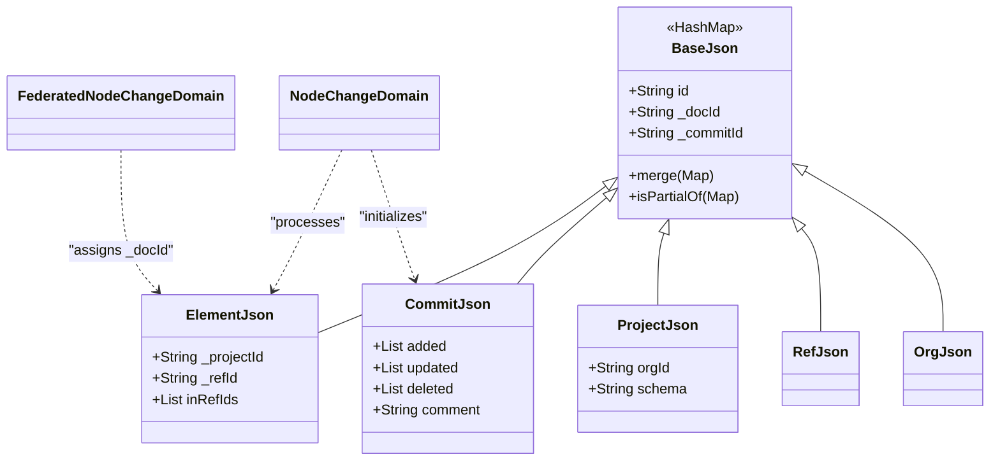
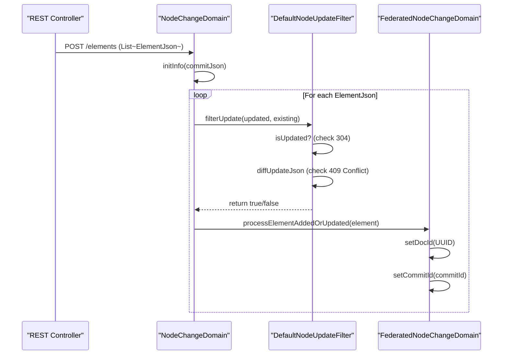

# Page: JSON Transfer Objects (json module)

# JSON Transfer Objects (json module)

Relevant source files

The following files were used as context for generating this wiki page:

- [artifacts/src/main/java/org/openmbee/mms/artifacts/crud/ArtifactsContext.java](artifacts/src/main/java/org/openmbee/mms/artifacts/crud/ArtifactsContext.java)
- [artifacts/src/main/java/org/openmbee/mms/artifacts/crud/ArtifactsPersistenceNodeUpdateFilter.java](artifacts/src/main/java/org/openmbee/mms/artifacts/crud/ArtifactsPersistenceNodeUpdateFilter.java)
- [crud/src/main/java/org/openmbee/mms/crud/domain/DefaultNodeUpdateFilter.java](crud/src/main/java/org/openmbee/mms/crud/domain/DefaultNodeUpdateFilter.java)
- [crud/src/main/java/org/openmbee/mms/crud/domain/NodeChangeDomain.java](crud/src/main/java/org/openmbee/mms/crud/domain/NodeChangeDomain.java)
- [crud/src/main/java/org/openmbee/mms/crud/domain/NodeUpdateFilter.java](crud/src/main/java/org/openmbee/mms/crud/domain/NodeUpdateFilter.java)
- [federatedpersistence/src/main/java/org/openmbee/mms/federatedpersistence/domain/FederatedNodeChangeDomain.java](federatedpersistence/src/main/java/org/openmbee/mms/federatedpersistence/domain/FederatedNodeChangeDomain.java)
- [json/json.gradle](json/json.gradle)
- [json/src/main/java/org/openmbee/mms/json/BaseJson.java](json/src/main/java/org/openmbee/mms/json/BaseJson.java)

The `json` module provides the core Data Transfer Objects (DTOs) used for communication between the MMS API, the persistence layers, and external clients. These objects are designed to be flexible, using a `HashMap`-based inheritance structure to allow for arbitrary metadata while enforcing a set of system-prefixed fields required for versioning and multi-tenancy.

## Design Philosophy: HashMap-based DTOs

MMS utilizes a "Schema-less" approach for the primary data payload of elements. All JSON objects in this module extend `BaseJson`, which itself extends `java.util.HashMap<String, Object>` [json/src/main/java/org/openmbee/mms/json/BaseJson.java:12](). 

This design allows:
1.  **Flexibility**: Clients can submit custom fields without requiring changes to the Java class definitions.
2.  **Schema Support**: Different domain modules (Cameo, Jupyter, MSOSA) can inject specific fields into the map while sharing the same base transport logic.
3.  **Merge Capabilities**: The `BaseJson.merge()` function allows for partial updates by combining existing map entries with new ones [json/src/main/java/org/openmbee/mms/json/BaseJson.java:177-184]().
4.  **Equality Checking**: The `isPartialOf()` method determines if a submitted JSON object is functionally equivalent to an existing one to prevent unnecessary commits (returning HTTP 304) [json/src/main/java/org/openmbee/mms/json/BaseJson.java:173-175]().

### System-Prefixed Fields

To distinguish between user-defined data and system-managed metadata, MMS uses an underscore prefix (`_`) for internal fields. These fields are defined as constants in `BaseJson` [json/src/main/java/org/openmbee/mms/json/BaseJson.java:14-25]().

| Constant | JSON Key | Purpose |
| :--- | :--- | :--- |
| `ID` | `id` | The unique identifier for the object (e.g., element ID). |
| `DOCID` | `_docId` | The unique UUID for a specific version/instance in the search index. |
| `PROJECTID` | `_projectId` | The ID of the project the object belongs to. |
| `REFID` | `_refId` | The ID of the branch (ref) containing this object. |
| `COMMITID` | `_commitId` | The ID of the commit that created this version. |
| `MODIFIED` | `_modified` | ISO 8601 timestamp of the last modification. |
| `MODIFIER` | `_modifier` | The username of the last person to modify the object. |
| `IS_DELETED` | `_deleted` | Boolean string ("true"/"false") indicating soft-deletion status. |

### DTO Hierarchy and Flow

The following diagram illustrates how the `json` module classes relate to each other and how they bridge the gap between API requests and the internal domain logic.

**DTO Entity Mapping**

Sources: [json/src/main/java/org/openmbee/mms/json/BaseJson.java:12-25](), [crud/src/main/java/org/openmbee/mms/crud/domain/NodeChangeDomain.java:53-84](), [federatedpersistence/src/main/java/org/openmbee/mms/federatedpersistence/domain/FederatedNodeChangeDomain.java:19-22]()

## Key JSON Classes

### ElementJson
Represents a versioned model element. It is the primary unit of data in MMS. During the persistence flow, `FederatedNodeChangeDomain` ensures that every `ElementJson` receives a new `_docId` (UUID) upon update, effectively creating a new immutable record in the search index [federatedpersistence/src/main/java/org/openmbee/mms/federatedpersistence/domain/FederatedNodeChangeDomain.java:140-144]().

### CommitJson
Encapsulates the metadata for a transaction. It contains lists of `ElementVersion` objects for elements that were `added`, `updated`, or `deleted` in that specific commit [federatedpersistence/src/main/java/org/openmbee/mms/federatedpersistence/domain/FederatedNodeChangeDomain.java:89-94]().

### RefJson, ProjectJson, and OrgJson
These objects represent the structural hierarchy of MMS. `ProjectJson` includes fields for the organization it belongs to and the specific schema (e.g., "cameo", "jupyter") it uses.

## Data Flow and Filtering

When JSON objects flow through the API into the `crud` module, they are processed by `NodeChangeDomain`. A critical part of this flow is the `NodeUpdateFilter` chain.

**Processing Flow: JSON to Persistence**

Sources: [crud/src/main/java/org/openmbee/mms/crud/domain/NodeChangeDomain.java:34-50](), [crud/src/main/java/org/openmbee/mms/crud/domain/DefaultNodeUpdateFilter.java:23-35](), [federatedpersistence/src/main/java/org/openmbee/mms/federatedpersistence/domain/FederatedNodeChangeDomain.java:129-150]()

### Conflict Detection and Merging
The `DefaultNodeUpdateFilter` uses the `_modified` field of the incoming `ElementJson` to perform optimistic locking. If the incoming `_modified` timestamp is older than the one currently in the database, a 409 Conflict rejection is generated [crud/src/main/java/org/openmbee/mms/crud/domain/DefaultNodeUpdateFilter.java:46-58](). If no conflict is found, the new data is merged into the existing record [crud/src/main/java/org/openmbee/mms/crud/domain/DefaultNodeUpdateFilter.java:63]().

### Artifact Integration
The `ArtifactsPersistenceNodeUpdateFilter` demonstrates how the JSON structure is protected during specific operations. It ensures that when a regular element update occurs, existing binary artifact metadata (stored under the `artifacts` key) is not accidentally overwritten or cleared [artifacts/src/main/java/org/openmbee/mms/artifacts/crud/ArtifactsPersistenceNodeUpdateFilter.java:12-22]().

Sources:
- [json/src/main/java/org/openmbee/mms/json/BaseJson.java]()
- [crud/src/main/java/org/openmbee/mms/crud/domain/NodeChangeDomain.java]()
- [crud/src/main/java/org/openmbee/mms/crud/domain/DefaultNodeUpdateFilter.java]()
- [federatedpersistence/src/main/java/org/openmbee/mms/federatedpersistence/domain/FederatedNodeChangeDomain.java]()
- [artifacts/src/main/java/org/openmbee/mms/artifacts/crud/ArtifactsPersistenceNodeUpdateFilter.java]()
