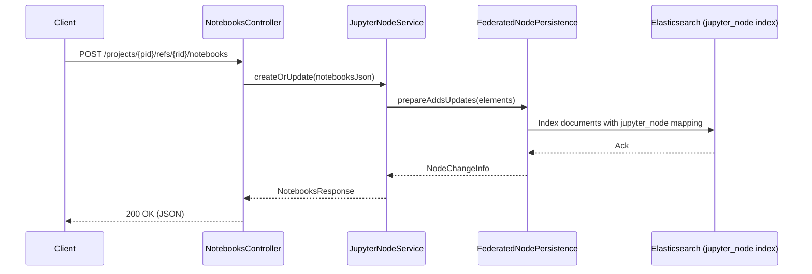
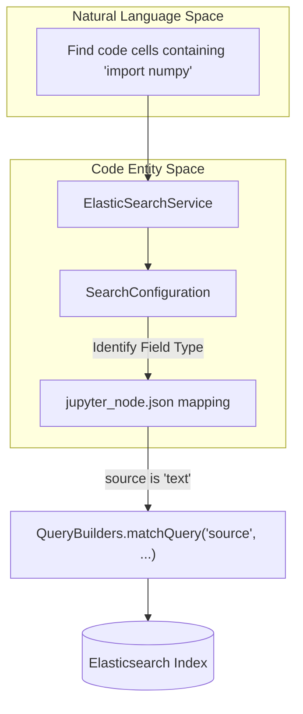

# Page: Jupyter Module

# Jupyter Module

<details>
<summary>Relevant source files</summary>

The following files were used as context for generating this wiki page:

- [elastic/src/main/java/org/openmbee/mms/elastic/services/ElasticSearchService.java](elastic/src/main/java/org/openmbee/mms/elastic/services/ElasticSearchService.java)
- [elastic/src/main/java/org/openmbee/mms/elastic/services/SearchConfiguration.java](elastic/src/main/java/org/openmbee/mms/elastic/services/SearchConfiguration.java)
- [elastic/src/main/resources/elastic_mappings/cameo_node.json](elastic/src/main/resources/elastic_mappings/cameo_node.json)
- [elastic/src/main/resources/elastic_mappings/commit.json](elastic/src/main/resources/elastic_mappings/commit.json)
- [elastic/src/main/resources/elastic_mappings/default_node.json](elastic/src/main/resources/elastic_mappings/default_node.json)
- [elastic/src/main/resources/elastic_mappings/jupyter_node.json](elastic/src/main/resources/elastic_mappings/jupyter_node.json)
- [example/jupyter.postman_collection.json](example/jupyter.postman_collection.json)
- [example/search.postman_collection.json](example/search.postman_collection.json)
- [gradle/wrapper/gradle-wrapper.jar](gradle/wrapper/gradle-wrapper.jar)
- [gradle/wrapper/gradle-wrapper.properties](gradle/wrapper/gradle-wrapper.properties)
- [gradlew](gradlew)
- [gradlew.bat](gradlew.bat)
- [twc/src/main/java/org/openmbee/mms/twc/config/TwcAuthSecurityConfig.java](twc/src/main/java/org/openmbee/mms/twc/config/TwcAuthSecurityConfig.java)

</details>


The Jupyter module provides a specialized schema for the Model Management System (MMS) to store, manage, and query Jupyter Notebooks as structured elements. By treating notebooks and their constituent cells as typed nodes, MMS enables version-controlled collaborative editing and granular search of computational narratives.

## Overview and Purpose

The Jupyter module extends the core MMS capabilities to handle the specific JSON structure of `.ipynb` files. It allows users to:
*   Store entire notebooks or individual notebook cells as MMS elements.
*   Perform CRUD operations on notebooks via a dedicated `/notebooks` API.
*   Utilize a specialized Elasticsearch mapping (`jupyter_node`) optimized for notebook metadata, cell types, and execution outputs.
*   Maintain the relationship between notebooks and cells using the standard MMS ownership hierarchy.

## Schema Configuration

The module is integrated into the MMS pluggable schema system through `JupyterSchemaConfig`. When a project is created with the `schema: "jupyter"` attribute, MMS uses the Jupyter-specific services for node operations.

### Data Model and Mapping
Jupyter notebooks are stored in Elasticsearch using a specific mapping defined in `jupyter_node.json`. This mapping ensures that notebook-specific fields are indexed correctly for search.

| Field | Type | Description |
| :--- | :--- | :--- |
| `metadata` | Object | Stores kernel info, language info, and author tags [elastic/src/main/resources/elastic_mappings/jupyter_node.json:4-43](). |
| `cells` | Keyword | List of cell identifiers or content [elastic/src/main/resources/elastic_mappings/jupyter_node.json:50-52](). |
| `cell_type` | Keyword | Distinguishes between `markdown`, `code`, or `raw` cells [elastic/src/main/resources/elastic_mappings/jupyter_node.json:54-56](). |
| `source` | Text | The actual content/code within a cell [elastic/src/main/resources/elastic_mappings/jupyter_node.json:60-62](). |
| `outputs` | Object | Captured execution results, including `text/plain`, `image/png`, and `traceback` [elastic/src/main/resources/elastic_mappings/jupyter_node.json:63-114](). |

**Sources:** [elastic/src/main/resources/elastic_mappings/jupyter_node.json:1-156]()

## Implementation Components

### NotebooksController
The `NotebooksController` provides the REST interface for notebook operations. It exposes endpoints under `/projects/{projectId}/refs/{refId}/notebooks`.

*   **GET `/notebooks`**: Retrieves notebooks in the specified ref.
*   **POST `/notebooks`**: Creates or updates notebooks. The request body typically contains a `notebooks` array [example/jupyter.postman_collection.json:149-176]().

### JupyterNodeService
The `JupyterNodeService` implements the logic for reading and writing notebook data. It interacts with the `NodeDAO` and the persistence layer to ensure that notebook JSON is correctly decomposed or reconstructed from the underlying element storage.

### Type Definitions
The module defines specific node and edge types to represent notebook structures:
*   **JupyterNodeType**: Defines types like `Notebook`, `Cell`, etc.
*   **JupyterEdgeType**: Defines relationships specific to notebook hierarchies.

## Data Flow: Saving a Notebook

The following diagram illustrates the flow of data when a Jupyter notebook is posted to the MMS API.

**Notebook Submission Sequence**

**Sources:** [example/jupyter.postman_collection.json:149-178](), [elastic/src/main/resources/elastic_mappings/jupyter_node.json:1-156]()

## Search Integration

The Jupyter module leverages `ElasticSearchService` to perform granular searches within notebooks. Because the `jupyter_node` mapping defines `source` as `text` and `metadata.tags` as `keyword`, users can perform complex queries across the notebook corpus.

**Code-to-System Mapping: Search Execution**

**Sources:** [elastic/src/main/java/org/openmbee/mms/elastic/services/ElasticSearchService.java:43-123](), [elastic/src/main/java/org/openmbee/mms/elastic/services/SearchConfiguration.java:26-37](), [elastic/src/main/resources/elastic_mappings/jupyter_node.json:60-62]()

## API Examples

### Creating a Project with Jupyter Schema
To enable Jupyter-specific processing, the project must be initialized with the correct schema identifier.

```json
POST /projects
{
    "projects": [
        {
            "id": "jupyter_research",
            "name": "Jupyter Research Project",
            "orgId": "my_org",
            "schema": "jupyter"
        }
    ]
}
```
**Sources:** [example/jupyter.postman_collection.json:107-147]()

### Adding a Notebook
Notebooks are sent as a collection of cells within the `notebooks` array.

```json
POST /projects/jupyter_research/refs/master/notebooks
{
    "notebooks": [
        {
            "id": "analysis_v1",
            "cells": [
                {
                    "cell_type": "markdown",
                    "source": ["# Analysis\n", "This is a test."]
                },
                {
                    "cell_type": "code",
                    "execution_count": 1,
                    "source": ["print('hello world')"],
                    "outputs": []
                }
            ]
        }
    ]
}
```
**Sources:** [example/jupyter.postman_collection.json:149-178]()
