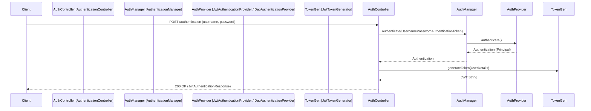

# Page: JWT Authentication (authenticator module)

# JWT Authentication (authenticator module)

<details>
<summary>Relevant source files</summary>

The following files were used as context for generating this wiki page:

- [authenticator/src/main/java/org/openmbee/mms/authenticator/controllers/AuthenticationController.java](authenticator/src/main/java/org/openmbee/mms/authenticator/controllers/AuthenticationController.java)
- [authenticator/src/main/resources/application.properties.example](authenticator/src/main/resources/application.properties.example)
- [localuser/src/main/java/org/openmbee/mms/localuser/config/AuthProviderConfig.java](localuser/src/main/java/org/openmbee/mms/localuser/config/AuthProviderConfig.java)

</details>


The `authenticator` module provides the core infrastructure for stateless JWT-based authentication within the Model Management System (MMS). It implements a standard Spring Security flow that handles token generation, per-request validation via filters, and provider-based authentication logic.

### Module Overview and Data Flow

The authentication process follows a standard provider-based architecture where credentials (username/password) are exchanged for a signed JSON Web Token (JWT). Subsequent requests include this token in the `Authorization` header.

**Authentication Data Flow**



**Sources:**
- [authenticator/src/main/java/org/openmbee/mms/authenticator/controllers/AuthenticationController.java:37-52]()
- [authenticator/src/main/java/org/openmbee/mms/authenticator/security/JwtTokenGenerator.java:1-50]()

---

### Key Components

#### 1. AuthenticationController
The `AuthenticationController` serves as the entry point for authentication requests. It exposes endpoints for obtaining and validating tokens.

*   **POST `/authentication`**: Accepts a `JwtAuthenticationRequest` (JSON with `username` and `password`). It uses the `AuthenticationManager` to verify credentials and returns a `JwtAuthenticationResponse` containing the token [[authenticator/src/main/java/org/openmbee/mms/authenticator/controllers/AuthenticationController.java:37-52]().
*   **GET `/authentication`**: Allows an already authenticated user to refresh or retrieve a new token [[authenticator/src/main/java/org/openmbee/mms/authenticator/controllers/AuthenticationController.java:54-64]().
*   **GET `/checkAuth`**: A validation endpoint that returns a `JwtTokenValidationResponse` containing the username if the current security context is authenticated [[authenticator/src/main/java/org/openmbee/mms/authenticator/controllers/AuthenticationController.java:67-75]().

#### 2. JwtTokenGenerator
This component handles the lifecycle of the JWT string. It uses a secret key and expiration time defined in `application.properties` [[authenticator/src/main/resources/application.properties.example:1-2]().

*   **`generateToken(UserDetails userDetails)`**: Creates a signed JWT with the username as the subject and an expiration date [[authenticator/src/main/java/org/openmbee/mms/authenticator/security/JwtTokenGenerator.java:49]().
*   **`getUsernameFromToken(String token)`**: Parses the claims to extract the subject.
*   **`validateToken(String token, UserDetails userDetails)`**: Verifies that the token is not expired and matches the provided user.

#### 3. JwtAuthenticationTokenFilter
A `OncePerRequestFilter` that intercepts every incoming HTTP request. It looks for the `Authorization: Bearer <token>` header. If a valid token is found, it populates the `SecurityContextHolder` with an authentication object, allowing the request to proceed to protected resources without re-authenticating against the database [[authenticator/src/main/java/org/openmbee/mms/authenticator/security/JwtAuthenticationTokenFilter.java:1-60]().

#### 4. AuthSecurityConfig
This configuration class defines the `HttpSecurity` bean for the module. It ensures the application is stateless by setting `SessionCreationPolicy.STATELESS` and configures CORS (Cross-Origin Resource Sharing) to allow web-based clients to interact with the API [[authenticator/src/main/java/org/openmbee/mms/authenticator/config/AuthSecurityConfig.java:1-50]().

**Sources:**
- [authenticator/src/main/java/org/openmbee/mms/authenticator/controllers/AuthenticationController.java:23-77]()
- [authenticator/src/main/java/org/openmbee/mms/authenticator/security/JwtAuthenticationTokenFilter.java:1-60]()
- [authenticator/src/main/java/org/openmbee/mms/authenticator/config/AuthSecurityConfig.java:1-50]()

---

### Security Entity Mapping

The following diagram maps the logical security concepts to the specific Java classes and Spring Beans implemented in the module.

```mermaid
classDiagram
    class "Spring Security Context" as Context {
        SecurityContextHolder
    }
    class "Authentication Endpoint" as Controller {
        AuthenticationController
        /authentication POST
    }
    class "Token Utility" as Generator {
        JwtTokenGenerator
        generateToken()
    }
    class "Per-Request Filter" as Filter {
        JwtAuthenticationTokenFilter
        doFilterInternal()
    }
    class "User Management" as UserDetails {
        UserDetailsServiceImpl
        loadUserByUsername()
    }
    
    Controller --> Generator : uses
    Filter --> Generator : validates with
    Filter --> Context : populates
    Controller --> UserDetails : verifies via Manager
```

**Sources:**
- [authenticator/src/main/java/org/openmbee/mms/authenticator/controllers/AuthenticationController.java:23-35]()
- [authenticator/src/main/java/org/openmbee/mms/authenticator/security/JwtAuthenticationTokenFilter.java:30-45]()
- [localuser/src/main/java/org/openmbee/mms/localuser/config/AuthProviderConfig.java:29-31]()

---

### Token Lifecycle and Validation

The system relies on external properties for JWT security. If these are not provided, the system defaults to values found in the example configuration.

| Property | Description | Example Value |
| :--- | :--- | :--- |
| `jwt.secret` | The signing key for the JWT. Must be long and complex. | `MAKE_ME_SOMETHING_REALLY_LONG` |
| `jwt.expiration` | Token validity period in seconds. | `86400` (24 hours) |

**Sources:**
- [authenticator/src/main/resources/application.properties.example:1-2]()

#### Root User Provisioning
During the initialization of the `AuthProviderConfig`, the system checks for the existence of an administrative user defined by `mms.admin.username`. If the user does not exist in the local database, the `UserDetailsServiceImpl` is used to register this "root" user automatically with the password provided in `mms.admin.password` [[localuser/src/main/java/org/openmbee/mms/localuser/config/AuthProviderConfig.java:38-55]().

**Sources:**
- [localuser/src/main/java/org/openmbee/mms/localuser/config/AuthProviderConfig.java:15-56]()
- [localuser/src/main/java/org/openmbee/mms/localuser/security/UserDetailsServiceImpl.java:1-50]()
