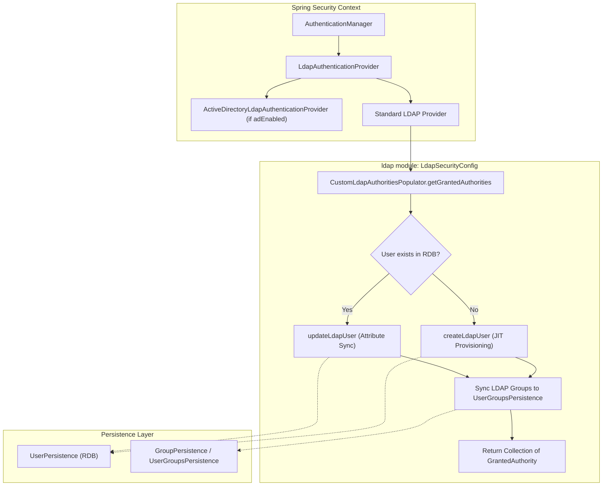
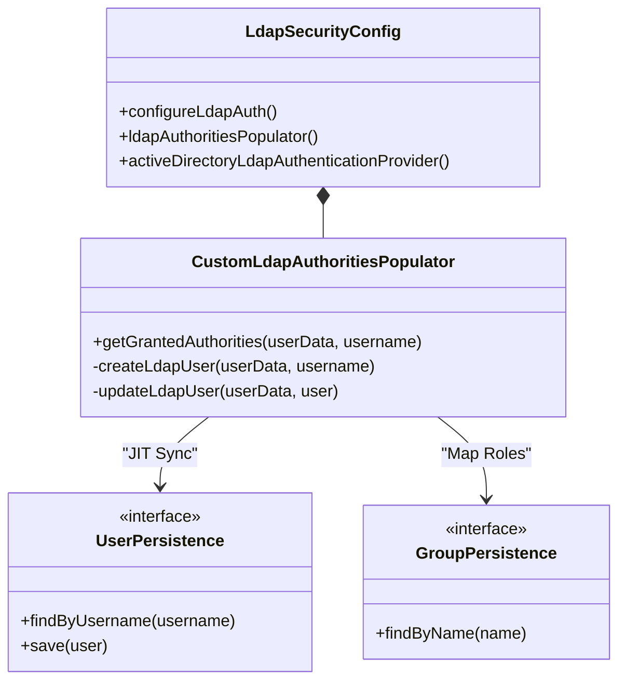

# Page: LDAP Authentication (ldap module)

# LDAP Authentication (ldap module)

Relevant source files

The following files were used as context for generating this wiki page:

- [authenticator/src/main/java/org/openmbee/mms/authenticator/config/AuthSecurityConfig.java](authenticator/src/main/java/org/openmbee/mms/authenticator/config/AuthSecurityConfig.java)
- [ldap/README.rst](ldap/README.rst)
- [ldap/src/main/java/org/openmbee/mms/ldap/LdapCondition.java](ldap/src/main/java/org/openmbee/mms/ldap/LdapCondition.java)
- [ldap/src/main/java/org/openmbee/mms/ldap/LdapSecurityConfig.java](ldap/src/main/java/org/openmbee/mms/ldap/LdapSecurityConfig.java)
- [ldap/src/main/resources/application.properties.example](ldap/src/main/resources/application.properties.example)
- [rdb/src/main/java/org/openmbee/mms/rdb/repositories/UserRepository.java](rdb/src/main/java/org/openmbee/mms/rdb/repositories/UserRepository.java)

The `ldap` module provides an optional authentication provider for MMS, allowing users to authenticate against an LDAP directory or Active Directory (AD). It features Just-In-Time (JIT) user provisioning, attribute synchronization, and group-to-authority mapping.

## Overview and Activation

The LDAP module is conditionally loaded based on the `ldap.enabled` property. The `LdapCondition` class evaluates this property to determine if the configuration should be initialized [[ldap/src/main/java/org/openmbee/mms/ldap/LdapCondition.java:8-13]()] [[ldap/src/main/java/org/openmbee/mms/ldap/LdapSecurityConfig.java:39-39]()].

### Data Flow: Authentication and Provisioning

The following diagram illustrates the flow from a login attempt to the creation/update of a local user record and the mapping of LDAP groups to MMS authorities.

**LDAP Authentication Flow**

Sources: [ldap/src/main/java/org/openmbee/mms/ldap/LdapSecurityConfig.java:115-160](), [ldap/src/main/java/org/openmbee/mms/ldap/LdapSecurityConfig.java:162-170]()

## Key Components

### LdapSecurityConfig
The central configuration class that wires the LDAP authentication provider into the Spring Security `AuthenticationManagerBuilder` [[ldap/src/main/java/org/openmbee/mms/ldap/LdapSecurityConfig.java:115-117]()]. It supports two primary modes:
1.  **Standard LDAP**: Uses `userDnPatterns`, `userSearch`, and `groupSearch` configurations [[ldap/src/main/java/org/openmbee/mms/ldap/LdapSecurityConfig.java:128-139]()].
2.  **Active Directory**: Activates `ActiveDirectoryLdapAuthenticationProvider` when `ldap.ad.enabled` is true [[ldap/src/main/java/org/openmbee/mms/ldap/LdapSecurityConfig.java:125-126]()].

### CustomLdapAuthoritiesPopulator
An inner class within `LdapSecurityConfig` that implements `LdapAuthoritiesPopulator`. It is responsible for:
*   **JIT Provisioning**: If a user authenticates successfully via LDAP but does not exist in the MMS database, `createLdapUser` is called to persist a new `UserJson` record [[ldap/src/main/java/org/openmbee/mms/ldap/LdapSecurityConfig.java:164-167]()].
*   **Attribute Synchronization**: Updates user details (email, first name, last name) based on LDAP attributes if the `ldap.user.attributes.update` interval (in hours) has passed [[ldap/src/main/java/org/openmbee/mms/ldap/LdapSecurityConfig.java:78-79]()] [[ldap/src/main/java/org/openmbee/mms/ldap/LdapSecurityConfig.java:168-170]()].
*   **Group Mapping**: Retrieves groups the user belongs to from the LDAP server and matches them against groups defined in MMS to grant appropriate `GrantedAuthority` objects [[ldap/src/main/java/org/openmbee/mms/ldap/LdapSecurityConfig.java:148-150]()] [[ldap/README.rst:6-6]()].

**Code Entity Mapping**

Sources: [ldap/src/main/java/org/openmbee/mms/ldap/LdapSecurityConfig.java:41-41](), [ldap/src/main/java/org/openmbee/mms/ldap/LdapSecurityConfig.java:150-150](), [ldap/src/main/java/org/openmbee/mms/ldap/LdapSecurityConfig.java:95-97]()

## Configuration Properties

The module is configured via `application.properties`. Below are the primary configuration keys:

| Property | Description | Default |
| --- | --- | --- |
| `ldap.enabled` | Enables the LDAP module. | `false` |
| `ldap.provider.url` | URL of the LDAP server (e.g., `ldaps://ldap.example.org`). | `null` |
| `ldap.provider.base` | The base DN for the LDAP hierarchy. | `null` |
| `ldap.ad.enabled` | Enables Active Directory specific provider. | `false` |
| `ldap.user.dn.pattern` | Pattern for user DNs, separated by `;`. | `uid={0}` |
| `ldap.user.attributes.username` | Attribute to use for the MMS username. | `uid` |
| `ldap.user.attributes.email` | Attribute to map to the user's email. | `mail` |
| `ldap.user.attributes.update` | Frequency (in hours) to sync attributes from LDAP. | `24` |
| `ldap.group.search.filter` | Filter used to find groups for a user. | `(uniqueMember={0})` |
| `ldap.group.role.attribute` | Attribute in the group object used as the role name. | `cn` |

Sources: [ldap/src/main/java/org/openmbee/mms/ldap/LdapSecurityConfig.java:45-94](), [ldap/README.rst:11-71](), [ldap/src/main/resources/application.properties.example:1-12]()

## Implementation Details

### Active Directory Support
When `ldap.ad.enabled` is set to `true`, the system instantiates `ActiveDirectoryLdapAuthenticationProvider`. This provider is specifically designed for AD's unique bind and search requirements, using the `ldap.ad.domain` and `ldap.provider.url` [[ldap/src/main/java/org/openmbee/mms/ldap/LdapSecurityConfig.java:45-52]()] [[ldap/src/main/java/org/openmbee/mms/ldap/LdapSecurityConfig.java:125-126]()].

### Context Source Configuration
The module defines a `contextSource` bean (of type `LdapContextSource`) which handles the low-level connection to the LDAP server, including the manager DN (`ldap.provider.userdn`) and manager password (`ldap.provider.password`) for authenticated searches [[ldap/src/main/java/org/openmbee/mms/ldap/LdapSecurityConfig.java:54-58]()].

### User Attribute Mapping
During JIT provisioning or synchronization, the following mappings are applied:
*   **First Name**: Mapped from `ldap.user.attributes.firstname` (default: `givenname`) [[ldap/src/main/java/org/openmbee/mms/ldap/LdapSecurityConfig.java:69-70]()].
*   **Last Name**: Mapped from `ldap.user.attributes.lastname` (default: `sn`) [[ldap/src/main/java/org/openmbee/mms/ldap/LdapSecurityConfig.java:72-73]()].
*   **Email**: Mapped from `ldap.user.attributes.email` (default: `mail`) [[ldap/src/main/java/org/openmbee/mms/ldap/LdapSecurityConfig.java:75-76]()].

Sources: [ldap/src/main/java/org/openmbee/mms/ldap/LdapSecurityConfig.java:45-80](), [ldap/src/main/java/org/openmbee/mms/ldap/LdapSecurityConfig.java:144-156]()
