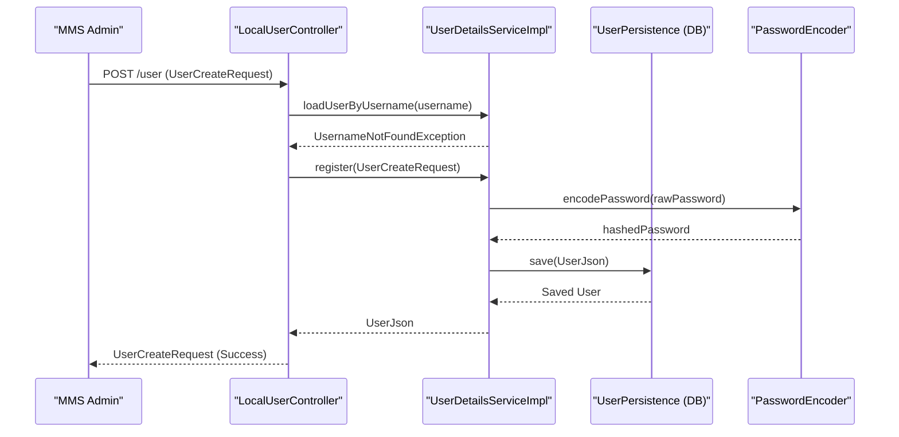

# Page: Local User Management (localuser module)

# Local User Management (localuser module)

<details>
<summary>Relevant source files</summary>

The following files were used as context for generating this wiki page:

- [data/src/main/java/org/openmbee/mms/data/domains/global/Base.java](data/src/main/java/org/openmbee/mms/data/domains/global/Base.java)
- [example/localauth.postman_collection.json](example/localauth.postman_collection.json)
- [groups/src/main/java/org/openmbee/mms/groups/controllers/LocalGroupsController.java](groups/src/main/java/org/openmbee/mms/groups/controllers/LocalGroupsController.java)
- [localuser/src/main/java/org/openmbee/mms/localuser/controllers/LocalUserController.java](localuser/src/main/java/org/openmbee/mms/localuser/controllers/LocalUserController.java)
- [localuser/src/main/java/org/openmbee/mms/localuser/security/UserCreateRequest.java](localuser/src/main/java/org/openmbee/mms/localuser/security/UserCreateRequest.java)
- [localuser/src/main/java/org/openmbee/mms/localuser/security/UserDetailsServiceImpl.java](localuser/src/main/java/org/openmbee/mms/localuser/security/UserDetailsServiceImpl.java)
- [localuser/src/main/java/org/openmbee/mms/localuser/security/UsersResponse.java](localuser/src/main/java/org/openmbee/mms/localuser/security/UsersResponse.java)
- [oauth/src/main/java/org/openmbee/mms/oauth/security/OAuthUserDetailsService.java](oauth/src/main/java/org/openmbee/mms/oauth/security/OAuthUserDetailsService.java)
- [permissions/src/main/java/org/openmbee/mms/permissions/PermissionsController.java](permissions/src/main/java/org/openmbee/mms/permissions/PermissionsController.java)
- [twc/README.rst](twc/README.rst)
- [twc/src/main/java/org/openmbee/mms/twc/maintenance/TWCMaintenanceController.java](twc/src/main/java/org/openmbee/mms/twc/maintenance/TWCMaintenanceController.java)
- [twc/src/main/java/org/openmbee/mms/twc/security/TwcUserDetailsService.java](twc/src/main/java/org/openmbee/mms/twc/security/TwcUserDetailsService.java)

</details>


The `localuser` module provides the implementation for managing users stored directly within the MMS database. It includes REST endpoints for user creation and password management, as well as the security services required to load and authenticate these users.

## LocalUserController

The `LocalUserController` exposes the REST API for managing local users and their credentials. It is primarily used by administrators to provision new accounts or by users to update their own passwords.

### Endpoints

| Method | Endpoint | Description | Security |
|:---|:---|:---|:---|
| `POST` | `/user` | Creates a new local user. | `IS_MMSADMIN` [localuser/src/main/java/org/openmbee/mms/localuser/controllers/LocalUserController.java:38-39]() |
| `GET` | `/users` | Retrieves a list of all users or a specific user via query param. | `isAuthenticated()` [localuser/src/main/java/org/openmbee/mms/localuser/controllers/LocalUserController.java:50-51]() |
| `POST` | `/password` | Updates the password for a specific user. | `isAuthenticated()` [localuser/src/main/java/org/openmbee/mms/localuser/controllers/LocalUserController.java:64-65]() |

### Implementation Details
*   **User Creation**: The `createUser` method first checks if a user already exists by calling `loadUserByUsername`. If a `UsernameNotFoundException` is caught, it proceeds to call `userDetailsService.register(req)` [localuser/src/main/java/org/openmbee/mms/localuser/controllers/LocalUserController.java:40-48]().
*   **Password Updates**: Users can update their own passwords. Administrators can update any user's password. The controller validates that the `requester` matches the target `username` or has `MMSADMIN` privileges before calling the service layer [localuser/src/main/java/org/openmbee/mms/localuser/controllers/LocalUserController.java:66-77]().

**Sources:**
* [localuser/src/main/java/org/openmbee/mms/localuser/controllers/LocalUserController.java:27-89]()

---

## UserDetailsServiceImpl

This class implements the Spring Security `UserDetailsService` interface and provides the core logic for user persistence and password encoding.

### Key Functions

*   **`loadUserByUsername(String username)`**: Fetches a user from the database using `UserPersistence`. It returns a `UserDetailsImpl` object containing the user's data and their assigned groups [localuser/src/main/java/org/openmbee/mms/localuser/security/UserDetailsServiceImpl.java:45-54]().
*   **`register(UserCreateRequest req)`**: Converts a `UserCreateRequest` into a `UserJson` object. It encodes the password using the configured `PasswordEncoder` and saves the user via `userPersistence` [localuser/src/main/java/org/openmbee/mms/localuser/security/UserDetailsServiceImpl.java:60-70]().
*   **`changeUserPassword(...)`**: Updates the password for an existing user. It includes a check against `UserPasswordRulesConfig` to prevent external users (those with blank/null local passwords) from setting a local password unless explicitly allowed [localuser/src/main/java/org/openmbee/mms/localuser/security/UserDetailsServiceImpl.java:72-88]().
*   **`encodePassword(String password)`**: A private helper that uses the `passwordEncoder` bean to hash passwords before storage [localuser/src/main/java/org/openmbee/mms/localuser/security/UserDetailsServiceImpl.java:90-92]().

### Data Flow: User Registration
The following diagram illustrates the flow from a REST request to the persistence of a new local user.

**User Registration Flow**

**Sources:**
* [localuser/src/main/java/org/openmbee/mms/localuser/security/UserDetailsServiceImpl.java:18-93]()
* [localuser/src/main/java/org/openmbee/mms/localuser/controllers/LocalUserController.java:38-48]()

---

## Data Entities and Transfer Objects

The module uses several specific classes for data transfer and internal representation.

### UserCreateRequest
A DTO used for creating users and updating passwords.
*   **Fields**: `username`, `password`, `email`, `firstname`, `lastname`, `admin` [localuser/src/main/java/org/openmbee/mms/localuser/security/UserCreateRequest.java:9-14]().

### UsersResponse
A wrapper for returning collections of users in the `/users` endpoint.
*   **Fields**: `Collection<UserJson> users` [localuser/src/main/java/org/openmbee/mms/localuser/security/UsersResponse.java:8]()

### UserDetailsImpl
An implementation of Spring Security's `UserDetails`. It wraps the `UserJson` object and provides the authorities (roles/groups) required for security filters [localuser/src/main/java/org/openmbee/mms/localuser/security/UserDetailsServiceImpl.java:53]().

**Sources:**
* [localuser/src/main/java/org/openmbee/mms/localuser/security/UserCreateRequest.java:5-64]()
* [localuser/src/main/java/org/openmbee/mms/localuser/security/UsersResponse.java:6-17]()

---

## Security Integration

The `localuser` module integrates with the broader MMS security architecture by providing a concrete implementation of `UserDetailsService`. 

### Interaction with Core Persistence
The module relies on `UserPersistence` and `UserGroupsPersistence` interfaces defined in the `core` module. These interfaces are typically backed by the `rdb` module's JPA implementations.

**Entity Association Diagram**
```mermaid
classDiagram
    class "LocalUserController" as LUC {
        +createUser(UserCreateRequest)
        +updatePassword(UserCreateRequest)
    }
    class "UserDetailsServiceImpl" as UDSI {
        +register(UserCreateRequest)
        +loadUserByUsername(String)
    }
    class "UserPersistence" as UP {
        <<interface>>
        +findByUsername(String)
        +save(UserJson)
    }
    class "UserGroupsPersistence" as UGP {
        <<interface>>
        +findGroupsAssignedToUser(String)
    }
    class "UserJson" as UJ {
        +String username
        +String password
    }

    LUC --> UDSI : "calls"
    UDSI --> UP : "uses"
    UDSI --> UGP : "uses"
    UP ..> UJ : "persists/retrieves"
```

### Password Rules
The `UserPasswordRulesConfig` class (referenced in `UserDetailsServiceImpl`) allows the system to control whether users who were created via external systems (like LDAP or TWC) can have a local password set [localuser/src/main/java/org/openmbee/mms/localuser/security/UserDetailsServiceImpl.java:80-83](). This is crucial for preventing security holes where an external user might attempt to bypass external auth by setting a local credential.

**Sources:**
* [localuser/src/main/java/org/openmbee/mms/localuser/security/UserDetailsServiceImpl.java:20-43]()
* [localuser/src/main/java/org/openmbee/mms/localuser/security/UserDetailsServiceImpl.java:72-88]()
