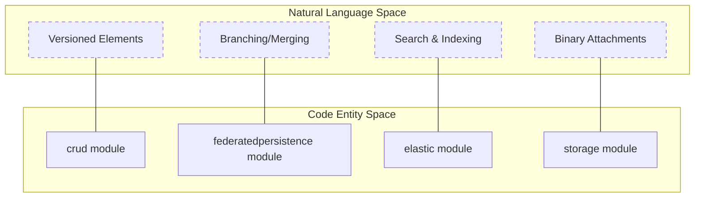

# Page: MMS Overview

# MMS Overview

<details>
<summary>Relevant source files</summary>

The following files were used as context for generating this wiki page:

- [.circleci/config.yml](.circleci/config.yml)
- [Dockerfile](Dockerfile)
- [README.rst](README.rst)
- [artifacts/README.rst](artifacts/README.rst)
- [authenticator/README.rst](authenticator/README.rst)
- [build.gradle](build.gradle)
- [cameo/README.rst](cameo/README.rst)
- [core/README.rst](core/README.rst)
- [docker-compose.yml](docker-compose.yml)
- [docs/Makefile](docs/Makefile)
- [docs/conf.py](docs/conf.py)
- [docs/deployment.rst](docs/deployment.rst)
- [docs/index.rst](docs/index.rst)
- [docs/installation.rst](docs/installation.rst)
- [docs/overview.rst](docs/overview.rst)
- [docs/quickstart.rst](docs/quickstart.rst)
- [example/example.gradle](example/example.gradle)
- [example/getAtCommits.postman_collection.json](example/getAtCommits.postman_collection.json)
- [gradle.properties](gradle.properties)
- [sonar-project.properties](sonar-project.properties)
- [storage/README.rst](storage/README.rst)
- [storage/src/main/java/org/openmbee/mms/storage/S3Storage.java](storage/src/main/java/org/openmbee/mms/storage/S3Storage.java)

</details>


The Model Management System (MMS) is a version-controlled structured-data repository built on the Spring Framework [README.rst:17-17](). It serves as a core component of the Open-MBEE ecosystem, providing a robust backend for managing complex engineering models with branching, committing, and fine-grained data access capabilities.

The system is designed as a collection of modular components that can be assembled into a high-performance, scalable application tailored to specific domain needs (e.g., Systems Engineering, Jupyter Notebook management).

### High-Level System Concept

MMS bridges the gap between structured model data and traditional version control concepts. It allows users to manage elements within a hierarchy of Organizations, Projects, and Refs (branches), with every change tracked via a persistent commit history.

The following diagram illustrates the relationship between the conceptual data space and the primary code modules responsible for managing them.

**Conceptual to Code Entity Mapping**

Sources: [example/example.gradle:16-38](), [README.rst:2-3]()

---

### Modular Architecture

MMS utilizes a Gradle multi-project layout to maintain strict separation of concerns [build.gradle:54-54](). This modularity allows for pluggable persistence backends, authentication providers, and domain-specific schemas.

The `example` module serves as the reference implementation, demonstrating how to wire together core and optional modules into a functional Spring Boot application [example/example.gradle:13-31]().

**System Component Interaction**
```mermaid
graph LR
    subgraph "Entry Point"
        "ExampleApplication"["example module"]
    end

    subgraph "Core Logic"
        "Core"["core module"]
        "CRUD"["crud module"]
    end

    subgraph "Persistence Drivers"
        "FedPersist"["federatedpersistence"]
        "RDB"["rdb module"]
        "ES"["elastic module"]
    end

    subgraph "Infrastructure"
        "PostgreSQL"[(PostgreSQL)]
        "Elasticsearch"[[Elasticsearch]]
    end

    "ExampleApplication" --> "Core"
    "Core" --> "CRUD"
    "CRUD" --> "FedPersist"
    "FedPersist" --> "RDB"
    "FedPersist" --> "ES"
    "RDB" --> "PostgreSQL"
    "ES" --> "Elasticsearch"
```
Sources: [example/example.gradle:16-31](), [docker-compose.yml:3-41]()

For a deep dive into individual modules and their responsibilities, see **[Module Architecture](#1.2)**.

---

### Technology Stack

MMS is built on a modern Java stack centered around the Spring ecosystem:

| Category | Technology | Version / Implementation |
| :--- | :--- | :--- |
| **Language** | Java | JDK 17 [README.rst:31-34]() |
| **Framework** | Spring Boot | 2.7.18 [gradle.properties:4-4]() |
| **Persistence (Meta)** | Relational DB | PostgreSQL 11+ or MySQL 5.7 [README.rst:36-54]() |
| **Persistence (Data)** | Search Engine | Elasticsearch 7.8.1 [gradle.properties:10-10]() |
| **Object Storage** | S3 Compatible | MinIO or AWS S3 [storage/README.rst:6-8]() |
| **Build Tool** | Gradle | 7.x (with Wrapper) [README.rst:82-85]() |
| **API Spec** | OpenAPI | SpringDoc / Swagger UI [example/example.gradle:35-36]() |

---

### Deployment and Lifecycle

The system is designed for containerized environments. A standard `Dockerfile` is provided that builds the application using the `bootJar` task and configures it for execution with a JaCoCo agent for telemetry [Dockerfile:1-10]().

Continuous Integration is handled via CircleCI, which manages the lifecycle from building and testing (using Postman/Newman collections) to publishing artifacts to Sonatype [circleci/config.yml:13-94]().

*   **Getting Started**: To run MMS locally using Docker Compose, see **[Getting Started](#1.1)**.
*   **Pipeline Details**: For information on the build process and quality gates, see **[CI/CD and Build Pipeline](#1.3)**.

---

### Child Pages
- **[Getting Started](#1.1)**: Step-by-step guide for local setup and infrastructure dependencies.
- **[Module Architecture](#1.2)**: Detailed breakdown of the Gradle multi-module project and internal dependencies.
- **[CI/CD and Build Pipeline](#1.3)**: Overview of the CircleCI automation, testing strategy, and artifact deployment.

Sources: [README.rst:122-123](), [docs/index.rst:12-21](), [example/example.gradle:16-31]()
