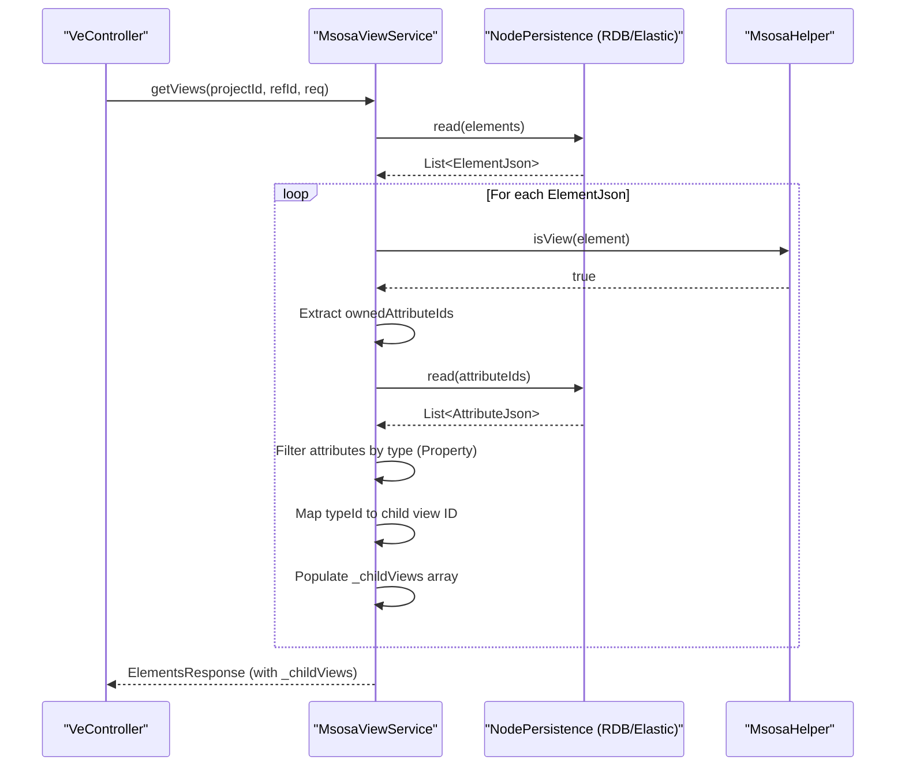
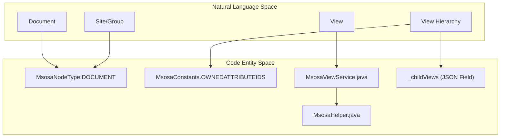

# Page: MSOSA Module

# MSOSA Module

Relevant source files

The following files were used as context for generating this wiki page:

- [cameo/src/main/java/org/openmbee/mms/cameo/services/CameoViewService.java](cameo/src/main/java/org/openmbee/mms/cameo/services/CameoViewService.java)
- [crud/src/main/java/org/openmbee/mms/crud/domain/JsonDomain.java](crud/src/main/java/org/openmbee/mms/crud/domain/JsonDomain.java)
- [jupyter/src/main/java/org/openmbee/mms/jupyter/services/JupyterNodeService.java](jupyter/src/main/java/org/openmbee/mms/jupyter/services/JupyterNodeService.java)
- [msosa/src/main/java/org/openmbee/mms/msosa/services/MsosaViewService.java](msosa/src/main/java/org/openmbee/mms/msosa/services/MsosaViewService.java)

The MSOSA (Model-based Systems Engineering Open Source Architecture) module provides a domain-specific schema for MMS, tailoring the repository behavior to support MSOSA-compliant models. It extends the core CRUD and View capabilities to handle SysML-like structures, including documents, views, and groups, while maintaining compatibility with the standard MMS federated persistence layer.

## Module Configuration and Constants

The module is configured via `MsosaSchemaConfig`, which registers the MSOSA-specific services into the MMS `GenericServiceFactory`. This allows the system to dispatch requests to MSOSA services when a project is configured with the `msosa` schema type.

### MSOSA Constants and Node Types
`MsosaConstants` defines the property names used within the JSON elements to represent SysML and MSOSA metadata.

| Constant | Value | Description |
| :--- | :--- | :--- |
| `COMMITID` | `commitId` | Query parameter for point-in-time reads. |
| `OWNERID` | `ownerId` | Represents the parent/container of an element. |
| `TYPEID` | `typeId` | The ID of the classifier/type for a property. |
| `OWNEDATTRIBUTEIDS` | `ownedAttributeIds` | List of attribute IDs owned by a view or class. |
| `CHILDVIEWS` | `_childViews` | Virtual field for nested view hierarchies. |
| `SITECHARACTERIZATIONID` | `_siteCharacterizationId` | Mapping for document-to-group relationships. |

`MsosaNodeType` defines the integer mappings for MSOSA-specific element types:
*   `ELEMENT`: 0 [msosa/src/main/java/org/openmbee/mms/msosa/MsosaNodeType.java:6-6]()
*   `SITE`: 1 [msosa/src/main/java/org/openmbee/mms/msosa/MsosaNodeType.java:7-7]()
*   `PROJECT`: 2 [msosa/src/main/java/org/openmbee/mms/msosa/MsosaNodeType.java:8-8]()
*   `DOCUMENT`: 3 [msosa/src/main/java/org/openmbee/mms/msosa/MsosaNodeType.java:9-9]()
*   `GROUP`: 4 [msosa/src/main/java/org/openmbee/mms/msosa/MsosaNodeType.java:10-10]()

**Sources:**
* [msosa/src/main/java/org/openmbee/mms/msosa/MsosaConstants.java:3-23]()
* [msosa/src/main/java/org/openmbee/mms/msosa/MsosaNodeType.java:3-16]()

## Service Implementations

The MSOSA module implements the core service interfaces to provide specialized logic for element manipulation and view rendering.

### MsosaViewService
`MsosaViewService` extends `MsosaNodeService` and implements the `ViewService` interface. It is responsible for assembling the document and view hierarchies used by web-based model viewers.

*   **getDocuments**: Retrieves all elements of type `DOCUMENT` and associates them with their parent `GROUP` (site characterization) [msosa/src/main/java/org/openmbee/mms/msosa/services/MsosaViewService.java:31-43]().
*   **addChildViews**: Processes a view element to find its `ownedAttributeIds`. It resolves these attributes, identifies their types (via `typeId`), and populates a virtual `_childViews` list containing the child view IDs and aggregation types [msosa/src/main/java/org/openmbee/mms/msosa/services/MsosaViewService.java:58-79]().
*   **extraProcessPostedElement**: Intercepts element updates. If `_childViews` are provided in the request, it calculates the delta between existing `ownedAttributeIds` and the new request to create, update, or delete the underlying property elements automatically [msosa/src/main/java/org/openmbee/mms/msosa/services/MsosaViewService.java:99-141]().

### MsosaNodeService
`MsosaNodeService` extends `DefaultNodeService`. It provides helper methods for navigating relationships, such as `getFirstRelationshipOfType`, which traverses the `ownerId` or other relationship pointers to find a specific ancestor type [msosa/src/main/java/org/openmbee/mms/msosa/services/MsosaViewService.java:36-39]().

### MsosaProjectService & MsosaCommitService
These services extend the default implementations (`DefaultProjectService` and `DefaultCommitService`) to ensure that MSOSA-specific metadata is handled correctly during project lifecycle events and commit operations.

**Sources:**
* [msosa/src/main/java/org/openmbee/mms/msosa/services/MsosaViewService.java:28-141]()
* [msosa/src/main/java/org/openmbee/mms/msosa/services/MsosaNodeService.java]()

## Data Flow: View Hierarchy Resolution

The following diagram illustrates how `MsosaViewService` transforms raw elements into a structured view hierarchy.

### View Resolution Logic
Title: MSOSA View Hierarchy Resolution

**Sources:**
* [msosa/src/main/java/org/openmbee/mms/msosa/services/MsosaViewService.java:51-82]()
* [msosa/src/main/java/org/openmbee/mms/msosa/services/MsosaViewService.java:61-71]()

## Code Entity Mapping

This diagram bridges the conceptual MSOSA structures to the specific Java classes and constants used in the implementation.

### System Name to Code Entity Mapping
Title: MSOSA Component Mapping

**Sources:**
* [msosa/src/main/java/org/openmbee/mms/msosa/MsosaNodeType.java:3-16]()
* [msosa/src/main/java/org/openmbee/mms/msosa/MsosaConstants.java:3-23]()
* [msosa/src/main/java/org/openmbee/mms/msosa/services/MsosaViewService.java:28-30]()

## Implementation Details

### View Editor Support
`MsosaViewService` includes complex logic in `extraProcessPostedElement` to support "View Editor" functionality. When a user reorders or modifies the `_childViews` of a view in a UI, the service:
1.  Removes the `_childViews` virtual field from the `ElementJson` [msosa/src/main/java/org/openmbee/mms/msosa/services/MsosaViewService.java:101-101]().
2.  Fetches existing properties via `getNodePersistence().findAll` [msosa/src/main/java/org/openmbee/mms/msosa/services/MsosaViewService.java:112-113]().
3.  Uses `JsonDomain.filter` to align IDs [msosa/src/main/java/org/openmbee/mms/msosa/services/MsosaViewService.java:64-64]().
4.  Determines which property elements need to be created (if a new view was added) or deleted (if a view was removed) to maintain the model's integrity [msosa/src/main/java/org/openmbee/mms/msosa/services/MsosaViewService.java:114-141]().

### Context Management
The MSOSA services frequently interact with `ContextHolder` to ensure the correct project and branch (ref) are targeted during cross-element lookups, particularly when resolving document parents [msosa/src/main/java/org/openmbee/mms/msosa/services/MsosaViewService.java:32-32]().

**Sources:**
* [msosa/src/main/java/org/openmbee/mms/msosa/services/MsosaViewService.java:100-141]()
* [crud/src/main/java/org/openmbee/mms/crud/domain/JsonDomain.java:9-18]()
* [msosa/src/main/java/org/openmbee/mms/msosa/services/MsosaViewService.java:32-32]()
