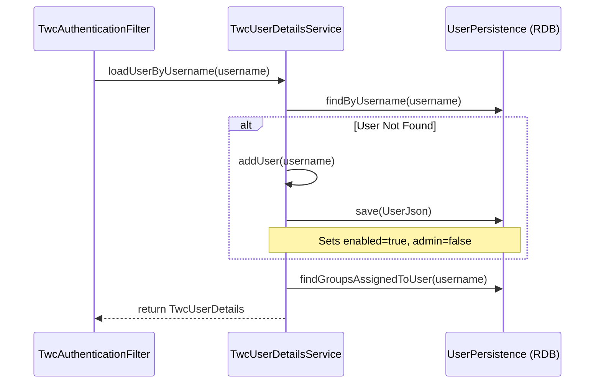
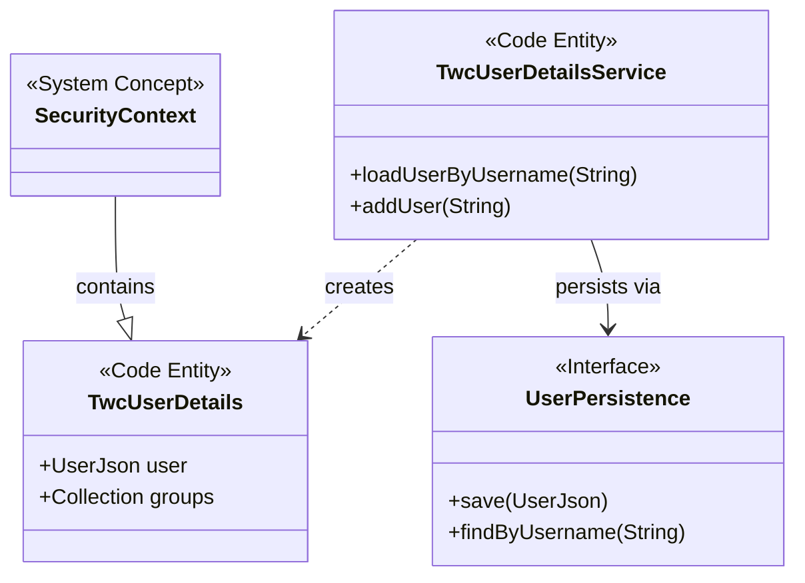

# Page: OAuth and TWC Authentication

# OAuth and TWC Authentication

Relevant source files

The following files were used as context for generating this wiki page:

- [data/src/main/java/org/openmbee/mms/data/domains/global/Base.java](data/src/main/java/org/openmbee/mms/data/domains/global/Base.java)
- [example/crud.postman_collection.json](example/crud.postman_collection.json)
- [example/permissions.postman_collection.json](example/permissions.postman_collection.json)
- [example/twc.postman_collection.json](example/twc.postman_collection.json)
- [groups/src/main/java/org/openmbee/mms/groups/controllers/LocalGroupsController.java](groups/src/main/java/org/openmbee/mms/groups/controllers/LocalGroupsController.java)
- [localuser/src/main/java/org/openmbee/mms/localuser/controllers/LocalUserController.java](localuser/src/main/java/org/openmbee/mms/localuser/controllers/LocalUserController.java)
- [localuser/src/main/java/org/openmbee/mms/localuser/security/UserCreateRequest.java](localuser/src/main/java/org/openmbee/mms/localuser/security/UserCreateRequest.java)
- [localuser/src/main/java/org/openmbee/mms/localuser/security/UserDetailsServiceImpl.java](localuser/src/main/java/org/openmbee/mms/localuser/security/UserDetailsServiceImpl.java)
- [localuser/src/main/java/org/openmbee/mms/localuser/security/UsersResponse.java](localuser/src/main/java/org/openmbee/mms/localuser/security/UsersResponse.java)
- [oauth/src/main/java/org/openmbee/mms/oauth/security/OAuthUserDetailsService.java](oauth/src/main/java/org/openmbee/mms/oauth/security/OAuthUserDetailsService.java)
- [permissions/src/main/java/org/openmbee/mms/permissions/PermissionsController.java](permissions/src/main/java/org/openmbee/mms/permissions/PermissionsController.java)
- [twc/README.rst](twc/README.rst)
- [twc/src/main/java/org/openmbee/mms/twc/maintenance/TWCMaintenanceController.java](twc/src/main/java/org/openmbee/mms/twc/maintenance/TWCMaintenanceController.java)
- [twc/src/main/java/org/openmbee/mms/twc/security/TwcUserDetailsService.java](twc/src/main/java/org/openmbee/mms/twc/security/TwcUserDetailsService.java)

This page documents the authentication and Just-In-Time (JIT) provisioning mechanisms for OAuth and Teamwork Cloud (TWC) within the MMS. These modules allow MMS to delegate authentication to external identity providers while maintaining local user records and permission mappings.

## OAuth Authentication Module

The OAuth module provides integration with OAuth2 identity providers. It focuses on loading user details and ensuring that users authenticated via OAuth have corresponding entries in the MMS database.

### OAuthUserDetailsService and JIT Provisioning
The `OAuthUserDetailsService` (similar in pattern to `TwcUserDetailsService`) is responsible for resolving identities from OAuth tokens. If a user successfully authenticates via an external OAuth provider but does not yet exist in the MMS local database, the system performs **Just-In-Time (JIT) user creation**.

Key behaviors:
1.  **Identity Resolution**: It queries `UserPersistence` to find a user by their username [twc/src/main/java/org/openmbee/mms/twc/security/TwcUserDetailsService.java:32-33]().
2.  **Automatic Creation**: If the user is missing, it invokes a creation method (e.g., `addUser`) to persist a new `UserJson` record with `enabled` set to `true` [twc/src/main/java/org/openmbee/mms/twc/security/TwcUserDetailsService.java:35-36](), [twc/src/main/java/org/openmbee/mms/twc/security/TwcUserDetailsService.java:43-50]().
3.  **Authority Mapping**: It retrieves group assignments via `UserGroupsPersistence` to build the security context [twc/src/main/java/org/openmbee/mms/twc/security/TwcUserDetailsService.java:40]().

**Sources:**
- `org.openmbee.mms.oauth.security.OAuthUserDetailsService`
- [twc/src/main/java/org/openmbee/mms/twc/security/TwcUserDetailsService.java:15-53]()

---

## Teamwork Cloud (TWC) SSO Module

The TWC module provides deep integration with NoMagic's Teamwork Cloud. It allows users to log in using TWC tickets (SSO) and enables MMS to delegate permission checks to TWC roles.

### Authentication Data Flow
The TWC authentication process involves several components working in a chain to validate external tickets.

| Component | Responsibility |
| :--- | :--- |
| `TwcAuthenticationFilter` | Intercepts requests containing TWC tickets/headers and extracts credentials. |
| `TwcAuthenticationProvider` | Communicates with the TWC REST API to validate the provided ticket. |
| `TwcUserDetailsService` | Loads or creates the local MMS user corresponding to the TWC identity [twc/src/main/java/org/openmbee/mms/twc/security/TwcUserDetailsService.java:31-41](). |
| `TwcDelegatingSecurityConfig` | Configures the Spring Security filter chain to include TWC-specific filters. |

### TWC User Details Implementation
The `TwcUserDetailsService` implements the standard Spring `UserDetailsService` interface but adds logic for persistent synchronization with TWC.

#### JIT User Creation in TWC

**Sources:**
- [twc/src/main/java/org/openmbee/mms/twc/security/TwcUserDetailsService.java:30-52]()
- [twc/README.rst:6-13]()

---

## Configuration

### TWC Instance Structure
MMS supports multiple TWC instances. Configuration is defined using an array-like structure in `application.properties`.

| Property | Description |
| :--- | :--- |
| `twc.instances[i].url` | The base URL for the TWC REST interface [twc/README.rst:19-20](). |
| `twc.instances[i].adminUsername` | Admin credentials for MMS to query TWC metadata [twc/README.rst:31-32](). |
| `twc.instances[i].roles.*` | Mapping of MMS permissions (e.g., `project_read`) to TWC roles [twc/README.rst:37-65](). |

### Project Association
To link an MMS project with a TWC resource, administrators use the maintenance endpoint:
- **Endpoint**: `POST /adm/maintenance/project/twcmetadata/{id}` [twc/src/main/java/org/openmbee/mms/twc/maintenance/TWCMaintenanceController.java:45-47]()
- **Payload**: Includes `workspaceId` and `resourceId` [example/twc.postman_collection.json:241-249]().

**Sources:**
- [twc/README.rst:14-65]()
- [twc/src/main/java/org/openmbee/mms/twc/maintenance/TWCMaintenanceController.java:18-76]()
- [example/twc.postman_collection.json:221-265]()

---

## MDK and TWC SSO Integration

For MagicDraw/Cameo (MDK) users to utilize SSO, both the MDK client and the MMS server must be configured to exchange tickets.

### MDK Configuration
Users must set the MMS Authentication Chain in Cameo:
1.  Navigate to `Options` -> `Environment` -> `MDK`.
2.  Set `MMS Authentication Chain` to include `org.openmbee.mdk.tickets.TWCAcquireTicketProcessor` at the front [twc/README.rst:10-11]().

### Security Entity Mapping
The following diagram maps the logical authentication concepts to the specific code entities implementing them in the TWC module.

**Sources:**
- [twc/README.rst:6-13]()
- [twc/src/main/java/org/openmbee/mms/twc/security/TwcUserDetailsService.java:15-30]()
- [twc/src/main/java/org/openmbee/mms/twc/security/TwcUserDetailsService.java:43-50]()
