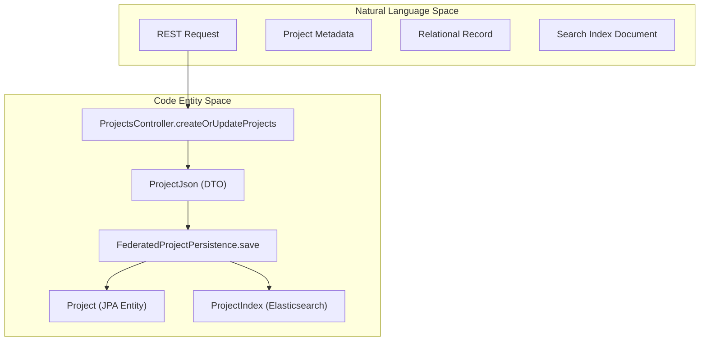
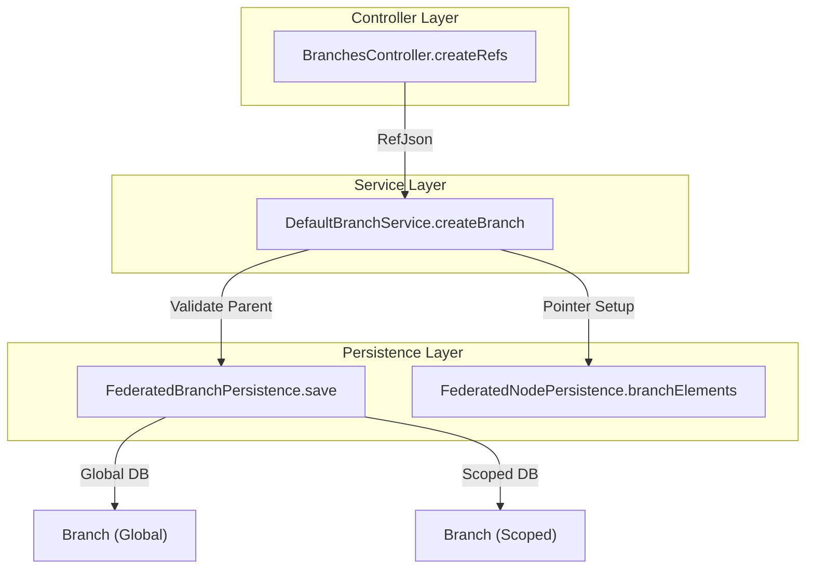

# Page: Organizations, Projects, and Refs API

# Organizations, Projects, and Refs API

Relevant source files

The following files were used as context for generating this wiki page:

- [core/src/main/java/org/openmbee/mms/core/services/BranchService.java](core/src/main/java/org/openmbee/mms/core/services/BranchService.java)
- [core/src/main/java/org/openmbee/mms/core/services/NodeChangeInfoImpl.java](core/src/main/java/org/openmbee/mms/core/services/NodeChangeInfoImpl.java)
- [core/src/main/java/org/openmbee/mms/core/services/NodeGetInfo.java](core/src/main/java/org/openmbee/mms/core/services/NodeGetInfo.java)
- [core/src/main/java/org/openmbee/mms/core/services/NodeGetInfoImpl.java](core/src/main/java/org/openmbee/mms/core/services/NodeGetInfoImpl.java)
- [crud/src/main/java/org/openmbee/mms/crud/controllers/branches/BranchesController.java](crud/src/main/java/org/openmbee/mms/crud/controllers/branches/BranchesController.java)
- [crud/src/main/java/org/openmbee/mms/crud/controllers/orgs/OrgsController.java](crud/src/main/java/org/openmbee/mms/crud/controllers/orgs/OrgsController.java)
- [crud/src/main/java/org/openmbee/mms/crud/controllers/projects/ProjectsController.java](crud/src/main/java/org/openmbee/mms/crud/controllers/projects/ProjectsController.java)
- [crud/src/main/java/org/openmbee/mms/crud/domain/NodeGetDomain.java](crud/src/main/java/org/openmbee/mms/crud/domain/NodeGetDomain.java)
- [crud/src/main/java/org/openmbee/mms/crud/services/DefaultBranchService.java](crud/src/main/java/org/openmbee/mms/crud/services/DefaultBranchService.java)
- [data/src/main/java/org/openmbee/mms/data/dao/ProjectDAO.java](data/src/main/java/org/openmbee/mms/data/dao/ProjectDAO.java)
- [example/crud.postman_collection.json](example/crud.postman_collection.json)
- [example/makeBranchFromCommit.postman_collection.json](example/makeBranchFromCommit.postman_collection.json)
- [example/permissions.postman_collection.json](example/permissions.postman_collection.json)
- [example/twc.postman_collection.json](example/twc.postman_collection.json)
- [federatedpersistence/src/main/java/org/openmbee/mms/federatedpersistence/dao/FederatedBranchPersistence.java](federatedpersistence/src/main/java/org/openmbee/mms/federatedpersistence/dao/FederatedBranchPersistence.java)
- [federatedpersistence/src/main/java/org/openmbee/mms/federatedpersistence/dao/FederatedProjectPersistence.java](federatedpersistence/src/main/java/org/openmbee/mms/federatedpersistence/dao/FederatedProjectPersistence.java)
- [federatedpersistence/src/main/java/org/openmbee/mms/federatedpersistence/domain/FederatedNodeGetDomain.java](federatedpersistence/src/main/java/org/openmbee/mms/federatedpersistence/domain/FederatedNodeGetDomain.java)

This page documents the REST API and underlying service implementation for managing the top-level hierarchy of the MMS: Organizations, Projects, and Refs (Branches). These entities provide the structural containers for version-controlled elements.

## 1. Organizations API (`/orgs`)

Organizations are the highest level of grouping in MMS. The `OrgsController` handles CRUD operations for organizations.

### Implementation Details
*   **Persistence**: Organizations are stored in the global database schema.
*   **Permissions**: Creating an organization typically requires administrative privileges.
*   **Data Flow**: Requests use `OrgsRequest` and return `OrgsResponse` containing `OrgJson` objects.

**Sources:** [crud/src/main/java/org/openmbee/mms/crud/controllers/orgs/OrgsController.java](), [example/crud.postman_collection.json:65-105]()

---

## 2. Projects API (`/projects`)

Projects are contained within Organizations and define the boundary for a specific set of model data. Each project is associated with a specific schema (e.g., `default`, `cameo`, `jupyter`).

### Project Creation and Schema Selection
When a project is created via `POST /projects`, the system:
1.  Validates the `projectId` against the pattern `^[\\w-]+$` [crud/src/main/java/org/openmbee/mms/crud/controllers/projects/ProjectsController.java:32-32]().
2.  Checks if the specified `projectType` (schema) exists in `ProjectSchemas` [crud/src/main/java/org/openmbee/mms/crud/controllers/projects/ProjectsController.java:121-125]().
3.  Uses `GenericServiceFactory` to resolve the appropriate `ProjectService` for that schema [crud/src/main/java/org/openmbee/mms/crud/controllers/projects/ProjectsController.java:132-132]().
4.  Initializes project permissions and creates the underlying database schema/search indices [crud/src/main/java/org/openmbee/mms/crud/controllers/projects/ProjectsController.java:141-141]().

### Soft vs. Hard Delete
*   **Soft Delete**: The project is marked as deleted (`_deleted: true`). It remains in the database but is filtered out of standard GET results [federatedpersistence/src/main/java/org/openmbee/mms/federatedpersistence/dao/FederatedProjectPersistence.java:136-159]().
*   **Hard Delete**: Handled by `ProjectDeleteService`, this involves dropping the project's relational schema and deleting its Elasticsearch indices [federatedpersistence/src/main/java/org/openmbee/mms/federatedpersistence/dao/FederatedProjectPersistence.java:98-115]().

### Data Flow: Project Creation
The following diagram illustrates the flow from the REST controller to the persistence layer.

**Project Entity Mapping**

**Sources:** [crud/src/main/java/org/openmbee/mms/crud/controllers/projects/ProjectsController.java:87-141](), [federatedpersistence/src/main/java/org/openmbee/mms/federatedpersistence/dao/FederatedProjectPersistence.java:162-190]()

---

## 3. Refs/Branches API (`/projects/{id}/refs`)

Refs (Branches) provide isolated versioning environments within a project. The `master` branch is created automatically upon project initialization.

### Branch Creation Logic
Branches can be created from a specific `commitId` or a `parentRefId`. If neither is provided, the system defaults to branching from the latest commit of the `master` branch [crud/src/main/java/org/openmbee/mms/crud/services/DefaultBranchService.java:104-107]().

1.  **Parent Resolution**: The service finds the parent branch and the specific commit to branch from [crud/src/main/java/org/openmbee/mms/crud/services/DefaultBranchService.java:95-123]().
2.  **Element Branching**: `nodePersistence.branchElements` is called to create the new branch pointers. In federated persistence, this is a "lazy" copy that doesn't duplicate element data but establishes the branch's starting point [crud/src/main/java/org/openmbee/mms/crud/services/DefaultBranchService.java:128-128]().
3.  **Status Tracking**: The branch status transitions from `CREATING` to `CREATED` [crud/src/main/java/org/openmbee/mms/crud/services/DefaultBranchService.java:85-129]().

### Branch Protection Rules
*   **Master Protection**: The `master` branch cannot be deleted. Any attempt to delete it via `DELETE /projects/{id}/refs/master` results in a `400 BadRequestException` [crud/src/main/java/org/openmbee/mms/crud/services/DefaultBranchService.java:159-161]().
*   **Immutability of Origin**: Once a branch is created, its `parentRefId` and `parentCommitId` cannot be changed [crud/src/main/java/org/openmbee/mms/crud/controllers/branches/BranchesController.java:100-103]().

### Data Flow: Branch Creation

**Sources:** [crud/src/main/java/org/openmbee/mms/crud/controllers/branches/BranchesController.java:77-123](), [crud/src/main/java/org/openmbee/mms/crud/services/DefaultBranchService.java:78-140](), [federatedpersistence/src/main/java/org/openmbee/mms/federatedpersistence/dao/FederatedBranchPersistence.java:45-100]()

---

## 4. API Summary Table

| Endpoint | Method | Description | Permission Required |
| :--- | :--- | :--- | :--- |
| `/orgs` | `GET` | List all organizations | `isAuthenticated()` |
| `/orgs` | `POST` | Create or update organizations | `ADMIN` |
| `/projects` | `GET` | List all projects (optionally filter by `orgId`) | `PROJECT_READ` |
| `/projects` | `POST` | Create or update projects | `ORG_CREATE_PROJECT` |
| `/projects/{id}` | `DELETE` | Soft delete a project | `PROJECT_DELETE` |
| `/projects/{id}/refs` | `GET` | List all branches in a project | `PROJECT_READ` |
| `/projects/{id}/refs` | `POST` | Create a new branch | `PROJECT_CREATE_BRANCH` |
| `/projects/{id}/refs/{refId}` | `DELETE` | Delete a branch (except `master`) | `BRANCH_DELETE` |

**Sources:** [crud/src/main/java/org/openmbee/mms/crud/controllers/projects/ProjectsController.java:47-150](), [crud/src/main/java/org/openmbee/mms/crud/controllers/branches/BranchesController.java:39-130](), [example/crud.postman_collection.json]()
