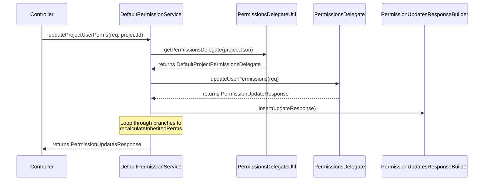

# Page: Permission Service and Delegates

# Permission Service and Delegates

<details>
<summary>Relevant source files</summary>

The following files were used as context for generating this wiki page:

- [core/src/main/java/org/openmbee/mms/core/builders/PermissionUpdatesResponseBuilder.java](core/src/main/java/org/openmbee/mms/core/builders/PermissionUpdatesResponseBuilder.java)
- [core/src/main/java/org/openmbee/mms/core/services/DefaultPermissionService.java](core/src/main/java/org/openmbee/mms/core/services/DefaultPermissionService.java)
- [data/src/main/java/org/openmbee/mms/data/domains/global/Privilege.java](data/src/main/java/org/openmbee/mms/data/domains/global/Privilege.java)
- [federatedpersistence/src/main/java/org/openmbee/mms/federatedpersistence/permissions/AbstractDefaultPermissionsDelegate.java](federatedpersistence/src/main/java/org/openmbee/mms/federatedpersistence/permissions/AbstractDefaultPermissionsDelegate.java)
- [federatedpersistence/src/main/java/org/openmbee/mms/federatedpersistence/permissions/DefaultBranchPermissionsDelegate.java](federatedpersistence/src/main/java/org/openmbee/mms/federatedpersistence/permissions/DefaultBranchPermissionsDelegate.java)
- [federatedpersistence/src/main/java/org/openmbee/mms/federatedpersistence/permissions/DefaultFederatedPermissionsDelegateFactory.java](federatedpersistence/src/main/java/org/openmbee/mms/federatedpersistence/permissions/DefaultFederatedPermissionsDelegateFactory.java)
- [federatedpersistence/src/main/java/org/openmbee/mms/federatedpersistence/permissions/DefaultOrgPermissionsDelegate.java](federatedpersistence/src/main/java/org/openmbee/mms/federatedpersistence/permissions/DefaultOrgPermissionsDelegate.java)
- [federatedpersistence/src/main/java/org/openmbee/mms/federatedpersistence/permissions/DefaultProjectPermissionsDelegate.java](federatedpersistence/src/main/java/org/openmbee/mms/federatedpersistence/permissions/DefaultProjectPermissionsDelegate.java)
- [federatedpersistence/src/main/java/org/openmbee/mms/federatedpersistence/permissions/FederatedPermissionUpdatesResponseBuilder.java](federatedpersistence/src/main/java/org/openmbee/mms/federatedpersistence/permissions/FederatedPermissionUpdatesResponseBuilder.java)

</details>


The MMS permission system is built on a hierarchical model (Organization → Project → Branch) that supports role-based access control (RBAC) and permission inheritance. This page documents the core service and the delegate pattern used to decouple permission logic from specific persistence implementations.

## Architecture Overview

The permission system uses a delegate pattern to allow different modules (like the `federatedpersistence` module or the `twc` module) to provide their own logic for checking and updating permissions. The `DefaultPermissionService` acts as the primary orchestrator, coordinating with the `PermissionsDelegateFactory` to obtain the correct delegate for a given resource.

### Code Entity Mapping

The following diagram bridges the natural language concepts of the permission system to the specific classes and interfaces in the codebase.

**Permission System Entity Map**
```mermaid
graph TD
    subgraph "Service Layer"
        DPS["DefaultPermissionService"]
    end

    subgraph "Delegation Pattern"
        PDF["PermissionsDelegateFactory"]
        PD["PermissionsDelegate (Interface)"]
        DOPD["DefaultOrgPermissionsDelegate"]
        DPPD["DefaultProjectPermissionsDelegate"]
        DBPD["DefaultBranchPermissionsDelegate"]
    end

    subgraph "Response Building"
        PURB["PermissionUpdatesResponseBuilder"]
        FPURB["FederatedPermissionUpdatesResponseBuilder"]
    end

    DPS -->|"uses"| PDF
    PDF -->|"creates"| PD
    PD <|-- DOPD
    PD <|-- DPPD
    PD <|-- DBPD
    DPS -->|"uses"| PURB
    PURB <|-- FPURB
```
**Sources:** [core/src/main/java/org/openmbee/mms/core/services/DefaultPermissionService.java:28-41](), [federatedpersistence/src/main/java/org/openmbee/mms/federatedpersistence/permissions/DefaultFederatedPermissionsDelegateFactory.java:21-47](), [core/src/main/java/org/openmbee/mms/core/builders/PermissionUpdatesResponseBuilder.java:6-11]()

---

## DefaultPermissionService

`DefaultPermissionService` is the implementation of the `PermissionService` interface. It handles the high-level logic for initializing permissions when resources are created and updating permissions via REST endpoints.

### Key Responsibilities
- **Initialization**: Sets up initial admin permissions for the creator of an Org, Project, or Branch.
- **Propagation**: When organization-level permissions are updated, it triggers a recalculation of inherited permissions for all child projects.
- **Abstraction**: Uses `PermissionsDelegateUtil` to resolve the appropriate delegate for the resource type (Org, Project, or Ref).

### Data Flow: Updating Permissions
When a permission update request arrives (e.g., via `/projects/{id}/permissions`), the service follows this flow:

**Permission Update Sequence**

**Sources:** [core/src/main/java/org/openmbee/mms/core/services/DefaultPermissionService.java:120-132](), [core/src/main/java/org/openmbee/mms/core/services/DefaultPermissionService.java:58-86]()

---

## Permissions Delegates

Delegates are resource-specific components that interact directly with the database (RDB) to check or modify `Privilege`, `Role`, and `User`/`Group` associations.

### Hierarchy and Inheritance
Delegates are scoped to a specific instance of a resource (e.g., a specific `Branch` entity).

| Delegate Class | Scope | Supported Actions |
| :--- | :--- | :--- |
| `DefaultOrgPermissionsDelegate` | `Organization` | User/Group Perms, Public toggle. **No Inheritance**. |
| `DefaultProjectPermissionsDelegate` | `Project` | User/Group Perms, Public toggle, Inheritance toggle. |
| `DefaultBranchPermissionsDelegate` | `Branch` | User/Group Perms, Inheritance toggle. |

### Implementation Details
- **Permission Checking**: `hasPermission(String user, Set<String> groups, String privilege)` checks if a user or any of their groups possess a role that contains the requested privilege. [federatedpersistence/src/main/java/org/openmbee/mms/federatedpersistence/permissions/DefaultBranchPermissionsDelegate.java:75-90]()
- **Inheritance Logic**: Projects and Branches can set an `inherit` flag. If true, permissions from the parent (Org for Project, Project for Branch) are considered during access checks. [federatedpersistence/src/main/java/org/openmbee/mms/federatedpersistence/permissions/DefaultProjectPermissionsDelegate.java:122-129]()

**Sources:** [federatedpersistence/src/main/java/org/openmbee/mms/federatedpersistence/permissions/DefaultOrgPermissionsDelegate.java:31-40](), [federatedpersistence/src/main/java/org/openmbee/mms/federatedpersistence/permissions/DefaultProjectPermissionsDelegate.java:28-40](), [federatedpersistence/src/main/java/org/openmbee/mms/federatedpersistence/permissions/DefaultBranchPermissionsDelegate.java:35-46]()

---

## PermissionsDelegateFactory

The `DefaultFederatedPermissionsDelegateFactory` is responsible for instantiating the correct delegate. It retrieves the underlying JPA entity (e.g., `org.openmbee.mms.data.domains.global.Project`) from the database and uses the Spring `ApplicationContext` to create a prototype-scoped delegate bean.

- **Project Delegate**: `getPermissionsDelegate(ProjectJson project)` [federatedpersistence/src/main/java/org/openmbee/mms/federatedpersistence/permissions/DefaultFederatedPermissionsDelegateFactory.java:49-57]()
- **Org Delegate**: `getPermissionsDelegate(OrgJson organization)` [federatedpersistence/src/main/java/org/openmbee/mms/federatedpersistence/permissions/DefaultFederatedPermissionsDelegateFactory.java:60-66]()
- **Branch Delegate**: `getPermissionsDelegate(RefJson branch)` [federatedpersistence/src/main/java/org/openmbee/mms/federatedpersistence/permissions/DefaultFederatedPermissionsDelegateFactory.java:69-76]()

---

## Response Builders

Updating permissions can affect multiple users and groups across hierarchical levels. The `PermissionUpdatesResponseBuilder` and its subclass `FederatedPermissionUpdatesResponseBuilder` provide a fluent API to collect these changes into a single `PermissionUpdatesResponse`.

### Key Functions
- `insertUsers(PermissionUpdateResponse)`: Adds user-level changes to the response. [core/src/main/java/org/openmbee/mms/core/builders/PermissionUpdatesResponseBuilder.java:31-34]()
- `insertGroups(PermissionUpdateResponse)`: Adds group-level changes to the response. [core/src/main/java/org/openmbee/mms/core/builders/PermissionUpdatesResponseBuilder.java:36-39]()
- `getPermissionUpdatesReponse()`: Finalizes the object for JSON serialization. [core/src/main/java/org/openmbee/mms/core/builders/PermissionUpdatesResponseBuilder.java:41-48]()

**Sources:** [core/src/main/java/org/openmbee/mms/core/builders/PermissionUpdatesResponseBuilder.java:6-11](), [federatedpersistence/src/main/java/org/openmbee/mms/federatedpersistence/permissions/FederatedPermissionUpdatesResponseBuilder.java:7-11]()

---

## REST Endpoints

The following endpoints are serviced by the `DefaultPermissionService` via their respective controllers:

| Endpoint | Method | Description |
| :--- | :--- | :--- |
| `/orgs/{id}/permissions` | `POST` | Update user or group roles for an organization. |
| `/projects/{id}/permissions` | `POST` | Update user or group roles for a project. |
| `/projects/{pid}/refs/{rid}/permissions` | `POST` | Update user or group roles for a specific branch. |

### Data Flow for Requests
1. Request arrives at the Controller with a `PermissionUpdateRequest`.
2. Controller calls the corresponding method in `DefaultPermissionService`.
3. Service identifies the resource and obtains a `PermissionsDelegate`.
4. Delegate performs RDB operations (e.g., `orgUserPermRepo.save(perm)`).
5. Results are aggregated and returned as `PermissionUpdatesResponse`.

**Sources:** [core/src/main/java/org/openmbee/mms/core/services/DefaultPermissionService.java:89-157](), [federatedpersistence/src/main/java/org/openmbee/mms/federatedpersistence/permissions/DefaultOrgPermissionsDelegate.java:134-163]()
