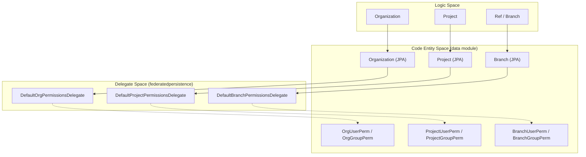
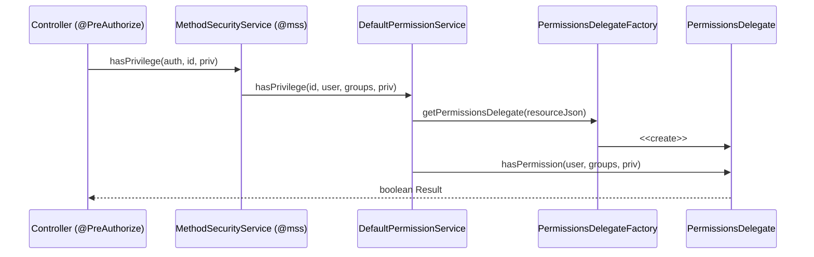

# Page: Permissions and Authorization

# Permissions and Authorization

Relevant source files

The following files were used as context for generating this wiki page:

- [core/src/main/java/org/openmbee/mms/core/builders/PermissionUpdatesResponseBuilder.java](core/src/main/java/org/openmbee/mms/core/builders/PermissionUpdatesResponseBuilder.java)
- [core/src/main/java/org/openmbee/mms/core/services/DefaultPermissionService.java](core/src/main/java/org/openmbee/mms/core/services/DefaultPermissionService.java)
- [data/src/main/java/org/openmbee/mms/data/domains/global/Privilege.java](data/src/main/java/org/openmbee/mms/data/domains/global/Privilege.java)
- [federatedpersistence/src/main/java/org/openmbee/mms/federatedpersistence/permissions/DefaultBranchPermissionsDelegate.java](federatedpersistence/src/main/java/org/openmbee/mms/federatedpersistence/permissions/DefaultBranchPermissionsDelegate.java)
- [federatedpersistence/src/main/java/org/openmbee/mms/federatedpersistence/permissions/DefaultFederatedPermissionsDelegateFactory.java](federatedpersistence/src/main/java/org/openmbee/mms/federatedpersistence/permissions/DefaultFederatedPermissionsDelegateFactory.java)
- [federatedpersistence/src/main/java/org/openmbee/mms/federatedpersistence/permissions/DefaultOrgPermissionsDelegate.java](federatedpersistence/src/main/java/org/openmbee/mms/federatedpersistence/permissions/DefaultOrgPermissionsDelegate.java)
- [federatedpersistence/src/main/java/org/openmbee/mms/federatedpersistence/permissions/DefaultProjectPermissionsDelegate.java](federatedpersistence/src/main/java/org/openmbee/mms/federatedpersistence/permissions/DefaultProjectPermissionsDelegate.java)
- [federatedpersistence/src/main/java/org/openmbee/mms/federatedpersistence/permissions/FederatedPermissionUpdatesResponseBuilder.java](federatedpersistence/src/main/java/org/openmbee/mms/federatedpersistence/permissions/FederatedPermissionUpdatesResponseBuilder.java)
- [permissions/permissions.gradle](permissions/permissions.gradle)

The MMS employs a robust, three-level hierarchical permission model designed to secure resources at the Organization, Project, and Ref (Branch) levels. Access control is managed through a Role-Based Access Control (RBAC) system where roles are associated with specific privileges. Security is enforced globally via the `MethodSecurityService` (aliased as `@mss` in Spring Security expressions), ensuring that every API endpoint validates the requester's identity and authority.

## Hierarchical Permission Model

Permissions in MMS follow the structural hierarchy of the data model. This allows for fine-grained control where access can be granted broadly at an organization level or restricted to a specific branch.

*   **Organization (Org):** The top-level container. Permissions here typically grant administrative or broad viewing access across all contained projects.
*   **Project:** Mid-level container. Permissions can be inherited from the Org or defined explicitly.
*   **Ref (Branch):** The most granular level. Permissions control access to specific versioned branches (e.g., `master`) and can inherit from the Project level.

### Permission Inheritance
Projects and Refs support an `inherit` flag. When enabled, the system recalculates effective permissions by traversing up the hierarchy. Organizations do not support inheritance as they are the root nodes [federatedpersistence/src/main/java/org/openmbee/mms/federatedpersistence/permissions/DefaultOrgPermissionsDelegate.java:95-97]().

### Code Space Mapping: Hierarchy to Entities
The following diagram maps the logical hierarchy to the JPA entities and delegates responsible for managing them.

**Permission Entity Mapping**

**Sources:** [data/src/main/java/org/openmbee/mms/data/domains/global/Privilege.java:1-38](), [federatedpersistence/src/main/java/org/openmbee/mms/federatedpersistence/permissions/DefaultBranchPermissionsDelegate.java:35-46](), [federatedpersistence/src/main/java/org/openmbee/mms/federatedpersistence/permissions/DefaultProjectPermissionsDelegate.java:28-40](), [federatedpersistence/src/main/java/org/openmbee/mms/federatedpersistence/permissions/DefaultOrgPermissionsDelegate.java:31-41]().

## Role-Based Access Control (RBAC)

MMS uses `Role` and `Privilege` entities to define what a user can do. 

| Role | Description | Typical Privileges |
| :--- | :--- | :--- |
| **ADMIN** | Full control over the resource and its permissions. | `ORG_EDIT`, `PROJECT_DELETE`, `BRANCH_EDIT_PERMS` |
| **WRITER** | Can modify data (elements, commits) but not metadata/perms. | `PROJECT_EDIT`, `BRANCH_WRITE`, `NODE_EDIT` |
| **READER** | Read-only access to the resource. | `ORG_READ`, `PROJECT_READ`, `BRANCH_READ` |

Privileges are mapped to Roles in a many-to-many relationship [data/src/main/java/org/openmbee/mms/data/domains/global/Privilege.java:13-14](). When a permission check is performed, the system looks for any role assigned to the user (or their groups) that contains the required privilege [federatedpersistence/src/main/java/org/openmbee/mms/federatedpersistence/permissions/DefaultBranchPermissionsDelegate.java:75-89]().

**Sources:** [data/src/main/java/org/openmbee/mms/data/domains/global/Privilege.java:1-38](), [federatedpersistence/src/main/java/org/openmbee/mms/federatedpersistence/permissions/DefaultBranchPermissionsDelegate.java:75-89]().

## Authorization Enforcement (@mss)

Authorization is enforced at the service and controller layer using Spring Security's `@PreAuthorize` annotation. The MMS provides a custom bean named `MethodSecurityService` (aliased as `mss`) to handle these checks dynamically.

Typical usage in a controller:
`@PreAuthorize("@mss.hasProjectPrivilege(authentication, #projectId, 'PROJECT_READ', true)")`

The `MethodSecurityService` coordinates with the `PermissionService` and `PermissionsDelegateFactory` to determine if the current `Authentication` object (user and groups) possesses the required privilege for the specific resource ID.

**Sources:** [core/src/main/java/org/openmbee/mms/core/services/DefaultPermissionService.java:28-36](), [federatedpersistence/src/main/java/org/openmbee/mms/federatedpersistence/permissions/DefaultFederatedPermissionsDelegateFactory.java:21-26]().

## Permission Components and Delegation

The system uses a delegate pattern to allow different persistence or integration modules (like TWC) to provide their own logic for permission validation.

### Permission Service and Delegates
The `DefaultPermissionService` acts as the primary entry point for permission CRUD operations. It uses a `PermissionsDelegateFactory` to instantiate the appropriate delegate (Org, Project, or Branch) based on the resource being accessed. 

For details, see [Permission Service and Delegates](#6.1).

### TWC Permission Delegation
When Teamwork Cloud (TWC) integration is enabled, the default delegates are overridden. In this mode, MMS roles are validated against TWC role mappings, allowing TWC to act as the authoritative source for permissions.

For details, see [TWC Permission Delegation](#6.2).

**Permissions Flow Diagram**

**Sources:** [core/src/main/java/org/openmbee/mms/core/services/DefaultPermissionService.java:58-86](), [federatedpersistence/src/main/java/org/openmbee/mms/federatedpersistence/permissions/DefaultFederatedPermissionsDelegateFactory.java:48-77]().
