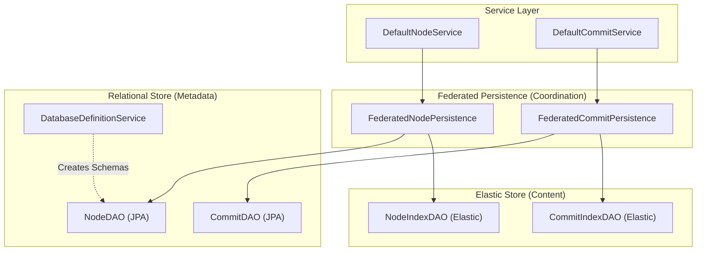
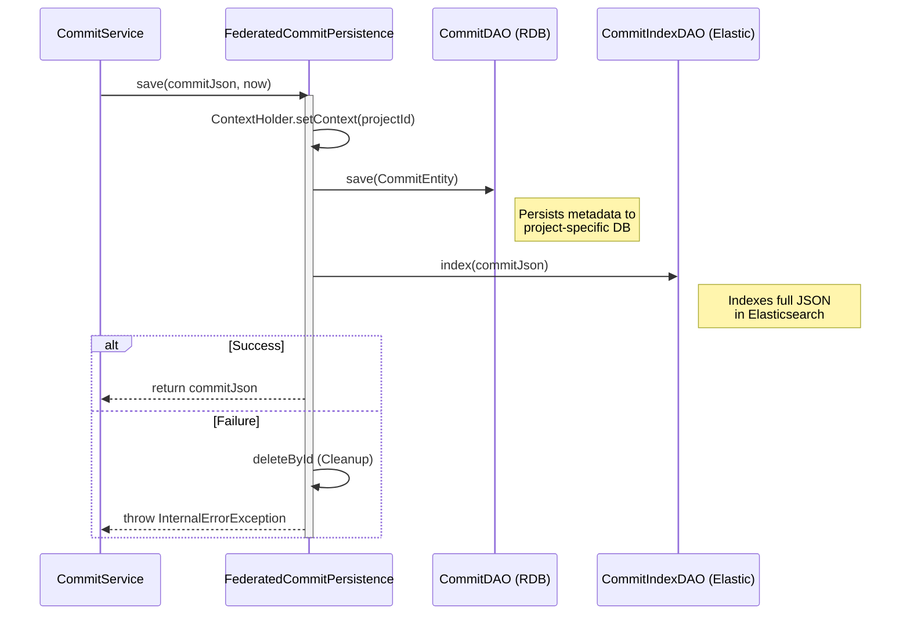

# Page: Persistence Layer

# Persistence Layer

Relevant source files

The following files were used as context for generating this wiki page:

- [authenticator/src/main/java/org/openmbee/mms/authenticator/security/JwtTokenGenerator.java](authenticator/src/main/java/org/openmbee/mms/authenticator/security/JwtTokenGenerator.java)
- [cameo/src/main/java/org/openmbee/mms/cameo/services/CameoCommitService.java](cameo/src/main/java/org/openmbee/mms/cameo/services/CameoCommitService.java)
- [cameo/src/main/java/org/openmbee/mms/cameo/services/CameoNodeService.java](cameo/src/main/java/org/openmbee/mms/cameo/services/CameoNodeService.java)
- [core/src/main/java/org/openmbee/mms/core/config/Constants.java](core/src/main/java/org/openmbee/mms/core/config/Constants.java)
- [core/src/main/java/org/openmbee/mms/core/dao/CommitPersistence.java](core/src/main/java/org/openmbee/mms/core/dao/CommitPersistence.java)
- [core/src/main/java/org/openmbee/mms/core/exceptions/MMSException.java](core/src/main/java/org/openmbee/mms/core/exceptions/MMSException.java)
- [core/src/main/java/org/openmbee/mms/core/objects/ElementsCommitResponse.java](core/src/main/java/org/openmbee/mms/core/objects/ElementsCommitResponse.java)
- [core/src/main/java/org/openmbee/mms/core/services/NodeService.java](core/src/main/java/org/openmbee/mms/core/services/NodeService.java)
- [core/src/main/java/org/openmbee/mms/core/services/TokenService.java](core/src/main/java/org/openmbee/mms/core/services/TokenService.java)
- [crud/src/main/java/org/openmbee/mms/crud/config/OptimizationConfig.java](crud/src/main/java/org/openmbee/mms/crud/config/OptimizationConfig.java)
- [crud/src/main/java/org/openmbee/mms/crud/controllers/BaseController.java](crud/src/main/java/org/openmbee/mms/crud/controllers/BaseController.java)
- [crud/src/main/java/org/openmbee/mms/crud/services/DefaultCommitService.java](crud/src/main/java/org/openmbee/mms/crud/services/DefaultCommitService.java)
- [elastic/src/main/java/org/openmbee/mms/elastic/BaseElasticDAOImpl.java](elastic/src/main/java/org/openmbee/mms/elastic/BaseElasticDAOImpl.java)
- [elastic/src/main/java/org/openmbee/mms/elastic/BranchElasticDAOImpl.java](elastic/src/main/java/org/openmbee/mms/elastic/BranchElasticDAOImpl.java)
- [elastic/src/main/java/org/openmbee/mms/elastic/NodeElasticDAOImpl.java](elastic/src/main/java/org/openmbee/mms/elastic/NodeElasticDAOImpl.java)
- [elastic/src/main/java/org/openmbee/mms/elastic/ProjectElasticImpl.java](elastic/src/main/java/org/openmbee/mms/elastic/ProjectElasticImpl.java)
- [elastic/src/main/java/org/openmbee/mms/elastic/utils/BulkProcessor.java](elastic/src/main/java/org/openmbee/mms/elastic/utils/BulkProcessor.java)
- [example/elastic.postman_collection.json](example/elastic.postman_collection.json)
- [federatedpersistence/src/main/java/org/openmbee/mms/federatedpersistence/dao/FederatedCommitPersistence.java](federatedpersistence/src/main/java/org/openmbee/mms/federatedpersistence/dao/FederatedCommitPersistence.java)
- [federatedpersistence/src/main/java/org/openmbee/mms/federatedpersistence/dao/FederatedNodePersistence.java](federatedpersistence/src/main/java/org/openmbee/mms/federatedpersistence/dao/FederatedNodePersistence.java)
- [rdb/src/main/java/org/openmbee/mms/rdb/config/DatabaseDefinitionService.java](rdb/src/main/java/org/openmbee/mms/rdb/config/DatabaseDefinitionService.java)
- [rdb/src/main/java/org/openmbee/mms/rdb/config/PersistenceJPAConfig.java](rdb/src/main/java/org/openmbee/mms/rdb/config/PersistenceJPAConfig.java)
- [rdb/src/main/java/org/openmbee/mms/rdb/config/SuffixedPhysicalNamingStrategy.java](rdb/src/main/java/org/openmbee/mms/rdb/config/SuffixedPhysicalNamingStrategy.java)
- [rdb/src/main/java/org/openmbee/mms/rdb/repositories/BaseDAOImpl.java](rdb/src/main/java/org/openmbee/mms/rdb/repositories/BaseDAOImpl.java)
- [twc/src/main/java/org/openmbee/mms/twc/config/TwcConfig.java](twc/src/main/java/org/openmbee/mms/twc/config/TwcConfig.java)
- [twc/src/main/java/org/openmbee/mms/twc/services/TwcRevisionMmsCommitMapService.java](twc/src/main/java/org/openmbee/mms/twc/services/TwcRevisionMmsCommitMapService.java)

The MMS Persistence Layer implements a **dual-store strategy** designed to balance the transactional requirements of version control with the high-performance retrieval needs of large-scale model data. It separates structural metadata and versioning logic (stored in a Relational Database) from the actual element content and search indexes (stored in Elasticsearch).

This architecture is orchestrated by the `federatedpersistence` module, which ensures atomicity across both backends during write operations.

## Architecture Overview

MMS uses a federated approach to data management. When a change is submitted, the system coordinates a "dual-write" process:
1.  **Relational Database (RDB):** Stores the "pointer" to the data. This includes branch structures, commit history metadata, and node existence/type information.
2.  **Elasticsearch:** Stores the full JSON content of elements and the detailed change-set of every commit.

### Data Flow Diagram
The following diagram illustrates how the persistence layer bridges the high-level service requests to specific code entities in the RDB and Elastic modules.

**Persistence Federated Bridge**

**Sources:** [federatedpersistence/src/main/java/org/openmbee/mms/federatedpersistence/dao/FederatedNodePersistence.java:40-67](), [federatedpersistence/src/main/java/org/openmbee/mms/federatedpersistence/dao/FederatedCommitPersistence.java:25-37]()

---

## Federated Persistence Architecture

The `federatedpersistence` module is the core coordinator. It implements the `NodePersistence` and `CommitPersistence` interfaces, providing a unified API to the `crud` module while delegating to specific DAO implementations for RDB and Elasticsearch.

### Key Components:
*   **`FederatedNodePersistence`**: Manages the lifecycle of elements. It uses a multi-step pipeline (`prepareChange`, `prepareAddsUpdates`, `commitChanges`) to ensure that metadata in the RDB and content in Elasticsearch remain synchronized. [federatedpersistence/src/main/java/org/openmbee/mms/federatedpersistence/dao/FederatedNodePersistence.java:79-98]()
*   **`FederatedCommitPersistence`**: Handles the creation of commit records. It performs a dual-write to the `CommitDAO` (RDB) and `CommitIndexDAO` (Elastic). If one fails, it attempts to clean up the other to prevent orphaned records. [federatedpersistence/src/main/java/org/openmbee/mms/federatedpersistence/dao/FederatedCommitPersistence.java:40-64]()
*   **`ContextHolder`**: A thread-local utility used to switch database schemas and Elasticsearch indexes based on the `projectId` and `refId` of the current request. [federatedpersistence/src/main/java/org/openmbee/mms/federatedpersistence/dao/FederatedCommitPersistence.java:41-41]()

For details, see [Federated Persistence Architecture](#4.1).

---

## Relational Database (RDB)

The `rdb` module provides the transactional backbone for MMS. It uses **Spring Data JPA** and **Hibernate** to manage relational entities. 

### Multi-Tenancy Strategy
MMS employs a "Database-per-Project" and "Table-per-Branch" strategy:
*   **Project Isolation**: Each project is given its own physical database schema, created dynamically via the `DatabaseDefinitionService`. [rdb/src/main/java/org/openmbee/mms/rdb/config/DatabaseDefinitionService.java:60-88]()
*   **Branch Isolation**: Within a project database, each branch (Ref) has its own set of `nodes` tables (e.g., `nodes`, `nodes_branch123`). This allows for rapid branching via SQL `INSERT INTO ... SELECT` operations without data duplication across the entire system. [rdb/src/main/java/org/openmbee/mms/rdb/config/DatabaseDefinitionService.java:163-178]()

### Key Entities:
*   **`Node`**: Tracks the existence of an element on a specific branch, its type, and whether it is deleted.
*   **`Commit`**: Stores the timestamp, creator, and comment for every change-set. [federatedpersistence/src/main/java/org/openmbee/mms/federatedpersistence/dao/FederatedCommitPersistence.java:42-48]()
*   **`Branch`**: Defines the branch hierarchy and parentage.

For details, see [Relational Database (rdb module)](#4.2).

---

## Elasticsearch Integration

The `elastic` module handles the storage of large JSON blobs and provides advanced search capabilities. Unlike the RDB, which stores structural metadata, Elasticsearch stores the `ElementJson` objects in their entirety.

### Implementation Details:
*   **`BaseElasticDAOImpl`**: A generic base class providing common Elasticsearch operations like `index`, `findById`, and `bulk` processing using the `RestHighLevelClient`. [elastic/src/main/java/org/openmbee/mms/elastic/BaseElasticDAOImpl.java:37-54]()
*   **`NodeElasticDAOImpl`**: Specialized for element storage. It manages the `_inRefIds` field, which tracks which branches a specific version of an element is visible on, allowing for efficient point-in-time reads. [elastic/src/main/java/org/openmbee/mms/elastic/NodeElasticDAOImpl.java:89-100]()
*   **`BulkProcessor`**: A utility to batch multiple index/update requests into a single network call to improve throughput during large commits. [elastic/src/main/java/org/openmbee/mms/elastic/utils/BulkProcessor.java:13-24]()

### Indexing Strategy
MMS uses several standard indexes:
*   `node`: Stores all versions of all elements.
*   `commit`: Stores the detailed change-set (added/updated/deleted IDs) for every commit.

For details, see [Elasticsearch Integration (elastic module)](#4.3).

---

## Backend Interaction Diagram

The following diagram demonstrates how a single commit operation interacts with both backends through the Federated layer.

**Commit Save Sequence**

**Sources:** [federatedpersistence/src/main/java/org/openmbee/mms/federatedpersistence/dao/FederatedCommitPersistence.java:40-64](), [crud/src/main/java/org/openmbee/mms/crud/services/DefaultCommitService.java:22-33]()
