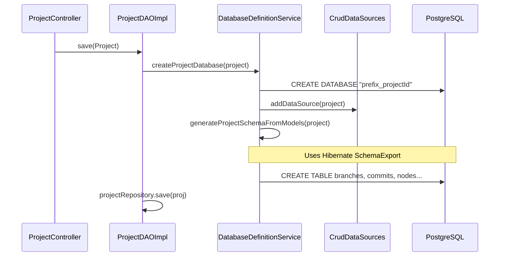
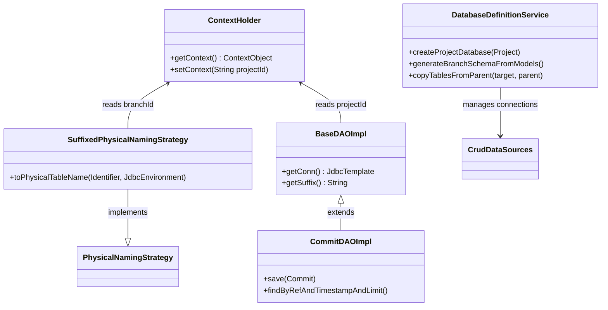

# Page: Relational Database (rdb module)

# Relational Database (rdb module)

Relevant source files

The following files were used as context for generating this wiki page:

- [authenticator/src/main/java/org/openmbee/mms/authenticator/security/JwtTokenGenerator.java](authenticator/src/main/java/org/openmbee/mms/authenticator/security/JwtTokenGenerator.java)
- [core/src/main/java/org/openmbee/mms/core/config/Constants.java](core/src/main/java/org/openmbee/mms/core/config/Constants.java)
- [core/src/main/java/org/openmbee/mms/core/objects/ElementsCommitResponse.java](core/src/main/java/org/openmbee/mms/core/objects/ElementsCommitResponse.java)
- [core/src/main/java/org/openmbee/mms/core/services/NodeService.java](core/src/main/java/org/openmbee/mms/core/services/NodeService.java)
- [core/src/main/java/org/openmbee/mms/core/services/TokenService.java](core/src/main/java/org/openmbee/mms/core/services/TokenService.java)
- [crud/src/main/java/org/openmbee/mms/crud/controllers/BaseController.java](crud/src/main/java/org/openmbee/mms/crud/controllers/BaseController.java)
- [rdb/src/main/java/org/openmbee/mms/rdb/config/DatabaseDefinitionService.java](rdb/src/main/java/org/openmbee/mms/rdb/config/DatabaseDefinitionService.java)
- [rdb/src/main/java/org/openmbee/mms/rdb/config/PersistenceJPAConfig.java](rdb/src/main/java/org/openmbee/mms/rdb/config/PersistenceJPAConfig.java)
- [rdb/src/main/java/org/openmbee/mms/rdb/config/SuffixedPhysicalNamingStrategy.java](rdb/src/main/java/org/openmbee/mms/rdb/config/SuffixedPhysicalNamingStrategy.java)
- [rdb/src/main/java/org/openmbee/mms/rdb/repositories/BaseDAOImpl.java](rdb/src/main/java/org/openmbee/mms/rdb/repositories/BaseDAOImpl.java)
- [rdb/src/main/java/org/openmbee/mms/rdb/repositories/ProjectDAOImpl.java](rdb/src/main/java/org/openmbee/mms/rdb/repositories/ProjectDAOImpl.java)
- [rdb/src/main/java/org/openmbee/mms/rdb/repositories/ProjectRepository.java](rdb/src/main/java/org/openmbee/mms/rdb/repositories/ProjectRepository.java)
- [rdb/src/main/java/org/openmbee/mms/rdb/repositories/commit/CommitDAOImpl.java](rdb/src/main/java/org/openmbee/mms/rdb/repositories/commit/CommitDAOImpl.java)
- [twc/src/main/java/org/openmbee/mms/twc/config/TwcConfig.java](twc/src/main/java/org/openmbee/mms/twc/config/TwcConfig.java)

The `rdb` module provides the relational persistence implementation for the Model Management System. It manages a dual-schema architecture: a global schema for system-wide metadata (Organizations, Projects, Users) and per-project databases for versioned data (Nodes, Commits, Branches). It handles multi-tenant routing, dynamic schema generation, and branch-level table isolation.

## Database Management Strategy

MMS uses a multi-tenant approach where each project resides in its own physical database. Within each project database, branching is implemented by suffixing table names, allowing multiple branches to coexist within the same relational schema while maintaining physical isolation of node data.

### DatabaseDefinitionService
The `DatabaseDefinitionService` is the primary orchestrator for DDL operations. It handles the creation of project databases and the initialization of tables within those databases using Hibernate's `SchemaExport`.

**Key Operations:**
*   **Project Creation:** When a new project is created, `createProjectDatabase(Project project)` is called. It executes a `CREATE DATABASE` command and then uses `generateProjectSchemaFromModels` to initialize the base tables (`branches`, `commits`, `nodes`, `node_types`) [rdb/src/main/java/org/openmbee/mms/rdb/config/DatabaseDefinitionService.java:60-88]().
*   **Branching:** When a new branch is created, `createBranch()` is invoked. This triggers `generateBranchSchemaFromModels()`, which creates a new `nodes` table with a unique suffix (e.g., `nodes_refid`) [rdb/src/main/java/org/openmbee/mms/rdb/config/DatabaseDefinitionService.java:115-161]().
*   **Table Copying:** If a branch is created from a parent branch (and not a specific commit), `copyTablesFromParent` executes an `INSERT INTO ... SELECT * FROM` SQL command to perform a fast, server-side copy of the parent's node state into the new branch's table [rdb/src/main/java/org/openmbee/mms/rdb/config/DatabaseDefinitionService.java:163-185]().

### Multi-Tenant Routing
MMS routes requests to the correct project database using the `ContextHolder`, which stores the current project and branch IDs in a `ThreadLocal` variable.

*   **CrudDataSources:** Manages the mapping of project IDs to `DataSource` objects. It dynamically adds new data sources as projects are accessed [rdb/src/main/java/org/openmbee/mms/rdb/config/DatabaseDefinitionService.java:123-125]().
*   **SuffixedPhysicalNamingStrategy:** This Hibernate strategy intercepts table name resolution. It retrieves the current `refId` from the `ContextHolder` and appends it to the base table name (e.g., transforming `nodes` to `nodes_master`). This ensures that JPA queries are directed to the correct branch-specific table [rdb/src/main/java/org/openmbee/mms/rdb/config/SuffixedPhysicalNamingStrategy.java:33-46]().

### Data Flow: Project and Branch Initialization

The following diagram illustrates how the system transitions from a project creation request to a physically provisioned database and branch tables.

**Database Provisioning Flow**

Sources: [rdb/src/main/java/org/openmbee/mms/rdb/repositories/ProjectDAOImpl.java:51-61](), [rdb/src/main/java/org/openmbee/mms/rdb/config/DatabaseDefinitionService.java:60-88]()

## Repository Layer Implementation

The `rdb` module implements the persistence interfaces defined in the `data` module. Most repositories extend `BaseDAOImpl` to gain access to the dynamic `JdbcTemplate` and branch suffix logic.

### BaseDAOImpl
Provides utility methods for repositories to interact with the database in a multi-tenant aware fashion.
*   `getConn()`: Returns a `JdbcTemplate` configured for the current project's `DataSource` based on the `ContextHolder` [rdb/src/main/java/org/openmbee/mms/rdb/repositories/BaseDAOImpl.java:35-37]().
*   `getSuffix()`: Generates the table suffix for the current branch [rdb/src/main/java/org/openmbee/mms/rdb/repositories/BaseDAOImpl.java:39-46]().

### CommitDAOImpl
Handles the storage and retrieval of commit metadata. It implements complex logic for traversing the commit history across branch points.
*   **Saving Commits:** Uses `GeneratedKeyHolder` to retrieve the auto-incremented primary key after insertion [rdb/src/main/java/org/openmbee/mms/rdb/repositories/commit/CommitDAOImpl.java:36-61]().
*   **History Traversal:** The `findByRefAndTimestampAndLimit` method implements a recursive-style search. If a commit isn't found in the current branch's history, it follows the `parentRefId` and `parentCommit` pointers to search up the branch hierarchy [rdb/src/main/java/org/openmbee/mms/rdb/repositories/commit/CommitDAOImpl.java:148-171]().

### ProjectDAOImpl
Wraps the standard Spring Data `ProjectRepository` with additional logic for physical database lifecycle management.
*   **Save:** Before saving the project entity to the global schema, it ensures the project-specific database is created [rdb/src/main/java/org/openmbee/mms/rdb/repositories/ProjectDAOImpl.java:51-61]().
*   **Delete:** Orchestrates the removal of the project entity and the physical `DROP DATABASE` command (including terminating active connections in PostgreSQL) [rdb/src/main/java/org/openmbee/mms/rdb/repositories/ProjectDAOImpl.java:64-78](), [rdb/src/main/java/org/openmbee/mms/rdb/config/DatabaseDefinitionService.java:90-104]().

## Code Entity Mapping

The following diagram maps the logical persistence concepts to the specific classes and methods within the `rdb` module.

**Persistence Entity Mapping**

Sources: [rdb/src/main/java/org/openmbee/mms/rdb/config/SuffixedPhysicalNamingStrategy.java:33-37](), [rdb/src/main/java/org/openmbee/mms/rdb/repositories/BaseDAOImpl.java:35-46](), [rdb/src/main/java/org/openmbee/mms/rdb/config/DatabaseDefinitionService.java:122-144]()

## Configuration

The `PersistenceJPAConfig` class sets up the primary JPA infrastructure.

*   **Default Entity Manager:** Configured to scan `org.openmbee.mms.data.domains.global` (for shared data) and `org.openmbee.mms.rdb.repositories` [rdb/src/main/java/org/openmbee/mms/rdb/config/PersistenceJPAConfig.java:48-62]().
*   **Transaction Management:** Uses `JpaTransactionManager` as the primary transaction coordinator [rdb/src/main/java/org/openmbee/mms/rdb/config/PersistenceJPAConfig.java:83-88]().
*   **Hibernate Properties:** Configures the dialect (defaulting to PostgreSQL) and DDL auto-update settings from the application environment [rdb/src/main/java/org/openmbee/mms/rdb/config/PersistenceJPAConfig.java:95-107]().

Sources:
* `rdb/src/main/java/org/openmbee/mms/rdb/config/DatabaseDefinitionService.java`
* `rdb/src/main/java/org/openmbee/mms/rdb/config/SuffixedPhysicalNamingStrategy.java`
* `rdb/src/main/java/org/openmbee/mms/rdb/config/PersistenceJPAConfig.java`
* `rdb/src/main/java/org/openmbee/mms/rdb/repositories/BaseDAOImpl.java`
* `rdb/src/main/java/org/openmbee/mms/rdb/repositories/ProjectDAOImpl.java`
* `rdb/src/main/java/org/openmbee/mms/rdb/repositories/commit/CommitDAOImpl.java`
* `core/src/main/java/org/openmbee/mms/core/config/Constants.java`
