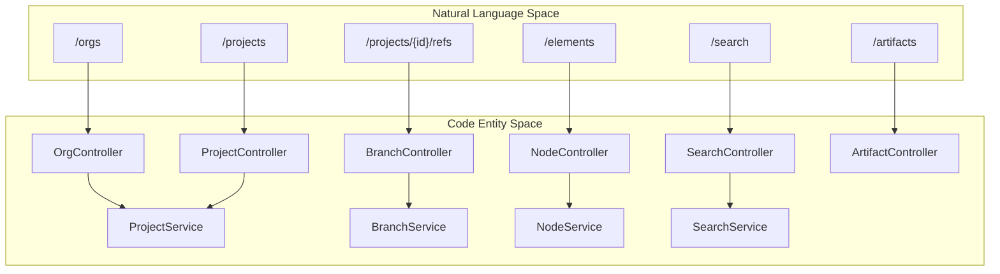
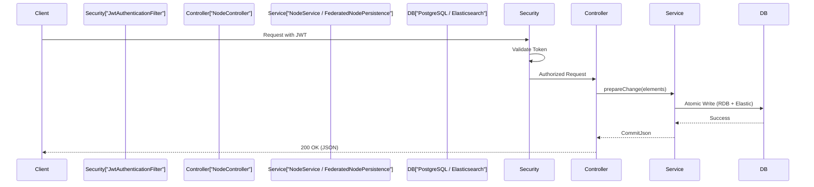

# Page: REST API Layer

# REST API Layer

Relevant source files

The following files were used as context for generating this wiki page:

- [docker-compose.yml](docker-compose.yml)
- [example/crud.postman_collection.json](example/crud.postman_collection.json)
- [example/permissions.postman_collection.json](example/permissions.postman_collection.json)
- [example/twc.postman_collection.json](example/twc.postman_collection.json)

The MMS REST API provides a unified interface for interacting with version-controlled model data. It is built using Spring Boot and exposes endpoints for managing organizations, projects, branches (refs), and the elements contained within them. The API supports bulk operations, point-in-time reads via commit IDs, and multi-tenant data isolation.

The complete OpenAPI specification is available at `/v3/swagger-ui.html` when the application is running.

### API Entry Points and Controllers

The API is organized into several controllers that delegate business logic to core services.

#### System Entry Point to Code Entity Mapping
The following diagram maps high-level REST resource paths to their corresponding Spring `@RestController` implementations and primary service interfaces.

"REST Resource Mapping"

Sources: [example/crud.postman_collection.json:95-102](), [example/crud.postman_collection.json:182-189](), [example/crud.postman_collection.json:341-352]()

---

### Major Resource Groups

#### Organizations, Projects, and Refs API
This group handles the top-level hierarchy of MMS. Organizations act as containers for projects, while projects define the schema (e.g., `default`, `cameo`) and house multiple branches (refs). The `master` branch is created by default upon project initialization.

For details, see [Organizations, Projects, and Refs API](#3.1).

#### Elements API
The Elements API is the core of MMS data manipulation. It supports CRUD operations on model elements. Key features include:
*   **Bulk Operations**: POST/PUT endpoints accept arrays of elements for atomic commits [example/crud.postman_collection.json:341-352]().
*   **Versioning**: Elements are versioned; reads can specify a `commitId` to retrieve data as it existed at a specific point in time.
*   **NDJSON**: Supports streaming large datasets using Newline Delimited JSON.

For details, see [Elements API](#3.2).

#### Commits and History API
Every change in MMS is recorded as a `Commit`. This API allows users to browse the history of a branch or a specific element, and inspect the `added`, `updated`, and `deleted` arrays within a commit object.

For details, see [Commits and History API](#3.3).

#### Search API
The Search API leverages Elasticsearch to provide powerful querying capabilities across model elements. It supports basic field searches, complex boolean queries, and scroll-based pagination for large result sets.

For details, see [Search API](#3.4).

#### Artifacts API
Elements in MMS can have associated binary files (e.g., images, PDFs). The Artifacts API manages the upload and retrieval of these binaries, typically backed by S3 or MinIO storage.

For details, see [Artifacts API](#3.5).

#### Views, Mounts, and Notebooks API
This API supports domain-specific modeling concepts such as Document/View hierarchies and Jupyter Notebooks. It also handles "Mounts," which allow elements in one project to reference or "use" elements from another project.

For details, see [Views, Mounts, and Notebooks API](#3.6).

#### Webhooks and Groups API
Provides administrative endpoints for managing internal user groups and registering webhooks that trigger on commit events to notify external systems.

For details, see [Webhooks and Groups API](#3.7).

---

### Request Flow and Security
Every API request passes through a security filter chain that validates JWT tokens or Basic Auth credentials. Permissions are checked at the Org, Project, or Ref level using the `@mss` (Method Security Service) expression before the controller logic is executed.

"Request to Persistence Flow"

Sources: [docker-compose.yml:30-41](), [example/permissions.postman_collection.json:9-32](), [example/crud.postman_collection.json:531-542]()
