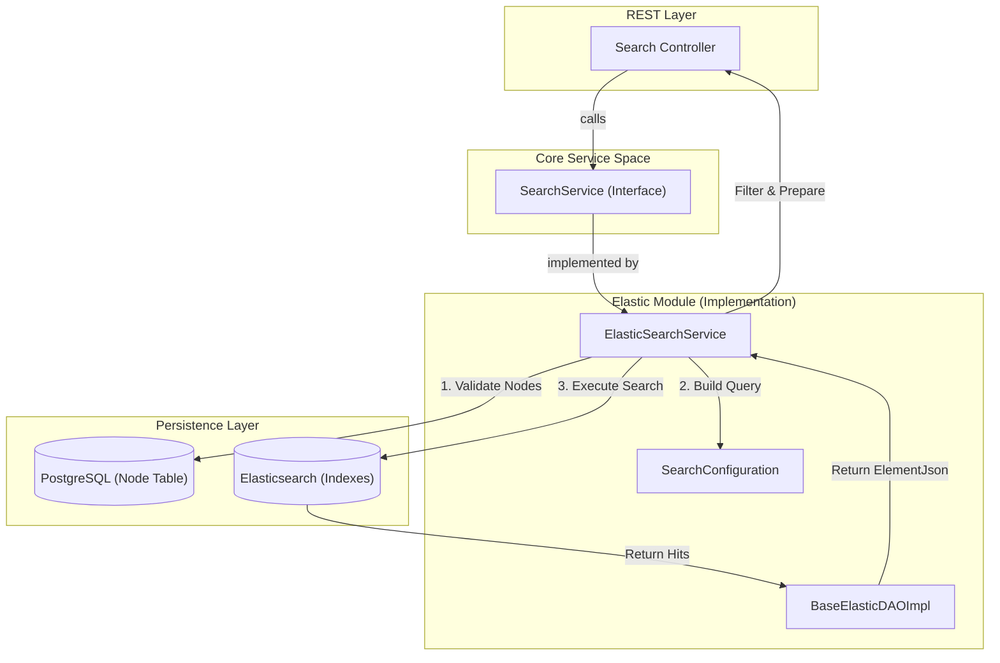
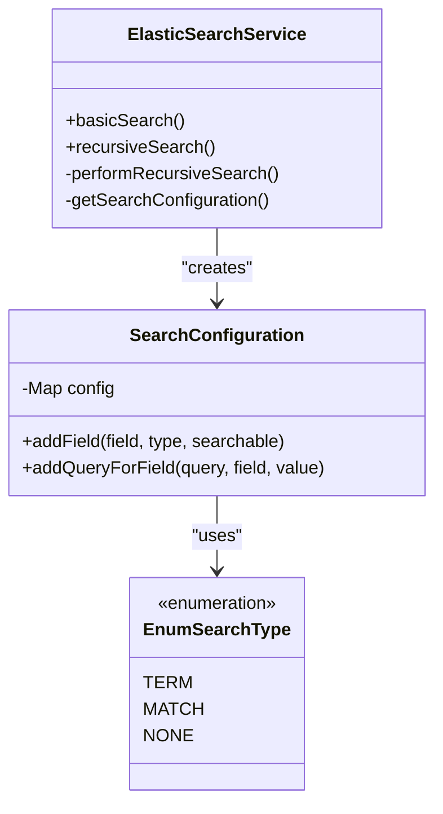

# Page: Search API

# Search API

Relevant source files

The following files were used as context for generating this wiki page:

- [elastic/src/main/java/org/openmbee/mms/elastic/services/ElasticSearchService.java](elastic/src/main/java/org/openmbee/mms/elastic/services/ElasticSearchService.java)
- [elastic/src/main/java/org/openmbee/mms/elastic/services/SearchConfiguration.java](elastic/src/main/java/org/openmbee/mms/elastic/services/SearchConfiguration.java)
- [example/jupyter.postman_collection.json](example/jupyter.postman_collection.json)
- [example/search.postman_collection.json](example/search.postman_collection.json)
- [gradle/wrapper/gradle-wrapper.jar](gradle/wrapper/gradle-wrapper.jar)
- [gradle/wrapper/gradle-wrapper.properties](gradle/wrapper/gradle-wrapper.properties)
- [gradlew](gradlew)
- [gradlew.bat](gradlew.bat)
- [search/search.gradle](search/search.gradle)
- [twc/src/main/java/org/openmbee/mms/twc/config/TwcAuthSecurityConfig.java](twc/src/main/java/org/openmbee/mms/twc/config/TwcAuthSecurityConfig.java)

The Search API provides powerful querying capabilities over element data stored in Elasticsearch. It supports basic key-value filtering via GET requests and advanced recursive tree searches via POST requests. The search implementation is decoupled from the core logic through the `SearchService` interface, with the primary implementation residing in the `elastic` module.

## Search Endpoints

The Search API is scoped to a specific project and reference (branch).

| Method | Endpoint | Description |
|:---|:---|:---|
| `GET` | `/projects/{projectId}/refs/{refId}/search` | Basic search using URL query parameters. |
| `POST` | `/projects/{projectId}/refs/{refId}/search` | Advanced search using a JSON body for recursion and pagination. |

### Basic Search (GET)
The GET endpoint accepts arbitrary query parameters that correspond to fields in the element JSON. For example, `?name=RequirementA` will filter elements where the `name` field matches "RequirementA" [example/search.postman_collection.json:213-229]().

### Advanced Search (POST)
The POST endpoint allows for complex queries, including recursive parent/child traversal. The request body typically follows the `BasicSearchRequest` structure (implied by usage) containing `params` and `recurse` maps [example/search.postman_collection.json:262-263]().

## Data Flow: From API to Elasticsearch

The search flow bridges the REST layer, the internal Service layer, and the Elasticsearch backend.

### Search Execution Diagram
This diagram illustrates how a search request moves from the `SearchService` into the `ElasticSearchService` and interacts with both the Relational Database (for node validation) and Elasticsearch (for content indexing).

Title: Search Request Flow

Sources: [elastic/src/main/java/org/openmbee/mms/elastic/services/ElasticSearchService.java:43-123](), [elastic/src/main/java/org/openmbee/mms/elastic/services/SearchConfiguration.java:12-37]()

## ElasticSearchService Implementation

The `ElasticSearchService` implements `SearchService` and handles the heavy lifting of translating MMS search logic into Elasticsearch queries [elastic/src/main/java/org/openmbee/mms/elastic/services/ElasticSearchService.java:43]().

### Key Functions
- **`basicSearch`**: Entry point for simple parameter-based searches [elastic/src/main/java/org/openmbee/mms/elastic/services/ElasticSearchService.java:77-83]().
- **`recursiveSearch`**: Orchestrates the search process, including setting the `ContextHolder` for multi-tenancy and fetching valid nodes from the `nodeRepository` to ensure only current elements are returned [elastic/src/main/java/org/openmbee/mms/elastic/services/ElasticSearchService.java:86-123]().
- **`performRecursiveSearch`**: A private method that executes iterative searches. It uses the results of one search to populate the parameters of the next based on the `recurse` mapping (e.g., searching for all elements where `ownerId` matches the `id` of the previous results) [elastic/src/main/java/org/openmbee/mms/elastic/services/ElasticSearchService.java:125-144]().
- **`getSearchConfiguration`**: Dynamically queries Elasticsearch using `FieldCapabilitiesRequest` to determine if a field is searchable and what its data type is (e.g., `text` vs `keyword`) [elastic/src/main/java/org/openmbee/mms/elastic/services/ElasticSearchService.java:146-166]().

### Field Capabilities and Query Building
MMS does not assume the schema of the elements. It uses `SearchConfiguration` to adapt the query type based on the Elasticsearch mapping of the field:
- **TERM Query**: Used for non-text fields (keywords, IDs) [elastic/src/main/java/org/openmbee/mms/elastic/services/SearchConfiguration.java:34-36]().
- **MATCH Query**: Used for `text` type fields to allow full-text search [elastic/src/main/java/org/openmbee/mms/elastic/services/SearchConfiguration.java:30-32]().

Title: Query Translation Logic

Sources: [elastic/src/main/java/org/openmbee/mms/elastic/services/ElasticSearchService.java:146-166](), [elastic/src/main/java/org/openmbee/mms/elastic/services/SearchConfiguration.java:18-37]()

## Scroll-based Pagination

For large result sets, the Search API utilizes Elasticsearch's scroll API to maintain a cursor.

- **Result Limit**: Configured via `elasticsearch.limit.result` [elastic/src/main/java/org/openmbee/mms/elastic/services/ElasticSearchService.java:46-47]().
- **Scroll Timeout**: Configured via `elasticsearch.limit.scrollTimeout` [elastic/src/main/java/org/openmbee/mms/elastic/services/ElasticSearchService.java:48-49]().
- **Cleanup**: An `ActionListener<ClearScrollResponse>` is implemented to handle freeing resources on the Elasticsearch cluster once the scroll is completed or fails [elastic/src/main/java/org/openmbee/mms/elastic/services/ElasticSearchService.java:53-64]().

## Search Configuration Properties

The behavior of the Search API is tuned via `application.properties`:

| Property | Description |
|:---|:---|
| `elasticsearch.limit.result` | The maximum number of hits returned in a single search page. |
| `elasticsearch.limit.scrollTimeout` | How long (in milliseconds) the scroll context is kept alive. |

Sources: [elastic/src/main/java/org/openmbee/mms/elastic/services/ElasticSearchService.java:46-50]()
