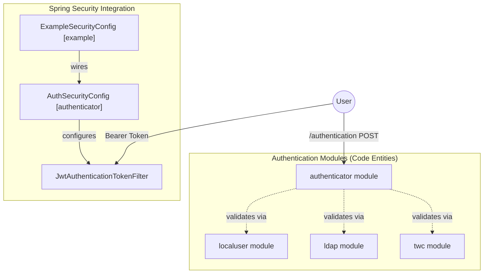

# Page: Security and Authentication

# Security and Authentication

Relevant source files

The following files were used as context for generating this wiki page:

- [authenticator/src/main/resources/application.properties.example](authenticator/src/main/resources/application.properties.example)
- [example/src/main/java/org/openmbee/mms/example/config/ExampleSecurityConfig.java](example/src/main/java/org/openmbee/mms/example/config/ExampleSecurityConfig.java)
- [rdb/src/main/java/org/openmbee/mms/rdb/repositories/BranchGroupPermRepository.java](rdb/src/main/java/org/openmbee/mms/rdb/repositories/BranchGroupPermRepository.java)
- [rdb/src/main/java/org/openmbee/mms/rdb/repositories/BranchRepository.java](rdb/src/main/java/org/openmbee/mms/rdb/repositories/BranchRepository.java)
- [rdb/src/main/java/org/openmbee/mms/rdb/repositories/BranchUserPermRepository.java](rdb/src/main/java/org/openmbee/mms/rdb/repositories/BranchUserPermRepository.java)
- [rdb/src/main/java/org/openmbee/mms/rdb/repositories/ProjectGroupPermRepository.java](rdb/src/main/java/org/openmbee/mms/rdb/repositories/ProjectGroupPermRepository.java)
- [rdb/src/main/java/org/openmbee/mms/rdb/repositories/ProjectUserPermRepository.java](rdb/src/main/java/org/openmbee/mms/rdb/repositories/ProjectUserPermRepository.java)

The Model Management System (MMS) employs a pluggable and modular security architecture designed to support diverse enterprise environments. At its core, MMS uses a stateless session model based on JSON Web Tokens (JWT). The system decouples the authentication mechanism (how a user proves who they are) from the authorization framework (what a user is allowed to do), allowing multiple identity providers to coexist or be toggled via configuration.

### Pluggable Authentication Architecture

MMS is composed of several security-related modules that integrate into the Spring Security filter chain. The `ExampleSecurityConfig` class in the example application serves as the primary entry point for wiring these security modules together, enabling global method security and configuring Cross-Origin Resource Sharing (CORS).

**Authentication Flow Overview**
1.  **Identity Providers:** Users can authenticate via Local DB, LDAP/Active Directory, OAuth2, or Teamwork Cloud (TWC).
2.  **Token Issuance:** Upon successful authentication, the `authenticator` module issues a JWT.
3.  **Stateless Validation:** Subsequent requests carry the JWT in the `Authorization: Bearer <token>` header, validated by the `JwtAuthenticationTokenFilter`.
4.  **Authorization:** The `MethodSecurityService` (accessed via the `@mss` expression) evaluates permissions against the Org/Project/Ref hierarchy.

#### Security System Component Mapping

**Sources:**
*   [example/src/main/java/org/openmbee/mms/example/config/ExampleSecurityConfig.java:28-47]()
*   [example/src/main/java/org/openmbee/mms/example/config/ExampleSecurityConfig.java:11-13]()

---

### Identity Provider Modules

MMS supports several authentication backends. Each is contained within its own module and can be enabled or disabled based on the application's classpath and properties.

#### JWT Authentication (authenticator)
The foundation of MMS's stateless security. It handles the generation, signing, and validation of tokens. It defines the `/authentication` endpoint for exchanging credentials for tokens and the `/token/validate` endpoint for verification.
*   **Key Entities:** `JwtTokenGenerator`, `JwtAuthenticationProvider`, `AuthSecurityConfig`.
*   **Configuration:** `jwt.secret` and `jwt.expiration` in `application.properties`.
*   **For details, see [JWT Authentication (authenticator module)](#5.1)**

#### Local User Management (localuser)
Provides a standard relational database-backed user store. It includes endpoints for user registration and management, utilizing the `User` entity in the global schema.
*   **Key Entities:** `LocalUserController`, `UserDetailsServiceImpl`, `LocalUserSecurityConfig`.
*   **For details, see [Local User Management (localuser module)](#5.2)**

#### LDAP Authentication (ldap)
Enables integration with enterprise directory services like Active Directory. It supports Just-In-Time (JIT) user provisioning, where MMS user records are created or updated upon successful LDAP login.
*   **Key Entities:** `LdapSecurityConfig`, `CustomLdapAuthoritiesPopulator`.
*   **For details, see [LDAP Authentication (ldap module)](#5.3)**

#### OAuth and TWC Authentication
Supports modern OAuth2 flows and specialized Single Sign-On (SSO) for Teamwork Cloud (TWC). The TWC integration is unique as it allows MMS to delegate or synchronize permissions based on TWC's internal project roles.
*   **Key Entities:** `OAuthUserDetailsService`, `TwcAuthenticationFilter`, `TwcAuthenticationProvider`.
*   **For details, see [OAuth and TWC Authentication](#5.4)**

**Sources:**
*   [authenticator/src/main/resources/application.properties.example:1-2]()
*   [example/src/main/java/org/openmbee/mms/example/config/ExampleSecurityConfig.java:38-46]()

---

### Authorization and Method Security

Authorization in MMS is enforced at the method level using Spring Security's `@PreAuthorize` annotations. Most controller methods use a custom SpEL (Spring Expression Language) bean named `mss` (MethodSecurityService).

This service checks the user's roles and privileges against the requested resource. Permissions are stored in the relational database and queried via specialized repositories that handle the hierarchy of Organizations, Projects, and Branches (Refs).

**Permission Repository Layer**
The following repositories are used by the security services to resolve access rights:

| Repository | Purpose |
| :--- | :--- |
| `ProjectUserPermRepository` | Maps users to roles at the Project level. |
| `ProjectGroupPermRepository` | Maps user groups to roles at the Project level. |
| `BranchUserPermRepository` | Maps users to roles at the Branch/Ref level. |
| `BranchGroupPermRepository` | Maps user groups to roles at the Branch/Ref level. |

**Sources:**
*   [rdb/src/main/java/org/openmbee/mms/rdb/repositories/ProjectUserPermRepository.java:15-34]()
*   [rdb/src/main/java/org/openmbee/mms/rdb/repositories/BranchUserPermRepository.java:15-30]()
*   [rdb/src/main/java/org/openmbee/mms/rdb/repositories/ProjectGroupPermRepository.java:15-35]()
*   [rdb/src/main/java/org/openmbee/mms/rdb/repositories/BranchGroupPermRepository.java:15-31]()

---

### CORS and Web Configuration

MMS provides fine-grained control over Cross-Origin Resource Sharing (CORS) to support web-based clients (like the MMS View Editor). Configuration is handled in `ExampleSecurityConfig`, allowing administrators to define `cors.allowed.origins` via environment variables or properties.

**CORS Implementation Details:**
*   **Methods Allowed:** `GET`, `POST`, `PUT`, `DELETE`, `OPTIONS`, `PATCH`.
*   **Headers Allowed:** `Origin`, `Content-Type`, `Accept`, `Authorization`.
*   **Credential Support:** Enabled to allow browser-based clients to send authentication headers.

**Sources:**
*   [example/src/main/java/org/openmbee/mms/example/config/ExampleSecurityConfig.java:63-94]()
*   [example/src/main/java/org/openmbee/mms/example/config/ExampleSecurityConfig.java:35-36]()
