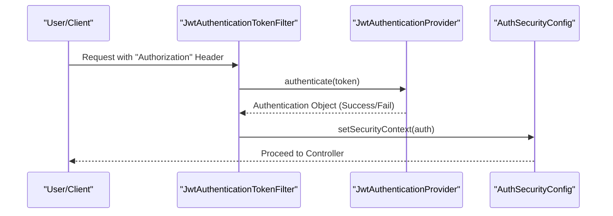
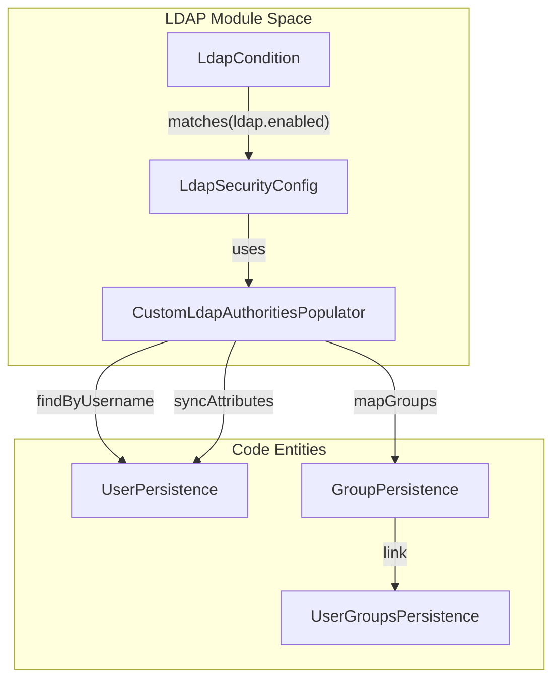
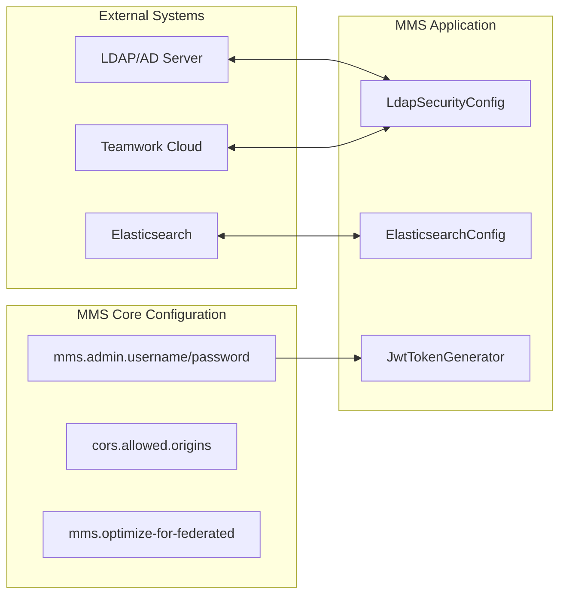

# Page: Security and Integration Configuration

# Security and Integration Configuration

Relevant source files

The following files were used as context for generating this wiki page:

- [authenticator/src/main/java/org/openmbee/mms/authenticator/config/AuthSecurityConfig.java](authenticator/src/main/java/org/openmbee/mms/authenticator/config/AuthSecurityConfig.java)
- [elastic/src/main/java/org/openmbee/mms/elastic/config/ElasticsearchConfig.java](elastic/src/main/java/org/openmbee/mms/elastic/config/ElasticsearchConfig.java)
- [elastic/src/main/resources/application.properties.example](elastic/src/main/resources/application.properties.example)
- [example/src/main/resources/application-test.properties](example/src/main/resources/application-test.properties)
- [example/src/main/resources/application.properties.example](example/src/main/resources/application.properties.example)
- [ldap/src/main/java/org/openmbee/mms/ldap/LdapCondition.java](ldap/src/main/java/org/openmbee/mms/ldap/LdapCondition.java)
- [ldap/src/main/java/org/openmbee/mms/ldap/LdapSecurityConfig.java](ldap/src/main/java/org/openmbee/mms/ldap/LdapSecurityConfig.java)
- [ldap/src/main/resources/application.properties.example](ldap/src/main/resources/application.properties.example)
- [rdb/src/main/java/org/openmbee/mms/rdb/repositories/UserRepository.java](rdb/src/main/java/org/openmbee/mms/rdb/repositories/UserRepository.java)

This page provides a detailed technical reference for the security and integration settings of the Model Management System (MMS). It covers the configuration of JSON Web Tokens (JWT), Lightweight Directory Access Protocol (LDAP) integration, Teamwork Cloud (TWC) instances, and global application flags like the federated optimization toggle.

## JWT and Authentication Configuration

MMS uses JWT for stateless authentication. The `authenticator` module handles token generation and validation.

### Key Properties
The following properties in `application.properties` control the JWT lifecycle:
*   `jwt.secret`: The signing key for the tokens. Must be a long, secure string [example/src/main/resources/application.properties.example:11-11]().
*   `jwt.expiration`: Token validity period in seconds (e.g., `86400` for 24 hours) [example/src/main/resources/application.properties.example:12-12]().
*   `jwt.header`: The HTTP header used to pass the token, typically `Authorization` [example/src/main/resources/application.properties.example:13-13]().

### Implementation Flow
The `AuthSecurityConfig` class configures the Spring Security filter chain to use `JwtAuthenticationTokenFilter` [authenticator/src/main/java/org/openmbee/mms/authenticator/config/AuthSecurityConfig.java:31-31](). This filter intercepts requests to validate tokens before they reach the controllers.

**Authentication Flow Diagram**

Sources: [authenticator/src/main/java/org/openmbee/mms/authenticator/config/AuthSecurityConfig.java:17-38](), [example/src/main/resources/application.properties.example:11-13]()

---

## LDAP Integration

The `ldap` module provides support for both standard LDAP and Active Directory (AD). It is conditionally activated via the `ldap.enabled` property [ldap/src/main/java/org/openmbee/mms/ldap/LdapCondition.java:12-12]().

### LDAP and Active Directory Configuration
MMS supports a wide range of LDAP provider settings:
*   **Provider URL**: `ldap.provider.url` defines the connection string (e.g., `ldaps://ldap.openmbee.org`) [example/src/main/resources/application.properties.example:17-17]().
*   **Active Directory Mode**: Enabled via `ldap.ad.enabled=true`. When active, MMS uses `ActiveDirectoryLdapAuthenticationProvider` [ldap/src/main/java/org/openmbee/mms/ldap/LdapSecurityConfig.java:45-46, 126-126]().
*   **DN Patterns**: `ldap.user.dn.pattern` (e.g., `uid={0},ou=personnel`) is used to locate users within the directory [example/src/main/resources/application.properties.example:20-20]().

### Attribute Mapping and Sync
MMS performs Just-In-Time (JIT) user provisioning. When a user authenticates via LDAP, their attributes are mapped to the internal `User` entity and cached.
*   **Update Interval**: `ldap.user.attributes.update` defines how often (in hours) user attributes are re-synced from the LDAP server [ldap/src/main/java/org/openmbee/mms/ldap/LdapSecurityConfig.java:78-79]().
*   **Mapping**: Configurable via `ldap.user.attributes.username`, `firstname`, `lastname`, and `email` [ldap/src/main/java/org/openmbee/mms/ldap/LdapSecurityConfig.java:66-76]().

### Group Search
MMS can search for group memberships to map LDAP groups to MMS roles:
*   **Base**: `ldap.group.search.base` (e.g., `ou=groups`) [example/src/main/resources/application.properties.example:27-27]().
*   **Filter**: `ldap.group.search.filter` (e.g., `uniqueMember={0}`) [example/src/main/resources/application.properties.example:28-28]().

**LDAP Integration Diagram**

Sources: [ldap/src/main/java/org/openmbee/mms/ldap/LdapSecurityConfig.java:41-150](), [ldap/src/main/java/org/openmbee/mms/ldap/LdapCondition.java:8-14](), [example/src/main/resources/application.properties.example:16-28]()

---

## Teamwork Cloud (TWC) Integration

MMS integrates with Teamwork Cloud for external model management and authentication delegation.

### Instance Configuration
TWC instances are configured as an array, allowing for aliases in clustered environments:
*   `twc.instances[n].url`: The primary URL of the TWC instance [example/src/main/resources/application.properties.example:74-74]().
*   `twc.instances[n].port`: REST interface port (default `8111`) [example/src/main/resources/application.properties.example:76-76]().
*   `twc.instances[n].aliases`: A list of alternative hostnames for the same instance [example/src/main/resources/application.properties.example:77-78]().

Sources: [example/src/main/resources/application.properties.example:71-79]()

---

## Global Security and Performance Settings

### Admin Credentials
Initial bootstrap credentials for the system administrator are defined via:
*   `mms.admin.username` [example/src/main/resources/application.properties.example:2-2]()
*   `mms.admin.password` [example/src/main/resources/application.properties.example:3-3]()

### CORS Configuration
Cross-Origin Resource Sharing (CORS) is managed via `cors.allowed.origins`. This accepts a comma-separated list of origins or `*` for unrestricted access [example/src/main/resources/application.properties.example:9-9]().

### Federated Optimization
The flag `mms.optimize-for-federated=true` is a critical performance toggle. When enabled, it signals the system to optimize queries and persistence operations for the `federatedpersistence` module, which manages the split between relational metadata and Elasticsearch content [example/src/main/resources/application.properties.example:6-6]().

### Elasticsearch Security
If the Elasticsearch cluster requires authentication, credentials can be provided via:
*   `elasticsearch.username`
*   `elasticsearch.password`

The `ElasticsearchConfig` class uses these to build a `BasicCredentialsProvider` for the `RestHighLevelClient` [elastic/src/main/java/org/openmbee/mms/elastic/config/ElasticsearchConfig.java:40-53]().

**System Integration Overview**

Sources: [example/src/main/resources/application.properties.example:2-9, 54-79](), [elastic/src/main/java/org/openmbee/mms/elastic/config/ElasticsearchConfig.java:32-58]()
