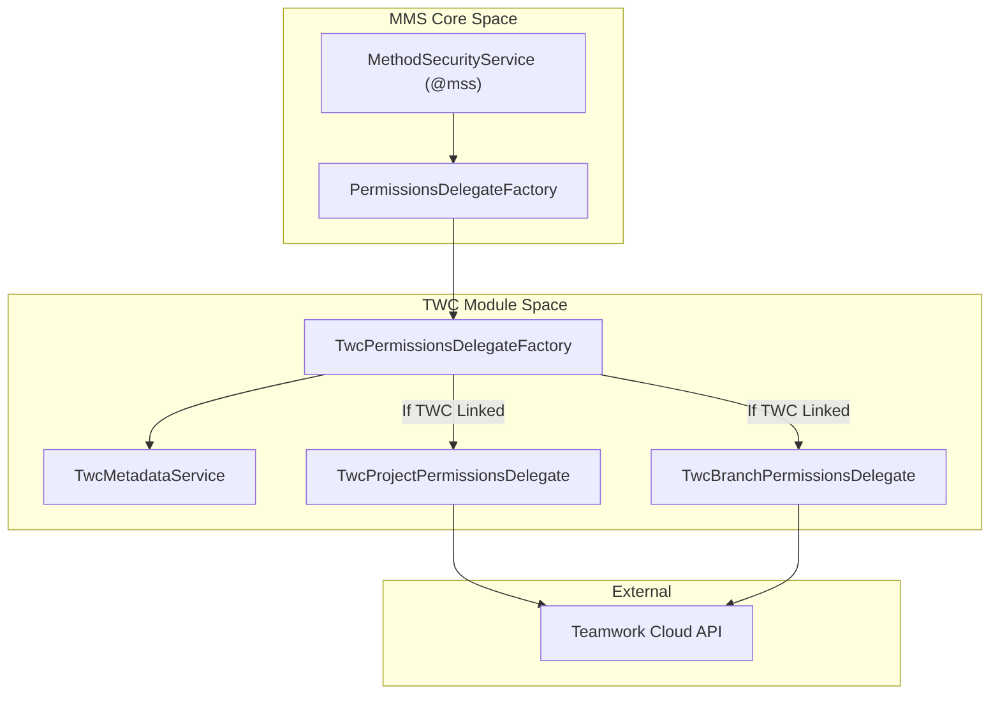

# Page: TWC Integration

# TWC Integration

Relevant source files

The following files were used as context for generating this wiki page:

- [twc/src/main/java/org/openmbee/mms/twc/metadata/TwcMetadataService.java](twc/src/main/java/org/openmbee/mms/twc/metadata/TwcMetadataService.java)
- [twc/src/main/java/org/openmbee/mms/twc/permissions/TwcPermissionsDelegateFactory.java](twc/src/main/java/org/openmbee/mms/twc/permissions/TwcPermissionsDelegateFactory.java)

The Teamwork Cloud (TWC) integration module extends MMS to support deep interoperability with No Magic's Teamwork Cloud. Beyond simple authentication, this module enables MMS to act as a coordinated data store alongside TWC by mapping internal MMS commits to TWC workspace revisions, maintaining cross-system metadata, and delegating authorization decisions to TWC’s own permission model.

### Module Purpose and Scope

The `twc` module is designed for environments where MMS and Teamwork Cloud coexist. It ensures that data remains synchronized at a structural level and that security policies are consistent across both platforms.

Key integration points include:
*   **Revision Mapping:** Associating MMS `commitId`s with TWC revision numbers.
*   **Metadata Management:** Storing TWC-specific identifiers (Workspace ID, Resource ID) within MMS project objects.
*   **Authorization Delegation:** Dynamically checking TWC permissions to determine if a user has `READER` or `WRITER` access to an MMS project or branch.

---

## TWC Metadata and Project Mapping

MMS stores TWC-specific metadata directly on the `ProjectJson` object under a specialized key. This metadata allows MMS to know which specific TWC resource and workspace corresponds to an MMS project.

The `TwcMetadataService` [twc/src/main/java/org/openmbee/mms/twc/metadata/TwcMetadataService.java:15-15]() manages the lifecycle of these associations. It uses the `TwcConstants.FOREIGN_PROJECT` key to store a map containing the TWC host, workspace ID, and resource ID [twc/src/main/java/org/openmbee/mms/twc/metadata/TwcMetadataService.java:25-30]().

### Metadata Persistence Flow

| Entity | Role | Code Reference |
| :--- | :--- | :--- |
| `TwcMetadata` | POJO representing TWC connection details (Host, Workspace, Resource). | [twc/src/main/java/org/openmbee/mms/twc/metadata/TwcMetadata.java]() |
| `TwcMetadataService` | Logic for reading/writing metadata to `ProjectJson`. | [twc/src/main/java/org/openmbee/mms/twc/metadata/TwcMetadataService.java:15]() |
| `ProjectPersistence` | Interface used to persist the updated `ProjectJson` to the database. | [twc/src/main/java/org/openmbee/mms/twc/metadata/TwcMetadataService.java:29]() |

For details on the maintenance endpoints and the revision-to-commit mapping logic, see **[TWC Revision-Commit Mapping](#8.1)**.

---

## Permission Delegation

When TWC integration is active, MMS can delegate authorization checks to the TWC server. This ensures that if a user is revoked access in TWC, their access to the corresponding MMS project is immediately restricted without manual intervention in MMS.

The `TwcPermissionsDelegateFactory` [twc/src/main/java/org/openmbee/mms/twc/permissions/TwcPermissionsDelegateFactory.java:21-21]() is responsible for determining if a project is linked to TWC and, if so, providing a TWC-specific delegate.

### Delegation Logic
1.  **Check Configuration:** The factory verifies if `twc.useAuthDelegation` is enabled [twc/src/main/java/org/openmbee/mms/twc/permissions/TwcPermissionsDelegateFactory.java:50-52]().
2.  **Lookup Metadata:** It retrieves TWC details via `TwcMetadataService` [twc/src/main/java/org/openmbee/mms/twc/permissions/TwcPermissionsDelegateFactory.java:132-132]().
3.  **Validate Host:** It ensures the TWC host is "trusted" (present in the MMS configuration) [twc/src/main/java/org/openmbee/mms/twc/permissions/TwcPermissionsDelegateFactory.java:140-146]().
4.  **Return Delegate:** It returns a `TwcProjectPermissionsDelegate` or `TwcBranchPermissionsDelegate` [twc/src/main/java/org/openmbee/mms/twc/permissions/TwcPermissionsDelegateFactory.java:56-57]().

### Code Entity Mapping: Permission Delegation
The following diagram shows how high-level permission requests are routed to TWC-specific code entities.

**Permission Routing Diagram**

Sources: [twc/src/main/java/org/openmbee/mms/twc/permissions/TwcPermissionsDelegateFactory.java:49-91](), [twc/src/main/java/org/openmbee/mms/twc/metadata/TwcMetadataService.java:32-43]()

---

## TWC Security and Authentication

The integration relies on a shared authentication context. Users typically authenticate against TWC (or a common SSO), and the resulting ticket/token is validated by MMS.

### Authentication Components
*   **`TwcAuthenticationFilter`**: Intercepts requests to extract TWC credentials.
*   **`TwcAuthenticationProvider`**: Validates the TWC ticket against the configured TWC instances.
*   **`TwcUserDetailsService`**: Synchronizes or loads user information from TWC into the MMS security context.

If the TWC instance is unreachable during a permission check, the system is designed to throw a `TwcConfigurationException` with a `424 Failed Dependency` status [twc/src/main/java/org/openmbee/mms/twc/permissions/TwcPermissionsDelegateFactory.java:143-146](), preventing unauthorized access due to system downtime.

For details on security filters and role mapping, see **[TWC Security Configuration](#8.2)**.

---

## Child Pages

*   **[TWC Revision-Commit Mapping](#8.1)**: Detailed documentation on `TwcRevisionMmsCommitMapService`, metadata maintenance endpoints, and the storage of workspace/resource IDs.
*   **[TWC Security Configuration](#8.2)**: Deep dive into `TwcAuthenticationFilter`, TWC ticket validation, and the `twc.instances[]` configuration structure.
