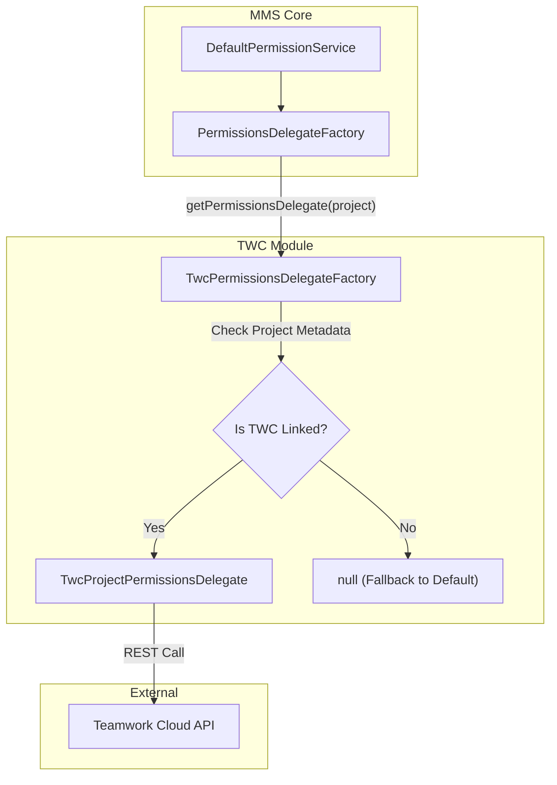
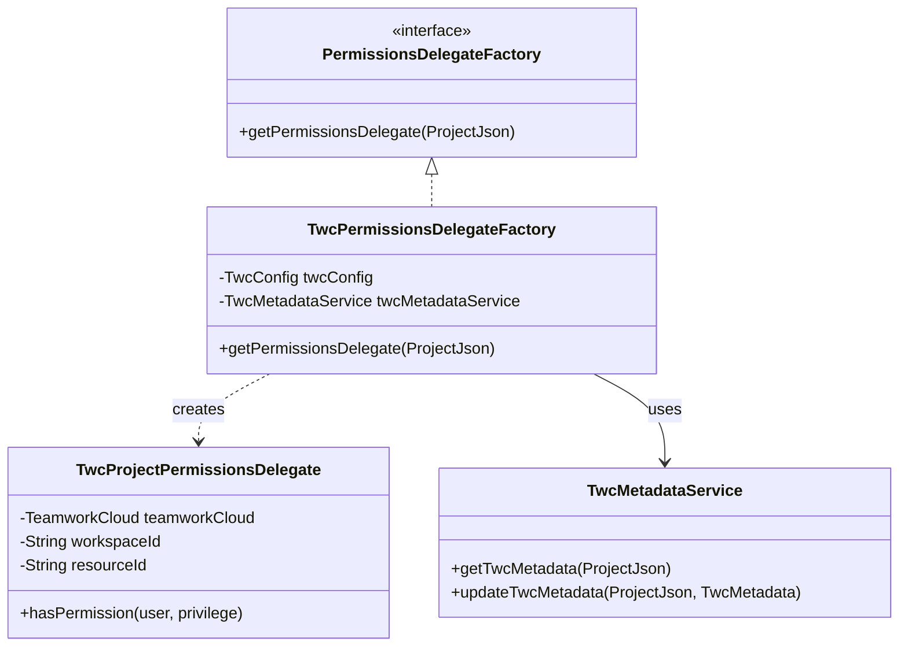

# Page: TWC Permission Delegation

# TWC Permission Delegation

Relevant source files

The following files were used as context for generating this wiki page:

- [example/crud.postman_collection.json](example/crud.postman_collection.json)
- [example/permissions.postman_collection.json](example/permissions.postman_collection.json)
- [example/twc.postman_collection.json](example/twc.postman_collection.json)
- [twc/src/main/java/org/openmbee/mms/twc/metadata/TwcMetadataService.java](twc/src/main/java/org/openmbee/mms/twc/metadata/TwcMetadataService.java)
- [twc/src/main/java/org/openmbee/mms/twc/permissions/TwcPermissionsDelegateFactory.java](twc/src/main/java/org/openmbee/mms/twc/permissions/TwcPermissionsDelegateFactory.java)

The TWC (Teamwork Cloud) module provides a mechanism to delegate MMS permission checks to a Teamwork Cloud instance. This allows MMS to synchronize its access control with TWC project roles, ensuring that users who have specific privileges in a TWC resource (e.g., a Cameo model) carry those same privileges over to the corresponding MMS project and branches.

## Overview

When TWC auth delegation is enabled, the default MMS permission logic is overridden for projects associated with a TWC resource. This is achieved through the `PermissionsDelegate` pattern, where a specialized factory determines if a request should be handled by standard MMS RBAC or delegated to TWC.

### Key Components

| Component | Description |
|-----------|-------------|
| `TwcPermissionsDelegateFactory` | Determines which delegate to use based on project metadata. |
| `TwcProjectPermissionsDelegate` | Handles permission checks at the Project level by querying TWC. |
| `TwcBranchPermissionsDelegate` | Handles permission checks at the Ref/Branch level. |
| `TwcMetadataService` | Manages the association between MMS projects and TWC resources. |

## Delegate Selection Logic

The `TwcPermissionsDelegateFactory` [twc/src/main/java/org/openmbee/mms/twc/permissions/TwcPermissionsDelegateFactory.java:21-21]() is responsible for intercepting permission requests. It checks the `twc.useAuthDelegation` configuration [twc/src/main/java/org/openmbee/mms/twc/permissions/TwcPermissionsDelegateFactory.java:50-52]() and inspects the project's metadata to see if it is linked to a TWC resource.

If a project contains valid `TwcMetadata` (Host, Workspace ID, and Resource ID), the factory returns a TWC-specific delegate instead of the default one [twc/src/main/java/org/openmbee/mms/twc/permissions/TwcPermissionsDelegateFactory.java:54-58]().

### Data Flow: Permission Delegation

The following diagram illustrates how a request for project permissions is routed to TWC.

**TWC Delegation Routing**

Sources: [twc/src/main/java/org/openmbee/mms/twc/permissions/TwcPermissionsDelegateFactory.java:49-61](), [twc/src/main/java/org/openmbee/mms/twc/metadata/TwcMetadataService.java:32-43]()

## TWC Metadata and Association

For delegation to function, an MMS project must be associated with a TWC resource. This association is stored within the `ProjectJson` under the `twc` key (defined by `TwcConstants.FOREIGN_PROJECT`) [twc/src/main/java/org/openmbee/mms/twc/metadata/TwcMetadataService.java:28-28]().

The `TwcMetadataService` manages these fields:
*   **Host**: The TWC instance URL [twc/src/main/java/org/openmbee/mms/twc/metadata/TwcMetadataService.java:39-39]().
*   **Workspace ID**: The TWC workspace containing the resource [twc/src/main/java/org/openmbee/mms/twc/metadata/TwcMetadataService.java:40-40]().
*   **Resource ID**: The specific TWC resource ID [twc/src/main/java/org/openmbee/mms/twc/metadata/TwcMetadataService.java:41-41]().

Sources: [twc/src/main/java/org/openmbee/mms/twc/metadata/TwcMetadataService.java:15-55]()

## Implementation Classes

### TwcProjectPermissionsDelegate
This delegate overrides standard project-level permission checks. When a user attempts to access or modify a project, this class maps the user's TWC roles to MMS roles (ADMIN, WRITER, READER). If the TWC instance is unreachable or the host is not in the trusted `twc.instances` list, it throws a `TwcConfigurationException` with a `424 Failed Dependency` status [twc/src/main/java/org/openmbee/mms/twc/permissions/TwcPermissionsDelegateFactory.java:142-146]().

### TwcBranchPermissionsDelegate
Used for branch-level operations. It retrieves the parent project's TWC metadata to perform role validation [twc/src/main/java/org/openmbee/mms/twc/permissions/TwcPermissionsDelegateFactory.java:79-89](). Currently, TWC permissions are often resource-wide, so branch permissions typically reflect the resource-level permissions found in TWC.

## Error Handling: 424 Failed Dependency

A critical aspect of TWC delegation is the behavior when the external system is unavailable or misconfigured. 

If `TwcPermissionsDelegateFactory` encounters a project linked to a TWC host that is not defined in the local `TwcConfig`, it refuses to fallback to local permissions (to prevent security bypasses) and instead throws a `TwcConfigurationException` [twc/src/main/java/org/openmbee/mms/twc/permissions/TwcPermissionsDelegateFactory.java:143-146](). This results in an HTTP `424 Failed Dependency` response to the client, indicating that the request cannot be processed because a required external service (TWC) is untrusted or unreachable.

**Code-to-System Mapping**

Sources: [twc/src/main/java/org/openmbee/mms/twc/permissions/TwcPermissionsDelegateFactory.java:21-61](), [twc/src/main/java/org/openmbee/mms/twc/metadata/TwcMetadataService.java:15-15]()

## Configuration

Delegation is controlled by properties typically found in `application.properties`:

*   `twc.enabled`: Must be true to load the TWC module.
*   `twc.useAuthDelegation`: If true, enables the `TwcPermissionsDelegateFactory`.
*   `twc.instances`: A list of trusted TWC hosts. If a project metadata host is not in this list, the system returns `424 Failed Dependency` [twc/src/main/java/org/openmbee/mms/twc/permissions/TwcPermissionsDelegateFactory.java:140-146]().

Sources: [twc/src/main/java/org/openmbee/mms/twc/permissions/TwcPermissionsDelegateFactory.java:50-52](), [twc/src/main/java/org/openmbee/mms/twc/permissions/TwcPermissionsDelegateFactory.java:140-142]()
