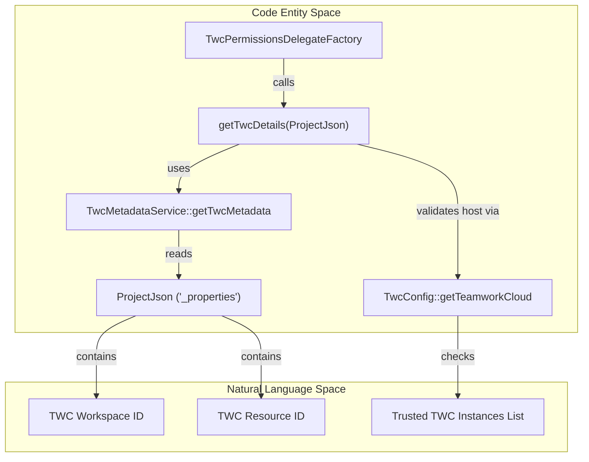
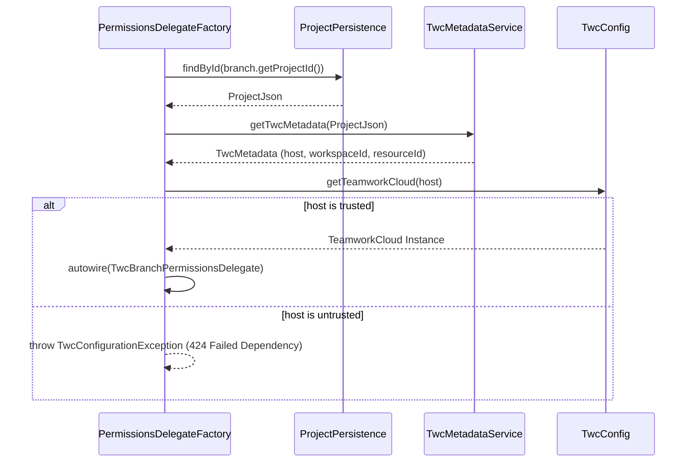

# Page: TWC Revision-Commit Mapping

# TWC Revision-Commit Mapping

Relevant source files

The following files were used as context for generating this wiki page:

- [twc/src/main/java/org/openmbee/mms/twc/metadata/TwcMetadataService.java](twc/src/main/java/org/openmbee/mms/twc/metadata/TwcMetadataService.java)
- [twc/src/main/java/org/openmbee/mms/twc/permissions/TwcPermissionsDelegateFactory.java](twc/src/main/java/org/openmbee/mms/twc/permissions/TwcPermissionsDelegateFactory.java)

This section documents the integration between Teamwork Cloud (TWC) and MMS regarding project metadata and revision mapping. The TWC module allows MMS to act as a consumer of TWC data, maintaining a mapping between TWC workspace revisions and MMS commit IDs, and storing TWC-specific identifiers (Workspace ID, Resource ID) directly on MMS project objects.

## TWC Metadata Management

MMS projects can be associated with "foreign" projects in Teamwork Cloud. This association is managed by the `TwcMetadataService` and stored within the `ProjectJson` object's metadata fields.

### TwcMetadata Entity
The `TwcMetadata` class is a POJO used to encapsulate the connection details for a TWC resource. It includes:
*   **Host**: The TWC server address.
*   **Workspace ID**: The unique identifier for the TWC workspace.
*   **Resource ID**: The unique identifier for the specific TWC resource.

### TwcMetadataService
The `TwcMetadataService` handles the persistence of these details into the underlying project storage. Instead of a separate database table, TWC metadata is stored as a nested map within the `ProjectJson` under the key defined by `TwcConstants.FOREIGN_PROJECT`.

Key functions include:
*   `updateTwcMetadata(ProjectJson, TwcMetadata)`: Injects TWC details and sets `TwcConstants.ENABLED_KEY` to `true` before updating the project via `ProjectPersistence` [twc/src/main/java/org/openmbee/mms/twc/metadata/TwcMetadataService.java:25-30]().
*   `getTwcMetadata(ProjectJson)`: Extracts the map from the project JSON and reconstructs a `TwcMetadata` object [twc/src/main/java/org/openmbee/mms/twc/metadata/TwcMetadataService.java:32-43]().
*   `deleteTwcMetadata(ProjectJson)`: Performs a soft delete by setting the enabled flag to `false` [twc/src/main/java/org/openmbee/mms/twc/metadata/TwcMetadataService.java:45-53]().

**Sources:**
* [twc/src/main/java/org/openmbee/mms/twc/metadata/TwcMetadataService.java:15-55]()
* [twc/src/main/java/org/openmbee/mms/twc/metadata/TwcMetadata.java]() (Implicitly referenced)

---

## Technical Flow: Metadata Resolution

The following diagram illustrates how TWC metadata is resolved from an MMS project to determine if permission delegation or revision mapping should occur.

### Metadata Resolution Logic

**Sources:**
* [twc/src/main/java/org/openmbee/mms/twc/permissions/TwcPermissionsDelegateFactory.java:129-154]()
* [twc/src/main/java/org/openmbee/mms/twc/metadata/TwcMetadataService.java:32-43]()

---

## TWC Revision to MMS Commit Mapping

The system provides a mechanism to map TWC revisions to MMS Commits. This is essential for tools like the MagicDraw Development Kit (MDK) to track which TWC change corresponds to which MMS transaction.

### Mapping Services and Controllers
*   **TwcRevisionMmsCommitMapService**: Responsible for the logic of persisting and retrieving the association between a TWC `revisionId` and an MMS `commitId`.
*   **TwcRevisionMmsCommitMapController**: Provides REST endpoints (typically under `/adm/maintenance/project/twcmetadata/{id}`) to manually query or update these mappings for administrative purposes.

### Integration with Permission Delegation
The `TwcPermissionsDelegateFactory` uses the stored metadata to instantiate specialized permission delegates. If a project has valid TWC metadata, MMS will delegate authorization checks to TWC using the stored Workspace and Resource IDs.

| Method | Description |
| :--- | :--- |
| `getPermissionsDelegate(ProjectJson)` | Returns a `TwcProjectPermissionsDelegate` if TWC metadata is present and complete [twc/src/main/java/org/openmbee/mms/twc/permissions/TwcPermissionsDelegateFactory.java:49-61](). |
| `getPermissionsDelegate(RefJson)` | Returns a `TwcBranchPermissionsDelegate` by looking up the parent project's TWC metadata [twc/src/main/java/org/openmbee/mms/twc/permissions/TwcPermissionsDelegateFactory.java:74-91](). |

**Sources:**
* [twc/src/main/java/org/openmbee/mms/twc/permissions/TwcPermissionsDelegateFactory.java:21-155]()
* [twc/src/main/java/org/openmbee/mms/twc/metadata/TwcMetadataService.java:15-55]()

---

## Data Flow: Permission Delegation Initialization

This diagram shows how the system bridges the gap between an API request on an MMS Ref (Branch) and the TWC resource identifiers required to check permissions.

### Ref-to-TWC Mapping Flow

**Sources:**
* [twc/src/main/java/org/openmbee/mms/twc/permissions/TwcPermissionsDelegateFactory.java:74-91]()
* [twc/src/main/java/org/openmbee/mms/twc/permissions/TwcPermissionsDelegateFactory.java:129-154]()
* [twc/src/main/java/org/openmbee/mms/twc/metadata/TwcMetadataService.java:32-43]()
