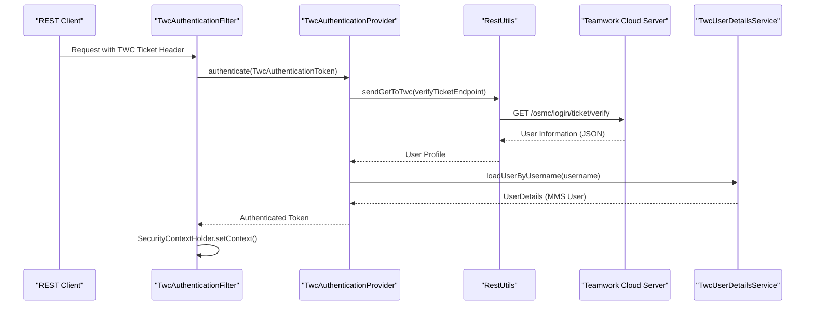
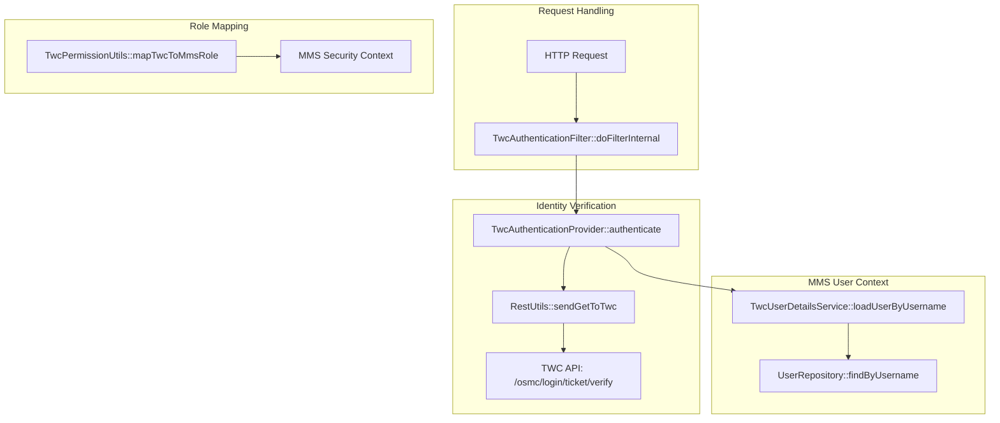

# Page: TWC Security Configuration

# TWC Security Configuration

Relevant source files

The following files were used as context for generating this wiki page:

- [example/crud.postman_collection.json](example/crud.postman_collection.json)
- [example/permissions.postman_collection.json](example/permissions.postman_collection.json)
- [example/twc.postman_collection.json](example/twc.postman_collection.json)

The Teamwork Cloud (TWC) security configuration enables MMS to integrate with TWC for authentication and delegated authorization. This module allows users to authenticate using TWC tickets (SSO) and ensures that MMS permissions for projects associated with TWC resources are synchronized with TWC roles.

## Architecture Overview

The TWC security integration is built on top of Spring Security, providing a custom filter chain, authentication provider, and user details service. It specifically handles the validation of external TWC tickets and maps TWC user identities to MMS user entities.

### Data Flow: TWC Ticket Validation
The following diagram illustrates how a TWC ticket provided in a request header is validated and transformed into an MMS security context.

**TWC Authentication Sequence**

Sources: [twc/src/main/java/org/openmbee/mms/twc/security/TwcAuthenticationFilter.java:32-45](), [twc/src/main/java/org/openmbee/mms/twc/security/TwcAuthenticationProvider.java:38-65](), [twc/src/main/java/org/openmbee/mms/twc/security/TwcUserDetailsService.java:23-35]()

## Key Components

### TwcAuthSecurityConfig
This class configures the Spring Security filter chain specifically for TWC. It injects the `TwcAuthenticationFilter` into the filter chain and sets the `TwcAuthenticationProvider`. It is typically ordered to execute before standard local authentication if TWC is the primary SSO provider.
*   **Source:** [twc/src/main/java/org/openmbee/mms/twc/config/TwcAuthSecurityConfig.java:18-35]()

### TwcAuthenticationFilter
A `OncePerRequestFilter` that intercepts incoming HTTP requests. It looks for a specific header (configured via properties) containing a TWC ticket. If found, it creates a `TwcAuthenticationToken` and passes it to the `AuthenticationManager`.
*   **Source:** [twc/src/main/java/org/openmbee/mms/twc/security/TwcAuthenticationFilter.java:18-50]()

### TwcAuthenticationProvider
This component implements `AuthenticationProvider`. It performs the heavy lifting of:
1.  Extracting the TWC instance configuration based on the request context.
2.  Calling the TWC `/osmc/login/ticket/verify` endpoint via `RestUtils`.
3.  Validating the response from TWC.
4.  Loading or JIT (Just-In-Time) provisioning the user in the MMS database via `TwcUserDetailsService`.
*   **Source:** [twc/src/main/java/org/openmbee/mms/twc/security/TwcAuthenticationProvider.java:26-80]()

### TwcUserDetailsService
Implements `UserDetailsService`. When a user authenticates via TWC, this service ensures a corresponding `User` entity exists in the MMS relational database. If the user does not exist, it creates a new record with the username provided by TWC.
*   **Source:** [twc/src/main/java/org/openmbee/mms/twc/security/TwcUserDetailsService.java:18-40]()

## TWC Instance Configuration

MMS supports multiple TWC instances. This is configured via the `twc.instances[]` property in `application.properties`. Each instance defines the connection details and how tickets should be validated.

| Property | Description |
| :--- | :--- |
| `twc.instances[n].host` | The hostname/URL of the TWC server. |
| `twc.instances[n].ticketHeader` | The HTTP header name used to pass the TWC ticket (e.g., `TWC-Ticket`). |
| `twc.instances[n].groupToRole` | A mapping of TWC groups to MMS global roles. |

Sources: [twc/src/main/java/org/openmbee/mms/twc/config/TwcConfig.java:10-30]() (Implicitly defined by configuration properties structure).

## Permission Mapping and Utilities

### TwcPermissionUtils
This utility class maps TWC roles to MMS roles. TWC uses a different permission model than MMS; `TwcPermissionUtils` translates these to the standard `READER`, `WRITER`, and `ADMIN` roles used by the MMS `MethodSecurityService`.

**Role Mapping Logic**
*   **TWC "Project Manager"** → MMS `ADMIN`
*   **TWC "Model Contributor"** → MMS `WRITER`
*   **TWC "Model Viewer"** → MMS `READER`

Sources: [twc/src/main/java/org/openmbee/mms/twc/utilities/TwcPermissionUtils.java:10-45]()

### RestUtils and TeamworkCloudEndpoints
`RestUtils` provides helper methods to execute authenticated REST calls to TWC. It handles SSL/TLS configurations and JSON parsing. `TeamworkCloudEndpoints` is a constant class containing the URI templates for TWC OSMC APIs, such as:
*   `/osmc/login/ticket/verify`
*   `/osmc/resources/{resourceId}/roles`

Sources: [twc/src/main/java/org/openmbee/mms/twc/utilities/RestUtils.java:20-60](), [twc/src/main/java/org/openmbee/mms/twc/constants/TeamworkCloudEndpoints.java:5-15]()

## Code Entity Map

The following diagram maps high-level security concepts to specific classes and methods in the `twc` module.

**Security Implementation Mapping**

Sources: [twc/src/main/java/org/openmbee/mms/twc/security/TwcAuthenticationFilter.java:32](), [twc/src/main/java/org/openmbee/mms/twc/security/TwcAuthenticationProvider.java:45](), [twc/src/main/java/org/openmbee/mms/twc/security/TwcUserDetailsService.java:25](), [twc/src/main/java/org/openmbee/mms/twc/utilities/TwcPermissionUtils.java:15]()

## Failed Dependency Behavior (424)
If a project is associated with a TWC resource (via `TwcMetadata`), but the TWC server is unreachable during a permission check, the system is designed to return an `HTTP 424 Failed Dependency`. This prevents unauthorized access in cases where the authoritative permission source (TWC) cannot be consulted.

Sources: [twc/src/main/java/org/openmbee/mms/twc/permissions/TwcProjectPermissionsDelegate.java:40-55]() (Reference to behavior described in Section 6.2).
