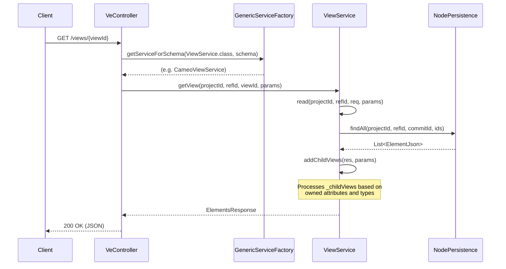
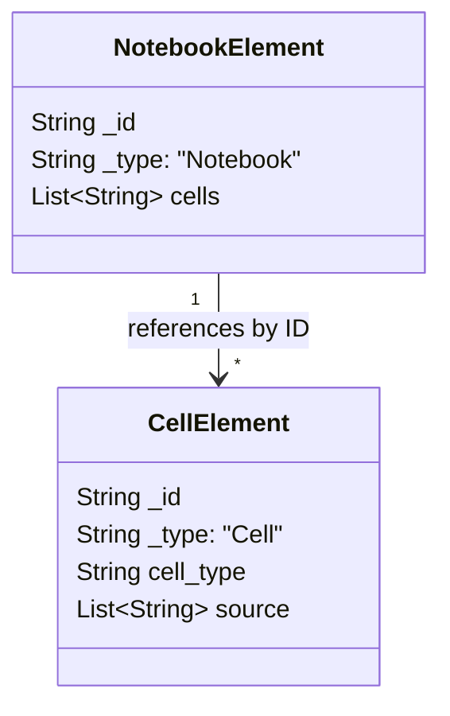

# Page: Views, Mounts, and Notebooks API

# Views, Mounts, and Notebooks API

Relevant source files

The following files were used as context for generating this wiki page:

- [cameo/src/main/java/org/openmbee/mms/cameo/services/CameoViewService.java](cameo/src/main/java/org/openmbee/mms/cameo/services/CameoViewService.java)
- [crud/src/main/java/org/openmbee/mms/crud/domain/JsonDomain.java](crud/src/main/java/org/openmbee/mms/crud/domain/JsonDomain.java)
- [example/cameo.postman_collection.json](example/cameo.postman_collection.json)
- [jupyter/src/main/java/org/openmbee/mms/jupyter/services/JupyterNodeService.java](jupyter/src/main/java/org/openmbee/mms/jupyter/services/JupyterNodeService.java)
- [msosa/src/main/java/org/openmbee/mms/msosa/services/MsosaViewService.java](msosa/src/main/java/org/openmbee/mms/msosa/services/MsosaViewService.java)
- [view/src/main/java/org/openmbee/mms/view/controllers/VeController.java](view/src/main/java/org/openmbee/mms/view/controllers/VeController.java)

The Views, Mounts, and Notebooks API provides specialized endpoints for interacting with structured model data as high-level architectural views, documents, and interactive notebooks. These APIs leverage the `ViewService` interface and domain-specific implementations (Cameo, MSOSA, Jupyter) to provide a semantic layer over the base elements.

## VeController and ViewService

The `VeController` [view/src/main/java/org/openmbee/mms/view/controllers/VeController.java:30]() handles requests for views, documents, and groups. It uses the `GenericServiceFactory` [view/src/main/java/org/openmbee/mms/view/controllers/VeController.java:32]() to resolve the appropriate `ViewService` implementation based on the project's schema (e.g., `cameoViewService` or `msosaViewService`).

### View Endpoints

| Method | Path | Description |
| :--- | :--- | :--- |
| `GET` | `/projects/{projectId}/refs/{refId}/views/{viewId}` | Retrieves a specific view and its child view metadata [view/src/main/java/org/openmbee/mms/view/controllers/VeController.java:64-76](). |
| `PUT` | `/projects/{projectId}/refs/{refId}/views` | Bulk retrieval of multiple views [view/src/main/java/org/openmbee/mms/view/controllers/VeController.java:78-88](). |
| `POST` | `/projects/{projectId}/refs/{refId}/views` | Creates or updates views, processing child view relationships [view/src/main/java/org/openmbee/mms/view/controllers/VeController.java:90-104](). |
| `GET` | `/projects/{projectId}/refs/{refId}/documents` | Lists all elements typed as Documents in the branch [view/src/main/java/org/openmbee/mms/view/controllers/VeController.java:52-62](). |
| `GET` | `/projects/{projectId}/refs/{refId}/groups` | Lists all elements typed as Groups (folders/packages) [view/src/main/java/org/openmbee/mms/view/controllers/VeController.java:106-115](). |

### View Data Flow

The following diagram illustrates how a request for a view is processed through the schema-specific service layer.

**View Retrieval Process**

**Sources:** [view/src/main/java/org/openmbee/mms/view/controllers/VeController.java:64-76](), [cameo/src/main/java/org/openmbee/mms/cameo/services/CameoViewService.java:47-56](), [cameo/src/main/java/org/openmbee/mms/cameo/services/CameoViewService.java:59-83]()

## Mounts and Cross-Project Resolution

MMS supports cross-project element resolution through "Mounts" (Project Usages). This is primarily used in the Cameo schema to allow a parent project to reference elements in child projects.

### MountJson Hierarchy
The `/mounts` endpoint returns a `MountJson` structure [view/src/main/java/org/openmbee/mms/view/controllers/VeController.java:41-50](). This object represents a recursive tree of project dependencies:
- **`id`**: The project ID.
- **`refId`**: The specific branch being used.
- **`mounts`**: A list of nested `MountJson` objects representing dependencies of this project.

### Implementation in Cameo
The `CameoViewService` (inheriting from `CameoNodeService`) implements `getProjectUsages` to traverse the model and find elements representing project mounts [cameo/src/main/java/org/openmbee/mms/cameo/services/CameoViewService.java:29](). When resolving elements, the system uses these mounts to search across multiple project schemas if an element is not found in the primary project.

**Sources:** [view/src/main/java/org/openmbee/mms/view/controllers/VeController.java:39-50](), [example/cameo.postman_collection.json:110-150]()

## Jupyter Notebooks API

The Jupyter module provides specialized handling for `.ipynb` files, treating them as structured MMS elements.

### NotebooksController
The `NotebooksController` (found in the jupyter module) exposes endpoints for managing notebooks:
- `GET /projects/{projectId}/refs/{refId}/notebooks`: Lists all notebooks.
- `GET /projects/{projectId}/refs/{refId}/notebooks/{notebookId}`: Retrieves a notebook and its constituent cells.
- `POST /projects/{projectId}/refs/{refId}/notebooks`: Creates or updates a notebook.

### Notebook Persistence Logic
Notebooks are stored as a parent element of type `Notebook` with a list of cell IDs in the `cells` field [jupyter/src/main/java/org/openmbee/mms/jupyter/services/JupyterNodeService.java:57-64]().
1. **Read**: When a notebook is requested, `JupyterNodeService.readNotebooks` first fetches the notebook element, then performs a bulk read for all cell IDs listed in its metadata to reconstruct the full notebook JSON [jupyter/src/main/java/org/openmbee/mms/jupyter/services/JupyterNodeService.java:45-69]().
2. **Write**: When a notebook is posted, `createOrUpdateNotebooks` decomposes the notebook into individual cell elements, assigns them IDs if missing, and saves them as separate MMS elements before saving the parent notebook element [jupyter/src/main/java/org/openmbee/mms/jupyter/services/JupyterNodeService.java:71-105]().

**Notebook to Element Mapping**

**Sources:** [jupyter/src/main/java/org/openmbee/mms/jupyter/services/JupyterNodeService.java:16-21](), [jupyter/src/main/java/org/openmbee/mms/jupyter/services/JupyterNodeService.java:45-69](), [jupyter/src/main/java/org/openmbee/mms/jupyter/services/JupyterNodeService.java:71-105]()

## Domain-Specific View Logic

### Cameo and MSOSA Implementations
Both `CameoViewService` and `MsosaViewService` provide logic to handle the `_childViews` virtual field. This field is not stored directly in the database but is computed during retrieval by:
1. Identifying the element as a View [cameo/src/main/java/org/openmbee/mms/cameo/services/CameoViewService.java:61]().
2. Looking up its `ownedAttributeIds` [cameo/src/main/java/org/openmbee/mms/cameo/services/CameoViewService.java:62]().
3. Filtering those attributes to find properties whose `typeId` refers to another View [cameo/src/main/java/org/openmbee/mms/cameo/services/CameoViewService.java:70-79]().

Similarly, `getDocuments` and `getGroups` calculate hierarchy metadata like `_parentId` or `_siteCharacterizationId` by traversing owner relationships [cameo/src/main/java/org/openmbee/mms/cameo/services/CameoViewService.java:37-42](), [msosa/src/main/java/org/openmbee/mms/msosa/services/MsosaViewService.java:35-41]().

**Sources:** [cameo/src/main/java/org/openmbee/mms/cameo/services/CameoViewService.java:31-97](), [msosa/src/main/java/org/openmbee/mms/msosa/services/MsosaViewService.java:31-96](), [crud/src/main/java/org/openmbee/mms/crud/domain/JsonDomain.java:9-18]()
