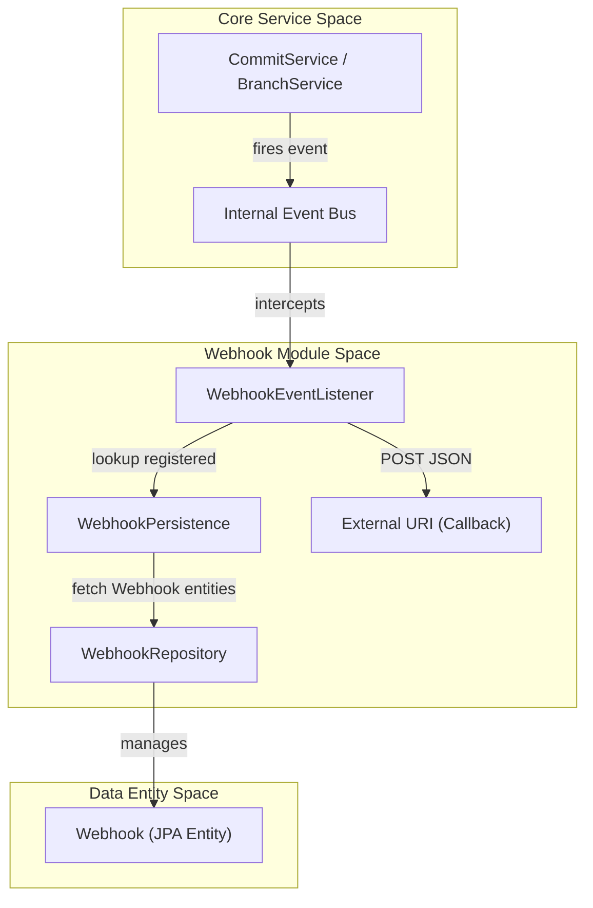
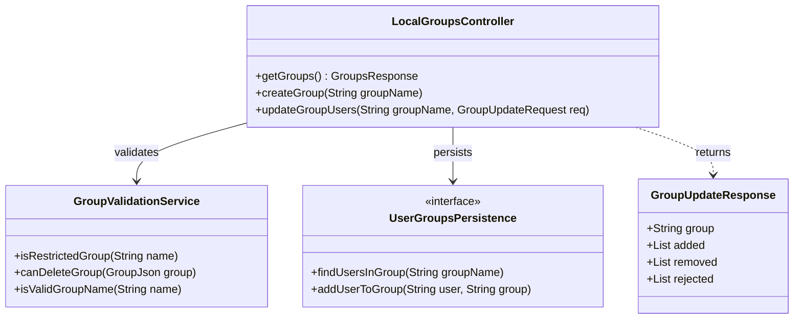

# Page: Webhooks and Groups API

# Webhooks and Groups API

<details>
<summary>Relevant source files</summary>

The following files were used as context for generating this wiki page:

- [docs/modules/groups.rst](docs/modules/groups.rst)
- [docs/modules/search.rst](docs/modules/search.rst)
- [example/groups.postman_collection.json](example/groups.postman_collection.json)
- [groups/README.rst](groups/README.rst)
- [groups/groups.gradle](groups/groups.gradle)
- [groups/src/main/java/org/openmbee/mms/groups/constants/GroupConstants.java](groups/src/main/java/org/openmbee/mms/groups/constants/GroupConstants.java)
- [groups/src/main/java/org/openmbee/mms/groups/objects/Action.java](groups/src/main/java/org/openmbee/mms/groups/objects/Action.java)
- [groups/src/main/java/org/openmbee/mms/groups/objects/GroupResponse.java](groups/src/main/java/org/openmbee/mms/groups/objects/GroupResponse.java)
- [groups/src/main/java/org/openmbee/mms/groups/objects/GroupUpdateRequest.java](groups/src/main/java/org/openmbee/mms/groups/objects/GroupUpdateRequest.java)
- [groups/src/main/java/org/openmbee/mms/groups/objects/GroupUpdateResponse.java](groups/src/main/java/org/openmbee/mms/groups/objects/GroupUpdateResponse.java)
- [groups/src/main/java/org/openmbee/mms/groups/objects/GroupsResponse.java](groups/src/main/java/org/openmbee/mms/groups/objects/GroupsResponse.java)
- [groups/src/main/java/org/openmbee/mms/groups/services/GroupValidationService.java](groups/src/main/java/org/openmbee/mms/groups/services/GroupValidationService.java)
- [localuser/README.rst](localuser/README.rst)
- [permissions/README.rst](permissions/README.rst)
- [webhooks/README.rst](webhooks/README.rst)

</details>


This page documents the internal management of user groups and the registration of outbound HTTP callbacks (webhooks) for system events. The `webhooks` module allows external systems to be notified of changes in MMS, while the `groups` module provides local group management for authorization and permission assignment.

## Webhooks API

The Webhooks API allows users to register URLs that MMS will notify when specific events occur within a project. Currently, the system supports triggers for **commit** and **branch creation** events [webhooks/README.rst:8-9]().

### Webhook Event Payloads

When an event is triggered, MMS sends a POST request to the registered URI with a JSON payload containing the context and the relevant data object.

| Event Type | Trigger | Payload Structure |
| :--- | :--- | :--- |
| `commit` | Fired when a new commit is persisted. | `projectId`, `branchId`, `event`, `payload` (see `CommitJson`) [webhooks/README.rst:15-20]() |
| `branch_created` | Fired when a new ref is created. | `projectId`, `branchId`, `event`, `payload` (see `RefJson`) [webhooks/README.rst:28-33]() |

### Webhook Architecture and Data Flow

The webhook system relies on an internal `EventListener` that captures events from the core services and dispatches them to registered URIs using the `WebhookPersistence` layer.

**Webhook Event Dispatch Flow**



**Sources:** [webhooks/README.rst:1-34](), [core/src/main/java/org/openmbee/mms/core/dao/WebhookPersistence.java](), [data/src/main/java/org/openmbee/mms/data/domains/global/Webhook.java]()

---

## Groups API

The Groups API manages internal user groups. These groups are stored in the relational database (`rdb` module) and are primarily used for assigning permissions at the Organization, Project, or Branch levels [groups/README.rst:1-10]().

### Group Management Operations

The `LocalGroupsController` exposes endpoints under `/groups` for CRUD operations and member management.

| Endpoint | Method | Description |
| :--- | :--- | :--- |
| `/groups` | GET | Returns a `GroupsResponse` containing all group names [groups/src/main/java/org/openmbee/mms/groups/objects/GroupsResponse.java:10-13]() |
| `/groups/{groupName}` | PUT | Creates a new local group [example/groups.postman_collection.json:79-82]() |
| `/groups/{groupName}` | GET | Returns a `GroupResponse` with details and members of a specific group [example/groups.postman_collection.json:233-236]() |
| `/groups/{groupName}` | DELETE | Removes a group (only if empty) [groups/src/main/java/org/openmbee/mms/groups/services/GroupValidationService.java:36-41]() |
| `/groups/{groupName}/users` | POST | Updates group membership using `ADD` or `REMOVE` actions [groups/src/main/java/org/openmbee/mms/groups/objects/Action.java:4-4]() |

### Group Validation Logic

The `GroupValidationService` enforces constraints on group naming and deletion to prevent system instability.

*   **Restricted Names:** Names like `mmsadmin` and `everyone` are reserved and cannot be created or deleted via this API [groups/src/main/java/org/openmbee/mms/groups/services/GroupValidationService.java:17-18]().
*   **Deletion Safety:** A group cannot be deleted if it still contains users [groups/src/main/java/org/openmbee/mms/groups/services/GroupValidationService.java:40-41]().
*   **Naming Conventions:** Group names must match the pattern `^[ -~]+` [groups/src/main/java/org/openmbee/mms/groups/services/GroupValidationService.java:18-18]().

### Integration with Authentication Providers

If LDAP is enabled, the group associations for LDAP users are synchronized upon login. This synchronization will overwrite local group associations if there are overlaps [groups/README.rst:8-9]().

**Groups Domain to Code Mapping**



**Sources:** [groups/src/main/java/org/openmbee/mms/groups/services/GroupValidationService.java:15-42](), [groups/src/main/java/org/openmbee/mms/groups/objects/GroupUpdateResponse.java:7-49](), [groups/README.rst:1-10](), [groups/src/main/java/org/openmbee/mms/groups/constants/GroupConstants.java:3-13]()

## Permissions Integration

Groups are a first-class citizen in the MMS permission system. When setting permissions on an Organization, Project, or Branch, a `GroupJson` or group name can be provided in the payload [permissions/README.rst:54-61]().

**Permissions Payload Example for Groups:**
```json
{
  "groups": {
    "action": "MODIFY",
    "permissions": [
      {
        "name": "engineers",
        "role": "WRITER"
      }
    ]
  }
}
```
**Sources:** [permissions/README.rst:51-65]()
