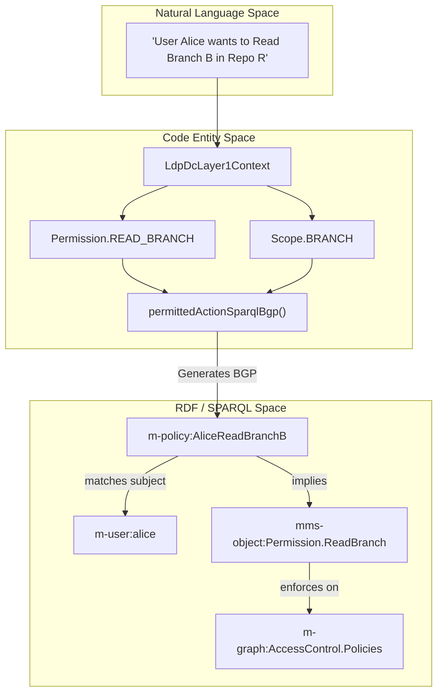
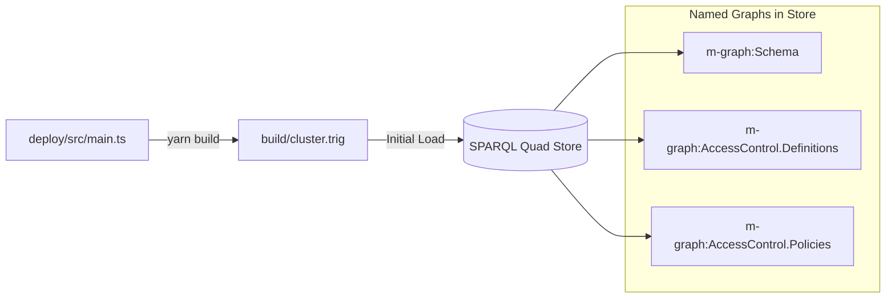

# Page: Access Control Model and Schema

# Access Control Model and Schema

<details>
<summary>Relevant source files</summary>

The following files were used as context for generating this wiki page:

- [deploy/.gitignore](deploy/.gitignore)
- [deploy/package.json](deploy/package.json)
- [deploy/src/belt.ts](deploy/src/belt.ts)
- [deploy/src/main.ts](deploy/src/main.ts)
- [deploy/tsconfig.json](deploy/tsconfig.json)
- [service/data/clean/init.trig](service/data/clean/init.trig)
- [src/main/kotlin/org/openmbee/flexo/mms/AccessControl.kt](src/main/kotlin/org/openmbee/flexo/mms/AccessControl.kt)
- [src/main/kotlin/org/openmbee/flexo/mms/routes/Groups.kt](src/main/kotlin/org/openmbee/flexo/mms/routes/Groups.kt)
- [src/main/kotlin/org/openmbee/flexo/mms/routes/Policies.kt](src/main/kotlin/org/openmbee/flexo/mms/routes/Policies.kt)
- [src/main/kotlin/org/openmbee/flexo/mms/routes/ldp/GroupRead.kt](src/main/kotlin/org/openmbee/flexo/mms/routes/ldp/GroupRead.kt)

</details>


The Flexo MMS Layer 1 Service utilizes a robust RDF-based Access Control (AC) model that defines relationships between agents (Users/Groups), roles, permissions, and scopes. This model is enforced at the SPARQL layer, ensuring that every request is validated against the graph-stored policies before execution.

## 1. Core Ontology Entities

The access control system is built upon a specific set of RDF classes and properties defined in the MMS ontology.

### 1.1 Agents: Users and Groups
- **`mms:User`**: Represents an individual authenticated entity. Users can be associated with groups via `mms:group` [deploy/src/main.ts:185]().
- **`mms:Group`**: Represents a collection of users or other groups. The system supports LDAP-compatible group slugs defined by `LDAP_COMPATIBLE_SLUG_REGEX` [src/main/kotlin/org/openmbee/flexo/mms/AccessControl.kt:3]() and initialized in the store [service/data/clean/init.trig:90-92]().

### 1.2 Policies, Roles, and Permissions
- **`mms:Policy`**: The binding entity. It connects a `mms:subject` (User or Group) to one or more `mms:role` entities within a specific `mms:scope` [deploy/src/main.ts:203-219]().
- **`mms:Role`**: A named collection of permissions (e.g., `mms-object:Role.AdminRepo`). Roles use the `mms:permits` property to link to specific permissions [deploy/src/main.ts:127-133]().
- **`mms:Permission`**: The atomic unit of authorization. Permissions can use `mms:implies` to form a hierarchy where a higher-level permission (like `Delete`) automatically grants lower-level ones (like `Update` or `Read`) [deploy/src/main.ts:99-108]().

### 1.3 Scopes
Scopes define the resource level at which a policy applies. The system uses a hierarchical implication model where access at a higher level (e.g., Cluster) implies access at lower levels (e.g., Org, Repo) [service/data/clean/init.trig:139-168]().

| Scope Type | RDF Class | Description |
| :--- | :--- | :--- |
| **Cluster** | `mms:Cluster` | The highest level; implies all Orgs [src/main/kotlin/org/openmbee/flexo/mms/AccessControl.kt:13](). |
| **Org** | `mms:Org` | Implies all Projects/Repos within the organization [src/main/kotlin/org/openmbee/flexo/mms/AccessControl.kt:14](). |
| **Repo** | `mms:Repo` | Implies all Branches and Locks within the repository [src/main/kotlin/org/openmbee/flexo/mms/AccessControl.kt:16](). |
| **Ref** | `mms:Ref` | The specific Branch or Lock level [src/main/kotlin/org/openmbee/flexo/mms/AccessControl.kt:17-18](). |

**Sources:** [deploy/src/main.ts:173-278](), [service/data/clean/init.trig:18-67](), [src/main/kotlin/org/openmbee/flexo/mms/AccessControl.kt:12-28]()

---

## 2. Access Control Data Flow

The following diagram illustrates how the system transitions from a natural language request to a SPARQL-enforced authorization check.

### Diagram: From Request to Authorization
Title: Access Control Enforcement Logic

**Sources:** [src/main/kotlin/org/openmbee/flexo/mms/AccessControl.kt:115-185](), [src/main/kotlin/org/openmbee/flexo/mms/routes/ldp/GroupRead.kt:32-35]()

---

## 3. Schema Generation and Initialization

The system's access control schema is programmatically generated to ensure consistency across permissions and roles.

### 3.1 Schema Generator (`deploy/src/main.ts`)
The `deploy/src/main.ts` script is a TypeScript utility that generates the `cluster.trig` file used to initialize the quad-store. It uses helper functions to expand CRUD definitions into full permission hierarchies.

- **`permissions()`**: Iterates through a `PermissionConfig` to create `mms:Permission` objects and their `mms:implies` relations [deploy/src/main.ts:98-109]().
- **`roles()`**: Maps roles to sets of permissions using the `mms:permits` predicate [deploy/src/main.ts:125-136]().
- **`scopes()`**: Defines the `mms:Scope` hierarchy and `mms:implies` links between levels (Cluster -> Org -> Repo) [deploy/src/main.ts:59-70]().

### 3.2 Cluster Initialization (`cluster.trig`)
The output of the generator is a TriG file that defines several critical named graphs:
- **`m-graph:Schema`**: Contains the RDFS classes for the MMS model (Branch, Commit, etc.) [service/data/clean/init.trig:19-67]().
- **`m-graph:AccessControl.Definitions`**: Contains the hierarchy of Scopes, Roles, and Permissions [service/data/clean/init.trig:133-182]().
- **`m-graph:AccessControl.Agents`**: Stores the bootstrap users (e.g., `m-user:root`) and groups [service/data/clean/init.trig:80-98]().
- **`m-graph:AccessControl.Policies`**: Stores the initial policies, such as the `DefaultSuperAdmins` policy [deploy/src/main.ts:203-219]().

### Diagram: Initialization Architecture
Title: Schema Generation and Deployment

**Sources:** [deploy/package.json:7](), [deploy/src/main.ts:152-171](), [service/data/clean/init.trig:10-16]()

---

## 4. Runtime Enforcement: `permittedActionSparqlBgp`

Authorization is enforced by injecting a Basic Graph Pattern (BGP) into every SPARQL query or update performed by the service. This logic is encapsulated in the `permittedActionSparqlBgp` function.

### Implementation Details
The function constructs a SPARQL snippet that:
1.  **Finds a Policy**: Checks `m-graph:AccessControl.Policies` for a policy where the subject is either the current user (`mu:`) or a group the user belongs to [src/main/kotlin/org/openmbee/flexo/mms/AccessControl.kt:118-157]().
2.  **Validates Scope**: Joins the policy's scope against the hierarchy of scopes relevant to the current request context using `scope.values()` [src/main/kotlin/org/openmbee/flexo/mms/AccessControl.kt:161-165]().
3.  **Verifies Permissions**: Traverses the `mms:implies` and `mms:permits` graph in `m-graph:AccessControl.Definitions` to ensure the role granted by the policy actually implies the required permission [src/main/kotlin/org/openmbee/flexo/mms/AccessControl.kt:173-183]().

### Context Metadata
The `generateReadContextBgp` function generates a BGP that links the resulting data to an `mms:Context`, detailing which policy and permission were applied to satisfy the request [src/main/kotlin/org/openmbee/flexo/mms/AccessControl.kt:187-199]().

### Example: Permission Implication
If a user has `mms-object:Permission.UpdateRepo`, the SPARQL BGP will automatically allow `mms-object:Permission.ReadRepo` because the schema defines:
```turtle
mms-object:Permission.UpdateRepo mms:implies mms-object:Permission.ReadRepo .
```
**Sources:** [src/main/kotlin/org/openmbee/flexo/mms/AccessControl.kt:115-185](), [service/data/clean/init.trig:208-210]()
