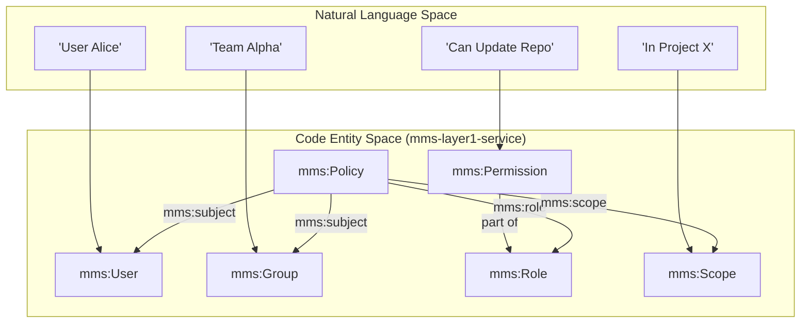
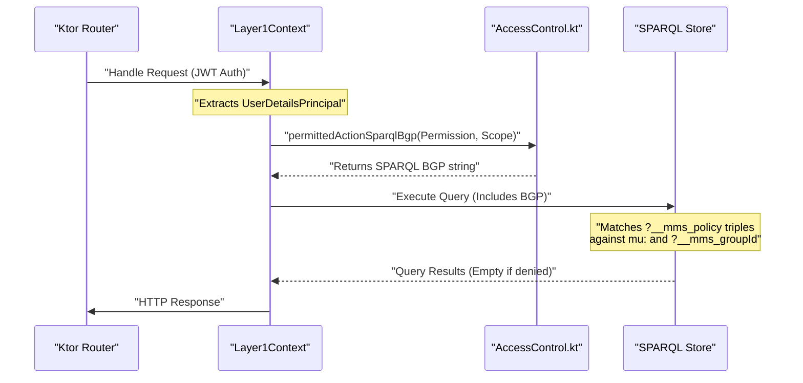

# Page: Access Control

# Access Control

Relevant source files

The following files were used as context for generating this wiki page:

- [deploy/src/main.ts](deploy/src/main.ts)
- [src/main/kotlin/org/openmbee/flexo/mms/AccessControl.kt](src/main/kotlin/org/openmbee/flexo/mms/AccessControl.kt)
- [src/main/kotlin/org/openmbee/flexo/mms/routes/Groups.kt](src/main/kotlin/org/openmbee/flexo/mms/routes/Groups.kt)
- [src/main/kotlin/org/openmbee/flexo/mms/routes/Policies.kt](src/main/kotlin/org/openmbee/flexo/mms/routes/Policies.kt)
- [src/main/kotlin/org/openmbee/flexo/mms/routes/ldp/GroupRead.kt](src/main/kotlin/org/openmbee/flexo/mms/routes/ldp/GroupRead.kt)
- [src/main/kotlin/org/openmbee/flexo/mms/server/Authentication.kt](src/main/kotlin/org/openmbee/flexo/mms/server/Authentication.kt)

The Flexo MMS Layer 1 Service implements a fine-grained, RDF-based access control model. It governs interactions between **Agents** (Users and Groups) and resources by evaluating **Policies** that grant **Roles** within specific **Scopes**. Authorization is enforced at the SPARQL layer by injecting graph patterns that validate permissions against the triple store's access control metadata.

### System Components

The access control system is composed of four primary pillars:

1.  **Identity (Agents)**: Represented by `mms:User` and `mms:Group` entities [deploy/src/main.ts:270-275]().
2.  **Permissions & Roles**: A hierarchical set of actions (Create, Read, Update, Delete) grouped into functional roles (e.g., `AdminRepo`, `AdminModel`) [src/main/kotlin/org/openmbee/flexo/mms/AccessControl.kt:5-112]().
3.  **Scopes**: The resource boundary where a role applies (e.g., a specific Org, Repo, or the entire Cluster) [src/main/kotlin/org/openmbee/flexo/mms/AccessControl.kt:12-28]().
4.  **Policies**: The binding entity that links a Subject (Agent) to a Role at a specific Scope [deploy/src/main.ts:203-219]().

### Access Control Architecture

The following diagram illustrates how natural language access concepts map to the code entities and RDF classes within the service.

**Conceptual to Code Mapping**

**Sources:** [src/main/kotlin/org/openmbee/flexo/mms/AccessControl.kt:5-112](), [deploy/src/main.ts:269-278]()

### Access Control Model and Schema
The foundational schema for access control is defined in RDF and initialized during the cluster deployment. The system uses an implication hierarchy where certain permissions imply others (e.g., `Update` implies `Read`). Scopes also follow a hierarchical structure; a policy defined at the `Cluster` scope (`m:`) implies access to all child `Orgs` and `Repos` via the `mms:implies` property and RDFS subClassOf reasoning.

For details on the RDF ontology and the schema generator, see [Access Control Model and Schema](#4.1).

**Sources:** [deploy/src/main.ts:59-109](), [src/main/kotlin/org/openmbee/flexo/mms/AccessControl.kt:12-38](), [deploy/src/main.ts:302-305]()

### Groups and Policies API
The service provides RESTful endpoints to manage the lifecycle of Groups and Policies. These endpoints use the Linked Data Platform (LDP) pattern, allowing administrators to create, replace, and read access control entities. Group and Policy IDs are validated against an LDAP-compatible regex (`LDAP_COMPATIBLE_SLUG_REGEX`) to ensure interoperability with external identity providers.

For details on the management endpoints, see [Groups and Policies API](#4.2).

| Resource | Path | Code Reference |
| :--- | :--- | :--- |
| **Groups** | `/groups/{groupId}` | [src/main/kotlin/org/openmbee/flexo/mms/routes/Groups.kt:44-77]() |
| **Policies** | `/policies/{policyId}` | [src/main/kotlin/org/openmbee/flexo/mms/routes/Policies.kt:26-32]() |

**Sources:** [src/main/kotlin/org/openmbee/flexo/mms/AccessControl.kt:3-3](), [src/main/kotlin/org/openmbee/flexo/mms/routes/Groups.kt:18-41]()

### Runtime Permission Enforcement
Authorization is not a separate middleware check but is integrated directly into the SPARQL queries that fetch or modify data. The function `permittedActionSparqlBgp` generates a Basic Graph Pattern (BGP) that traverses the `m-graph:AccessControl.Policies` and `m-graph:AccessControl.Definitions` graphs to verify that the requesting user (identified via JWT claims like `username` and `groups`) has the required permission.

For details on the SPARQL generation and enforcement logic, see [Runtime Permission Enforcement](#4.3).

**Enforcement Flow Diagram**

**Sources:** [src/main/kotlin/org/openmbee/flexo/mms/AccessControl.kt:115-185](), [src/main/kotlin/org/openmbee/flexo/mms/routes/ldp/GroupRead.kt:32-35](), [src/main/kotlin/org/openmbee/flexo/mms/server/Authentication.kt:23-30]()
