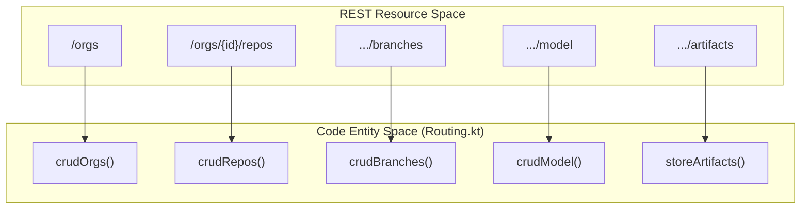
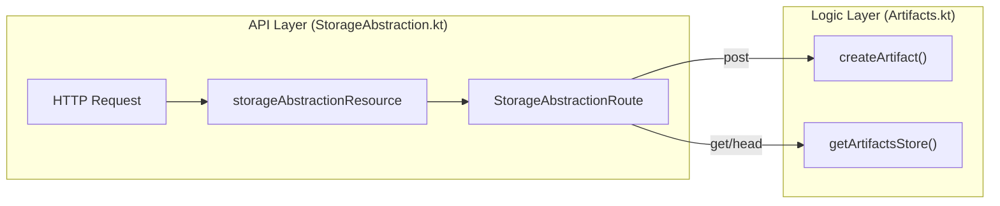

# Page: API Routes

# API Routes

Relevant source files

The following files were used as context for generating this wiki page:

- [src/main/kotlin/org/openmbee/flexo/mms/routes/Artifacts.kt](src/main/kotlin/org/openmbee/flexo/mms/routes/Artifacts.kt)
- [src/main/kotlin/org/openmbee/flexo/mms/routes/Orgs.kt](src/main/kotlin/org/openmbee/flexo/mms/routes/Orgs.kt)
- [src/main/kotlin/org/openmbee/flexo/mms/routes/Repos.kt](src/main/kotlin/org/openmbee/flexo/mms/routes/Repos.kt)
- [src/main/kotlin/org/openmbee/flexo/mms/routes/gsp/RepoRead.kt](src/main/kotlin/org/openmbee/flexo/mms/routes/gsp/RepoRead.kt)
- [src/main/kotlin/org/openmbee/flexo/mms/server/GraphStore.kt](src/main/kotlin/org/openmbee/flexo/mms/server/GraphStore.kt)
- [src/main/kotlin/org/openmbee/flexo/mms/server/LinkedDataPlatform.kt](src/main/kotlin/org/openmbee/flexo/mms/server/LinkedDataPlatform.kt)
- [src/main/kotlin/org/openmbee/flexo/mms/server/Protocol.kt](src/main/kotlin/org/openmbee/flexo/mms/server/Protocol.kt)
- [src/main/kotlin/org/openmbee/flexo/mms/server/Routing.kt](src/main/kotlin/org/openmbee/flexo/mms/server/Routing.kt)
- [src/main/kotlin/org/openmbee/flexo/mms/server/StorageAbstraction.kt](src/main/kotlin/org/openmbee/flexo/mms/server/StorageAbstraction.kt)

The Flexo MMS Layer 1 Service exposes a RESTful API designed around Linked Data Principles. It organizes resources into a hierarchy of Organizations, Repositories, and Versioning elements (Branches, Locks, Commits). The service utilizes three primary routing patterns to handle different interaction models: **Linked Data Platform (LDP)** for resource management, **Graph Store Protocol (GSP)** for RDF payload handling, and **SPARQL** for complex querying and updates.

### Route Registration
All routes are registered within the Ktor `Application.configureRouting()` function and are wrapped in an `authenticate` block to ensure that every request is associated with a valid agent context [[src/main/kotlin/org/openmbee/flexo/mms/server/Routing.kt:86-124]](). The routing table uses specialized DSL builders like `linkedDataPlatformDirectContainer` [[src/main/kotlin/org/openmbee/flexo/mms/server/LinkedDataPlatform.kt:196-217]](), `graphStoreProtocol` [[src/main/kotlin/org/openmbee/flexo/mms/server/GraphStore.kt:113-133]](), and `storageAbstractionResource` [[src/main/kotlin/org/openmbee/flexo/mms/server/StorageAbstraction.kt:102-122]]() to standardize protocol behavior.

The following diagram maps the high-level REST concepts to the internal Ktor routing functions:

**Route Registration Mapping**

Sources: [src/main/kotlin/org/openmbee/flexo/mms/server/Routing.kt:91-122]()

---

### Organizations and Repositories
Organizations (`mms:Org`) serve as the top-level containers, while Repositories (`mms:Repo`) hold the versioned graph data. These resources are managed via LDP Direct Containers, allowing for standard CRUD operations and metadata management [[src/main/kotlin/org/openmbee/flexo/mms/routes/Orgs.kt:17-93]](). Creating a repository automatically initializes its metadata graph, including the root commit and the `master` branch [[src/main/kotlin/org/openmbee/flexo/mms/routes/Repos.kt:20-113]]().

For details, see [Organizations and Repositories](#3.1).

### Branches and Locks
The service distinguishes between mutable and immutable references to the model state:
*   **Branches**: Mutable references (Staging snapshots) that can receive updates.
*   **Locks**: Immutable snapshots of the model at a specific point in time.

Both are managed under the `/branches` and `/locks` paths respectively using `linkedDataPlatformDirectContainer` abstractions [[src/main/kotlin/org/openmbee/flexo/mms/server/Routing.kt:94-95]]().

For details, see [Branches and Locks](#3.2).

### Model Graph Operations
Model data is accessed and modified through the `/model` endpoint relative to a branch or lock [[src/main/kotlin/org/openmbee/flexo/mms/server/Routing.kt:107-108]](). This subsystem supports:
*   **GSP (Graph Store Protocol)**: For bulk `PUT` (load) and `GET` (read) operations [[src/main/kotlin/org/openmbee/flexo/mms/server/GraphStore.kt:113-133]]().
*   **SPARQL Update**: For fine-grained modifications via `POST` or `PATCH` [[src/main/kotlin/org/openmbee/flexo/mms/server/GraphStore.kt:172-225]]().
*   **SPARQL Query**: For reading data using standard SELECT/CONSTRUCT queries [[src/main/kotlin/org/openmbee/flexo/mms/server/Routing.kt:118-120]]().

For details, see [Model Graph Operations](#3.3).

### Commits, Diffs, and Squash
The versioning engine tracks every change as a `mms:Commit`.
*   **Commits**: Permanent records of changes including `insGraph` (additions) and `delGraph` (deletions) [[src/main/kotlin/org/openmbee/flexo/mms/server/Routing.kt:96]]().
*   **Diffs**: Computation of differences between any two refs [[src/main/kotlin/org/openmbee/flexo/mms/server/Routing.kt:97]]().
*   **Squash**: An administrative operation to collapse a range of commits into a single entry to optimize graph materialization [[src/main/kotlin/org/openmbee/flexo/mms/server/Routing.kt:98]]().

For details, see [Commits, Diffs, and Squash](#3.4).

### Collections
Collections allow users to aggregate multiple references (Branches, Locks, or Scratches) into a single virtual graph. This enables cross-ref SPARQL queries without needing to physically merge data [[src/main/kotlin/org/openmbee/flexo/mms/server/Routing.kt:109]]().

For details, see [Collections](#3.5).

### Scratches
Scratches provide temporary, non-versioned RDF workspaces. They are useful for staging data or performing complex transformations before committing them to a branch. They support standard GSP and SPARQL operations [[src/main/kotlin/org/openmbee/flexo/mms/server/Routing.kt:103-105]]().

For details, see [Scratches](#3.6).

### Artifacts
The Artifacts subsystem manages opaque data blobs (e.g., images, PDF exports, binaries). These are stored under the `/artifacts` path [[src/main/kotlin/org/openmbee/flexo/mms/routes/Artifacts.kt:17]]() and use a `storageAbstractionResource` to decouple the API from the underlying storage strategy [[src/main/kotlin/org/openmbee/flexo/mms/server/StorageAbstraction.kt:102-122]]().

**Artifact Storage Abstraction**

Sources: [src/main/kotlin/org/openmbee/flexo/mms/routes/Artifacts.kt:22-78](), [src/main/kotlin/org/openmbee/flexo/mms/server/StorageAbstraction.kt:102-172]()

For details, see [Artifacts](#3.7).

---
**Sources:**
* [src/main/kotlin/org/openmbee/flexo/mms/server/Routing.kt:86-124]()
* [src/main/kotlin/org/openmbee/flexo/mms/routes/Orgs.kt:14-93]()
* [src/main/kotlin/org/openmbee/flexo/mms/routes/Repos.kt:14-113]()
* [src/main/kotlin/org/openmbee/flexo/mms/routes/Artifacts.kt:13-78]()
* [src/main/kotlin/org/openmbee/flexo/mms/server/StorageAbstraction.kt:102-172]()
* [src/main/kotlin/org/openmbee/flexo/mms/server/LinkedDataPlatform.kt:196-217]()
* [src/main/kotlin/org/openmbee/flexo/mms/server/GraphStore.kt:113-133]()
