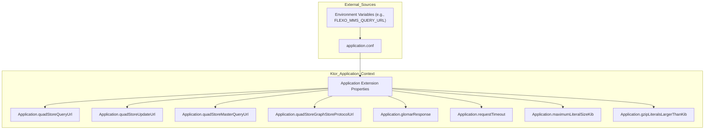
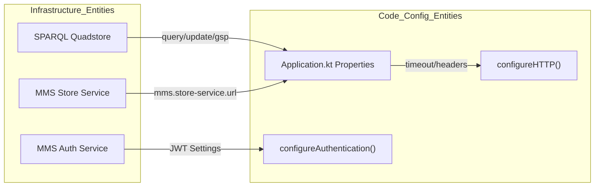

# Page: Application Configuration

# Application Configuration

Relevant source files

The following files were used as context for generating this wiki page:

- [.gitignore](.gitignore)
- [deploy/README.md](deploy/README.md)
- [docs/index.rst](docs/index.rst)
- [resource/crud.postman_collection.json](resource/crud.postman_collection.json)
- [src/main/kotlin/org/openmbee/flexo/mms/Application.kt](src/main/kotlin/org/openmbee/flexo/mms/Application.kt)
- [src/main/kotlin/org/openmbee/flexo/mms/server/BuildInfo.kt](src/main/kotlin/org/openmbee/flexo/mms/server/BuildInfo.kt)
- [src/main/kotlin/org/openmbee/flexo/mms/server/HTTP.kt](src/main/kotlin/org/openmbee/flexo/mms/server/HTTP.kt)
- [src/main/resources/application.conf.example](src/main/resources/application.conf.example)
- [src/main/resources/application.conf.test](src/main/resources/application.conf.test)
- [src/main/resources/logback.xml](src/main/resources/logback.xml)

The Flexo MMS Layer 1 Service is configured primarily through a HOCON (Human-Optimized Config Object Notation) file, typically `application.conf`. This configuration defines the connection parameters for the underlying RDF quad-store, security settings for JWT authentication, and performance-related thresholds for data storage and retrieval.

## Configuration Loading and Access

The application utilizes Ktor's environment configuration to load settings. Key properties are exposed via extension properties on the `Application` class in [src/main/kotlin/org/openmbee/flexo/mms/Application.kt](), allowing for centralized access throughout the service's lifecycle.

### Configuration Data Flow

The following diagram illustrates how configuration values flow from the `application.conf` file (and environment variables) into the internal `Application` extension properties used by the service components.

**Configuration Mapping Diagram**

**Sources:** [src/main/kotlin/org/openmbee/flexo/mms/Application.kt:21-88](), [src/main/resources/application.conf.example:1-63]()

---

## Quad-Store Settings

The service requires a SPARQL 1.1 compliant quad-store. Configuration supports splitting traffic between reader and writer instances to handle replica lag.

| Property | Env Variable | Description |
| :--- | :--- | :--- |
| `mms.quad-store.query-url` | `FLEXO_MMS_QUERY_URL` | Endpoint for SPARQL SELECT/CONSTRUCT/ASK queries [src/main/kotlin/org/openmbee/flexo/mms/Application.kt:21-22](). |
| `mms.quad-store.update-url` | `FLEXO_MMS_UPDATE_URL` | Endpoint for SPARQL UPDATE operations [src/main/kotlin/org/openmbee/flexo/mms/Application.kt:27-28](). |
| `mms.quad-store.master-query-url` | `FLEXO_MMS_MASTER_QUERY_URL` | Query endpoint on the writer node. Used to verify writes immediately after updates to avoid replica lag issues [src/main/kotlin/org/openmbee/flexo/mms/Application.kt:35-38](). |
| `mms.quad-store.graph-store-protocol-url` | `FLEXO_MMS_GRAPH_STORE_PROTOCOL_URL` | Endpoint for [Graph Store Protocol](https://www.w3.org/TR/sparql11-http-rdf-update/) operations [src/main/kotlin/org/openmbee/flexo/mms/Application.kt:43-44](). |
| `mms.quad-store.graph-store-protocol-accepts` | `FLEXO_MMS_GRAPH_STORE_PROTOCOL_ACCEPTS` | Comma-separated RDF content types accepted by the GSP backend [src/main/kotlin/org/openmbee/flexo/mms/Application.kt:49-50](). |

**Sources:** [src/main/kotlin/org/openmbee/flexo/mms/Application.kt:21-51](), [src/main/resources/application.conf.example:27-38](), [docs/index.rst:117-138]()

---

## Application Behavior and Performance

These settings control how the Layer 1 service manages data internally and how it responds to unauthorized requests.

### Security and Privacy
*   **Glomar Response (`mms.application.glomar-response`)**: If set to `true`, the service returns a `404 Not Found` instead of `403 Forbidden` for unauthorized requests. This prevents information leakage by neither confirming nor denying the existence of a resource [src/main/kotlin/org/openmbee/flexo/mms/Application.kt:67-68]().

### Data Optimization
*   **Maximum Literal Size (`mms.application.maximum-literal-size-kib`)**: Defines the maximum size (in KiB) for string literals stored in the commit history. Large patches exceeding this threshold (default 60 MiB) will not be stored in the triplestore [src/main/kotlin/org/openmbee/flexo/mms/Application.kt:73-74](), [src/main/resources/application.conf.example:8-9]().
*   **GZIP Compression (`mms.application.gzip-literals-larger-than-kib`)**: Literals exceeding this size threshold (default 512 KiB) are GZIP compressed before being stored in the triplestore to save space [src/main/kotlin/org/openmbee/flexo/mms/Application.kt:79-80](), [src/main/resources/application.conf.example:12-13]().

### Request Management
*   **Request Timeout (`mms.application.request-timeout`)**: The maximum duration (in seconds) the service will wait for a response from the backend quad-store before timing out the request. Defaults to 1800 seconds (30 minutes) [src/main/kotlin/org/openmbee/flexo/mms/Application.kt:85-88](), [src/main/resources/application.conf.example:16-17]().

**Sources:** [src/main/kotlin/org/openmbee/flexo/mms/Application.kt:65-88](), [src/main/resources/application.conf.example:1-18]()

---

## JWT Authentication Settings

The service uses JSON Web Tokens (JWT) for authentication. The configuration defines the validation parameters for incoming tokens, typically shared with the Flexo MMS Auth Service.

| HOCON Path | Env Variable | Description |
| :--- | :--- | :--- |
| `jwt.domain` | `JWT_DOMAIN` | The issuer domain of the JWT provider [src/main/resources/application.conf.example:55-56](). |
| `jwt.audience` | `JWT_AUDIENCE` | The intended recipient of the token [src/main/resources/application.conf.example:57-58](). |
| `jwt.realm` | `JWT_REALM` | The authentication realm name [src/main/resources/application.conf.example:59-60](). |
| `jwt.secret` | `JWT_SECRET` | The secret key used for signing/verifying tokens [src/main/resources/application.conf.example:61-62](). |

**Sources:** [src/main/resources/application.conf.example:54-63](), [docs/index.rst:43-62]()

---

## Store Service and Global Constants

The service can optionally integrate with an external `store-service` (such as the MMS Load service) for managing large model loads or external RDF data.

*   **Store Service URL (`mms.store-service.url`)**: The base URL for the external store service [src/main/kotlin/org/openmbee/flexo/mms/Application.kt:55-56]().
*   **Store Service Accepts (`mms.store-service.accepts`)**: Content types supported by the external store [src/main/kotlin/org/openmbee/flexo/mms/Application.kt:61-62]().

### Initialization and Root Context
The quad-store must be initialized with a context that matches the service's configuration.
*   **`ROOT_CONTEXT`**: The base URI for all resources. This is critical for producing dereferenceable IRIs and must match the URL provided to the `cluster.trig` initialization script [docs/index.rst:66-70](), [docs/index.rst:91-103]().

**Service Entity Diagram**

**Sources:** [src/main/kotlin/org/openmbee/flexo/mms/Application.kt:53-63](), [src/main/kotlin/org/openmbee/flexo/mms/server/HTTP.kt:14-63](), [docs/index.rst:4-7]()
