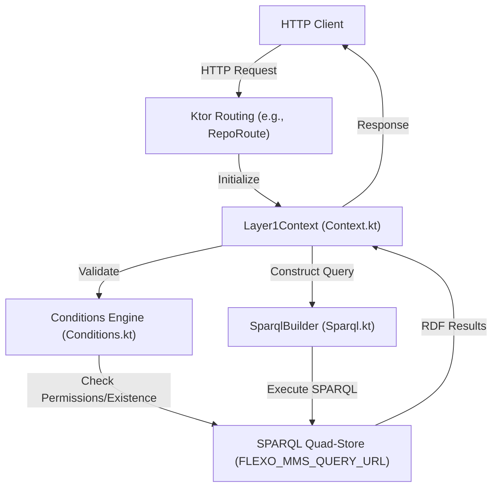
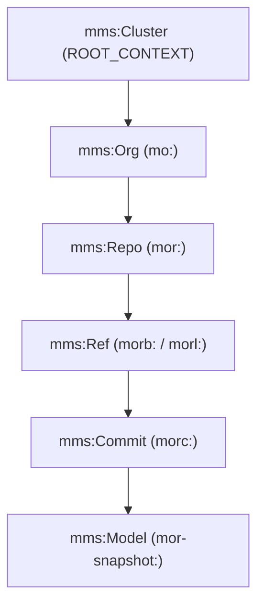

# Page: Architecture Overview

# Architecture Overview

Relevant source files

The following files were used as context for generating this wiki page:

- [deploy/README.md](deploy/README.md)
- [diagrams/mms5-access-control.png](diagrams/mms5-access-control.png)
- [diagrams/mms5-cluster.png](diagrams/mms5-cluster.png)
- [diagrams/mms5-commits.png](diagrams/mms5-commits.png)
- [diagrams/mms5-graphs-crud.png](diagrams/mms5-graphs-crud.png)
- [diagrams/mms5-graphs.drawio](diagrams/mms5-graphs.drawio)
- [diagrams/mms5-graphs.png](diagrams/mms5-graphs.png)
- [diagrams/mms5-versioning.png](diagrams/mms5-versioning.png)
- [docs/index.rst](docs/index.rst)
- [resource/crud.postman_collection.json](resource/crud.postman_collection.json)
- [src/main/kotlin/org/openmbee/flexo/mms/Namespaces.kt](src/main/kotlin/org/openmbee/flexo/mms/Namespaces.kt)
- [src/test/kotlin/org/openmbee/flexo/mms/AnyAny.kt](src/test/kotlin/org/openmbee/flexo/mms/AnyAny.kt)

The Flexo MMS Layer 1 Service is a middle-tier metadata management service that provides a version-controlled, RESTful API over a SPARQL quad-store. It acts as the primary interface for managing organizations, repositories, and model data within the Open-MBEE Flexo ecosystem.

## Tiered Architecture

The system follows a tiered architecture where the application logic (Layer 1) abstracts the complexities of RDF graph management and SPARQL execution from the end user.

1.  **API Layer (Ktor):** Handles HTTP requests, authentication, and content negotiation.
2.  **Logic Layer (`Layer1Context`):** Manages the request lifecycle, including transaction IDs, precondition evaluation (ETags), and permission checks [src/main/kotlin/org/openmbee/flexo/mms/Context.kt:41-43]().
3.  **Data Layer (SPARQL/RDF):** Interfaces with a quad-store (e.g., Fuseki or Blazegraph) using the SPARQL Graph Store Protocol (GSP) and standard SPARQL 1.1 Query/Update [docs/index.rst:4-35]().

### System Component Relationship

The following diagram illustrates how the core code entities interact to process a request and interact with the quad-store.

**Diagram: Request Flow and Code Entity Interaction**

Sources: [src/main/kotlin/org/openmbee/flexo/mms/Context.kt:41-150](), [src/main/kotlin/org/openmbee/flexo/mms/Sparql.kt:13-15](), [docs/index.rst:16-30]()

---

## RDF Data Model and Named Graphs

The service uses a sophisticated named graph structure to isolate metadata, access control, and model data. All resources are identified by URIs and organized into specific graph contexts.

### Key Named Graphs
*   **Cluster Graph (`m-graph:Cluster`):** Contains the root cluster declaration.
*   **Access Control Graphs:**
    *   `ma:Agents`: Stores Users and Groups.
    *   `ma:Policies`: Stores Policies linking subjects to roles and scopes.
    *   `ma:Definitions`: Contains the ontology for roles and permissions.
*   **Metadata Graphs:** Each Org and Repo has its own metadata graph (e.g., `mor-graph:Metadata`) storing branches, commits, and locks [src/main/kotlin/org/openmbee/flexo/mms/Namespaces.kt:145-155]().
*   **Model Graphs:** The actual user-contributed RDF data, versioned via commits.

### Resource Hierarchy and Scopes
The data model implements a hierarchy where permissions at a higher scope imply permissions at lower scopes (Cluster -> Org -> Repo -> Ref).

**Diagram: Logical Resource Hierarchy and Code Prefixes**

Sources: [src/main/kotlin/org/openmbee/flexo/mms/Namespaces.kt:75-166](), [deploy/src/main.ts:1-100]()

---

## Namespace and URI Strategy

The service relies on a strict URI strategy defined in `Namespaces.kt`. This allows the system to deterministically generate graph URIs and resource identifiers based on IDs provided in the path parameters.

| Prefix | Base URI Path | Description |
| :--- | :--- | :--- |
| `mms` | `https://mms.openmbee.org/rdf/ontology/` | Core MMS Ontology [src/main/kotlin/org/openmbee/flexo/mms/Namespaces.kt:68-68]() |
| `mo` | `.../orgs/{orgId}` | Organization Resource [src/main/kotlin/org/openmbee/flexo/mms/Namespaces.kt:132-132]() |
| `mor` | `.../orgs/{orgId}/repos/{repoId}` | Repository Resource [src/main/kotlin/org/openmbee/flexo/mms/Namespaces.kt:147-147]() |
| `morb` | `.../branches/{branchId}` | Branch Resource [src/main/kotlin/org/openmbee/flexo/mms/Namespaces.kt:158-158]() |
| `morc` | `.../commits/{commitId}` | Commit Resource [src/main/kotlin/org/openmbee/flexo/mms/Namespaces.kt:192-192]() |

The `prefixesFor` function is the primary utility used to construct the `PrefixMapBuilder` for a specific request context [src/main/kotlin/org/openmbee/flexo/mms/Namespaces.kt:90-106]().

Sources: [src/main/kotlin/org/openmbee/flexo/mms/Namespaces.kt:10-210]()

---

## Transaction and Lifecycle Management

Every mutating operation in the service is treated as a transaction. A `mms:Transaction` object (prefixed with `mt:`) is created in the quad-store to track the metadata of the change, including the user, timestamp, and the specific resources (Org, Repo, Branch) affected [src/test/kotlin/org/openmbee/flexo/mms/AnyAny.kt:10-31]().

### Request Lifecycle
1.  **Authentication:** The Ktor `Authentication` plugin verifies the JWT and extracts the `userId` [src/main/kotlin/org/openmbee/flexo/mms/Context.kt:58]().
2.  **Context Initialization:** `Layer1Context` is created, generating a unique `transactionId` [src/main/kotlin/org/openmbee/flexo/mms/Context.kt:66]().
3.  **Precondition Check:** The system evaluates `Conditions` (e.g., checking if the resource exists or if the `If-Match` ETag is valid) [src/main/kotlin/org/openmbee/flexo/mms/Context.kt:143-150]().
4.  **SPARQL Execution:** The primary query or update is executed against the quad-store.
5.  **Response Generation:** The results are transformed into the requested RDF serialization (JSON-LD, Turtle, etc.) and returned with an ETag.

Sources: [src/main/kotlin/org/openmbee/flexo/mms/Context.kt:41-150](), [src/test/kotlin/org/openmbee/flexo/mms/AnyAny.kt:10-31]()
