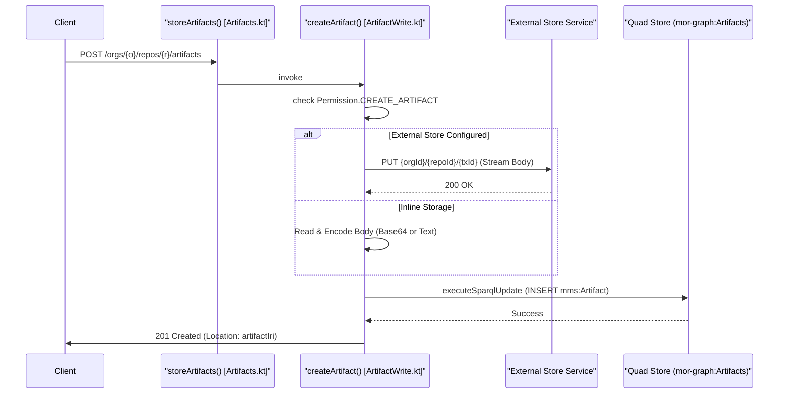
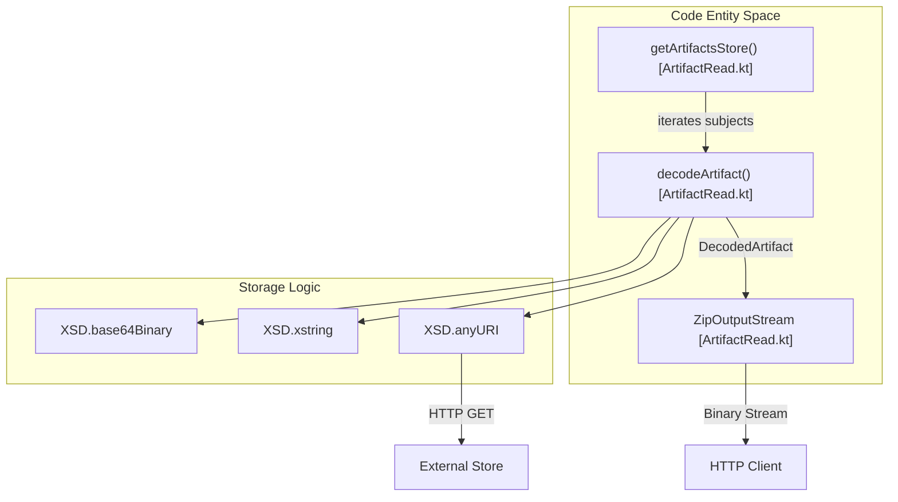

# Page: Artifacts

# Artifacts

Relevant source files

The following files were used as context for generating this wiki page:

- [src/main/kotlin/org/openmbee/flexo/mms/routes/Artifacts.kt](src/main/kotlin/org/openmbee/flexo/mms/routes/Artifacts.kt)
- [src/main/kotlin/org/openmbee/flexo/mms/routes/Repos.kt](src/main/kotlin/org/openmbee/flexo/mms/routes/Repos.kt)
- [src/main/kotlin/org/openmbee/flexo/mms/routes/gsp/RepoRead.kt](src/main/kotlin/org/openmbee/flexo/mms/routes/gsp/RepoRead.kt)
- [src/main/kotlin/org/openmbee/flexo/mms/routes/store/ArtifactStoreRead.kt](src/main/kotlin/org/openmbee/flexo/mms/routes/store/ArtifactStoreRead.kt)
- [src/main/kotlin/org/openmbee/flexo/mms/routes/store/ArtifactWrite.kt](src/main/kotlin/org/openmbee/flexo/mms/routes/store/ArtifactWrite.kt)
- [src/main/kotlin/org/openmbee/flexo/mms/server/Routing.kt](src/main/kotlin/org/openmbee/flexo/mms/server/Routing.kt)
- [src/main/kotlin/org/openmbee/flexo/mms/server/StorageAbstraction.kt](src/main/kotlin/org/openmbee/flexo/mms/server/StorageAbstraction.kt)
- [src/test/kotlin/org/openmbee/flexo/mms/ArtifactAny.kt](src/test/kotlin/org/openmbee/flexo/mms/ArtifactAny.kt)

The Artifact storage subsystem provides a mechanism for storing and retrieving opaque data blobs associated with a repository. Unlike model data, which is parsed as RDF, artifacts are treated as binary or text payloads with associated metadata (e.g., content type, creation time, and owner) stored in the repository's metadata graph.

## Storage Strategies

The system supports three distinct strategies for storing artifact data, determined by the server configuration and the request's content type:

| Strategy | Storage Location | Trigger Condition |
| :--- | :--- | :--- |
| **Inline Text** | RDF Literal (`xsd:string`) | `storeServiceUrl` is null AND Content-Type starts with `text/` [src/main/kotlin/org/openmbee/flexo/mms/routes/store/ArtifactWrite.kt:55-58]() |
| **Base64 Binary** | RDF Literal (`xsd:base64Binary`) | `storeServiceUrl` is null AND Content-Type is non-text [src/main/kotlin/org/openmbee/flexo/mms/routes/store/ArtifactWrite.kt:59-61]() |
| **External Store** | External Service via HTTP PUT | `storeServiceUrl` is configured in `application.conf` [src/main/kotlin/org/openmbee/flexo/mms/routes/store/ArtifactWrite.kt:32-53]() |

### External Store Service
When an external store service is configured, the Layer 1 service acts as a proxy. It streams the incoming request body to the external service using a generated path based on the organization, repository, and transaction ID: `{orgId}/{repoId}/{transactionId}` [src/main/kotlin/org/openmbee/flexo/mms/routes/store/ArtifactWrite.kt:34-50](). The resulting URI is stored in the RDF metadata using the `xsd:anyURI` datatype [src/main/kotlin/org/openmbee/flexo/mms/routes/store/ArtifactWrite.kt:53-53]().

## Data Flow: Creating an Artifact

The creation process involves validating permissions, persisting the blob (using one of the strategies above), and recording the metadata in the `mor-graph:Artifacts` named graph.

### Artifact Creation Sequence
The following diagram maps the logical flow to specific code entities during a `POST` request to the artifacts endpoint.

**Title: Artifact Creation Flow**

Sources: [src/main/kotlin/org/openmbee/flexo/mms/routes/Artifacts.kt:47-49](), [src/main/kotlin/org/openmbee/flexo/mms/routes/store/ArtifactWrite.kt:16-62](), [src/main/kotlin/org/openmbee/flexo/mms/routes/store/ArtifactWrite.kt:65-96]()

## Data Flow: Retrieving Artifacts

Artifacts can be retrieved individually or in bulk. The retrieval process uses the `decodeArtifact` utility to resolve the data regardless of which storage strategy was used during creation.

### Decoding Logic
The `decodeArtifact` function handles the polymorphic nature of the `mms:body` property:
1. **Base64**: Decodes the literal string into a `ByteArray` [src/main/kotlin/org/openmbee/flexo/mms/routes/store/ArtifactRead.kt:71-73]().
2. **String**: Returns the literal string as `bodyText` [src/main/kotlin/org/openmbee/flexo/mms/routes/store/ArtifactRead.kt:75-77]().
3. **URI**: Performs an internal GET request to the `storeServiceUrl` to fetch the binary content [src/main/kotlin/org/openmbee/flexo/mms/routes/store/ArtifactRead.kt:78-91]().

### Bulk Download (ZIP)
If the `download` query parameter is present when requesting the artifacts collection, the service generates a ZIP file containing all artifacts the user is authorized to read [src/main/kotlin/org/openmbee/flexo/mms/routes/store/ArtifactRead.kt:175-202]().
- **Filenames**: Generated using the artifact's extension (derived from its `mms:contentType`) [src/main/kotlin/org/openmbee/flexo/mms/routes/store/ArtifactRead.kt:31-43]().
- **Permissions**: Enforced via `permittedActionSparqlBgp(Permission.READ_ARTIFACT, Scope.REPO)` within the SPARQL CONSTRUCT query [src/main/kotlin/org/openmbee/flexo/mms/routes/store/ArtifactRead.kt:127-127]().

**Title: Artifact Retrieval and Decoding**

Sources: [src/main/kotlin/org/openmbee/flexo/mms/routes/store/ArtifactRead.kt:49-96](), [src/main/kotlin/org/openmbee/flexo/mms/routes/store/ArtifactRead.kt:98-129](), [src/main/kotlin/org/openmbee/flexo/mms/routes/store/ArtifactRead.kt:201-215]()

## Routing and Endpoints

The artifact routes are registered within the `storeArtifacts()` function and use the `storageAbstractionResource` helper [src/main/kotlin/org/openmbee/flexo/mms/routes/Artifacts.kt:22-24]().

| Method | Path | Description |
| :--- | :--- | :--- |
| `GET` | `/orgs/{orgId}/repos/{repoId}/artifacts` | List all artifacts or download as ZIP (if `?download` is set) [src/main/kotlin/org/openmbee/flexo/mms/routes/Artifacts.kt:42-44]() |
| `POST` | `/orgs/{orgId}/repos/{repoId}/artifacts` | Create a new artifact [src/main/kotlin/org/openmbee/flexo/mms/routes/Artifacts.kt:47-49]() |
| `GET` | `/orgs/{orgId}/repos/{repoId}/artifacts/{artifactId}` | Retrieve a specific artifact's metadata or body [src/main/kotlin/org/openmbee/flexo/mms/routes/Artifacts.kt:71-73]() |
| `HEAD` | `/orgs/{orgId}/repos/{repoId}/artifacts/{artifactId}` | Check existence and metadata of an artifact [src/main/kotlin/org/openmbee/flexo/mms/routes/Artifacts.kt:66-68]() |

### Preconditions and Permissions
All artifact operations are governed by `ARTIFACT_QUERY_CONDITIONS` and require specific permissions:
- **Creation**: `Permission.CREATE_ARTIFACT` at `Scope.REPO` [src/main/kotlin/org/openmbee/flexo/mms/routes/store/ArtifactWrite.kt:25-25]().
- **Reading**: `Permission.READ_ARTIFACT` at `Scope.REPO` [src/main/kotlin/org/openmbee/flexo/mms/routes/store/ArtifactRead.kt:116-116]().

Sources: [src/main/kotlin/org/openmbee/flexo/mms/routes/Artifacts.kt:17-78](), [src/main/kotlin/org/openmbee/flexo/mms/routes/store/ArtifactWrite.kt:23-26](), [src/main/kotlin/org/openmbee/flexo/mms/routes/store/ArtifactRead.kt:127-127]()
