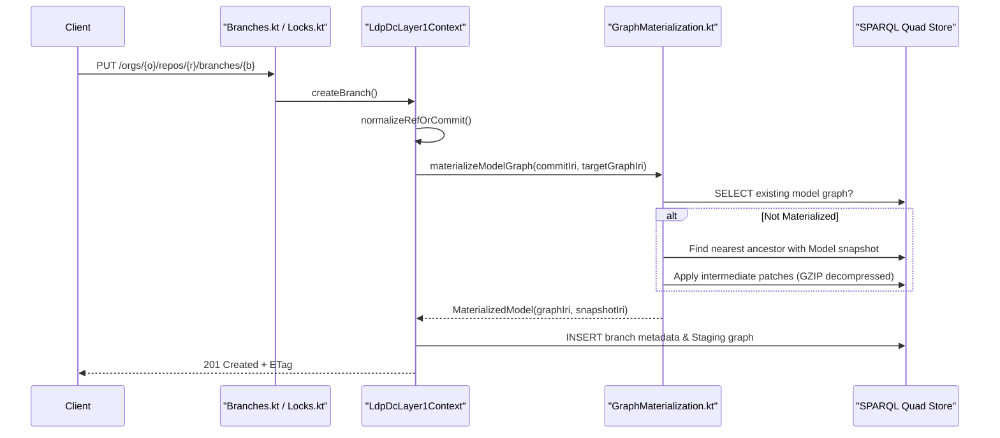
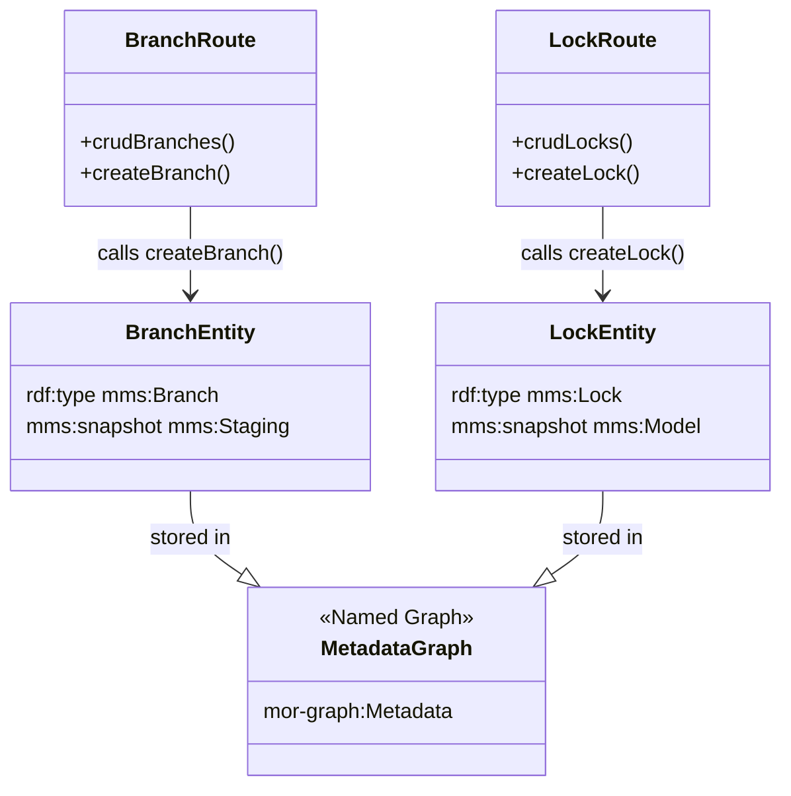

# Page: Branches and Locks

# Branches and Locks

Relevant source files

The following files were used as context for generating this wiki page:

- [src/main/kotlin/org/openmbee/flexo/mms/Errors.kt](src/main/kotlin/org/openmbee/flexo/mms/Errors.kt)
- [src/main/kotlin/org/openmbee/flexo/mms/routes/Locks.kt](src/main/kotlin/org/openmbee/flexo/mms/routes/Locks.kt)
- [src/main/kotlin/org/openmbee/flexo/mms/routes/ldp/BranchRead.kt](src/main/kotlin/org/openmbee/flexo/mms/routes/ldp/BranchRead.kt)
- [src/main/kotlin/org/openmbee/flexo/mms/routes/ldp/BranchWrite.kt](src/main/kotlin/org/openmbee/flexo/mms/routes/ldp/BranchWrite.kt)
- [src/main/kotlin/org/openmbee/flexo/mms/routes/ldp/LockRead.kt](src/main/kotlin/org/openmbee/flexo/mms/routes/ldp/LockRead.kt)
- [src/main/kotlin/org/openmbee/flexo/mms/routes/ldp/LockWrite.kt](src/main/kotlin/org/openmbee/flexo/mms/routes/ldp/LockWrite.kt)
- [src/main/kotlin/org/openmbee/flexo/mms/routes/ldp/RepoRead.kt](src/main/kotlin/org/openmbee/flexo/mms/routes/ldp/RepoRead.kt)
- [src/test/kotlin/org/openmbee/flexo/mms/BranchDelete.kt](src/test/kotlin/org/openmbee/flexo/mms/BranchDelete.kt)
- [src/test/kotlin/org/openmbee/flexo/mms/BranchUpdate.kt](src/test/kotlin/org/openmbee/flexo/mms/BranchUpdate.kt)
- [src/test/kotlin/org/openmbee/flexo/mms/LockAny.kt](src/test/kotlin/org/openmbee/flexo/mms/LockAny.kt)
- [src/test/kotlin/org/openmbee/flexo/mms/LockRead.kt](src/test/kotlin/org/openmbee/flexo/mms/LockRead.kt)
- [src/test/kotlin/org/openmbee/flexo/mms/LockWrite.kt](src/test/kotlin/org/openmbee/flexo/mms/LockWrite.kt)
- [src/test/kotlin/org/openmbee/flexo/mms/RefAny.kt](src/test/kotlin/org/openmbee/flexo/mms/RefAny.kt)

This section documents the lifecycle and management of **Branches** and **Locks** within the Flexo MMS Layer 1 Service. Both resources represent pointers to specific commits in a repository's history but differ in their mutability and intended use:
*   **Branches**: Mutable references that track a "Staging" snapshot. They allow updates to the model data through commits.
*   **Locks**: Immutable references that point to a "Model" snapshot. They are intended for baselining or freezing a specific state of the model.

## Conceptual Overview

In the MMS data model, branches and locks are both `mms:Ref` types (references). When created, they must resolve to a specific source commit (either via an explicit commit IRI or by referencing an existing branch/lock).

### Branch vs. Lock Lifecycle
| Feature | Branch (`mms:Branch`) | Lock (`mms:Lock`) |
| :--- | :--- | :--- |
| **Snapshot Type** | `mms:Staging` [src/main/kotlin/org/openmbee/flexo/mms/routes/ldp/BranchWrite.kt:102]() | `mms:Model` [src/main/kotlin/org/openmbee/flexo/mms/routes/ldp/LockWrite.kt:77]() |
| **Mutability** | Mutable (via SPARQL Update/GSP) | Immutable (Metadata only PATCH) |
| **Creation** | Materializes model + copies to Staging | Materializes model only |
| **Permissions** | `mms:Permission.CREATE_BRANCH` | `mms:Permission.CREATE_LOCK` |

Sources: [src/main/kotlin/org/openmbee/flexo/mms/routes/ldp/BranchWrite.kt:14-30](), [src/main/kotlin/org/openmbee/flexo/mms/routes/ldp/LockWrite.kt:14-30]()

## Branch and Lock Creation

Creation is handled via `PUT` or `POST` requests to the LDP containers. The service performs "Graph Materialization" during this process to ensure the new reference has a physical RDF graph representing the state of the model at the target commit.

### Creation Data Flow
The following diagram illustrates the transition from a REST request to the internal materialization logic.

**Ref Creation Process**

Sources: [src/main/kotlin/org/openmbee/flexo/mms/routes/ldp/BranchWrite.kt:32-130](), [src/main/kotlin/org/openmbee/flexo/mms/routes/ldp/LockWrite.kt:32-136](), [src/main/kotlin/org/openmbee/flexo/mms/routes/Locks.kt:42-48]()

### Implementation Details
*   **`createBranch()`**: Initializes a branch by materializing the source commit's model [src/main/kotlin/org/openmbee/flexo/mms/routes/ldp/BranchWrite.kt:70]() and then performing a `COPY` of that graph to a new `mms:Staging` graph [src/main/kotlin/org/openmbee/flexo/mms/routes/ldp/BranchWrite.kt:73-88](). It also creates an auto-policy granting the creator `Role.AdminBranch` [src/main/kotlin/org/openmbee/flexo/mms/routes/ldp/BranchWrite.kt:111-117]().
*   **`createLock()`**: Similar to branch creation, but it points directly to the materialized `mms:Model` snapshot and does not create a staging copy [src/main/kotlin/org/openmbee/flexo/mms/routes/ldp/LockWrite.kt:65-78](). It grants the creator `Role.AdminLock` [src/main/kotlin/org/openmbee/flexo/mms/routes/ldp/LockWrite.kt:84-90]().

## Metadata Reads and Updates

### Read Operations
Metadata for branches and locks is stored in the `mor-graph:Metadata` named graph. Reads are handled via `fetchBranches` and `fetchLocks`.

*   **GET/HEAD**: Returns RDF metadata including the commit IRI, snapshot IRI, and ETag [src/main/kotlin/org/openmbee/flexo/mms/routes/ldp/BranchRead.kt:104-109](), [src/main/kotlin/org/openmbee/flexo/mms/routes/ldp/LockRead.kt:111-119]().
*   **SPARQL BGP**: The system uses a reusable Basic Graph Pattern (BGP) to fetch metadata while enforcing `READ_BRANCH` or `READ_LOCK` permissions [src/main/kotlin/org/openmbee/flexo/mms/routes/ldp/BranchRead.kt:13-35](), [src/main/kotlin/org/openmbee/flexo/mms/routes/ldp/LockRead.kt:14-36]().

### Update Operations (PATCH)
Updates are restricted to metadata (e.g., titles, descriptions).
*   **`guardedPatch`**: Used by both routes to allow partial updates while enforcing `BRANCH_UPDATE_CONDITIONS` or `LOCK_UPDATE_CONDITIONS` [src/main/kotlin/org/openmbee/flexo/mms/routes/Locks.kt:80-102]().
*   **ETag Validation**: PATCH requests require an `If-Match` header which is validated against the `mms:etag` property in the metadata graph via `appendPreconditions` [src/main/kotlin/org/openmbee/flexo/mms/routes/Locks.kt:82-93]().

## Routing and Resource Mapping

The service uses Ktor routing with the `linkedDataPlatformDirectContainer` abstraction to map HTTP methods to the internal logic.

**Code Entity Mapping**
| Route Pattern | Code Function | File |
| :--- | :--- | :--- |
| `/orgs/{...}/branches` | `crudBranches()` | [src/main/kotlin/org/openmbee/flexo/mms/routes/Branches.kt:20]() |
| `/orgs/{...}/locks` | `crudLocks()` | [src/main/kotlin/org/openmbee/flexo/mms/routes/Locks.kt:21]() |
| `POST` (Collection) | `createBranch()` / `createLock()` | [src/main/kotlin/org/openmbee/flexo/mms/routes/ldp/BranchWrite.kt:32](), [src/main/kotlin/org/openmbee/flexo/mms/routes/ldp/LockWrite.kt:32]() |
| `GET` (Individual) | `getBranches()` / `getLocks()` | [src/main/kotlin/org/openmbee/flexo/mms/routes/ldp/BranchRead.kt:104](), [src/main/kotlin/org/openmbee/flexo/mms/routes/ldp/LockRead.kt:114]() |

### Resource Structure Diagram
This diagram shows how code entities relate to the RDF graph structure.

Sources: [src/main/kotlin/org/openmbee/flexo/mms/routes/Locks.kt:1-113](), [src/main/kotlin/org/openmbee/flexo/mms/routes/ldp/BranchWrite.kt:95-105](), [src/main/kotlin/org/openmbee/flexo/mms/routes/ldp/LockWrite.kt:71-78]()
