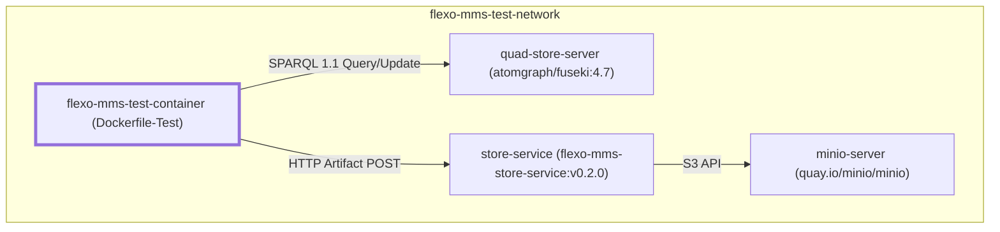
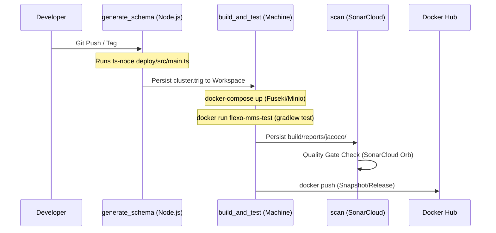

# Page: CI/CD Pipeline and Docker

# CI/CD Pipeline and Docker

<details>
<summary>Relevant source files</summary>

The following files were used as context for generating this wiki page:

- [.circleci/config.yml](.circleci/config.yml)
- [.dockerignore](.dockerignore)
- [.github/workflows/action.yml](.github/workflows/action.yml)
- [Dockerfile](Dockerfile)
- [Dockerfile-Test](Dockerfile-Test)
- [README.md](README.md)
- [build.gradle.kts](build.gradle.kts)
- [deploy/package-lock.json](deploy/package-lock.json)
- [gradle/wrapper/gradle-wrapper.jar](gradle/wrapper/gradle-wrapper.jar)
- [gradle/wrapper/gradle-wrapper.properties](gradle/wrapper/gradle-wrapper.properties)
- [gradlew](gradlew)
- [gradlew.bat](gradlew.bat)
- [rebuild.sh](rebuild.sh)
- [sonar-project.properties](sonar-project.properties)
- [src/main/kotlin/org/openmbee/flexo/mms/Compressor.kt](src/main/kotlin/org/openmbee/flexo/mms/Compressor.kt)
- [src/main/kotlin/org/openmbee/flexo/mms/Content.kt](src/main/kotlin/org/openmbee/flexo/mms/Content.kt)
- [src/test/resources/docker-compose.yml](src/test/resources/docker-compose.yml)

</details>


This page documents the automation and containerization strategy for the Flexo MMS Layer 1 Service. The project utilizes CircleCI for its continuous integration and delivery pipeline, Docker for both production and testing environments, and SonarCloud for automated code quality gates.

## CircleCI Pipeline Stages

The pipeline is defined in `.circleci/config.yml` and consists of several interconnected jobs that handle everything from schema generation to Docker Hub deployment.

### Pipeline Workflow
The workflow `build-test-deploy` orchestrates the execution order based on branch filters and tag patterns `[.circleci/config.yml:143-187]()`.

| Job | Purpose | Triggers |
| :--- | :--- | :--- |
| `generate_schema` | Generates the RDF initialization schema (`cluster.trig`). | All commits & tags. |
| `build_and_test` | Runs the integration test suite within a multi-container network. | Requires `generate_schema`. |
| `scan` | Performs static analysis via SonarCloud. | Requires `build_and_test`. |
| `deploy_snapshot` | Pushes a `-SNAPSHOT` image to Docker Hub. | `develop`, `release/*`, `hotfix/*` branches. |
| `deploy_nightly` | Pushes a `NIGHTLY-SNAPSHOT` image to Docker Hub. | Scheduled or manual triggers. |
| `deploy_release` | Pushes a versioned image to Docker Hub. | Version tags (e.g., `v0.2.0`). |

### Schema Generation
The `generate_schema` job uses a Node.js executor to run a TypeScript utility located in the `deploy/` directory `[.circleci/config.yml:7-24]()`. This utility generates the `cluster.trig` file by executing `npx ts-node src/main.ts http://layer1-service` `[.circleci/config.yml:24-24]()`. This file contains the foundational RDF triples (users, roles, permissions) required to initialize the quad-store `[README.md:46-53]()`.

### Build and Test Execution
The `build_and_test` job uses a machine executor to support Docker-in-Docker operations `[.circleci/config.yml:29-50]()`.
1. **Environment Setup**: Attaches the workspace containing the generated `cluster.trig`.
2. **Infrastructure**: Spins up the test stack using `docker-compose -f src/test/resources/docker-compose.yml up -d` `[.circleci/config.yml:44-44]()`.
3. **Configuration**: Replaces the default configuration with the test profile: `cp src/main/resources/application.conf.test ./src/main/resources/application.conf` `[.circleci/config.yml:45-45]()`.
4. **Test Execution**: Builds the `Dockerfile-Test` image and runs it within the `flexo-mms-test-network` `[.circleci/config.yml:46-47]()`.
5. **Artifact Recovery**: Copies the JUnit/Kotest reports from the container back to the host for CircleCI storage `[.circleci/config.yml:49-52]()`.

**Sources:** `[.circleci/config.yml:1-187]()`, `[README.md:46-53]()`

---

## Docker Configuration

The service utilizes two distinct Dockerfiles to separate production concerns from testing requirements.

### Production Dockerfile
The primary `Dockerfile` uses a multi-stage build based on Eclipse Temurin images `[Dockerfile:1-12]()`.
1. **Build Stage**: Uses `eclipse-temurin:21-jdk` to run `./gradlew installDist`, creating a standalone executable distribution `[Dockerfile:1-4]()`.
2. **Final Stage**: Uses `eclipse-temurin:21-jre`. It copies the installed distribution from the build stage, exposes port `8080`, and sets the entry point to the Ktor application binary `[Dockerfile:6-12]()`.

### Test Dockerfile (`Dockerfile-Test`)
`Dockerfile-Test` is based on `openjdk:17.0.2-jdk-slim` and is optimized for the CI environment `[Dockerfile-Test:1-11]()`. It injects environment variables that point the service to the internal container names defined in the test network.

| Variable | Value (Internal Network) |
| :--- | :--- |
| `FLEXO_MMS_ROOT_CONTEXT` | `http://layer1-service` |
| `FLEXO_MMS_QUERY_URL` | `http://quad-server:3030/ds/sparql` |
| `FLEXO_MMS_UPDATE_URL` | `http://quad-server:3030/ds/update` |
| `FLEXO_MMS_GRAPH_STORE_PROTOCOL_URL` | `http://quad-server:3030/ds/data` |
| `FLEXO_MMS_STORE_SERVICE_URL` | `http://store-service:8080/store` |

**Sources:** `[Dockerfile:1-12]()`, `[Dockerfile-Test:1-11]()`

---

## Multi-Container Test Network

The integration testing environment is defined in `src/test/resources/docker-compose.yml`. This setup ensures that the Layer 1 service interacts with real instances of its dependencies.

### Service Topology Diagram
This diagram maps the Docker Compose service names to their roles and the specific ports/protocols used in the codebase.



### Component Details
*   **quad-store-server**: An Apache Jena Fuseki instance running in-memory (`--mem`) with the dataset path `/ds` `[src/test/resources/docker-compose.yml:5-11]()`.
*   **minio-server**: Provides an S3-compatible interface for the artifact storage system, initialized with `admintest` credentials `[src/test/resources/docker-compose.yml:13-24]()`.
*   **store-service**: The `flexo-mms-store-service` which acts as a bridge between Layer 1 and the S3 backend, configured via `test.env` `[src/test/resources/docker-compose.yml:26-41]()`.

**Sources:** `[src/test/resources/docker-compose.yml:1-46]()`, `[Dockerfile-Test:4-7]()`

---

## SonarCloud and Quality Gate

The project integrates with SonarCloud to enforce code quality standards. The configuration is managed via `build.gradle.kts` and `sonar-project.properties`.

### Quality Metrics Configuration
The `sonar` block in the Gradle build script defines the project identity and links the Jacoco XML reports for coverage analysis `[build.gradle.kts:15-22]()`. The `jacocoTestReport` task is configured to generate the required XML output `[build.gradle.kts:119-124]()`.

```kotlin
sonar {
    properties {
        property("sonar.projectKey", "Open-MBEE_flexo-mms-layer1-service")
        property("sonar.organization", "openmbee")
        property("sonar.host.url", "https://sonarcloud.io")
        property("sonar.coverage.jacoco.xmlReportPaths", "build/reports/jacoco/test/jacocoTestReport.xml")
    }
}
```

### Analysis Execution
The `scan` job in CircleCI executes the `sonarcloud/scan` orb command `[.circleci/config.yml:57-65]()`. It requires the `build_and_test` job to complete so that it can attach the generated test reports and coverage data from the workspace `[.circleci/config.yml:145-149]()`.

**Sources:** `[build.gradle.kts:15-22]()`, `[build.gradle.kts:119-124]()`, `[sonar-project.properties:1-6]()`, `[.circleci/config.yml:57-65]()`

---

## Build Pipeline Data Flow

The following diagram illustrates how data (artifacts, schemas, and test results) flows through the CI/CD pipeline from source code to the final Docker image.



**Sources:** `[.circleci/config.yml:7-140]()`, `[build.gradle.kts:115-120]()`, `[README.md:46-53]()`
