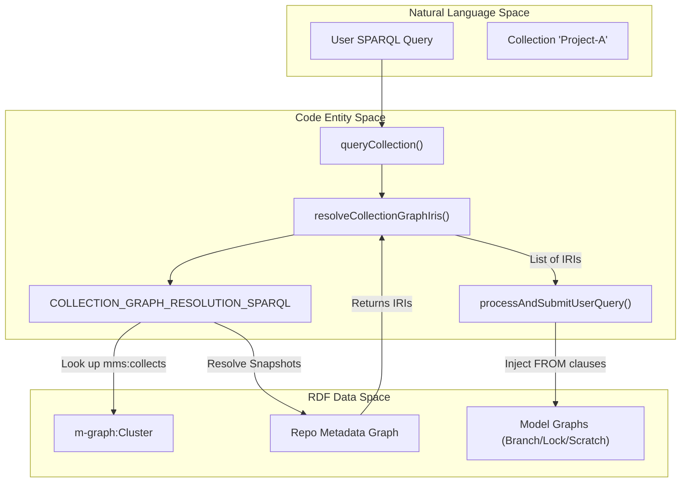
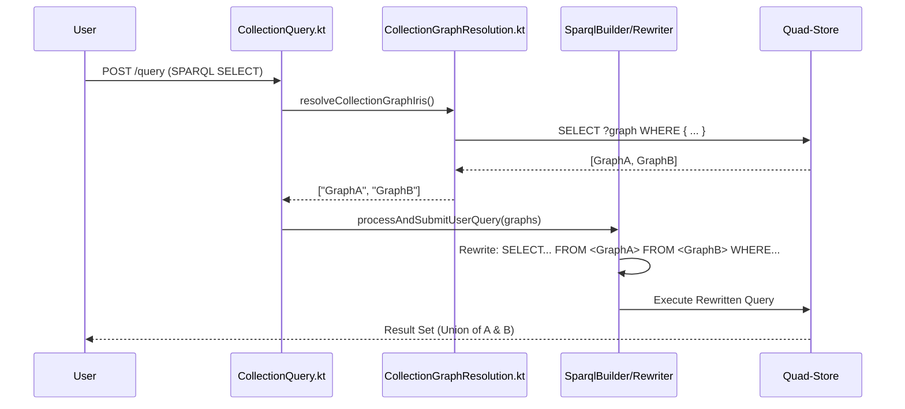

# Page: Collections

# Collections

Relevant source files

The following files were used as context for generating this wiki page:

- [src/main/kotlin/org/openmbee/flexo/mms/routes/Branches.kt](src/main/kotlin/org/openmbee/flexo/mms/routes/Branches.kt)
- [src/main/kotlin/org/openmbee/flexo/mms/routes/CollectionGraphResolution.kt](src/main/kotlin/org/openmbee/flexo/mms/routes/CollectionGraphResolution.kt)
- [src/main/kotlin/org/openmbee/flexo/mms/routes/Collections.kt](src/main/kotlin/org/openmbee/flexo/mms/routes/Collections.kt)
- [src/main/kotlin/org/openmbee/flexo/mms/routes/gsp/CollectionGraphRead.kt](src/main/kotlin/org/openmbee/flexo/mms/routes/gsp/CollectionGraphRead.kt)
- [src/main/kotlin/org/openmbee/flexo/mms/routes/ldp/CollectionRead.kt](src/main/kotlin/org/openmbee/flexo/mms/routes/ldp/CollectionRead.kt)
- [src/main/kotlin/org/openmbee/flexo/mms/routes/ldp/CollectionWrite.kt](src/main/kotlin/org/openmbee/flexo/mms/routes/ldp/CollectionWrite.kt)
- [src/main/kotlin/org/openmbee/flexo/mms/routes/sparql/CollectionQuery.kt](src/main/kotlin/org/openmbee/flexo/mms/routes/sparql/CollectionQuery.kt)
- [src/main/kotlin/org/openmbee/flexo/mms/routes/sparql/RepoQuery.kt](src/main/kotlin/org/openmbee/flexo/mms/routes/sparql/RepoQuery.kt)
- [src/test/kotlin/org/openmbee/flexo/mms/CollectionAny.kt](src/test/kotlin/org/openmbee/flexo/mms/CollectionAny.kt)
- [src/test/kotlin/org/openmbee/flexo/mms/CollectionLdpDc.kt](src/test/kotlin/org/openmbee/flexo/mms/CollectionLdpDc.kt)
- [src/test/kotlin/org/openmbee/flexo/mms/CollectionQueryTest.kt](src/test/kotlin/org/openmbee/flexo/mms/CollectionQueryTest.kt)

The **Collections** subsystem provides a mechanism to aggregate multiple distributed resources—specifically branches, locks, and scratches—into a single virtual queryable graph. Unlike repositories or branches, collections are lightweight resources that do not maintain their own commit history or materialized graphs; instead, they serve as a pointer-based grouping mechanism for cross-repository and cross-ref analysis.

## Overview

A `mms:Collection` resource resides within an Organization and uses the `mms:collects` property to reference one or more refs. When a collection is queried via SPARQL or accessed via the Graph Store Protocol (GSP), the system dynamically resolves these references to their underlying model graph IRIs and executes the operation against the union of those graphs.

### Key Capabilities
- **Cross-Repo Aggregation**: Collect refs from different repositories within the same organization.
- **Heterogeneous Refs**: Combine stable snapshots (Locks), active development lines (Branches), and temporary workspaces (Scratches).
- **Dynamic Resolution**: Queries always target the current state of the collected refs (e.g., the latest commit on a branch).
- **Virtual Union Graph**: Provides a single GSP endpoint to read the combined RDF data of all members.

---

## Data Model and Storage

Collections are stored exclusively in the `m-graph:Cluster` named graph. They do not have a dedicated metadata graph or a materialization pipeline.

| Property | Description |
| :--- | :--- |
| `rdf:type` | Must be `mms:Collection`. |
| `mms:id` | The unique identifier within the organization. |
| `mms:collects` | One or more IRIs pointing to a `mms:Branch`, `mms:Lock`, or `mms:Scratch`. |
| `mms:etag` | Used for optimistic concurrency control during updates. |
| `mms:org` | Link to the parent Organization. |

Sources: [src/main/kotlin/org/openmbee/flexo/mms/routes/ldp/CollectionWrite.kt:41-70](), [src/main/kotlin/org/openmbee/flexo/mms/routes/ldp/CollectionRead.kt:14-30]()

---

## Graph Resolution Logic

The core of the Collections subsystem is the ability to resolve a list of abstract refs into concrete SPARQL graph IRIs. This is handled by the `resolveCollectionGraphIris` function and the `COLLECTION_GRAPH_RESOLUTION_SPARQL` query.

### Resolution Mapping

| Ref Type | Resolution Path |
| :--- | :--- |
| **Branch** | `Branch` → `mms:commit` → `mms:snapshot` (Prefer `mms:Model`, fallback to `mms:Staging`) → `mms:graph`. |
| **Lock** | `Lock` → `mms:commit` → `mms:snapshot` (Must be `mms:Model`) → `mms:graph`. |
| **Scratch** | Derived directly from the Scratch IRI by replacing `/scratches/` with `/graphs/Scratch.`. |

The resolution query identifies the owner repository for each ref by checking IRI prefixes in `m-graph:Cluster` and then looks into that repository's metadata graph (`{repoIri}/graphs/Metadata`) to find the latest snapshots.

### Logic Flow: Collection Resolution
The following diagram illustrates how the system translates a Collection's members into a queryable dataset.

Sources: [src/main/kotlin/org/openmbee/flexo/mms/routes/CollectionGraphResolution.kt:10-73](), [src/main/kotlin/org/openmbee/flexo/mms/routes/sparql/CollectionQuery.kt:10-27]()

---

## API Endpoints

### LDP Container Operations
Collections are managed via a Linked Data Platform (LDP) Direct Container at `/orgs/{orgId}/collections`.

- **POST /orgs/{orgId}/collections**: Creates a new collection. Requires `mms:collects` in the body.
- **PUT /orgs/{orgId}/collections/{collectionId}**: Creates or replaces a specific collection.
- **GET /orgs/{orgId}/collections/{collectionId}**: Retrieves the metadata and the list of collected refs.

Sources: [src/main/kotlin/org/openmbee/flexo/mms/routes/Collections.kt:19-84](), [src/main/kotlin/org/openmbee/flexo/mms/routes/ldp/CollectionWrite.kt:47-70]()

### Query and Graph Access
Collections provide endpoints for executing queries across the aggregated dataset.

| Method | Endpoint | Description |
| :--- | :--- | :--- |
| **POST** | `.../collections/{id}/query` | Executes a SPARQL Query. The service resolves graphs and injects `FROM` clauses into the user's query. |
| **GET** | `.../collections/{id}/graph` | GSP endpoint. Returns a `CONSTRUCT {?s ?p ?o} WHERE {?s ?p ?o}` across all collected graphs. |

Sources: [src/main/kotlin/org/openmbee/flexo/mms/routes/sparql/CollectionQuery.kt:17-27](), [src/main/kotlin/org/openmbee/flexo/mms/routes/gsp/CollectionGraphRead.kt:18-53]()

---

## Implementation Details

### Creation Logic
The `createOrReplaceCollection` function handles the persistence of collection metadata. It performs the following steps:
1. **Sanitization**: Validates the incoming RDF and ensures `rdf:type mms:Collection` and `mms:id` are present.
2. **Ref Extraction**: Extracts `mms:collects` IRIs from the request body.
3. **Condition Checking**: Verifies the parent Organization exists and the user has `CREATE_COLLECTION` (for new) or `UPDATE_COLLECTION` (for replace) permissions.
4. **Auto-Policy**: If creating a new collection, it generates an auto-policy granting the creator `ADMIN_COLLECTION` role on the new resource.

Sources: [src/main/kotlin/org/openmbee/flexo/mms/routes/ldp/CollectionWrite.kt:47-179](), [src/test/kotlin/org/openmbee/flexo/mms/CollectionLdpDc.kt:35-53]()

### Query Execution Flow
When `queryCollection` is called:
1. The `resolveCollectionGraphIris()` helper is called to get a list of current model graph IRIs for all members.
2. `processAndSubmitUserQuery` is invoked with the `rewriteDataset` flag set to `true`.
3. The `UpdateRewriter` (referenced in the SPARQL pipeline) injects `FROM <graphIri>` clauses for every resolved graph into the user's SPARQL query before it is sent to the quad-store.

Sources: [src/main/kotlin/org/openmbee/flexo/mms/routes/sparql/CollectionQuery.kt:17-27](), [src/main/kotlin/org/openmbee/flexo/mms/routes/CollectionGraphResolution.kt:84-93]()

### Permissions
Permission enforcement for collections is applied at two levels:
1. **Metadata Level**: `READ_COLLECTION` is required to see the collection definition or use its query endpoints.
2. **Data Level**: Access to the underlying data is governed by the permissions on the individual refs (Branches/Locks/Scratches) being collected.

Sources: [src/main/kotlin/org/openmbee/flexo/mms/routes/ldp/CollectionRead.kt:15-30](), [src/main/kotlin/org/openmbee/flexo/mms/routes/gsp/CollectionGraphRead.kt:19-23]()
