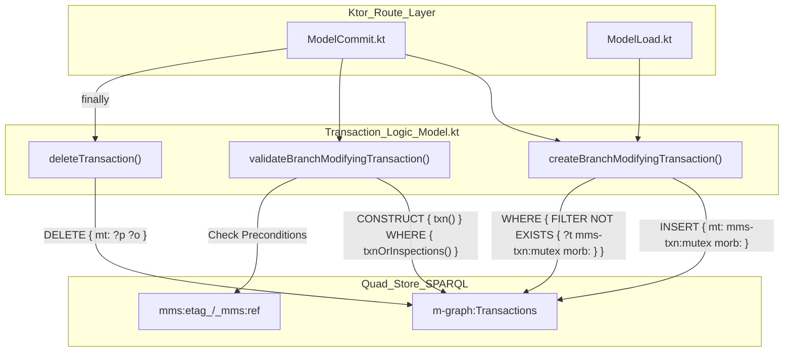
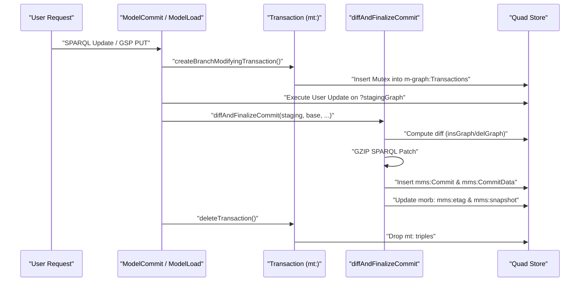

# Page: Commit and Patch Internals

# Commit and Patch Internals

Relevant source files

The following files were used as context for generating this wiki page:

- [Dockerfile](Dockerfile)
- [deploy/package-lock.json](deploy/package-lock.json)
- [src/main/kotlin/org/openmbee/flexo/mms/Compressor.kt](src/main/kotlin/org/openmbee/flexo/mms/Compressor.kt)
- [src/main/kotlin/org/openmbee/flexo/mms/Content.kt](src/main/kotlin/org/openmbee/flexo/mms/Content.kt)
- [src/main/kotlin/org/openmbee/flexo/mms/routes/SquashCommits.kt](src/main/kotlin/org/openmbee/flexo/mms/routes/SquashCommits.kt)
- [src/main/kotlin/org/openmbee/flexo/mms/routes/gsp/ModelLoad.kt](src/main/kotlin/org/openmbee/flexo/mms/routes/gsp/ModelLoad.kt)
- [src/main/kotlin/org/openmbee/flexo/mms/routes/ldp/DiffCreate.kt](src/main/kotlin/org/openmbee/flexo/mms/routes/ldp/DiffCreate.kt)
- [src/main/kotlin/org/openmbee/flexo/mms/routes/sparql/ModelCommit.kt](src/main/kotlin/org/openmbee/flexo/mms/routes/sparql/ModelCommit.kt)
- [src/test/kotlin/org/openmbee/flexo/mms/SquashCommits.kt](src/test/kotlin/org/openmbee/flexo/mms/SquashCommits.kt)

The Flexo MMS Layer 1 Service utilizes a Git-like versioning model for RDF data. Changes to the model are not performed by overwriting the current state, but by computing a diff between the current staging graph and the proposed new state, then persisting that diff as a compressed patch within a new commit resource.

## Commit Data Model

The commit system is defined by several key RDF classes and properties that track the lineage and data of every change.

| Entity | RDF Type | Description |
| :--- | :--- | :--- |
| **Commit** | `mms:Commit` | A metadata resource representing a point in time in the repository history. |
| **Commit Data** | `mms:CommitData` | A resource linked to a commit that holds the actual change information. |
| **Patch** | `mms:patch` | A property on `mms:CommitData` containing a GZIP-compressed SPARQL Update string. |
| **Insert Graph** | `mms:insGraph` | A named graph containing triples added in this commit. |
| **Delete Graph** | `mms:delGraph` | A named graph containing triples removed in this commit. |

When a commit is finalized, the service generates an `mms:Commit` resource in the `mor-graph:Metadata` graph. This resource points to an `mms:CommitData` resource, which in turn points to the specific graphs containing the added/deleted triples and the compressed patch string.

**Sources:** [src/main/kotlin/org/openmbee/flexo/mms/routes/gsp/ModelLoad.kt:53-76](), [src/main/kotlin/org/openmbee/flexo/mms/routes/sparql/ModelCommit.kt:59-65]()

## The Transaction Mutex Pattern

To prevent race conditions during model updates (where multiple users might attempt to commit to the same branch simultaneously), the service implements a transaction mutex pattern using a dedicated `m-graph:Transactions` graph.

### Mutex Lifecycle

1.  **Create Transaction**: Before any data is modified, the service attempts to insert a `mms:Transaction` triple with a `mms-txn:mutex` pointing to the branch IRI (`morb:`). This operation includes a `FILTER NOT EXISTS` check to ensure no other transaction holds the mutex for that branch.
2.  **Validate Transaction**: The service queries for the transaction it just created. If the transaction does not exist but the preconditions (like ETags) were met, it indicates another process holds the mutex, and a `409 Conflict` is returned.
3.  **Delete Transaction**: Once the commit is finalized or an error occurs, the transaction resource is deleted to release the mutex.

### Code Entity Mapping: Transaction Flow

The following diagram maps the transaction lifecycle from the Ktor route handlers to the internal SPARQL-based locking mechanism.

**Sources:** [src/main/kotlin/org/openmbee/flexo/mms/routes/Model.kt:80-127](), [src/main/kotlin/org/openmbee/flexo/mms/routes/Model.kt:207-216]()

## Diff Computation and Finalization

The `diffAndFinalizeCommit` function (internal utility) is the core of the versioning logic. It computes the delta between the "base" state and the "new" state.

### Implementation Steps

1.  **Compute Diffs**: The service compares the triples in the new staging graph against the base model graph.
2.  **Generate Patch**: A SPARQL Update string is constructed containing `DELETE DATA { ... }` for removed triples and `INSERT DATA { ... }` for added triples.
3.  **Compress**: The resulting SPARQL string is GZIP-compressed to minimize storage overhead in the metadata graph.
4.  **Finalize Metadata**:
    *   Create `mms:Commit`.
    *   Update the branch's `mms:etag` to the new `transactionId`.
    *   Update the branch's `mms:snapshot` to point to the new state.

### Data Flow: From Update to Commit

This diagram illustrates how a user's SPARQL Update or GSP Load is transformed into a persisted commit.

**Sources:** [src/main/kotlin/org/openmbee/flexo/mms/routes/sparql/ModelCommit.kt:50-83](), [src/main/kotlin/org/openmbee/flexo/mms/routes/gsp/ModelLoad.kt:71-96]()

## Squash Commits

The `squashCommits` operation allows collapsing a linear range of commits into a single commit. This is performed by identifying a source lock (`mms:srcRef`) and a destination lock (`mms:dstRef`), ensuring a linear path exists between them, and computing a single diff between their respective model snapshots.

### Squash Logic
1. **Resolve Locks**: Fetches the commit and snapshot graph for both the source and destination locks [src/main/kotlin/org/openmbee/flexo/mms/routes/SquashCommits.kt:69-114]().
2. **Linearity Check**: Uses a SPARQL `ASK` query with property paths (`mms:parent+`) to verify that the destination commit is a descendant of the source commit [src/main/kotlin/org/openmbee/flexo/mms/routes/SquashCommits.kt:121-137]().
3. **Diff Generation**: Performs a symmetric difference between the source graph and destination graph to populate `mms:insGraph` and `mms:delGraph` [src/main/kotlin/org/openmbee/flexo/mms/routes/SquashCommits.kt:147-181]().
4. **Patch Replacement**: The intermediate commits are logically bypassed by creating a new commit that points directly back to the source commit as its parent, effectively squashing the history [src/main/kotlin/org/openmbee/flexo/mms/routes/SquashCommits.kt:191-205]().

**Sources:** [src/main/kotlin/org/openmbee/flexo/mms/routes/SquashCommits.kt:13-49](), [src/main/kotlin/org/openmbee/flexo/mms/routes/SquashCommits.kt:115-181]()

## Storage and Optimization

### Patch Compression
The system uses GZIP compression for the SPARQL patch strings stored in the `mms:patch` property. This is critical for repositories with large models where small changes (e.g., updating one attribute) would otherwise result in significant redundant text storage.

### Named Graph Management
*   **Staging Graphs**: Temporary graphs (e.g., `mor-graph:Load.$transactionId`) are used to hold the intermediate state of a model during a transaction [src/main/kotlin/org/openmbee/flexo/mms/routes/gsp/ModelLoad.kt:48-51]().
*   **Transaction Metadata**: The `mt:` prefix refers to the specific transaction resource within `m-graph:Transactions`. It tracks the `baseCommit`, `stagingGraph`, and `baseModelGraph` required to complete the diff [src/main/kotlin/org/openmbee/flexo/mms/routes/Model.kt:83-86]().
*   **Squash Graphs**: During a squash operation, temporary graphs are created with the pattern `Squash.Ins.${transactionId}` and `Squash.Del.${transactionId}` to compute the final delta [src/main/kotlin/org/openmbee/flexo/mms/routes/SquashCommits.kt:144-145]().

**Sources:** [src/main/kotlin/org/openmbee/flexo/mms/routes/Model.kt:81-101](), [src/main/kotlin/org/openmbee/flexo/mms/routes/gsp/ModelLoad.kt:48-62](), [src/main/kotlin/org/openmbee/flexo/mms/routes/SquashCommits.kt:143-146]()
